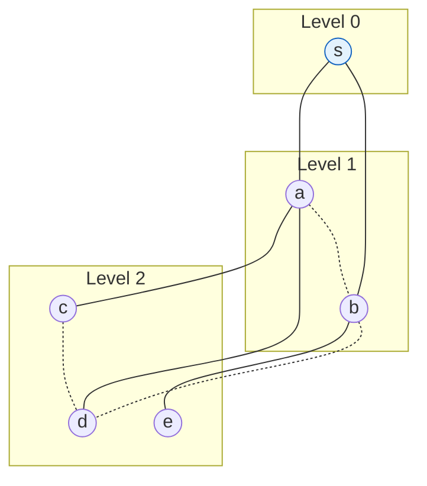

## Purpose

Breadth first search explores the vertices of a graph in order of their distance from the starting vertex. This note gives the algorithm, its runtime analysis, and proofs of the two structural facts that make BFS useful: adjacent vertices sit within one level of each other, and the level of a vertex equals its shortest path distance from the start.

## Core idea

A vertex is in one of three states during BFS:

- **Undiscovered**: the vertex has not been seen yet.
- **Discovered**: the vertex has been seen, but its neighbors have not been explored yet.
- **Explored**: the vertex has been seen and its neighbors have been explored.

BFS holds discovered vertices in a queue, so vertices leave the queue in the same order they were discovered. Discovery order respects distance from the start, which is what the proofs below make precise.

```text
BFS(G, s):
  mark all vertices as undiscovered

  mark s as discovered
  q = queue({s})
  while q is not empty:
    u = poll(q)
    for each edge (u, v) in G:
      if v is undiscovered:
        mark v as discovered
        add v to q
    mark u as explored
```

## Analysis

The outer while loop runs once for each vertex in the graph, and the inner for loop runs once for each edge of the current vertex. The sum of all vertex degrees is twice the number of edges, so the total work is

$$
O(|V|) + O\left(\sum_{v \in V} deg(v)\right) = O(|V| + |E|)
$$

## Structure of the BFS tree

1. $BFS(s)$ visits a vertex $v$ if and only if there is a path from $s$ to $v$.
2. Edges into then-undiscovered vertices form a tree rooted at $s$ (the **BFS spanning tree**).
3. Level $i$ of the tree contains exactly the vertices $v$ such that the shortest path from $s$ to $v$ has $i$ edges.
4. All non-tree edges of $G$ connect vertices in the same level or adjacent levels.

A BFS from $s$ on a small graph shows all four facts at once. Solid edges are tree edges, dashed edges are the non-tree edges of $G$, and every dashed edge stays within one level of itself:



> [!tip] Non-tree edges never skip a level
> Fact 4 is the structural payoff of using a queue. If an edge spanned two or more levels, its deeper endpoint would have a shorter path than its level allows, contradicting the shortest-path claim below. The same-level case is exactly what the [[algorithms/bipartite-graphs|bipartiteness test]] looks for, since a same-level edge closes an odd cycle.

### Difference in levels

Let $L(v)$ be the level of vertex $v$ in the BFS tree.

**Claim**:

$$
\forall (x, y) \in E, |L(x) - L(y)| \le 1
$$

**Proof**: Suppose $L(x) = i$ and $L(y) = j$. Without loss of generality, assume $x$ is explored before $y$. Consider the iteration where we process $x$.

Case 1: $y$ is still undiscovered. Since there is an edge between $x$ and $y$, we discover $y$ while processing $x$, so $L(y) = i + 1$.

Case 2: $y$ is already discovered. Then $y$ is in the queue somewhere behind $x$, and levels in the queue are non-decreasing, so $L(y) \ge i$. Every vertex still in the queue was discovered by a vertex of level at most $i$, so $L(y) \le i + 1$.

In both cases $|L(x) - L(y)| \le 1$. $\blacksquare$

### Levels are shortest path distances

**Claim**: for every vertex $v$ reachable from $s$, $L(v)$ equals the length of the shortest path from $s$ to $v$.

**Proof**: Let $l(v)$ be the length of the shortest path from $s$ to $v$.

$L(v) \ge l(v)$: the tree path from $s$ to $v$ is a real path in $G$ with $L(v)$ edges, and the shortest path is at least as short.

$L(v) \le l(v)$: let $s = v_0, v_1, \ldots, v_k = v$ be a shortest path, so $k = l(v)$. Each consecutive pair $(v_i, v_{i+1})$ is an edge, so the previous claim gives $L(v_{i+1}) \le L(v_i) + 1$. Starting from $L(v_0) = 0$ and applying this along the path, $L(v_k) \le k$.

Together, $L(v) = l(v)$. $\blacksquare$

## Implementation

```python
from collections import deque

def bfs(graph, start):
    visited = set()
    queue = deque([start])
    visited.add(start)
    while queue:
        vertex = queue.popleft()
        print(vertex)
        for neighbor in graph[vertex]:
            if neighbor not in visited:
                visited.add(neighbor)
                queue.append(neighbor)
```

Or a reusable level-order iterator over a graph. The visited set matters here: without it, any cycle makes the traversal loop forever.

```python
from collections import deque

def level_order_traversal(graph, start):
    visited = {start}
    queue = deque([(start, 0)])
    while queue:
        vertex, level = queue.popleft()
        yield vertex, level
        for neighbor in graph[vertex]:
            if neighbor not in visited:
                visited.add(neighbor)
                queue.append((neighbor, level + 1))
```

## Related notes

- [[algorithms/patterns/BFS|BFS pattern]]
- [[algorithms/graphs-intro|Graph fundamentals]]
- [[algorithms/DFS|depth-first search]]
- [[algorithms/connected-components|connected components]]
- [[algorithms/bipartite-graphs|bipartite graphs]]
