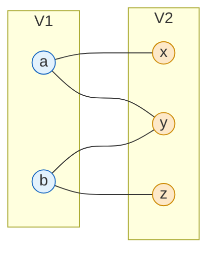
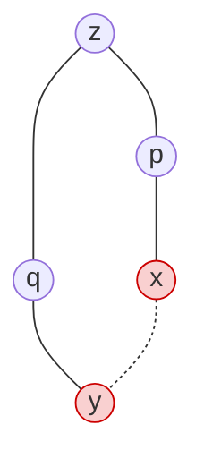

## Purpose

This note defines bipartite graphs, proves the characterization in terms of odd cycles, and turns that proof into a linear time detection algorithm based on [[algorithms/BFS|BFS]] layers.

## Definition

An undirected graph $G = (V, E)$ is bipartite if there exists a partition of $V$ into two sets $V_1$ and $V_2$ such that every edge in $E$ has one endpoint in $V_1$ and the other in $V_2$.

Equivalently, $G$ is bipartite when it has a proper 2-coloring: an assignment of one of two colors to each vertex such that no edge joins two vertices of the same color. The two color classes are exactly $V_1$ and $V_2$.



Bipartite structure shows up whenever the vertices naturally split into two kinds, for example machines and jobs in scheduling, or companies and applicants in [[algorithms/stable-matching|stable matching]]. Many problems that are hard on general graphs get easier on bipartite graphs, maximum matching being the standard example (see [[algorithms/network-flows|network flows]]).

## Odd-Length Cycles

**Lemma**: If $G$ is bipartite, then it does not contain an odd-length cycle.

**Proof**: Fix a proper 2-coloring of $G$. Walking around any cycle, the colors must alternate, so returning to the start vertex after $k$ steps requires $k$ to be even. An odd cycle therefore admits no proper 2-coloring, and a bipartite $G$ cannot contain one. $\blacksquare$

**Lemma**: Let $G$ be a connected graph, and let $L_0, \ldots, L_k$ be the layers produced by $BFS(s)$. Then exactly one of the following holds:

1. No edge of $G$ joins two nodes of the same layer, and $G$ is bipartite.
2. An edge of $G$ joins two nodes of the same layer, and $G$ contains an odd cycle (and is thus not bipartite).

**Proof**: In case 1, every edge joins vertices in adjacent layers (BFS layers differ by at most one across an edge), so coloring even layers one color and odd layers the other gives a proper 2-coloring.

In case 2, let $(x, y)$ be an edge with $L(x) = L(y)$, and let $z$ be the lowest common ancestor of $x$ and $y$ in the BFS tree. The tree paths from $z$ to $x$ and from $z$ to $y$ have the same length, say $k$, because $x$ and $y$ sit in the same layer. Those two paths plus the edge $(x, y)$ form a cycle of length $2k + 1$, which is odd. $\blacksquare$

Case 2 with $k = 2$: the tree paths $z, p, x$ and $z, q, y$ plus the same-layer edge $(x, y)$ form a cycle of length 5.



> [!abstract] Characterization
> A graph is bipartite if and only if it contains no odd-length cycle. The first lemma gives the forward direction. The second gives the converse for connected graphs, and applying it per [[algorithms/connected-components|component]] covers the general case, since a graph is bipartite exactly when every component is.

## Algorithm

**Problem**: Given a graph $G$, output `true` if it is bipartite, `false` otherwise.

Run BFS from any vertex (repeating per connected component) and record each vertex's layer. Then scan every edge. If some edge joins two vertices in the same layer, output `false`. Otherwise output `true`, and the even/odd layers give the two sides of the partition. Correctness is exactly the lemma above, and the runtime is the BFS runtime plus an edge scan, $O(|V| + |E|)$.

```python
from collections import deque

def is_bipartite(G):
    layer = {}
    for s in G:
        if s in layer:
            continue
        layer[s] = 0
        q = deque([s])
        while q:
            u = q.popleft()
            for v in G[u]:
                if v not in layer:
                    layer[v] = layer[u] + 1
                    q.append(v)
    return all(layer[u] != layer[v] for u in G for v in G[u])
```

## Related notes

- [[algorithms/BFS|breadth-first search]]
- [[algorithms/connected-components|connected components]]
- [[algorithms/network-flows|network flows]]
- [[algorithms/graphs-intro|graph fundamentals]]
