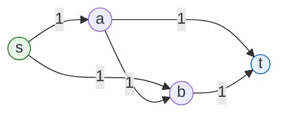

## Purpose

Max-flow and min-cut sit behind a large family of reductions. This note covers the core algorithm (Ford-Fulkerson), the classic reduction from bipartite matching, an image segmentation formulation, and four worked problems that reduce to flow. Two of the problem writeups (P1 and P3) reference results proved in course section or lecture that this note does not reproduce, which is why it carries a needs-review status.

## Max Flow/Min Cut

**Max flow** and **min cut** show up wherever you route things through capacity-limited networks or split objects into two groups at minimum cost:

- **Transportation networks**: flow of goods, data, or people through a network
- **Telecommunications**: the min cut is exactly the number of edges you must remove to disconnect servers $s$ and $t$
- **Image segmentation**: partitioning an image into regions
- **Data mining**: clustering and classification

Use min cut when you want a partition of objects into two sets minimizing some cost. Use max flow for optimal routing. If the objects carry a natural ordering, also consider [[algorithms/dynamic-programming|dynamic programming]], and for problems on trees, try greedy (inducting on leaves) or dynamic programming on subtrees.

Given a graph $G$ with edge capacities and vertices $s, t$, the max-flow problem asks for the maximum value of a flow from $s$ to $t$. The max-flow min-cut theorem says this value equals the minimum capacity over all cuts separating $s$ from $t$, where for a cut $(A, B)$ with $s \in A, t \in B$:

$$
cap(A, B) = \sum_{u \in A, v \in B, (u, v) \in E} c(u, v)
$$

> [!abstract] Max-flow min-cut theorem
> The maximum value of an $s$-$t$ flow equals the minimum capacity over all $s$-$t$ cuts. Ford-Fulkerson proves both directions at once: when no augmenting path remains, the vertices reachable from $s$ in the residual graph form the $A$ side of a cut whose capacity equals the current flow value.

## Ford Fulkerson Algorithm

The **residual graph** $G_f$ represents remaining capacity. If edge $(u, v)$ has capacity $c$ and current flow $f(u, v)$, the residual capacity forward is $c - f(u, v)$, and there is a backward residual edge $(v, u)$ with capacity $f(u, v)$ that lets the algorithm undo flow it committed earlier.

An **augmenting path** is a path from $s$ to $t$ in $G_f$ using only edges with positive residual capacity. Ford-Fulkerson repeatedly finds an augmenting path and pushes the bottleneck (minimum residual capacity along the path) through it, until no augmenting path exists. At that point the flow is maximum, and the vertices reachable from $s$ in the residual graph form the $A$ side of a minimum cut.

Pushing flow along a forward edge increases the flow on that edge. Pushing flow along a backward residual edge decreases the flow on the corresponding forward edge, rerouting flow that an earlier iteration placed badly.

The network below shows the backward edge doing that work. Every capacity is $1$ and the max flow is $2$:



A DFS that first augments along $s \to a \to b \to t$ saturates $(a, b)$ and leaves a flow of value $1$. The second augmenting path is $s \to b \to a \to t$: it crosses the backward residual edge $(b, a)$, canceling the unit on $(a, b)$. The final flow routes $s \to a \to t$ and $s \to b \to t$ with nothing on the middle edge.

```python
from collections import defaultdict

def ford_fulkerson(G, s, t, c):
    # G: adjacency lists, c[u][v]: capacity of edge (u, v)
    # r holds residual capacities, including backward edges
    r = defaultdict(dict)
    for u in G:
        for v in G[u]:
            r[u][v] = c[u][v]
            r[v].setdefault(u, 0)

    def find_augmenting_path():
        stack = [(s, [s])]
        seen = {s}
        while stack:
            u, path = stack.pop()
            if u == t:
                return path
            for v, cap in r[u].items():
                if cap > 0 and v not in seen:
                    seen.add(v)
                    stack.append((v, path + [v]))
        return None

    flow = 0
    while True:
        path = find_augmenting_path()
        if path is None:
            return flow
        bottleneck = min(r[u][v] for u, v in zip(path, path[1:]))
        for u, v in zip(path, path[1:]):
            r[u][v] -= bottleneck
            r[v][u] += bottleneck
        flow += bottleneck
```

### Running Time

Assume all capacities are integers between $1$ and $C$. Invariantly, every flow value $f(e)$ and every residual capacity $c_f(e)$ remains an integer throughout the algorithm.

**Theorem**: the algorithm terminates after at most $v(f^*) \le (n - 1)C$ iterations, where $f^*$ is an optimal flow.

Only $s$ produces flow, and at most $n - 1$ edges leave $s$, each with capacity at most $C$, so $v(f^*) \le (n - 1)C$. Each iteration increases the flow value by at least $1$ (flows stay integral), which bounds the iteration count.

Each iteration finds an augmenting path via DFS in $O(m)$, giving an overall runtime of $O(mnC)$, or more generally $O(m \cdot v(f^*))$.

> [!warning] The bound is pseudo-polynomial
> $C$ occupies only $\log_2 C$ bits of input, so $O(mnC)$ can be exponential in the input size. The diamond network above with capacities $C, C, C, C$ on the outer edges and $1$ on $(a, b)$ realizes the blowup: a path search that keeps routing through the middle edge alternates $s \to a \to b \to t$ with $s \to b \to a \to t$, gaining $1$ unit per iteration and taking $2C$ iterations to reach the max flow of $2C$.

## Maximum Matching

Given an undirected graph $G = (V, E)$, find the matching $M \subseteq E$ with largest cardinality, where a matching is a set of edges such that each vertex touches at most one edge in $M$. This is solvable in polynomial time in general; here I only cover the case where $G$ is [[algorithms/bipartite-graphs|bipartite]].

### Bipartite Maximum Matching

Given an undirected bipartite graph $G = (X \cup Y, E)$, find the maximum matching $M$.

Add vertices $s, t$, with edges $(s, v)$ of capacity $1$ for $v \in X$, and $(u, t)$ of capacity $1$ for $u \in Y$. All original edges get capacity $\infty$ and are oriented from $X$ to $Y$.

The maximum flow value equals the maximum matching size, and the minimum cut yields the minimum vertex cover (this equality of matching and cover sizes in bipartite graphs is Konig's theorem).

**Proof**: Let $M$ be a maximum matching in $G$, and $f$ the value of a maximum **integer** flow in the constructed graph $H$. We prove $|M| = f$ by showing each bounds the other.

$|M| \le f$: it suffices to exhibit a flow of value $|M|$.

- For every edge $(u, v) \in M$, set $f(s \to u) = f(u \to v) = f(v \to t) = 1$, and all other flows to $0$.
- This flow is feasible: no capacity is exceeded because $M$ is a matching (each vertex is used once), and conservation holds at every internal vertex.
- Its value is $|M|$, so the max flow is at least $|M|$.

$f \le |M|$: given an integer flow of value $k$, we construct a matching of size $k$.

- Integer capacities guarantee an integer maximum flow exists.
- Every edge into $X$ and out of $Y$ has capacity $1$, so each vertex of $X$ receives at most $1$ unit and each vertex of $Y$ sends at most $1$ unit.
- Every unit of flow travels a path $s, v_x, v_y, t$ with $v_x \in X, v_y \in Y$, and these paths share no internal vertices. The $k$ middle edges $(v_x, v_y)$ therefore form a matching of size $k$.

## Foreground/Background Segmentation

Label each pixel of an image as foreground or background. Let $V$ be the set of pixels and $E$ connect neighboring pixels.

- $a_i \ge 0$ is the likelihood of pixel $i$ being in the foreground
- $b_i \ge 0$ is the likelihood of pixel $i$ being in the background
- $p_{i,j} \ge 0$ is the penalty for labeling one of $i$ and $j$ as foreground and the other as background, i.e. the penalty for a region boundary between them

Two forces pull on each label. Accuracy: if $a_i > b_i$ in isolation, prefer to label $i$ foreground. Smoothness: if many neighbors of $i$ are foreground, lean foreground for $i$ too.

Find a partition $(A, B)$ that maximizes

$$
\sum_{i \in A} a_i + \sum_{j \in B} b_j - \sum_{(i, j) \in E, i \in A, j \in B} p_{i, j}
$$

Min-cut minimizes, so negate the objective:

$$
\sum_{(i, j) \in E, i \in A, j \in B} p_{i, j} - \sum_{i \in A} a_i - \sum_{j \in B} b_j
$$

Negative terms are awkward in a cut formulation, so add the constant $\sum_{i \in V} a_i + \sum_{j \in V} b_j$, which shifts every solution equally:

$$
\sum_{(i, j) \in E, i \in A, j \in B} p_{i, j} - \sum_{i \in A} a_i - \sum_{j \in B} b_j + \sum_{i \in V} a_i + \sum_{j \in V} b_j
$$

Since $V = A \cup B$ and $A \cap B = \emptyset$, this equals

$$
\sum_{(i, j) \in E, i \in A, j \in B} p_{i, j} + \sum_{i \in B} a_i + \sum_{j \in A} b_j
$$

Add vertices $s$ and $t$, an edge $(s, i)$ with weight $a_i$ for every pixel, an edge $(j, t)$ with weight $b_j$ for every pixel, and weight $p_{i,j}$ on every neighbor edge $(i, j)$. The min-cut of this graph minimizes the shifted objective, giving the optimal partition $(A, B)$.

## P1 - Count Disjoint Paths

Given an undirected graph $G = (V, E)$ and disjoint vertex sets $S, T \subseteq V$, design a polynomial time algorithm that outputs the maximum number of vertex-disjoint paths between vertices of $S$ and $T$ (every vertex in $S$ and every vertex in $T$ can be in at most one path).

**Algorithm**:

- Given $G = (V, E)$, and $S, T$
  - Construct a directed graph $G'$ with all undirected edges $(u, v) \in E$ replaced by two directed edges $(u, v), (v, u)$. Add two vertices $s$, $t$, an edge $(s, v)$ for all $v \in S$, and an edge $(u, t)$ for all $u \in T$.
  - Run the algorithm from section for the maximum number of vertex-disjoint $s \to t$ paths in an unweighted directed graph. (That algorithm reduces to max-flow; this note treats it as a given.)

**Correctness**:

Let $G = (V, E)$ be an undirected graph, and $S$, $T$ be disjoint subsets of $V$.

Since we have an algorithm to count vertex-disjoint paths from $s$ to $t$ in a directed graph, it is enough to show the construction of $G'$ preserves the answer: the number of vertex-disjoint $s \to t$ paths in $G'$ equals the number of vertex-disjoint paths in $G$ from vertices in $S$ to vertices in $T$.

The algorithm adds both a forward and backward directed edge for every edge in $E$, since $G$ is undirected and a path may traverse an edge in either direction. The paths counted must be vertex-disjoint (not counting $s$ and $t$), so at most one of the two directed copies of an edge is ever used across all counted paths, and adding both copies never inflates the count.

The added vertices $s$ and $t$ create a bijection between $A$, a maximum set of vertex-disjoint $s \to t$ paths in $G'$, and $B$, a maximum set of vertex-disjoint paths from $S$ to $T$ in $G$. Letting $s' \in S$ and $t' \in T$ denote arbitrary members, paths have these forms:

- $a_i = s, s', \ldots, t', t$ for all paths $a_i \in A$
- $b_i = s', \ldots, t'$ for all paths $b_i \in B$

All paths in $A$ have some $s'$ as their second vertex, since the only edges leaving $s$ go to $S$, and some $t'$ as their second-to-last vertex, since the only edges into $t$ come from $T$. To show $|A| = |B|$:

- $|B| \le |A|$: suppose for contradiction $|B| > |A|$. Prepend $s$ and append $t$ to every path in $B$ (possible because of the added edges) to get $|B|$ vertex-disjoint $s \to t$ paths in $G'$. That contradicts $A$ being maximum.

- $|A| \le |B|$: suppose for contradiction $|A| > |B|$. Strip $s$ and $t$ from every path in $A$. The stripped paths remain vertex-disjoint, start in $S$, and end in $T$, giving $|A|$ vertex-disjoint $S$-to-$T$ paths in $G$. That contradicts $B$ being maximum.

**Running Time**: constructing $G'$ takes $O(|V| + |E|)$ for duplicating and orienting edges, plus $O(|S| + |T|) = O(|V|)$ to add $s$, $t$, and their edges. The disjoint-paths algorithm runs in $O(|V||E|)$, so the total is $O(|V||E|)$, which is polynomial.

## P2 - Number of Disjoint Paths

Given a directed unweighted graph $G = (V, E)$, suppose there are $k$ edge-disjoint paths from $s$ to $t$ and $k$ edge-disjoint paths from $t$ to $u$, for vertices $s, t, u \in V$. Prove that there are $k$ edge-disjoint paths from $s$ to $u$.

**Proof**:

Construct a graph $G'$ by adding vertices $w, x, y, z$ with edges $(w, s), (t, x), (y, t), (u, z)$, each with capacity $k$, and give every original edge capacity $1$.

The max flow from $w \to x$ is $k$: send $1$ unit along each of the $k$ edge-disjoint $s \to t$ paths, fed by the capacity-$k$ edge $(w, s)$ and drained by $(t, x)$. Similarly the max flow from $y \to z$ is $k$, using the $k$ edge-disjoint $t \to u$ paths. Conservation holds at every vertex in both flows.

To get $k$ edge-disjoint paths from $s$ to $u$, we exhibit a flow of value $k$ from $w \to z$. The $k$ edge-disjoint $s \to t$ paths end in $k$ distinct capacity-$1$ edges entering $t$, and the $k$ edge-disjoint $t \to u$ paths leave through $k$ distinct capacity-$1$ edges out of $t$. Route the $k$ units arriving at $t$ from the first family of paths out through the second family. Conservation at $t$ holds because $k$ units enter and $k$ units leave.

This flow travels from $s$ to $u$ entirely through capacity-$1$ edges, so its $k$ units decompose into $k$ edge-disjoint $s \to u$ paths. The $s \to t$ and $t \to u$ path families may share edges with each other in general, but the decomposition of this single flow cannot reuse an edge, since each edge supports at most $1$ unit. $\blacksquare$

## P3 - Minimum Vertex Cover, Maximum Independent Set (Bipartite)

In this exercise we give a polynomial time algorithm to find the minimum vertex cover and maximum independent set in a bipartite graph $G = (X, Y, E)$.

### (a) Construct H

Let $H$ be a directed graph on vertices $X \cup Y$ with each edge $e = (u \to v) \in E$, where $u \in X$ and $v \in Y$, given $c_e = \infty$. Add vertices $s, t$, edges $e_s = (s \to u)$ $\forall u \in X$, and $e_t = (v \to t)$ $\forall v \in Y$, with $c_{e_s} = c_{e_t} = 1$. Let these edge sets be $E_s$ and $E_t$ respectively.

### (b) Construct S

Let $(A, B)$ be a min s-t cut in $H$. I will construct a vertex cover $S \subseteq X \cup Y$ such that $cap(A, B) = |S|$. Define $A_X = A \cap X$, $B_X = B \cap X$, $A_Y = A \cap Y$, $B_Y = B \cap Y$.

The following lemmas will become useful:

- *(1)*: the capacity of the min s-t cut of $H$ is upper bounded by $|X|$
  - Cutting all of $E_s$ separates $s$ from $t$ at capacity $|X|$, and the min cut can only be smaller.
- *(2)*: all $e_s \in E_s, e_t \in E_t$ have capacity $1$ (by construction).
- *(3)*: no edges from $A_X \to B_Y$ exist
  - By *(1)*, $cap(A, B)$ is finite. Since all edges $e \notin E_s \cup E_t$ have $c_e = \infty$, such an edge would put infinite capacity across the cut, contradicting *(1)*.
- *(4)*: $cap(A, B) = |B_X| + |A_Y|$ (shown in lecture)
  - By *(3)* and bipartiteness, every edge crossing the cut is either an $E_s$ edge into $B_X$ or an $E_t$ edge out of $A_Y$.
  - By *(2)* each such edge has capacity $1$, and there are $|B_X|$ of the first kind and $|A_Y|$ of the second.

By *(3)*, all edges of $G$ fall into three sets: $E_1$ between $A_X$ and $A_Y$, $E_2$ between $A_Y$ and $B_X$, and $E_3$ between $B_X$ and $B_Y$.

We can therefore select a vertex cover $S = B_X \cup A_Y$, since $A_Y$ covers $E_1$ and $E_2$, and $B_X$ covers $E_2$ and $E_3$. By *(4)*, $|S| = |B_X| + |A_Y| = cap(A, B)$. This is a vertex cover of size $cap(A, B)$, though not yet shown minimum.

### (c) Construct (A, B)

Let $S$ be a vertex cover of $G$. I will construct an s-t cut $(A, B)$ in $H$ with $cap(A, B) = |S|$.

Let $S_X = S \cap X$ and $S_Y = S \cap Y$. Take $A = \{s\} \cup (X \setminus S_X) \cup S_Y$ and $B = S_X \cup (Y \setminus S_Y) \cup \{t\}$.

No infinite edge crosses this cut: an original edge $u \to v$ crossing from $A$ to $B$ would need $u \in X \setminus S_X$ and $v \in Y \setminus S_Y$, meaning edge $(u, v)$ has neither endpoint in $S$, contradicting $S$ being a vertex cover.

The crossing edges are exactly the $E_s$ edges from $s$ into $S_X$ (capacity $1$ each, $|S_X|$ of them) and the $E_t$ edges from $S_Y$ into $t$ (capacity $1$ each, $|S_Y|$ of them). Therefore $cap(A, B) = |S_X| + |S_Y| = |S|$.

### (d) Design the algorithm

- Given a bipartite graph $G = (X, Y, E)$
  - Construct $H$ as described in (a), but use capacity $n + 1$ instead of $\infty$ on edges between $X$ and $Y$
  - Find the min s-t cut $(A, B)$ in $H$ using Ford-Fulkerson
  - Let $B_X = B \cap X$, $A_Y = A \cap Y$
  - Return $S = B_X \cup A_Y$

**Correctness**:

Replacing $\infty$ with $n + 1$ preserves lemma *(3)*: a cut crossing such an edge has capacity at least $n + 1$, while the min cut has capacity at most $|X| \le n$, so no such edge crosses the min cut.

From (b), the returned $S$ is a vertex cover with $|S| = cap(A, B)$. Suppose for contradiction $S$ is not minimum, i.e. some vertex cover $S'$ has $|S'| < |S|$. From (c), $S'$ yields an s-t cut $(A', B')$ with $cap(A', B') = |S'| < |S| = cap(A, B)$. That contradicts $(A, B)$ being a min cut. $\blacksquare$

The maximum independent set is the complement $V \setminus S$ of the minimum vertex cover.

**Running Time**:

For a bipartite graph in adjacency list form with $|X| + |Y| = n$ and $|E| = m$, constructing $H$ takes $O(n + m)$: two added vertices, $n$ added edges, and $O(m)$ capacity initialization.

With integer capacities, Ford-Fulkerson terminates in at most $nC$ iterations with $C = n + 1$, each taking $O(m)$ to find an augmenting path, for $O(mn^2)$ total.

Ford-Fulkerson outputs the min cut $(A, B)$, and computing $B_X$, $A_Y$, and their union takes $O(n)$ with hash sets. The total runtime is $O(mn^2)$, which is polynomial.

## P4 - Knights

Given an $n \times n$ chess board where some cells are removed, design a polynomial time algorithm to find the maximum number of knights that can be placed on the board such that no two knights attack each other.

**Algorithm**:

- Given $X$, the set of removed cells $(i, j)$, and board size $n$
  - Create an undirected graph $G = (V, E)$ where $V = [n]^2 \setminus X$, the cells still present
  - Add an edge $((i, j), (i', j'))$ whenever knights on those two cells attack each other, i.e. both cells are in $V$ and
    - $(|i - i'| = 2 \land |j - j'| = 1) \lor (|i - i'| = 1 \land |j - j'| = 2)$
  - Find the minimum vertex cover $S$ of $G$ using the algorithm from P3 (knight moves always connect cells of opposite color, so $G$ is bipartite with the sides given by the standard checkerboard coloring)
  - Return $|V| - |S|$

**Running Time**:

Creating $V$ takes $O(n^2)$, assuming an $n \times n$ boolean grid makes checking $(i, j) \in X$ $O(1)$.

Computing $E$ iterates over all $n^2$ cells and checks the at most $8$ cells a knight there could attack, so $O(n^2)$ total. The graph has $|V| \le n^2$ and $|E| \le 8n^2 = O(n^2)$.

Finding the minimum vertex cover via P3 costs $O(|V|^2|E|) = O(n^6)$, and returning $|V| - |S|$ is constant time on top of that. The total running time is $O(n^6)$, which is polynomial.

**Proof**:

By construction, $G$ has a vertex for each cell a knight could occupy and an edge for each pair of cells that attack each other, since a knight on $(i, j)$ attacks exactly the surviving cells offset by $(\pm 2, \pm 1)$ or $(\pm 1, \pm 2)$.

Let $I \subseteq V$ be a maximum independent set of $G$, and $k$ the maximum number of mutually non-attacking knights. I claim $|I| = k$:

- $|I| \le k$: no two vertices in $I$ are adjacent, so knights placed on the cells of $I$ do not attack each other, and $k$ is the maximum over all such placements.
- $|I| \ge k$: take a maximum placement $P$ of $k$ non-attacking knights. By construction of $G$, no edges join any two cells of $P$, so $P$ is an independent set of size $k$, and the maximum independent set is at least that large. $\blacksquare$

## Related notes

- [[algorithms/graphs-intro|graph fundamentals]]
- [[algorithms/bipartite-graphs|bipartite graphs]]
- [[algorithms/linear-programming|linear programming]]
- [[algorithms/practice/4|Problem Set 4 Notes]]
