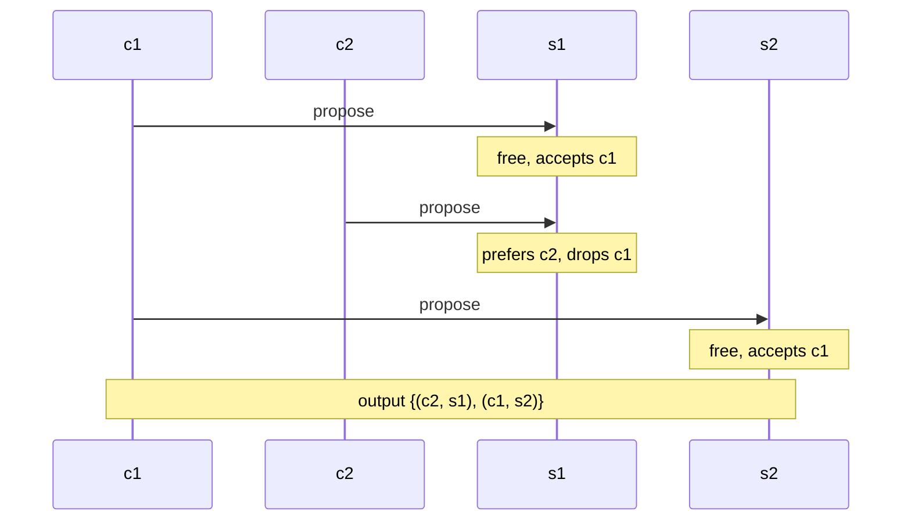

## Purpose

Given $n$ companies and $n$ students, where each side ranks the other, we want a matching nobody wants to defect from. This note defines stability, walks the Gale-Shapley propose-and-reject algorithm, and proves its correctness and its optimality structure (proposers get their best valid partner, receivers get their worst). The algorithm and the existence guarantee come from [Gale and Shapley (1962)](https://www.jstor.org/stable/2312726).

## Problem

Given a list of $n$ companies $c_1, c_2, \ldots, c_n$ and a list of students $s_1, s_2, \ldots, s_n$, each company ranks all students in order of preference, and each student ranks all companies.

Find a **stable matching**: a matching where no company and student would prefer each other over their current matches.

- **Perfect matching**: every company and every student is matched with exactly one partner.
- **Stable**: there is no pair $(c, s)$ not matched to each other where $c$ prefers $s$ over its current match and $s$ prefers $c$ over their current match.

A stable matching is a matching that is both perfect and stable. In other words, no company-student pair has an incentive to break their current matches for each other.

You can confirm a matching is stable by checking every non-matched pair for whether both sides prefer each other. With $n$ matched pairs, that is $n(n - 1)$ pairs to check.

Stable matchings always exist, and the algorithm below is the constructive proof.

## Propose and Reject Algorithm (Gale-Shapley)

```text
Initialize all companies and students to be free

while some company is free and hasn't proposed to all students:
    c = first such company
    s = highest-ranked student c has not yet proposed to
    if s is free:
        (c, s) become paired
    else if s prefers c to current match c':
        c' becomes free
        (c, s) become paired
    else:
        s rejects c

return the set of pairs
```

```python
def gale_shapley(company_prefs, student_prefs):
    # company_prefs[c]: list of students in decreasing preference
    # student_prefs[s]: list of companies in decreasing preference
    free = list(company_prefs)
    match = {}                              # student -> company
    next_prop = {c: 0 for c in company_prefs}
    rank = {s: {c: i for i, c in enumerate(prefs)}
            for s, prefs in student_prefs.items()}

    while free:
        c = free.pop()
        s = company_prefs[c][next_prop[c]]
        next_prop[c] += 1
        if s not in match:
            match[s] = c
        elif rank[s][c] < rank[s][match[s]]:
            free.append(match[s])
            match[s] = c
        else:
            free.append(c)

    return match
```

> [!example] A run with two companies
> Take preferences $c_1: s_1 > s_2$, $c_2: s_1 > s_2$, $s_1: c_2 > c_1$, $s_2: c_1 > c_2$. Both companies want $s_1$, so one of them gets bumped:



The run shows both directions of movement at once: $s_1$ trades up from $c_1$ to $c_2$, while $c_1$ walks down its list from $s_1$ to $s_2$.

### Properties

- Companies propose to students in decreasing order of preference.
- Each company proposes to each student at most once.
- Once a student is matched, they never become unmatched, only "trade up".

### Proof of Correctness

Two obligations: the algorithm terminates in reasonable time, and its output is a stable matching.

**Termination**: each of the $n$ companies proposes to each of the $n$ students at most once, so there are at most $n^2$ proposals, and the algorithm runs in $O(n^2)$ time.

**Output is perfect**: suppose some company $c_1$ has no match after termination. Matches are one-to-one at every step, so some student is also unmatched:

$$
\exists \text{ unmatched company } \leftrightarrow \exists \text{ unmatched student}
$$

A company only ends unmatched after proposing to and being rejected by every student. A student only ends unmatched by never receiving a proposal. But students keep a match once they have one, so a student proposed to by $c_1$ cannot end unmatched. Every student received a proposal from $c_1$, so no student is unmatched, a contradiction.

**Output is stable**: suppose for contradiction the output $S$ contains an unstable pair, i.e. there exist $(c, a') \in S$ and $(c', a) \in S$ where $c$ prefers $a$ over $a'$ and $a$ prefers $c$ over $c'$.

Since $c$ proposes in decreasing order of preference and ended with $a'$, it proposed to $a$ earlier and was rejected. Students only reject in favor of companies they prefer, and only trade up afterward, so $a$'s final match $c'$ satisfies $c' >_a c$. That contradicts $a$ preferring $c$ over $c'$. $\blacksquare$

## GS Solution Properties

> [!tip] The invariant behind both results
> Each proposer walks down its preference list, so its situation only worsens over the run, while each receiver only trades up, so its match only improves. This asymmetry drives everything below: whichever side proposes gets its best valid partner, and the receiving side gets its worst.

### Company Optimal Assignments

- **Valid partner**: company $c$ is a valid partner of student $a$ if some stable matching pairs them.
- **Best valid partner** $BVP(c)$: the valid partner $c$ prefers most.

**Claim**: GS matches every company with its best valid partner. In particular the output is the same regardless of proposal order.

**Proof**: by contradiction. Since companies propose in decreasing order of preference, if some company misses its BVP, there is a *first* rejection of a company by its best valid partner during the run. Say $a = BVP(c)$ rejects $c$ in favor of $c'$, so $a$ prefers $c'$ over $c$.

Since $a$ is a valid partner of $c$, some stable matching $S$ pairs $(c, a)$. In $S$, $c'$ is paired with some other student $a'$. Because $a$'s rejection of $c$ is the first rejection by a best valid partner, $c'$ had not yet been rejected by $BVP(c')$ at that moment, and $c'$ proposes in decreasing order, so $a \ge_{c'} BVP(c') \ge_{c'} a'$, meaning $c'$ prefers $a$ over $a'$.

So in $S$, $c'$ prefers $a$ over its partner $a'$, and $a$ prefers $c'$ over its partner $c$. The pair $(c', a)$ is unstable for $S$, contradicting the stability of $S$. $\blacksquare$

### Applicant Pessimality

**Claim**: each student receives their **worst valid partner** $WVP(a)$.

**Proof**: let $S^*$ be the output of GS. Suppose for contradiction $(c, a) \in S^*$ but $c \ne WVP(a)$.

Say $c' = WVP(a)$. Since $c'$ is a valid partner of $a$, some stable matching $S$ pairs $(c', a)$. Let $(c, a') \in S$.

By company optimality, $a = BVP(c)$, so $c$ prefers $a$ over $a'$. And since $c'$ is $a$'s worst valid partner while $c$ is also valid, $a$ prefers $c$ over $c'$. Then $(c, a)$ is unstable for $S$, a contradiction. $\blacksquare$

### Efficient Implementation

GS runs in $O(n^2)$ time with the right data structures.

Name companies $1, \ldots, n$ and students $n + 1, \ldots, 2n$, each with a preference list of the other side. The one trick: precompute an inverse array of each student's preference list, so "does $s$ prefer $c$ to $c'$" is an $O(1)$ array lookup instead of a list scan.

```python
for i in range(n):
    for j in range(n):
        inverse[i][pref[i][j]] = j
```

## Stable Roommate Problem

Given $2n$ people, each person ranks the other $2n - 1$ in order of preference. Find a stable matching among them. Unlike the bipartite version, a stable matching is no longer guaranteed to exist.

### Does a stable match always include at least one person's top choice?

No. Brute force over every stable matching instance with $n = 3$ companies and applicants turns up 12 examples where nobody is matched with their top choice. The script below enumerates all preference profiles, finds their stable matchings, and counts how many participants got their first pick.

```python
from itertools import permutations, product

def is_stable_matching(company_prefs, applicant_prefs, matching):
    imatching = { v:k for k, v in matching.items() }
    for company, applicant in matching.items():
        company_index = company_prefs[company].index(applicant)
        for other_applicant in company_prefs[company][:company_index]:
            if applicant_prefs[other_applicant].index(company) < applicant_prefs[other_applicant].index(imatching[other_applicant]):
                return False
    return True

def find_stable_matchings(company_prefs, applicant_prefs):
    matchings = []
    for perm in permutations(applicant_prefs.keys()):
        matching = dict(zip(company_prefs.keys(), perm))
        if is_stable_matching(company_prefs, applicant_prefs, matching):
            matchings.append(matching)
    return matchings


A1, A2, A3 = 'A1', 'A2', 'A3'
C1, C2, C3 = 'C1', 'C2', 'C3'

def generate_preferences():

    company_labels = [C1, C2, C3]
    applicant_labels = [A1, A2, A3]

    cperms = list(permutations(company_labels))
    aperms = list(permutations(applicant_labels))

    cprod = product(cperms, cperms, cperms)
    aprod = product(aperms, aperms, aperms)

    c = [ dict(zip(applicant_labels, c)) for c in cprod ]
    a = [ dict(zip(company_labels, a)) for a in aprod ]

    return c, a

all_c, all_a = generate_preferences()

data = []
res = []
for c in all_c:
  for a in all_a:

    stable_matchings = find_stable_matchings(c, a)

    for matching in stable_matchings:
      imatching = { v: k for k, v in matching.items() }
      match_dict = dict(matching)
      match_dict.update(imatching)

      data.append((c, a, matching))
      curr = 0
      for co, pref in c.items():
        if pref[0] == match_dict[co]:
          curr += 1

      for ap, pref in a.items():
        if pref[0] == match_dict[ap]:
          curr += 1

      res.append(curr)


candidates = []

for i in range(len(res)):
  if res[i] == 0:
    candidates.append(data[i])
    print(data[i])
```

## Related notes

- [[algorithms/bipartite-graphs|bipartite graphs]]
- [[algorithms/greedy-algorithms|greedy algorithms]]
- [[algorithms/induction|induction]]
- [[algorithms/practice/4|Problem Set 4 Notes]]
- [[reference/cheatsheets/algorithms/intervals|Interval Scheduling/Partitioning]]
