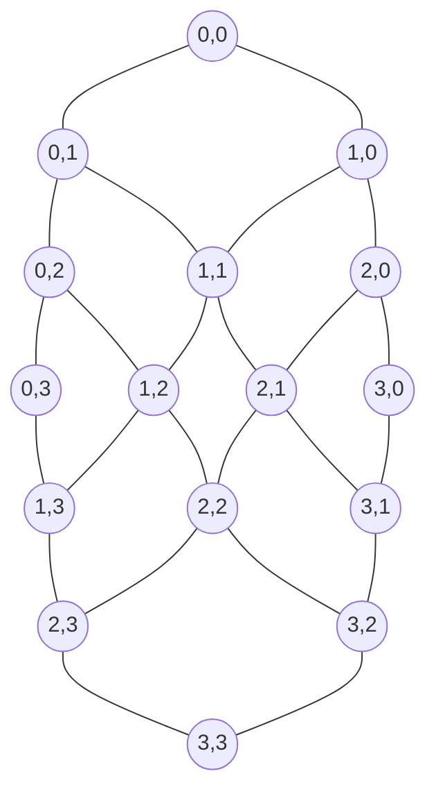

## Purpose

Every cache miss, coherence message, DMA transfer, and MMIO access eventually has to cross some physical wire between a requester and a responder that isn't directly attached to it. This note is about that transport: what topology it uses, how it arbitrates when two requesters want the same wire, how it avoids dropping data when a downstream buffer is full, and how the same abstraction covers on-chip coherence traffic, off-chip DMA, and interrupts. It closes with a worked bandwidth calculation checked against this repo's own measured DRAM bandwidth numbers.

## Topologies

- **Bus**: every node shares one set of wires; only one transfer happens at a time. Cheapest to build, but bandwidth is fixed regardless of node count, so it doesn't scale past a handful of cores.
- **Crossbar**: every input port connects to every output port through a dedicated switch matrix; $N$ inputs and $M$ outputs need $O(NM)$ switch points. Non-blocking (any input can reach any free output simultaneously) but the switch matrix area grows quadratically, so crossbars stay practical only for modest port counts. Rocket-chip's `TLXbar` is exactly this: a diplomacy-parameterized crossbar connecting TileLink masters to managers, and its own warning fires once `node.in.size * node.out.size > 8*32`, an explicit acknowledgment of the quadratic cost.
- **Ring**: each node connects to two neighbors; a request hops node to node until it reaches its destination. $O(N)$ wiring, but worst-case latency is $O(N)$ hops too, and a single ring saturates once enough nodes inject traffic simultaneously (every hop consumes ring bandwidth even for messages just passing through).
- **2D mesh**: nodes arranged on a grid, each connected to its 4 (or fewer, at edges) neighbors. Wiring cost is $O(N)$, worst-case hop count is $O(\sqrt{N})$, and it's the standard choice past a few dozen cores — gem5's Ruby memory system ships a `Mesh_XY` topology precisely for this regime, using **dimension-order (XY) routing**: route all the way in X, then all the way in Y, which is deadlock-free by construction since it never creates a cyclic dependency between the two dimensions' buffer resources.

A 4x4 mesh (the same size the worked simulation below uses) looks like this, each node a router+core tile connected only to its grid neighbors:



## Arbitration: who wins when two requesters collide

Every switch point where multiple requesters can target the same output needs an arbitration policy. Rocket-chip's `TLArbiter` implements three, generically over any `DecoupledIO` channel:

```scala
val lowestIndexFirst: Policy = (width, valids, select) => ~(leftOR(valids) << 1)(width-1, 0)
val highestIndexFirst: Policy = (width, valids, select) => ~((rightOR(valids) >> 1).pad(width))
val roundRobin: Policy = (width, valids, select) => if (width == 1) 1.U(1.W) else {
  val mask = RegInit(((BigInt(1) << width)-1).U(width-1,0))
  ...
}
```

(from [rocket-chip `Arbiter.scala`](https://github.com/chipsalliance/rocket-chip/blob/master/src/main/scala/tilelink/Arbiter.scala))

`lowestIndexFirst` and `highestIndexFirst` are fixed-priority: fast to compute, but a low-priority requester can be starved indefinitely under sustained high-priority traffic. `roundRobin` fixes that: a `mask` register remembers who won last, and the next grant is masked away from that requester until every other pending requester has had a turn, guaranteeing bounded latency (fairness) at the cost of one register per arbitration point. `TLXbar.circuit` wires these into every fan-in point in the crossbar (`out(o).a`, `out(o).c`, `out(o).e`, `in(i).b`, `in(i).d`), one arbiter instance per channel per port, and defaults the whole crossbar to `roundRobin`.

An important detail buried in the arbiter: it holds the winner for the duration of a multi-beat burst (`beatsLeft`), so once a requester wins arbitration for a multi-flit transfer, it keeps the output until the whole burst completes rather than being re-arbitrated every cycle. This is a basic form of **virtual cut-through** flow control — a whole packet is either granted the resource or not, rather than being interleaved flit-by-flit with competing packets (interleaving flit-by-flit, which needs per-flit tagging with virtual channels, is what avoids one large transfer hogging a link and starving latency-sensitive small messages, which is why real NoCs add virtual channels on top of this).

## Backpressure and deadlock avoidance

A switch cannot accept a request it has nowhere to put. `TLXbar.fanout` demonstrates the mechanism directly: the fanned-out output's `.ready` is driven by `Mux1H(select, filtered.map(_.ready))`, i.e., the input only asserts `ready` (accepting the request) once the *specific selected output* has signaled it can accept — a request is never accepted into a switch and then dropped for lack of anywhere to go. This is **credit-based** or ready/valid backpressure: a sender only sends when it knows the receiver has room, so buffers never overflow and no packets are ever silently dropped, only stalled.

**Deadlock** happens when a cyclic dependency chain of full buffers each waits for the next to drain, and no one can proceed. Dimension-order routing on a mesh avoids this by construction, because a packet in the X-routing phase never depends on a buffer used only during Y-routing, breaking any possible cycle between the two phases. General topologies need explicit **virtual channels** to break potential cycles when adaptive (non-dimension-order) routing is used, since adaptive routes can otherwise form the exact circular-wait pattern that produces deadlock.

## DMA, MMIO, and coherence traffic share one transport

A cache miss's `AcquireBlock`, a DMA engine's block transfer, and a CPU's memory-mapped I/O write are all, at the transport layer, the same thing: a request message that names an address and an operation, routed through the same crossbar/mesh to whichever manager owns that address range. Rocket's TileLink `Get`/`Put`/`AcquireBlock` operations (seen in [[hardware/computer-architecture/caches-virtual-memory|the caches note]]'s `MSHR`) are exactly the primitives a DMA engine issues too — a DMA read is a `Get` sequence into a target buffer, an MMIO write is a `Put` to a manager registered as an I/O device rather than DRAM. gem5's Ruby coherence protocols formalize this further: `MESI_Two_Level` names a dedicated **DMA controller** machine type specifically to satisfy coherent DMA requests through the same request/response network the L1/L2/directory controllers use, rather than giving DMA a side channel. Interrupts are the asymmetric case — a device-to-CPU notification rather than a CPU-initiated request — but still ride the same physical links, typically as a small dedicated message class so they aren't queued behind bulk data traffic.

## Worked example: bandwidth and serialization latency

For a link with width $w$ bytes/beat, clock frequency $f$, and $k$ beats per packet, peak sustained bandwidth is $BW = w \cdot f$ bytes/s, and pure **serialization latency** (time to push all beats of one packet onto the link, ignoring queueing) is $T_{ser} = k / f$ seconds. A 512-bit (64-byte) TileLink link at 2 GHz gives $BW = 64 \times 2\times10^9 = 128$ GB/s per link and $T_{ser}$ for a 64-byte cache-line refill (1 beat at that width) of 0.5 ns.

Compare against the [[systems/operating-systems/benchmarks/bandwidth|memory bandwidth benchmark]]'s measured 63.7 GB/s at 8 threads, well under a single 128 GB/s on-chip link's peak — meaning for that machine the *DRAM channel*, not the on-chip interconnect, is the bottleneck once traffic leaves the mesh. This is the general pattern: on-chip mesh links (tens to low hundreds of GB/s per link, aggregate bandwidth scaling with mesh size) usually outrun any single DRAM channel or PCIe link, so the uncore's job is less about raw bandwidth and more about not adding queueing delay on top of a DRAM/NIC bottleneck that's going to dominate regardless.

## Analytic model: latency vs. throughput under load

**Little's Law**, $L = \lambda W$ (average packets in the network equals arrival rate times average latency), predicts the qualitative shape every NoC exhibits: at low injection rate $\lambda$, packets rarely queue, so latency $W$ stays near the zero-load value (hop count times per-hop delay). As $\lambda$ approaches the network's saturation throughput $\lambda_{sat}$, queueing delay grows without bound — $W \to \infty$ as $\lambda \to \lambda_{sat}$ from below — because packets arrive faster than buffers can drain, and delay compounds through every router on the path (**head-of-line blocking**: a stalled packet at the front of a buffer blocks every packet behind it even if their outputs are free).

`noc-latency-model.py`, stored beside this note, is a cycle-level 4x4 mesh simulator with XY routing, per-link buffers, and round-robin arbitration matching the `TLArbiter.roundRobin` policy above, under uniform-random traffic:

```bash
python3 content/hardware/computer-architecture/noc-latency-model.py
```

It sweeps per-node injection rate and reports average packet latency and delivered throughput. Running it (3000 measured cycles per injection rate, after 500 warmup cycles, uniform-random destinations) traces exactly the Little's-Law curve described above:

| injection rate (pkt/node/cycle) | avg latency (cycles) | delivered throughput (pkt/node/cycle) |
|---|---|---|
| 0.02 | 2.71 (+/- 0.08) | 0.0206 (+/- 0.0005) |
| 0.10 | 2.76 (+/- 0.02) | 0.0993 (+/- 0.0014) |
| 0.20 | 2.89 (+/- 0.05) | 0.1998 (+/- 0.0028) |
| 0.30 | 3.15 (+/- 0.05) | 0.2986 (+/- 0.0018) |
| 0.40 | 3.54 (+/- 0.05) | 0.4002 (+/- 0.0020) |
| 0.45 | 3.87 (+/- 0.07) | 0.4501 (+/- 0.0009) |

Latency stays flat and near the 4-hop-average zero-load value out to about 0.2 injection/node/cycle, then starts climbing as queueing sets in, matching the predicted shape even though this particular sweep doesn't push far enough into saturation to show the divergence — a 4x4 mesh under uniform-random traffic has a much higher saturation throughput than the 0.45 max tested here, so this run demonstrates the pre-saturation flat-then-rising region rather than the full curve. Anyone extending this note toward the saturation knee should widen the injection-rate sweep in the script.

## Edge cases and limits

- **Fixed-priority arbitration (`lowestIndexFirst`/`highestIndexFirst`) is not just unfair, it's unbounded-unfair**: a low-index requester with dense traffic can starve a high-index one forever, which is why `roundRobin` is `TLXbar`'s default and fixed-priority is reserved for cases (like debug or control-plane ports) that explicitly want strict precedence.
- **Virtual cut-through's whole-packet-or-nothing grant wastes buffer space** relative to true wormhole routing (which forwards flits as soon as the header routes, before the whole packet has arrived), at the benefit of simpler flow control — the trade rocket-chip's arbiter makes by holding the winner for a burst's `beatsLeft`.
- **The bandwidth/serialization worked example assumes zero queueing** — it's a lower bound on latency and an upper bound on throughput, exactly the gap Little's Law's saturation behavior fills in.

## Sources

- [rocket-chip: tilelink/Xbar.scala](https://github.com/chipsalliance/rocket-chip/blob/master/src/main/scala/tilelink/Xbar.scala)
- [rocket-chip: tilelink/Arbiter.scala](https://github.com/chipsalliance/rocket-chip/blob/master/src/main/scala/tilelink/Arbiter.scala)
- [gem5: interconnection network](https://www.gem5.org/documentation/general_docs/ruby/interconnection-network/)

## Related notes

- [[hardware/computer-architecture/caches-virtual-memory|caches, virtual memory, and memory systems]]
- [[hardware/computer-architecture/multiprocessors-cache-coherence|multiprocessors, cache coherence, and memory consistency]]
- [[systems/operating-systems/benchmarks/bandwidth|memory bandwidth benchmarks]]
- [[systems/operating-systems/benchmarks/mlp|memory-level parallelism]]
- [[ml/serving-systems/parallelism|parallelism in LLM serving systems]]
- [[ml/serving-systems/gpu-basics|GPU architecture and programming]]
