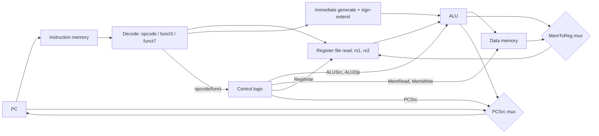

## Purpose

Build the Computer Architecture I foundation from bits to a working processor. RV32I is the concrete
ISA because its [specification](https://riscv.github.io/riscv-isa-manual/snapshot/spec/) is small
enough to decode by hand, and because two open cores implement it in different styles: [CVA6](https://github.com/openhwgroup/cva6)
as a hand-written SystemVerilog single-issue pipeline, [Rocket](https://github.com/chipsalliance/rocket-chip)
as a Chisel-generated in-order core. Both ground the abstract datapath/control split in real RTL.
This is one branch of [[hardware/computer-architecture/index|the computer architecture map]]; the next
branches are [[hardware/computer-architecture/pipelining-hazards-branch-prediction|pipelining]] and
[[hardware/computer-architecture/out-of-order-execution|out-of-order execution]].

## Core idea

A processor is a machine that repeatedly does fetch, decode, execute, memory access, writeback. The
**datapath** is the wiring: register file, ALU, memories, muxes, the pieces that move and transform
data. The **control** is a function from the current instruction (and, in a multicycle or pipelined
design, the current stage) to the mux-select and enable signals that make the datapath do the right
thing for that instruction. Everything else in this note is elaborating that split.

## RV32I encoding

RV32I instructions are 32 bits, always word-aligned, and split into six formats. `opcode` (bits
6:0) is always in the same place, which lets decode start before the rest of the fields are known.

```text
R-type: funct7[31:25] rs2[24:20] rs1[19:15] funct3[14:12] rd[11:7]  opcode[6:0]
I-type: imm[31:20]              rs1[19:15] funct3[14:12] rd[11:7]  opcode[6:0]
S-type: imm[31:25] rs2[24:20] rs1[19:15] funct3[14:12] imm[11:7]   opcode[6:0]
B-type: imm[31,7] imm[30:25] rs2[24:20] rs1[19:15] funct3[14:12] imm[11:8,7] opcode[6:0]
U-type: imm[31:12]                                    rd[11:7]  opcode[6:0]
J-type: imm[31,19:12,20,30:21]                        rd[11:7]  opcode[6:0]
```

`rs1`, `rs2`, `rd`, and `opcode` sit in the same bit positions across every format that uses them, so
a single wire fans out to the register file read ports before decode has fully resolved the
instruction. The sign bit of every immediate is always instruction bit 31, so sign extension runs in
parallel with decoding rather than after it. Branch and jump immediates are bit-rotated (not simply
packed) specifically to keep the register-source fields aligned across formats, trading a slightly
odd bit-swizzle in hardware for a uniform decode path ([ISA manual §2.2](https://riscv.github.io/riscv-isa-manual/snapshot/spec/)).

Decoding by hand: `add x5, x6, x7` is R-type, `opcode=0110011`, `funct3=000`, `funct7=0000000`,
`rd=00101`, `rs1=00110`, `rs2=00111`, giving `0000000 00111 00110 000 00101 0110011`. `addi x5, x6, -1`
is I-type with `imm=111111111111` (sign-extended -1), `opcode=0010011`.

CVA6's decoder confirms the sign-extension-in-parallel claim directly in RTL: every immediate variant
is built from `instruction_i[31]` regardless of format, computed unconditionally in the same
always_comb block instead of only after `opcode` is known:

```systemverilog
imm_i_type = {{CVA6Cfg.XLEN - 12{instruction_i[31]}}, instruction_i[31:20]};
imm_s_type = {{CVA6Cfg.XLEN - 12{instruction_i[31]}}, instruction_i[31:25], instruction_i[11:7]};
imm_sb_type = {{CVA6Cfg.XLEN - 13{instruction_i[31]}}, instruction_i[31], instruction_i[7],
               instruction_i[30:25], instruction_i[11:8], 1'b0};
```

(from [CVA6 `core/decoder.sv`](https://github.com/openhwgroup/cva6/blob/e4184b665b7c777224688e8973167c8c5842762a/core/decoder.sv), commit `e4184b6`)

## Single-cycle datapath

A single-cycle RV32I core executes one instruction per clock. Every instruction's critical path runs
through instruction memory, register file read, ALU, data memory (if a load/store), and register file
write, all in one cycle. The clock period is bounded by the *slowest* instruction (loads, which touch
both memories), even though most instructions (register-register ALU ops) need far less time.

```text
PC -> I$ -> {rs1,rs2,imm} -> RegFile read -> ALU -> D$ (loads/stores) -> RegFile write -> PC+4 or branch target
```

Control is a combinational function of `opcode`/`funct3`/`funct7`: it drives `ALUSrc` (register vs.
immediate), `ALUOp` (which ALU operation), `MemRead`/`MemWrite`, `RegWrite`, `MemToReg` (ALU result vs.
loaded value), and `PCSrc` (PC+4 vs. branch/jump target). Because the whole instruction finishes in one
cycle, there is no hazard logic: the next instruction always sees a fully updated register file and PC.



CVA6's register file is exactly the flip-flop-based structure this model assumes, parameterized over
read/commit ports:

```systemverilog
for (genvar i = 0; i < NR_READ_PORTS; i++) begin
  assign rdata_o[i] = mem[raddr_i[i]];
end
```

(from [CVA6 `core/ariane_regfile_ff.sv`](https://github.com/openhwgroup/cva6/blob/e4184b665b7c777224688e8973167c8c5842762a/core/ariane_regfile_ff.sv), commit `e4184b6`)

Reads are combinational (a wire, not a clocked read), writes are synchronous and gated per commit port
by a write-enable decoder, and register `x0` is hardwired so writes to it are absorbed. This lines up
with the ADR-style register file used in every textbook single-cycle design.

## Multicycle controller

Splitting fetch/decode/execute/memory/writeback into separate cycles turns the single combinational
controller into a finite state machine. Only the FSM's current state plus the instruction's opcode
determine the control signals for that cycle, so an ALU-register instruction can finish in 4 cycles
while a load takes 5. The FSM has one state per pipeline stage, plus opcode-dependent branches after
decode: ALU ops go IF -> ID -> EX -> WB; loads go IF -> ID -> EX -> MEM -> WB.

Average CPI drops below the single-cycle design's fixed 1 only if instruction mix favors short paths,
but clock period drops to the length of the *longest single stage*, not the longest whole instruction,
which is the entire point: the same functional units (one ALU, one memory port) get reused stage by
stage instead of duplicated for parallel access. This reuse is also what a pipeline gives up: a
pipeline needs five separate stage resources active at once, trading area for throughput.

## ALU control and register-register instructions

`funct3` and `funct7` together select the ALU operation; `funct7` bit 30 (`SUB`/`SRA` vs. `ADD`/`SRL`)
is the one bit RV32I overloads across R-type and I-type shifts. Rocket takes a different
implementation approach than a raw `funct3`/`funct7` case statement: `IDecode` is a truth table,
one row per instruction, mapping each RV32I opcode directly to a fixed-width control-signal vector
(legal, uses rs1/rs2, ALU function, memory command, writes rd, ...) resolved once at elaboration time
into decode logic:

```scala
ADD->  List(Y,N,N,N,N,N,Y,Y,A2_RS2,A1_RS1,IMM_X,DW_XPR,FN_ADD, N,M_X, N,N,N,N,N,N,Y,CSR.N,N,N,N,N),
SUB->  List(Y,N,N,N,N,N,Y,Y,A2_RS2,A1_RS1,IMM_X,DW_XPR,FN_SUB, N,M_X, N,N,N,N,N,N,Y,CSR.N,N,N,N,N),
SLL->  List(Y,N,N,N,N,N,Y,Y,A2_RS2,A1_RS1,IMM_X,DW_XPR,FN_SL,  N,M_X, N,N,N,N,N,N,Y,CSR.N,N,N,N,N),
```

(from [Rocket Chip `src/main/scala/rocket/IDecode.scala`](https://github.com/chipsalliance/rocket-chip/blob/55bcad0f59436de98ea510334121de8546b9e9d7/src/main/scala/rocket/IDecode.scala), commit `55bcad0`)

Same semantics as RV32I's R-type register-register instructions: ADD/SUB, SLT/SLTU, AND/OR/XOR,
SLL/SRL/SRA, each reading `rs1`/`rs2` and writing `rd` ([ISA manual §2.4.2](https://riscv.github.io/riscv-isa-manual/snapshot/spec/)),
but every control signal for every instruction is enumerated up front instead of computed by a
hand-written case statement, trading decoder readability for a mechanically checkable, exhaustive
table.

CVA6's ALU shows how a real implementation folds the base RV32I operations into a wider RV64GC
operation set behind a `case` on a decoded `operation` enum rather than raw `funct3`/`funct7` bits
(the decoder does that translation once, upstream):

```systemverilog
unique case (fu_data_i.operation)
  ANDL, ANDN: result_o = operand_a & operand_b_neg[CVA6Cfg.XLEN:1];
  ADD, SUB, ADDUW, SH1ADD, SH2ADD, SH3ADD: result_o = adder_result;
  SLTS, SLTU: result_o = {{CVA6Cfg.XLEN - 1{1'b0}}, less};
```

(from [CVA6 `core/alu.sv`](https://github.com/openhwgroup/cva6/blob/e4184b665b7c777224688e8973167c8c5842762a/core/alu.sv), commit `e4184b6`)

This is the general pattern in real decoders: raw instruction bits get translated once, early, into a
dense internal opcode, and every downstream unit (ALU, branch comparator, forwarding logic) switches
on that internal opcode instead of re-deriving meaning from `funct3`/`funct7` repeatedly.

## Memory operations, control flow, and traps

Loads/stores use I-type (loads) and S-type (stores) formats with a 12-bit signed byte offset added to
`rs1`. Byte, halfword, and word variants (`LB`/`LH`/`LW`, with unsigned `LBU`/`LHU`) determine both the
memory access width and whether the loaded value is sign- or zero-extended before being placed in
`rd`. Branches (B-type: `BEQ`, `BNE`, `BLT`, `BLTU`, `BGE`, `BGEU`) compare `rs1`/`rs2` and add a
sign-extended, 2-byte-aligned offset to the PC if taken, otherwise fall through to `PC+4`. `JAL`
(J-type) and `JALR` (I-type) are unconditional; both write `PC+4` into `rd` (usually `x1`, the return
address register) before jumping, which is how call/return is built without dedicated instructions.

Exceptions and interrupts are handled outside the base integer instructions: a trap redirects control
to a handler address, saves the interrupted PC, and raises privilege, then `MRET`/`SRET` reverses that
on return. In a single-cycle or multicycle design this is just another control-flow override on
`PCSrc`; in a pipelined or out-of-order design it becomes a precise-exception problem, covered in
[[hardware/computer-architecture/pipelining-hazards-branch-prediction|pipelining and hazards]].

## CPI, clock period, and the single-cycle vs. multicycle vs. pipelined tradeoff

| Design | CPI | Clock period bound | Hardware reuse |
|---|---|---|---|
| Single-cycle | 1 | Slowest instruction (load) | None; everything used once per instruction |
| Multicycle | Varies (~4-5, weighted by mix) | Slowest single stage | Full; one ALU, one memory port |
| Pipelined | Approaches 1 (with hazards) | Slowest single stage | Full, but 5 stages active simultaneously |

Multicycle wins over single-cycle when instruction mix is dominated by short instructions (its lower
clock period beats single-cycle's fixed CPI-1 once average CPI times clock period drops below the
single-cycle instruction time). Pipelining is the next step: keep the multicycle clock period but
overlap instructions across stages instead of serializing them, which is where CPI approaches 1 again
but hazards reappear because now multiple instructions are live in the datapath at once.

## Edge cases or limits

RV32I alone has no multiply, divide, or floating point; those are separate extensions (M, F/D) that
plug into the same register-file and decode structure but add functional units and, in the multiply
case, multi-cycle latency that a simple single-cycle model cannot absorb without stalling. `x0` being
hardwired to zero means the register file must special-case writes to register 0 (both CVA6 and Rocket
do this in the write-enable decode, not by trapping). Misaligned loads/stores and jumps are
implementation-defined in the base ISA: some cores trap, some handle it in hardware; the ISA manual
leaves this a platform choice rather than mandating one behavior.

## Sources

- [The RISC-V Instruction Set Manual, Volume I](https://riscv.github.io/riscv-isa-manual/snapshot/spec/)
- [CVA6 source, commit e4184b6](https://github.com/openhwgroup/cva6/tree/e4184b665b7c777224688e8973167c8c5842762a)
- [Rocket Chip source, commit 55bcad0](https://github.com/chipsalliance/rocket-chip/tree/55bcad0f59436de98ea510334121de8546b9e9d7)

## Related notes

- [[hardware/computer-architecture/index|A working map of computer architecture]]
- [[hardware/computer-architecture/pipelining-hazards-branch-prediction|Pipelining, hazards, and branch prediction]]
- [[hardware/computer-architecture/out-of-order-execution|Out-of-order and superscalar execution]]
- [[hardware/digital-design/369/system-verilog|SystemVerilog]]
- [[hardware/digital-design/371/algorithmic-state-machines|Algorithmic state machines]]
