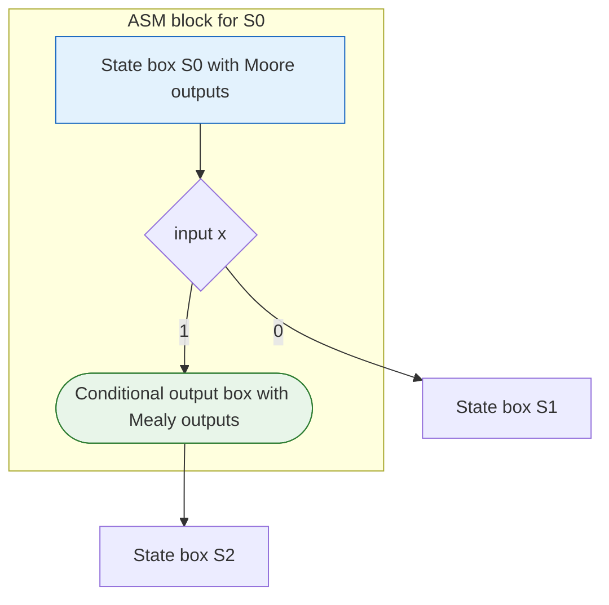

## Purpose

Algorithmic State Machines (ASMs) are the standard recipe for turning a sequential algorithm into clocked hardware. This note reviews FSMs, defines the control/datapath split, walks the ASM diagram notation, and ends with SystemVerilog skeletons for the controller and datapath.

## Review: Finite State Machines (FSMs)

A state machine is a set of states, transitions, and outputs. You use them to model systems with **finite, discrete states**. They are the bread and butter of hardware design, and they show up in software too (the state machine pattern).

### Mealy vs. Moore

- **Mealy**: Outputs depend on both the current state and the input, so an output can change as soon as an input changes, even without a state transition.
- **Moore**: Outputs depend only on the current state, so an output can only change when the state changes.

### Mathematical definition

More concisely, a finite state machine is a 5-tuple:

$$
FSM = (S, I, O, T, s_0)
$$

Where:

- $S$ is the set of states
- $I$ is the set of inputs
- $O$ is the set of outputs
- $T$ is the transition function, which maps a state and an input to a new state
- $s_0$ is the initial state

## What an Algorithmic State Machine is

An ASM is an extended framework for designing and implementing synchronous (clocked) digital systems around an FSM. At the highest level you divide the design into two parts:

1. **Control**: Manages state transitions and controls the flow of the algorithm.
   - Typically implemented as an FSM.
   - Generates control signals based on the current state and inputs.
   - Determines which operations happen and when.
2. **Datapath**: Performs the actual computations and data manipulation.
   - Built from combinational and sequential logic.
   - Consists of registers, multiplexers, arithmetic units, and other components that carry out the operations.
   - Processes data according to the signals the control unit generates.

If you come from software, the datapath is roughly the model and the control unit is the controller. Don't push the analogy far.

## Register Transfer Level (RTL) design

A sequential algorithm uses variables as symbolic memory locations, and sequential execution dictates the ordering of operations. The hardware implementation mirrors this. Registers store the intermediate data (the variables), the datapath implements every register operation as combinational logic attached to register inputs, and a control FSM sequences the register operations. This scheme is what people mean by register-transfer level (RTL) design.

The basic RTL operation is

$$
r_{\text{dest}} \leftarrow f(r_{\text{src1}}, r_{\text{src2}}, \ldots, r_{\text{srcn}})
$$

Where:

- $r_{i}$ is a register
- $f$ is some combinational function

For example:

- $r_{1} \leftarrow r_{2} + r_{3}$ adds the values in registers 2 and 3 and stores the result in register 1.
- $r_{1} \leftarrow 0$ clears register 1.
- $y \leftarrow a \cdot a$ multiplies the value in register $a$ by itself and stores the result in register $y$.

### Timing interpretation

- After a clock edge, the outputs of all registers update simultaneously and become available.
- During the rest of the clock cycle, those outputs propagate through the combinational logic that performs $f$.
- At the *next* clock edge, the result is stored into $r_{\text{dest}}$ and the process repeats.

## ASM Diagram (ASMD)

An ASM diagram is a graphical representation of an algorithmic state machine. It consists of:

- **State boxes**: Rectangular boxes representing the states, containing the state name and the Moore-type output signals.
- **Transition arrows**: The transitions between states.
- **Decision boxes**: Diamond-shaped boxes containing a condition with a $0$ and a $1$ transition. These determine state transitions.
- **Conditional output boxes**: Rounded boxes containing Mealy-type outputs, which depend on the current state and input conditions. A conditional output box must hang off a decision box.
- **ASM block**: A single state box grouped with all the decision and conditional output boxes that belong to that state. ASM blocks must not overlap, and a block must not contain an internal feedback loop (shrink the block until the loop goes outside it). All changes in an ASM block happen in a single clock cycle, **particularly at state exit** rather than entrance. That exit-time convention matters when you trace register updates.

One ASM block, with a state box feeding a decision box and a conditional output box hanging off the taken branch:



The Moore outputs in the state box hold for the whole cycle spent in S0. The Mealy outputs in the conditional output box assert only when `x = 1` while in S0. Everything inside the subgraph executes in one clock cycle.

> [!warning] Register updates land at state exit
> An RTL operation written in an ASM block, say $r \leftarrow r + 1$, does not change $r$ during that state. The datapath computes $r + 1$ over the cycle and the register captures it on the clock edge that exits the block, so any decision box in the same block still sees the old value of $r$.

## ASMD design procedure

Given some sequential algorithm:

1. Identify **datapath** components and **operations**. Registers, ALUs, multiplexers, and the additions, subtractions, comparisons, and so on that run through them.
2. Identify **states** and the **signals** that cause state transitions. These come from external inputs and status signals, based on the required sequence of operations.
3. Name the control signals. These are the outputs of the control unit and the inputs to the datapath.

## SystemVerilog controller module

```verilog
module controller(
    input logic clk, reset, // (input signals, e.g. start)
    // input logic (status signals, e.g. x_le_y, i_eq_z)
    // output logic {status indicators, e.g. ready, done}
    // output logic {control signals, e.g. load, incr, set}
);

  // define state names (enum) and variables
  /*
  enum logic [2:0] {S0, S1, S2, S3} ps, ns;
  */

  // controller logic with synchronous reset
  /*
  always_ff @(posedge clk)
    if (reset) ps <= S0;
    else ps <= ns;
  */

  // next state logic
  /*
  always_comb
    case (ps)
      S0:       ns = ...
      S1:       ns = ...
      S2:       ns = ...
      S3:       ns = ...
      default:  ns = ...
    endcase
  */

  // output assignment
  /*
  assign ctrl_sig_1 = (ps == Si) & (...);
  assign ctrl_sig_2 = (ps == Sj) & (...);
  ...
  */

endmodule // controller
```

## SystemVerilog datapath module

```verilog
module datapath #(parameter W=4)(
    input logic clk,
    // input logic (input data, e.g. [W-1:0] x)
    // output logic (output data, e.g. y)
    // input logic (control signals, e.g. load, incr, set)
    // output logic (status signals, e.g. x_le_y, i_eq_z)
);
  // internal datapath signals and regs
  /*
  logic [W-1:0] x;
  */

  // datapath logic
  /*
  always_ff @(posedge clk) begin
    if (load) x <= ...;
    else if (incr) x <= x + 1;
    else if (set) x <= ...;
  end
  */

  // output assignments
  /*
  assign y = ...;
  assign x_le_y = (x <= y);
  assign i_eq_z = (i == z);
  */

endmodule // datapath
```

## Related

- [[hardware/digital-design/369/sequential-logic|Sequential Logic]]
- [[hardware/digital-design/371/verilog-review|SystemVerilog Review]]
- [[hardware/digital-design/371/static-timing-analysis|Static Timing Analysis]]
- [[hardware/computer-architecture/rtl-reading-lab|Open-Source CPU RTL Reading Lab]]
