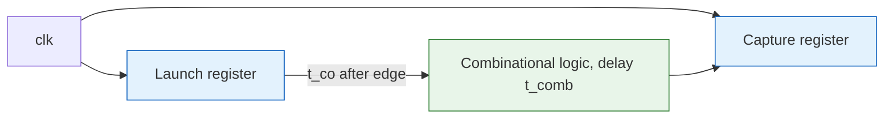

## Purpose

Timing in synchronous hardware comes down to keeping every register input stable inside a window around each clock edge. This note defines the constraints, shows how to turn them into inequalities on path delays, and records where static timing analysis happens in the FPGA design flow.

## Sequential timing constraints

- $t_s$ (**Setup Time**): The minimum time before the clock edge that the data input must be stable, so the flip-flop latches the data correctly.
- $t_h$ (**Hold Time**): The minimum time after the clock edge that the data input must remain stable, so the data doesn't change before the flip-flop latches it.
- $t_{co}$ (**Clock-to-Q Delay**): The time it takes for the flip-flop's output to change after the clock edge, i.e. the time for data to propagate through the flip-flop.

```txt
            T (clk edge)
            |
            |
  +---------+------------+
  |     reg must be      |
  |     stable during    |
  |     this time        |
T - t_s                T + t_h
```

A register input must not violate setup or hold constraints within a clock cycle. With $t_{\text{input}, i}$ being the $i$-th time a register input changes and $T_{clk}$ being the clock period, we need

$$
t_{h} \leq t_{\text{input}, i} \leq T_{clk} - t_{s} ~ \forall i
$$

So there are two constraints to keep in mind:

- $t_{\text{input}, i} \geq t_h$: The input must stay stable for at least the hold time after the clock edge.
- $t_{\text{input}, i} \leq T_{clk} - t_s$: The input must settle early enough to be stable for the setup time before the next clock edge.

When reasoning about combinational delay between registers, the hold constraint cares about the fastest possible path and the setup constraint cares about the slowest. So for hold time you find the shortest path through the circuit, and for setup time you find the longest.

The canonical path runs from a launching register through combinational logic to a capturing register, with both registers on the same clock:



> [!abstract] Register-to-register timing inequalities
> The capture register's input changes $t_{co} + t_{comb}$ after the clock edge. Substituting that into the window above gives one inequality per constraint:
>
> $$t_{co} + t_{comb,max} \leq T_{clk} - t_s \qquad \text{(setup, longest path)}$$
>
> $$t_{co} + t_{comb,min} \geq t_h \qquad \text{(hold, shortest path)}$$

A typical exam problem gives you $t_{co}$, $t_{h}$, $t_{s}$, and $T_{clk}$ and asks for the range of tolerable delays for a component on a path between two registers, or for how late an input signal can change after the clock edge. The method is the same either way. Identify the longest and shortest paths through the circuit that involve your component or connect the two registers, then write out the two inequalities above and solve for the unknown delay.

## In practice

Static timing analysis usually happens twice in the FPGA design process: once after synthesis, as static analysis of the RTL, and once after place and route, as static analysis of the netlist.

### Circuit path categorization

- **Data paths** run between inputs, sequential elements, and outputs.
- **Clock paths** run from device ports or internally generated clocks to the clock pins of sequential elements.
- **Asynchronous paths** run between inputs and the asynchronous set and clear pins of sequential elements.

## Related

- [[hardware/digital-design/369/waveform-diagram|Waveform Diagrams]]
- [[hardware/digital-design/369/sequential-logic|Sequential Logic]]
- [[hardware/digital-design/371/algorithmic-state-machines|Algorithmic State Machines]]
