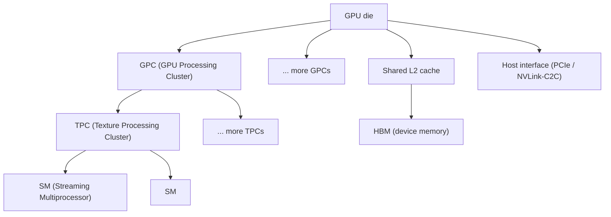
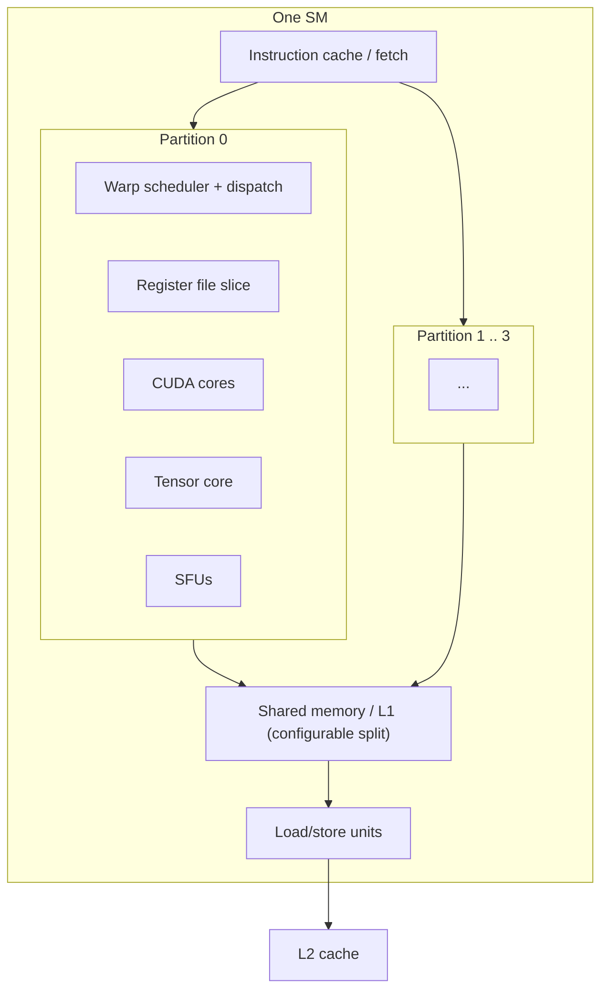
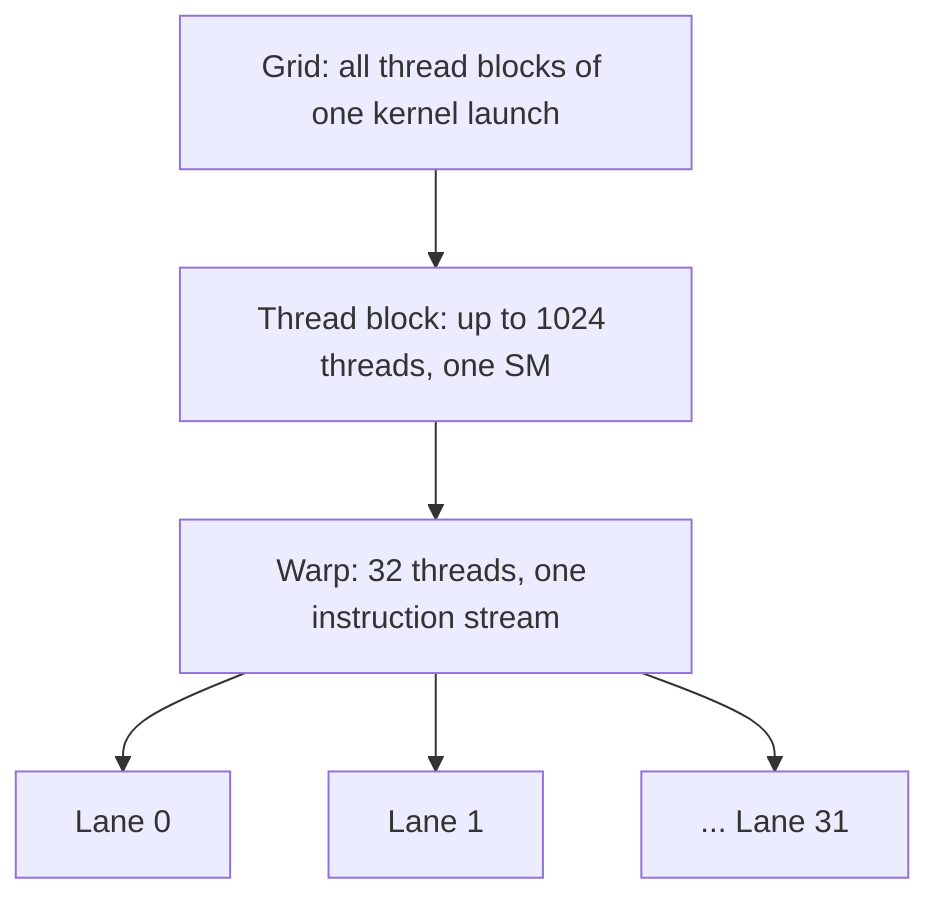

## Purpose

Most GPU explanations start from CUDA's thread/block/grid vocabulary and work outward. This note goes the other direction: it starts from clocked digital logic (the same registers and combinational datapaths covered in [[hardware/digital-design/369/system-verilog|SystemVerilog]]) and builds up to warps, SMs, and the memory pipeline that CUDA exposes. The goal is to make the SIMT execution model feel like an engineering consequence of hardware constraints rather than an arbitrary API choice.

Two kinds of claims appear here, and they are marked differently. Sentences about the H100/B200 cite NVIDIA documentation and are facts about real silicon. The four SystemVerilog modules are my own simplified teaching models, not vendor RTL; NVIDIA has never published its SM microarchitecture at the gate level. Where a real open GPU RTL exists for comparison, I point to [MIAOW](https://github.com/VerticalResearchGroup/miaow), a synthesizable implementation of AMD's Southern Islands ISA built for exactly this kind of architecture research.

## From wires to lanes: the hardware building blocks

Everything below rests on three primitives, all covered in [[hardware/digital-design/369/system-verilog|SystemVerilog]] and [[hardware/digital-design/369/sequential-logic|Sequential Logic]]:

- **A clocked register** (`always_ff @(posedge clk)`) is a single bit or word of state that only changes on a clock edge. It is the only place state legally lives in a synchronous design.
- **A combinational datapath** (`always_comb` or continuous `assign`) computes a function of its inputs with no memory; an adder, a multiplexer, or an ALU are all combinational blocks wired between registers.
- **Valid/ready handshaking** is the discipline two hardware blocks use to pass data when one might not be ready to receive: the sender asserts `valid`, the receiver asserts `ready`, and a transfer happens only on a cycle where both are high. This is how independent clocked blocks (a warp scheduler and an execution unit, say) communicate without assuming a shared, synchronous notion of "now."

A GPU core is enormous numbers of these three primitives, replicated and specialized. An ALU lane is a combinational datapath. A register file is an array of clocked registers with an addressing scheme. A pipeline is a chain of registers separated by combinational stages, one instruction phase advancing on every clock edge. Everything that follows names deliberate design choices layered on top of this substrate to extract data parallelism.

## The chip-level hierarchy

The [CUDA programming guide](https://docs.nvidia.com/cuda/cuda-c-programming-guide/) documents a hierarchy of compute resources; H100-class figures below are from the guide and the [Hopper architecture page](https://www.nvidia.com/en-us/data-center/technologies/hopper-architecture/).



An H100 SXM part has 132 SMs (up to 144 on the full GH100 die), 50 MB of L2, and 80 GB of HBM3 at roughly 3.35 TB/s, per the Hopper architecture page. A GPC groups several TPCs, and a TPC groups two SMs sharing an instruction cache path; the exact grouping is a floorplanning decision that does not change the programming model, since CUDA's grid/block abstraction targets SMs directly and the scheduler maps blocks onto whichever SM has room.

## Inside one SM

Each SM is itself a small parallel machine, not a single core. NVIDIA's documented H100 SM contains four warp-scheduler partitions, each with its own register file slice, CUDA cores (scalar FP32/INT32/FP64 ALUs), fourth-generation tensor cores, special function units (SFUs) for transcendentals, and load/store units, sharing one block of configurable L1/shared memory (up to 228 KB per SM) per the [CUDA programming guide](https://docs.nvidia.com/cuda/cuda-c-programming-guide/).



Four independent warp schedulers per SM exist because one scheduler cannot issue fast enough to keep all the SM's ALUs busy from a single instruction stream; splitting into partitions is a throughput decision, the same reason a CPU might use superscalar issue, except here the parallelism comes from separate warps rather than separate instructions from one thread.


## SIMT: one instruction stream, many lanes

Single Instruction, Multiple Threads (SIMT) is NVIDIA's name for the execution model documented in the [CUDA programming guide](https://docs.nvidia.com/cuda/cuda-c-programming-guide/): the hardware groups 32 consecutive threads into a warp, fetches and issues one instruction for the whole warp, and broadcasts it across 32 parallel lanes. This is a direct consequence of the RTL substrate above: fetching and decoding an instruction costs registers and combinational logic regardless of how many lanes execute it, so amortizing that cost over 32 lanes instead of 1 is pure efficiency. The cost is that a lane with nothing useful to do this instruction (a divergent branch, a masked-off predicate) still occupies a slot in the warp and the hardware still pays for it, just with its result discarded.



Compute capability 9.0 (Hopper) and 10.0 (Blackwell) both support up to 64 concurrent warps resident per SM, per the [Blackwell Tuning Guide](https://docs.nvidia.com/cuda/archive/12.8.1/blackwell-tuning-guide/index.html), which explicitly notes Blackwell targets similar occupancy to Hopper. Since Independent Thread Scheduling arrived in Volta (compute capability 7.0), threads within a warp can each carry their own program counter and diverge and reconverge independently rather than executing in lockstep with a single shared PC; the [Blackwell compatibility guide](https://docs.nvidia.com/cuda/inline-ptx-assembly/blackwell-compatibility-guide/index.html) still documents an opt-in flag to fall back to the older Pascal-style scheduling model for code that assumed warp-synchronous behavior. Divergence cost did not go away with Independent Thread Scheduling, it just stopped forcing full lockstep; a warp whose threads take different branches still executes both sides serially at the warp level.

## Four educational RTL models

The four models below are my own simplified teaching designs, meant to make the SIMT concepts above checkable in simulation. None of them are NVIDIA RTL; NVIDIA has not published SM microarchitecture at the gate level. [MIAOW](https://github.com/VerticalResearchGroup/miaow), a synthesizable open-source GPU implementing AMD's Southern Islands ISA, is the closest public reference for what real compute-unit RTL looks like, and its wiki documents an actual warp scheduler, vector register file, and ALU pipeline at a level of detail these four snippets intentionally do not attempt.

### Model 1: warp issue arbiter

One scheduler partition picks one ready warp to issue per cycle. This is the hardware justification for the "4 warps run at once, more are queued" structure GPUs actually use: only one of the warps mapped to a partition can issue in a given cycle, so a round-robin (or a fairer policy, GPU simulators commonly model greedy-then-oldest) keeps every ready warp making progress instead of starving.

```systemverilog
// Educational model, not vendor RTL. Round-robin arbiter picking one
// ready warp to issue each cycle, one-hot output.
module warp_issue_arbiter #(
    parameter int NUM_WARPS = 4
) (
    input  logic                  clk,
    input  logic                  rst_n,
    input  logic [NUM_WARPS-1:0]  warp_ready,   // warp i has a decoded instruction ready
    output logic [NUM_WARPS-1:0]  warp_grant,   // one-hot: warp granted issue this cycle
    output logic                  issue_valid   // some warp was granted
);
    logic [$clog2(NUM_WARPS)-1:0] rr_ptr;       // round-robin priority pointer
    logic [2*NUM_WARPS-1:0]       ready_x2;     // ready mask duplicated for rotation
    logic [2*NUM_WARPS-1:0]       grant_x2;

    assign ready_x2 = {warp_ready, warp_ready};

    always_comb begin
        grant_x2    = '0;
        issue_valid = 1'b0;
        for (int i = 0; i < NUM_WARPS; i++) begin
            if (!issue_valid && ready_x2[rr_ptr + i]) begin
                grant_x2[rr_ptr + i] = 1'b1;
                issue_valid = 1'b1;
            end
        end
        warp_grant = grant_x2[NUM_WARPS-1:0] | grant_x2[2*NUM_WARPS-1:NUM_WARPS];
    end

    always_ff @(posedge clk or negedge rst_n) begin
        if (!rst_n)          rr_ptr <= '0;
        else if (issue_valid) rr_ptr <= (rr_ptr + 1) % NUM_WARPS; // move past the granted warp
    end
endmodule
```

Testbench sketch: assert fairness (every ready warp gets granted within `NUM_WARPS` cycles) and correctness (no grant when nothing is ready).

```systemverilog
module warp_issue_arbiter_tb;
    logic clk = 0, rst_n = 0;
    logic [3:0] warp_ready, warp_grant;
    logic issue_valid;

    warp_issue_arbiter #(.NUM_WARPS(4)) dut (.*);
    always #5 clk = ~clk;

    initial begin
        rst_n = 0; warp_ready = 4'b0000;
        @(posedge clk); rst_n = 1;

        warp_ready = 4'b0100;  // only warp 2 ready
        @(posedge clk);
        assert (warp_grant == 4'b0100)
            else $error("expected warp 2 granted, got %b", warp_grant);

        warp_ready = 4'b0000;  // nobody ready
        @(posedge clk);
        assert (issue_valid == 1'b0)
            else $error("issued with no ready warps");
        $finish;
    end
endmodule
```

### Model 2: banked (per-lane) register file

Warp width is not arbitrary: 32 lanes read from 32 independent register-file banks in the same cycle, one bank per lane, which is exactly what lets the whole warp read its operands in a single cycle instead of serializing 32 scalar reads. Modeling each lane's registers as its own tiny memory makes that parallelism explicit and makes a conflict structurally impossible, since lane `i` can only ever address bank `i`.

```systemverilog
// Educational model, not vendor RTL. One synchronous register-file
// bank per SIMT lane; a warp-wide register read is 32 parallel bank
// reads in a single cycle, addressed identically across lanes.
module lane_register_file #(
    parameter int NUM_LANES     = 32,
    parameter int REGS_PER_LANE = 256,
    parameter int DATA_WIDTH    = 32
) (
    input  logic                                 clk,
    input  logic [$clog2(REGS_PER_LANE)-1:0]     raddr,   // same register index, all lanes
    input  logic [$clog2(REGS_PER_LANE)-1:0]     waddr,
    input  logic                                 we,
    input  logic [NUM_LANES-1:0][DATA_WIDTH-1:0] wdata,
    output logic [NUM_LANES-1:0][DATA_WIDTH-1:0] rdata
);
    logic [DATA_WIDTH-1:0] bank [NUM_LANES-1:0][REGS_PER_LANE-1:0];

    genvar lane;
    generate
        for (lane = 0; lane < NUM_LANES; lane++) begin : g_lane
            always_ff @(posedge clk) begin
                if (we) bank[lane][waddr] <= wdata[lane];
                rdata[lane] <= bank[lane][raddr];
            end
        end
    endgenerate
endmodule
```

Testbench sketch: write register 3 with a distinct value per lane, then confirm the whole warp reads it back in one cycle.

```systemverilog
module lane_register_file_tb;
    localparam int LANES = 32;
    logic clk = 0;
    logic [7:0] raddr, waddr;
    logic we;
    logic [LANES-1:0][31:0] wdata, rdata;

    lane_register_file #(.NUM_LANES(LANES), .REGS_PER_LANE(256)) dut (.*);
    always #5 clk = ~clk;

    initial begin
        waddr = 8'd3; we = 1'b1;
        for (int i = 0; i < LANES; i++) wdata[i] = i;
        @(posedge clk);
        we = 1'b0;

        raddr = 8'd3;
        @(posedge clk);
        for (int i = 0; i < LANES; i++)
            assert (rdata[i] == i)
                else $error("lane %0d expected %0d got %0d", i, i, rdata[i]);
        $finish;
    end
endmodule
```

### Model 3: pipelined multiply-accumulate datapath (matrix engine primitive)

Tensor cores compute small matrix products per instruction instead of one multiply-add per thread. The primitive underneath is a multiply-accumulate (MAC) chain: a systolic-style pipeline of MAC stages, each stage registered, streaming operands through so a new partial product completes every cycle even though any single result takes several cycles to reach the output. This is the same pipelining idea from [[hardware/digital-design/371/static-timing-analysis|static timing analysis]], applied to arithmetic instead of control: splitting one long combinational multiply-then-add into registered stages raises achievable clock frequency at the cost of latency.

```systemverilog
// Educational model, not vendor RTL. 4-deep pipelined MAC chain, one
// educational analog of the systolic accumulation inside a matrix
// engine: each stage multiplies one (a,b) pair and adds it into the
// running sum carried from the previous stage.
module pipelined_mac_chain #(
    parameter int WIDTH = 16,
    parameter int DEPTH = 4
) (
    input  logic                   clk,
    input  logic                   rst_n,
    input  logic                   in_valid,
    input  logic [DEPTH-1:0][WIDTH-1:0] a,
    input  logic [DEPTH-1:0][WIDTH-1:0] b,
    output logic                   out_valid,
    output logic [2*WIDTH+DEPTH-1:0] acc_out
);
    logic [2*WIDTH+DEPTH-1:0] acc [DEPTH:0];
    logic [DEPTH:0]           valid_pipe;

    assign acc[0]        = '0;
    assign valid_pipe[0] = in_valid;

    genvar s;
    generate
        for (s = 0; s < DEPTH; s++) begin : g_stage
            always_ff @(posedge clk or negedge rst_n) begin
                if (!rst_n) begin
                    acc[s+1]        <= '0;
                    valid_pipe[s+1] <= 1'b0;
                end else begin
                    acc[s+1]        <= acc[s] + (a[s] * b[s]); // multiply-add this stage
                    valid_pipe[s+1] <= valid_pipe[s];          // carry the valid bit downstream
                end
            end
        end
    endgenerate

    assign acc_out   = acc[DEPTH];
    assign out_valid = valid_pipe[DEPTH];
endmodule
```

Testbench sketch: push one operand set in, confirm `out_valid` rises exactly `DEPTH` cycles later and `acc_out` equals the reference dot product.

```systemverilog
module pipelined_mac_chain_tb;
    localparam int WIDTH = 16, DEPTH = 4;
    logic clk = 0, rst_n = 0, in_valid, out_valid;
    logic [DEPTH-1:0][WIDTH-1:0] a, b;
    logic [2*WIDTH+DEPTH-1:0] acc_out;
    int expected;

    pipelined_mac_chain #(.WIDTH(WIDTH), .DEPTH(DEPTH)) dut (.*);
    always #5 clk = ~clk;

    initial begin
        rst_n = 0; in_valid = 0;
        @(posedge clk); rst_n = 1;

        for (int i = 0; i < DEPTH; i++) begin a[i] = i + 1; b[i] = 2; end
        expected = 0;
        for (int i = 0; i < DEPTH; i++) expected += (i + 1) * 2;

        in_valid = 1'b1;
        @(posedge clk);
        in_valid = 1'b0;

        repeat (DEPTH - 1) @(posedge clk);
        assert (out_valid == 1'b1)
            else $error("expected out_valid after %0d cycles", DEPTH);
        assert (acc_out == expected)
            else $error("expected acc_out=%0d got %0d", expected, acc_out);
        $finish;
    end
endmodule
```

### Model 4: valid/ready handshake between scheduler and execution unit

The arbiter (Model 1) and the MAC pipeline (Model 3) run at different depths and can stall independently (a shared-memory bank conflict downstream, a busy tensor core). A valid/ready handshake decouples them: the scheduler asserts `valid` when it has an instruction to issue, the execution unit asserts `ready` when it can accept one, and only a cycle with both high is a real transfer. This is the same handshake used throughout real NoCs and AXI-style buses, scaled down to a two-block example.

```systemverilog
// Educational model, not vendor RTL. Minimal valid/ready handshake
// between an issuing warp scheduler and a downstream execution unit
// that is not always free to accept a new instruction.
module issue_handshake #(
    parameter int OPWIDTH = 8
) (
    input  logic               clk,
    input  logic                rst_n,
    input  logic                sched_valid,   // scheduler has an instruction
    input  logic [OPWIDTH-1:0]  sched_op,
    output logic                sched_ready,   // execution unit can accept it
    output logic                exec_valid,    // instruction accepted this cycle
    output logic [OPWIDTH-1:0]  exec_op
);
    logic busy;   // models a multi-cycle execution unit occupied by a prior op

    assign sched_ready = !busy;
    assign exec_valid  = sched_valid && sched_ready; // transfer iff both sides agree

    always_ff @(posedge clk or negedge rst_n) begin
        if (!rst_n) begin
            busy    <= 1'b0;
            exec_op <= '0;
        end else if (exec_valid) begin
            busy    <= 1'b1;      // pretend this op occupies the unit next cycle
            exec_op <= sched_op;
        end else begin
            busy    <= 1'b0;      // frees up if nothing was accepted
        end
    end
endmodule
```

Testbench sketch: hold `sched_valid` high while the unit is busy and assert no transfer occurs, then release and confirm exactly one transfer.

```systemverilog
module issue_handshake_tb;
    logic clk = 0, rst_n = 0, sched_valid, sched_ready, exec_valid;
    logic [7:0] sched_op, exec_op;

    issue_handshake #(.OPWIDTH(8)) dut (.*);
    always #5 clk = ~clk;

    initial begin
        rst_n = 0; sched_valid = 0; sched_op = 8'hAA;
        @(posedge clk); rst_n = 1;

        sched_valid = 1'b1;
        @(posedge clk);
        assert (exec_valid == 1'b1 && exec_op == 8'hAA)
            else $error("expected transfer of op AA");

        @(posedge clk); // execution unit now busy, sched_ready should drop
        assert (sched_ready == 1'b0)
            else $error("expected sched_ready low while busy");
        $finish;
    end
endmodule
```

## Worked trace: one warp instruction, issue to writeback

Trace a single `FFMA` (fused multiply-add) warp instruction through the pipeline built from the models above, using a simplified 5-stage view (fetch/decode already resolved, so the trace starts at issue):

1. **Issue (cycle 0)**: `warp_issue_arbiter` grants warp 2, which has a decoded `FFMA R3, R1, R2, R3` ready. `warp_grant = 0100`, `issue_valid = 1`.
2. **Register read (cycle 1)**: the issued warp's register index feeds `lane_register_file.raddr` for `R1` and `R2` across all 32 lanes in parallel; 32 pairs of operands come out one cycle later (the model's registered read).
3. **Handshake to execution unit (cycle 2)**: the decoded operands and opcode present as `sched_valid` to `issue_handshake`; if the target ALU/tensor pipe is free (`sched_ready = 1`), `exec_valid` fires and the operands enter the pipeline.
4. **Execute (cycles 3-6)**: the multiply-add streams through the 4-stage `pipelined_mac_chain`; each stage advances one operand set per cycle, so throughput is one FFMA issued per cycle once the pipeline is full, but this particular instruction's result is not ready until 4 cycles after it entered.
5. **Writeback (cycle 7)**: `acc_out` with `out_valid = 1` is written back into `lane_register_file` at `R3` (`we = 1`, `waddr = R3`), one bank per lane, completing the instruction.

The pipeline depth (4 execute stages here) is why a single warp cannot issue two dependent instructions back to back without a stall or without the scheduler filling the gap with a different warp's instruction. This is precisely why having many resident warps per SM (up to 64 on Hopper/Blackwell) matters: while warp 2's FFMA is still draining through the pipeline, the scheduler can issue warp 5's instruction in the same slot, hiding the pipeline latency instead of stalling.


## Memory pipeline: registers to HBM

Reading `R1`/`R2` in the trace above is the fast path; most real kernels also touch shared memory, L2, and HBM, each a step further from the ALU and each documented with very different bandwidth and latency:

- **Registers**: read in the same cycle as issue in this model (real hardware pipelines this over 1-2 cycles); private per thread, largest but cheapest resource per access.
- **Shared memory / L1**: on-chip SRAM, configurable up to 228 KB per SM on Hopper and Blackwell compute capability 10.0 per the [Blackwell Tuning Guide](https://docs.nvidia.com/cuda/archive/12.8.1/blackwell-tuning-guide/index.html); visible to a whole thread block, tens of cycles of latency, banked similarly to the register file so that a warp's 32 threads can hit 32 different banks in one cycle without conflict.
- **L2 cache**: shared across the whole GPU, 50 MB on H100 and up to 126 MB on GB200 per the tuning guide; hundreds of cycles of latency but far faster than a round trip to HBM.
- **HBM (device memory)**: off-chip, ~3.35 TB/s on H100 SXM and up to 8 TB/s aggregate on B200-class HBM3e configurations per NVIDIA's published specs; the slowest and highest-capacity tier, hundreds of cycles away, and the layer the [[ml/serving-systems/performance-modeling|roofline model]] treats as "the" bandwidth denominator for a single-GPU kernel.


## Bandwidth and latency: a worked calculation

Take an H100 SXM: 3.35 TB/s HBM bandwidth and roughly 132 SMs (Hopper architecture page). A kernel that streams through the entire 80 GB of HBM once, purely memory bound, takes at minimum

$$T = \frac{80 \times 10^9 \text{ bytes}}{3.35 \times 10^{12} \text{ bytes/s}} \approx 23.9\text{ ms}$$

Per-SM share of that bandwidth, if perfectly divided, is $3.35\text{ TB/s} / 132 \approx 25.4\text{ GB/s}$ per SM. A single warp's load instruction moving 32 lanes x 4 bytes = 128 bytes in one coalesced transaction, issued back to back with zero stall, would need $128\text{ bytes} / 25.4\text{ GB/s} \approx 5\text{ ns}$ per transaction just to stay bandwidth-bound at the SM's fair share, which at a ~1.8 GHz clock is roughly 9 cycles; well above the roughly 1-cycle issue rate, which is exactly why real kernels need many warps in flight (see the worked trace above) rather than one warp saturating memory bandwidth alone. This is the same conclusion the [[ml/serving-systems/performance-modeling|roofline model]] reaches from the software side: single-thread or single-warp memory traffic is nowhere near enough to hit peak bandwidth, so occupancy exists to keep enough outstanding memory requests in flight.

## Resource tradeoff: registers, shared memory, occupancy, pipeline depth

Everything above shares one finite SM budget: on Hopper/Blackwell compute capability 10.0, 64K 32-bit registers and up to 228 KB of shared memory per SM, with up to 64 resident warps per SM per the [Blackwell Tuning Guide](https://docs.nvidia.com/cuda/archive/12.8.1/blackwell-tuning-guide/index.html). These trade off directly:

- **More registers per thread** reduces spills to local memory (which is just HBM traffic in disguise) but reduces how many warps' worth of registers fit in the 64K-register file, lowering occupancy.
- **More shared memory per block** enables larger tiles (fewer HBM round trips per unit of compute, raising arithmetic intensity per the [[ml/serving-systems/performance-modeling|roofline model]]) but reduces how many blocks fit per SM simultaneously.
- **Deeper execution pipelines** (Model 3 above) raise achievable clock frequency and per-cycle throughput once full, but raise the latency any single dependent instruction chain must tolerate, again pushing toward needing more resident warps to hide that latency.

None of these axes can be maximized independently: a kernel using all 228 KB of shared memory per block leaves room for only one block per SM regardless of register usage, and a kernel using 255 registers per thread (the compute-capability 10.0 max per the tuning guide) leaves room for at most $65536 / (255 \times 32) \approx 8$ warps per SM, an eighth of the 64-warp ceiling. Occupancy alone is not a sufficient optimization target (see [[ml/serving-systems/gpu-basics|GPU Basics]] for why), but it is the visible symptom of this three-way resource competition, and tuning any one axis (registers, shared memory, launch bounds) moves the other two.

## Related notes

- [[hardware/digital-design/369/system-verilog|SystemVerilog]] and [[hardware/digital-design/369/sequential-logic|Sequential Logic]] for the RTL primitives this note builds on.
- [[hardware/digital-design/371/static-timing-analysis|Static Timing Analysis]] for why pipelining trades latency for frequency.
- [[ml/serving-systems/gpu-basics|GPU Basics]] for the software-facing view of warps, occupancy, and dtype throughput.
- [[ml/serving-systems/optimizing-gpu-kernels|Optimizing GPU Kernels]] for how these hardware constraints shape real kernel design (tiling, TMA, tensor cores).
- [[ml/serving-systems/performance-modeling|Performance Modeling for LLM Serving Systems]] for the roofline model this note's bandwidth calculation feeds into.
- [[ml/serving-systems/gpu-interconnects|GPU Interconnects and Collective Communication]] for what happens once data leaves a single GPU's HBM.
