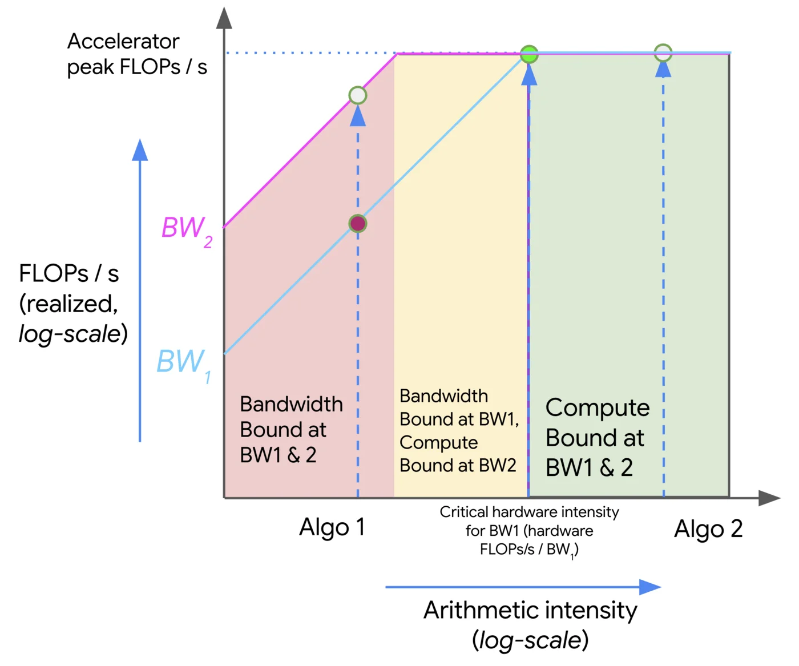

## Purpose

This is the compact reference for the roofline analysis developed in [[llm-serving-systems/performance-modeling|Performance Modeling]] and applied in [[llm-serving-systems/optimizing-gpu-kernels|Optimizing GPU Kernels]].

> "When we run algorithms on hardware, we're bounded by three things: how fast it can do math (OPs/second), the bandwidth available for moving data around (bytes/second), and the total memory available to store data (bytes). These "roofline" constraints let us upper and lower bound the time of a given computation." - [How to Scale Your Model - All About Rooflines](https://jax-ml.github.io/scaling-book/roofline/)

## Arithmetic intensity

> Definition: the arithmetic intensity of an algorithm is given by the ratio of the total FLOPs it performs to the number of bytes it needs to communicate, either within a chip or between chips.

$$
\text{Arithmetic Intensity} = \frac{\text{Computation FLOPs}}{\text{Communication Bytes}}
$$

We want models to run as compute-bound as possible, meaning the algorithm's intensity meets or exceeds what the hardware supplies. That drives utilization up. A memory-bound workload leaves compute supply unmatched and the hardware underutilized.

### Example: dot product

$$
\text{Dot Product} = \sum_{i=1}^{n} a_i b_i
$$

For $a, b \in \mathbb{R}^n$ in a 2-byte dtype (float16), we load $2n$ elements ($4n$ bytes), write one ($2$ bytes), and perform $n$ multiplications plus $n-1$ additions:

$$
\text{Intensity (dot product)} = \frac{2n - 1}{4n + 2} \to \frac{1}{2} \text{ as } n \to \infty
$$

That is bad. An H100 supplies roughly 333 FLOPs per byte (see below), so the dot product is deeply memory bound and the GPU spends most of its time waiting on loads.

## Roofline plot

Roofline plots put arithmetic intensity on the x-axis and performance on the y-axis, both usually log scale. Three regions matter:

- Roofline: the performance upper bound at each intensity, set by memory bandwidth on the left and peak compute on the right.
- Compute-bound: the flat region. Where compute-heavy workloads want to live.
- Memory-bound: the slanted region, where bandwidth caps performance.

Moving up within the memory-bound region means better data movement (coalesced access, tiling, faster memory) or better math throughput (multithreading, SIMD) once compute binds. NUMA effects make the memory side harder: when memory is "local" or "remote" relative to a core, careless placement turns into communication overhead.

Writing $\text{OI}$ for operational intensity, a workload is compute bound when $\text{OI}(\text{algorithm}) > \text{OI}(\text{accelerator})$ and memory bound when the inequality flips. The balance point is the critical operational intensity, $\text{OI}(\text{algorithm}) = \text{OI}(\text{accelerator})$. For an H100 at ~1000 FP16 TFLOPs and ~3 TB/s, the critical intensity is about 333 FLOPs/byte, so the dot product's $\frac{1}{2}$ is very memory bound.

## Matrix multiplication with FP16

For $A \in \mathbb{R}^{M \times N}$, $B \in \mathbb{R}^{N \times K}$, and $C = AB$: reads are $2MN + 2NK$ bytes, writes $2MK$ bytes, compute $2MNK$ FLOPs.

$$
\text{OI}(\text{matmul}) = \frac{2MNK}{2MN + 2NK + 2MK} \approx M \text{ if } M \text{ is large}
$$

So with $M$ as the batch dimension, matmul goes compute bound on the H100 once $M > 333$.

## Key hardware specs for serving throughput

- $N_{\text{gpus}}$: number of GPUs
- $\text{MemBW}$: memory bandwidth (GB/s)
- $\text{NetBW}$: GPU interconnect bandwidth (GB/s)
- $\text{GPU}_{\text{mem}}$: GPU memory (GB)
- $\text{compute}$: GPU compute (TFLOPs)

## Key model specs for serving throughput

- $D_\text{model}$: hidden dimension size (`hidden_dim`)
- $L$: number of layers (`num_layers`)
- $P_\text{model}$: number of parameters
- $R_\text{GQA}$: group size of GQA (`group_size`)
- $S_\text{type}$: datatype size (`float16` = 2 bytes, `bfloat16` = 2 bytes, `int8` = 1 byte)
- $p$: average number of tokens to prefill
- $d$: average number of tokens to decode
- $p + d$: average number of tokens per user request
- $\frac{\text{Throughput}_\text{total}}{p + d}$: per-request throughput
- $d\frac{\text{Throughput}_\text{total}}{p + d}$: decoding throughput

## Execution time model

Assume optimal batching and enough demand to keep the hardware fed.

Memory: each iteration effectively streams all of GPU memory (weights, activations, KV cache) once, so $t_\text{mem} = \frac{\text{GPU}_{\text{mem}}}{\text{MemBW}}$.

Compute: dense operations cost 2 FLOPs per parameter per batched token, so $t_{\text{compute}} = \frac{2 B_{\text{dense}} P_\text{model}}{\text{compute}}$.

Network: for a model sharded across GPUs, the collectives that matter are `AllGather` and `AllReduce`.

- `AllGather`: collect each GPU's output; roughly $N_{\text{gpus}} - 1$ network hops, with several per layer (4 in Llama 2).
- `AllReduce`: roughly twice the cost of an `AllGather`.

$$
\begin{align*}
N_{\text{gpus}} - 1 & \text{ hops} \\
4 & \text{ allgather per layer} \\
B_\text{dense} D_\text{model} & \text{ shape of the activations} \\
S_\text{type} & \text{ size of the datatype}\\
\end{align*}
$$

$$
T_\text{network} = \frac{4(N_{\text{gpus}} - 1) B_\text{dense} D_\text{model} S_\text{type}L}{\text{NetBW}}
$$

## Related notes

- [[llm-serving-systems/performance-modeling|Performance Modeling]]
- [[llm-serving-systems/optimizing-gpu-kernels|Optimizing GPU Kernels]]
