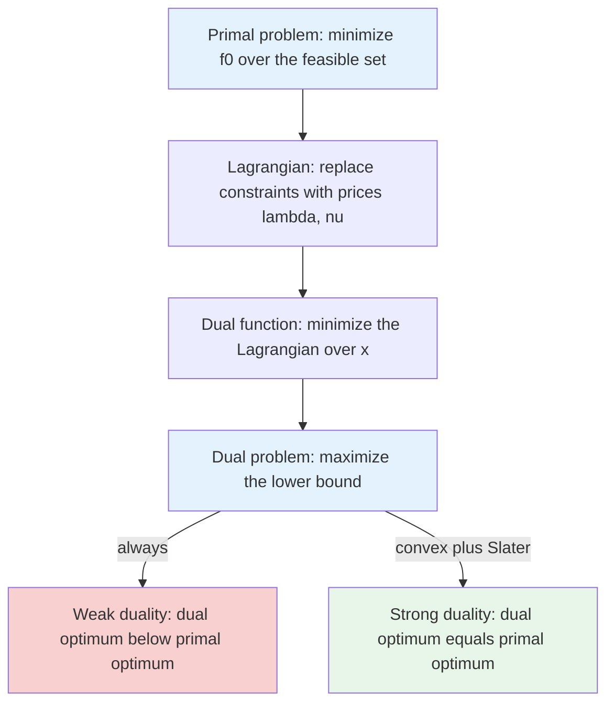

## Purpose

A reference for constrained optimization: what convexity buys, how the Lagrangian and dual problem arise, and what the KKT conditions say. [[algorithms/linear-programming|Linear Programming]] is the special case where everything is affine, and resource allocation under constraints — as in [[systems/scheduling/index|scheduling]] — uses the dual-variables-as-prices idea without naming it. Section and equation references are to [Boyd and Vandenberghe](https://web.stanford.edu/~boyd/cvxbook/), cited as B&V.

## Convex sets and functions

A set $C$ is convex if the segment between any two of its points stays inside: $x, y \in C$ and $\theta \in [0,1]$ imply $\theta x + (1-\theta) y \in C$ (B&V §2.1). A function $f$ is convex if its domain is convex and

$$
f(\theta x + (1-\theta) y) \le \theta f(x) + (1-\theta) f(y),
$$

chords lie above the graph (B&V §3.1). Two equivalent tests for differentiable $f$: the first-order condition $f(y) \ge f(x) + \nabla f(x)^T (y - x)$, the tangent plane is a global underestimator, and the second-order condition $\nabla^2 f(x) \succeq 0$.

Convexity changes what optimization can promise. For a convex $f$ over a convex set, every local minimum is global, and the first-order condition turns a zero gradient from a stationarity statement into a certificate of optimality. Without convexity, all the machinery below still produces necessary conditions, but nothing certifies you found the minimum.

## The Lagrangian and the dual

Standard form (B&V §4.2, §5.1):

$$
\begin{aligned}
\text{minimize} \quad & f_0(x) \\
\text{subject to} \quad & f_i(x) \le 0, \quad i = 1, \dots, m \\
& h_j(x) = 0, \quad j = 1, \dots, p,
\end{aligned}
$$

convex when $f_0, \dots, f_m$ are convex and the $h_j$ affine. The Lagrangian prices the constraints instead of enforcing them:

$$
L(x, \lambda, \nu) = f_0(x) + \sum_{i=1}^m \lambda_i f_i(x) + \sum_{j=1}^p \nu_j h_j(x),
$$

with multipliers $\lambda_i \ge 0$ for inequalities and free $\nu_j$ for equalities. The dual function minimizes out $x$:

$$
g(\lambda, \nu) = \inf_x L(x, \lambda, \nu).
$$

For any feasible $x$ and any $\lambda \succeq 0$, the penalty terms are nonpositive, so $L(x, \lambda, \nu) \le f_0(x)$, and therefore $g(\lambda, \nu) \le p^\star$, the primal optimum. Every dual point is a lower bound; this is weak duality, and it holds with no convexity at all (B&V §5.1.3). Maximizing the bound gives the dual problem, always concave regardless of the primal, with optimum $d^\star \le p^\star$. The gap $p^\star - d^\star$ closes for convex problems under mild conditions: Slater's condition, existence of a strictly feasible point with $f_i(x) < 0$, guarantees strong duality $d^\star = p^\star$ (B&V §5.2.3).



Boyd's interpretation in [EE364a lecture 9](https://see.stanford.edu/materials/lsocoee364a/transcripts/ConvexOptimizationI-Lecture09.html): the optimal $\lambda_i^\star$ are shadow prices. If constraint $i$ is relaxed from $f_i(x) \le 0$ to $f_i(x) \le u_i$, the optimal value moves at rate $-\lambda_i^\star$ in $u_i$ (B&V §5.6.3). A large multiplier marks a constraint the objective is straining against; a zero multiplier marks one you could delete.

## KKT conditions

For differentiable problems, the Karush-Kuhn-Tucker conditions bundle everything a primal-dual optimal pair must satisfy (B&V §5.5.3):

1. Primal feasibility: $f_i(x) \le 0$, $h_j(x) = 0$.
2. Dual feasibility: $\lambda_i \ge 0$.
3. Complementary slackness: $\lambda_i f_i(x) = 0$ for every $i$.
4. Stationarity: $\nabla f_0(x) + \sum_i \lambda_i \nabla f_i(x) + \sum_j \nu_j \nabla h_j(x) = 0$.

When strong duality holds, any primal-dual optimal pair satisfies KKT (necessity). For convex problems, any point satisfying KKT is optimal (sufficiency), so with Slater's condition, KKT exactly characterizes the solution (B&V §5.5.3).

Complementary slackness is the reading key: either a constraint is inactive and its price is zero, or it binds and may carry a positive price. Stationarity says the objective gradient is a nonnegative combination of active constraint gradients, geometrically, at the optimum there is no feasible descent direction, because every way downhill exits the feasible set.

> [!abstract] KKT as a checklist
> To verify a candidate pair $(x, \lambda, \nu)$, check four things:
>
> 1. $x$ is feasible: $f_i(x) \le 0$ and $h_j(x) = 0$.
> 2. Prices are legal: $\lambda_i \ge 0$.
> 3. Every product $\lambda_i f_i(x) = 0$: inactive constraints carry zero price.
> 4. The Lagrangian gradient in $x$ vanishes: $\nabla f_0 + \sum_i \lambda_i \nabla f_i + \sum_j \nu_j \nabla h_j = 0$.
>
> For a convex problem satisfying Slater's condition, passing all four is a proof of optimality, not just a necessary condition. The practical solve pattern, as in water-filling below: case-split on which constraints are active, use slackness to zero out multipliers, and solve stationarity in each case.

## Worked example: water-filling

The classic KKT exercise, from B&V §5.5.3, allocating power to $n$ channels with noise levels $\alpha_i > 0$:

$$
\begin{aligned}
\text{maximize} \quad & \textstyle\sum_{i=1}^n \log(\alpha_i + x_i) \\
\text{subject to} \quad & x \succeq 0, \quad \textstyle\sum_i x_i = 1.
\end{aligned}
$$

As a minimization of $-\sum_i \log(\alpha_i + x_i)$, introduce $\lambda_i \ge 0$ for $-x_i \le 0$ and $\nu$ for the budget. KKT:

- Stationarity: $-\frac{1}{\alpha_i + x_i} - \lambda_i + \nu = 0$ for each $i$.
- Complementary slackness: $\lambda_i x_i = 0$.
- Feasibility: $x \succeq 0$, $\sum_i x_i = 1$, $\lambda \succeq 0$.

Case split on channel $i$. If $x_i > 0$, then $\lambda_i = 0$ and stationarity gives $\alpha_i + x_i = 1/\nu$. If $x_i = 0$, then $\lambda_i = \nu - 1/\alpha_i \ge 0$ requires $\alpha_i \ge 1/\nu$. Both cases compress into

$$
x_i^\star = \max\!\left(0,\; \tfrac{1}{\nu^\star} - \alpha_i\right),
$$

with $\nu^\star$ set by the budget $\sum_i x_i^\star = 1$. The picture that names the method: draw bars of height $\alpha_i$ and pour in one unit of water; the water settles at level $1/\nu^\star$, filling the low-noise channels and leaving channels with $\alpha_i$ above the waterline dry. The dual variable is literally the water level, and solving the problem reduces to a one-dimensional search for it.

```python
import numpy as np

alpha = np.array([0.3, 0.6, 1.1, 2.0])

def waterfill(level):                      # total water below `level`
    return np.maximum(0.0, level - alpha).sum()

lo, hi = alpha.min(), alpha.min() + 1.0    # bisection on the water level
for _ in range(60):
    mid = (lo + hi) / 2
    lo, hi = (lo, mid) if waterfill(mid) > 1.0 else (mid, hi)

x = np.maximum(0.0, hi - alpha)
print(np.round(x, 4))    # [0.65 0.35 0.   0.  ] - two channels stay dry
print(x.sum())           # 1.0000...
```

The two noisy channels ($\alpha = 1.1, 2.0$) sit above the water level $1/\nu^\star = 0.95$ and get nothing, matching the KKT case analysis: check that $0.65 + 0.35 = 1$ and both wet channels end at $\alpha_i + x_i = 0.95$.

## Where this shows up

Lagrangian duality is the backbone of more than optimization theory. SVM training is a quadratic program whose dual reveals the support vectors as the points with nonzero multipliers. Regularized regression swaps a constraint $\lVert w \rVert \le t$ for a penalty $\lambda \lVert w \rVert$, the Lagrangian view of the same problem. Utility-maximizing resource allocation, congestion control, and [[systems/scheduling/3-network-and-packet/fair-queueing-wfq-and-drr|fair queueing]] all inherit the price interpretation: a scarce resource earns a positive multiplier, and the multiplier tells you what one more unit of the resource is worth. [[algorithms/linear-programming|Linear Programming]] duality is the same theory with every function affine, where strong duality holds without Slater's condition.

## Sources

- [Boyd and Vandenberghe, Convex Optimization (Cambridge, 2004)](https://web.stanford.edu/~boyd/cvxbook/), §2.1, §3.1, §4.2, §5.1-5.6
- [Stanford EE364a, Convex Optimization I, lecture 9 transcript](https://see.stanford.edu/materials/lsocoee364a/transcripts/ConvexOptimizationI-Lecture09.html)

## Related notes

- [[algorithms/linear-programming|Linear Programming]]
- [[math/matrix-calculus|Matrix Calculus for Machine Learning]]
- [[math/numerical-optimization|Numerical Optimization for Machine Learning]]
