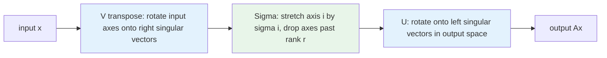

## Purpose

The SVD is the decomposition that works for every matrix: no squareness, no symmetry, no full-rank requirement. This note derives it from the eigendecomposition of $A^T A$, defines the pseudoinverse through it, and states Eckart-Young, which is the license behind every truncated-SVD compression and PCA plot. It leans on [[math/linear-algebra/eigenvalues-eigenvectors-diagonalization|Eigenvalues and Diagonalization]] and finishes the least-squares story from [[math/linear-algebra/orthogonality-projections-least-squares|Orthogonality, Projections, and Least Squares]].

## Deriving the SVD from $A^T A$

Let $A \in \mathbb{R}^{m \times n}$. The matrix $A^T A \in \mathbb{R}^{n \times n}$ is symmetric and positive semidefinite, so by the spectral theorem it has an orthonormal eigenbasis $v_1, \dots, v_n$ with real eigenvalues $\lambda_1 \ge \dots \ge \lambda_n \ge 0$. Define the singular values $\sigma_i = \sqrt{\lambda_i}$, and for each $\sigma_i > 0$ define

$$
u_i = \frac{A v_i}{\sigma_i}.
$$

These $u_i$ are orthonormal: $u_i^T u_j = \frac{v_i^T A^T A v_j}{\sigma_i \sigma_j} = \frac{\lambda_j v_i^T v_j}{\sigma_i \sigma_j}$, which is 1 when $i = j$ and 0 otherwise. Completing $\{u_i\}$ to an orthonormal basis of $\mathbb{R}^m$ and collecting everything in matrices gives

$$
A = U \Sigma V^T,
$$

with $U \in \mathbb{R}^{m \times m}$ and $V \in \mathbb{R}^{n \times n}$ orthogonal and $\Sigma$ diagonal with $\sigma_1 \ge \sigma_2 \ge \dots \ge 0$. This is Strang's construction in [18.06 lecture 29](https://ocw.mit.edu/courses/18-06-linear-algebra-spring-2010/). The rank $r$ of $A$ is the number of nonzero singular values, and the compact form $A = \sum_{i=1}^{r} \sigma_i u_i v_i^T$ writes $A$ as a sum of $r$ rank-one pieces, largest first.

Sanity check both eigenproblems: $A^T A = V \Sigma^T \Sigma V^T$ and $A A^T = U \Sigma \Sigma^T U^T$, so the right singular vectors diagonalize $A^T A$ and the left ones diagonalize $A A^T$, sharing the nonzero spectrum $\sigma_i^2$.

## Geometry

The SVD says every linear map is rotate, stretch, rotate. $V^T$ rotates the input so the axes line up with $v_1, \dots, v_n$, $\Sigma$ stretches axis $i$ by $\sigma_i$ (killing axes past rank $r$), and $U$ rotates into output space. The image of the unit sphere under any $A$ is a hyperellipse whose semi-axes have lengths $\sigma_1, \dots, \sigma_r$ pointing along $u_1, \dots, u_r$ (Trefethen and Bau open the whole subject with this picture in lecture 4). $\sigma_1 = \lVert A \rVert_2$ is the largest stretch factor any unit vector experiences, and $\sigma_r$ the smallest nonzero one; their ratio $\sigma_1/\sigma_r$ is the condition number.



## The Moore-Penrose pseudoinverse

Invert what is invertible and leave the rest alone:

$$
A^{+} = V \Sigma^{+} U^T, \qquad
\Sigma^{+} = \mathrm{diag}(\sigma_1^{-1}, \dots, \sigma_r^{-1}, 0, \dots, 0)^T.
$$

$A^{+}$ is the unique matrix satisfying the four Penrose conditions: $A A^{+} A = A$, $A^{+} A A^{+} = A^{+}$, and both $A A^{+}$ and $A^{+} A$ symmetric (Golub and Van Loan, ch. 5). When $A$ is square and invertible, $A^{+} = A^{-1}$. When $A$ has full column rank, $A^{+} = (A^T A)^{-1} A^T$, the least-squares operator from the normal equations.

The general statement: $\hat{x} = A^{+} b$ is always a least-squares solution of $Ax = b$, and among all least-squares solutions it is the one with minimum norm. Rank deficiency makes the minimizer non-unique, adding any null-space component leaves the residual unchanged, and $A^{+} b$ is the choice with zero null-space component. This is exactly what `np.linalg.lstsq` returns, since its SVD-based driver applies a truncated pseudoinverse ([numpy.linalg.lstsq docs](https://numpy.org/doc/stable/reference/generated/numpy.linalg.lstsq.html)).

> [!abstract] SVD, pseudoinverse, and least squares are one package
> Undo the three-step geometry in reverse: rotate with $U^T$, divide by the nonzero $\sigma_i$ (zero out the rest), rotate back with $V$. That is $A^{+} = V\Sigma^{+}U^T$, and it solves least squares in every rank case at once:
>
> - Square invertible $A$: $A^{+} = A^{-1}$, the exact solution.
> - Full column rank: $A^{+} = (A^TA)^{-1}A^T$, the normal-equations solution.
> - Rank deficient: $A^{+}b$ is the *minimum-norm* least-squares solution, the unique minimizer with no null-space component.
>
> The normal equations only cover the middle case; the SVD route degrades gracefully through all three.

## Eckart-Young: best low-rank approximation

Truncate the rank-one sum after $k$ terms: $A_k = \sum_{i=1}^{k} \sigma_i u_i v_i^T$. The Eckart-Young-Mirsky theorem says no rank-$k$ matrix does better:

$$
\min_{\mathrm{rank}(B) \le k} \lVert A - B \rVert_2 = \sigma_{k+1},
\qquad
\min_{\mathrm{rank}(B) \le k} \lVert A - B \rVert_F = \sqrt{\textstyle\sum_{i > k} \sigma_i^2},
$$

with $A_k$ attaining both (Mirsky extended the result to every unitarily invariant norm). The singular value spectrum is therefore a complete answer to "how compressible is this matrix": if the $\sigma_i$ decay fast, a few rank-one terms capture almost everything, and $\sigma_{k+1}$ tells you exactly the error of stopping at $k$.

PCA is this theorem applied to data. Center the data matrix $X \in \mathbb{R}^{n \times p}$ (subtract column means), take its SVD, and the right singular vectors $v_i$ are the principal components; the variance along component $i$ is $\sigma_i^2/(n-1)$, and the fraction of variance explained by the top $k$ components is $\sum_{i \le k} \sigma_i^2 / \sum_i \sigma_i^2$ ([Stanford STATS 305C](https://web.stanford.edu/class/stats305c/lectures/PCA_I.html)). The repo has a small image-compression demo of exactly this truncation in `content/math/linear-algebra/pca_image_compression.py`.

## NumPy

```python
import numpy as np

rng = np.random.default_rng(0)
A = rng.standard_normal((6, 4)) @ np.diag([10.0, 3.0, 0.5, 0.01])

U, s, Vh = np.linalg.svd(A, full_matrices=False)
print(s)                                  # descending: [25.57  5.64  0.95  0.01]
print(np.allclose(U @ np.diag(s) @ Vh, A))  # True

k = 2                                     # rank-2 truncation
Ak = U[:, :k] @ np.diag(s[:k]) @ Vh[:k]
print(np.linalg.norm(A - Ak, 2), s[k])    # equal, per Eckart-Young

Apinv = Vh.T @ np.diag(1/s) @ U.T         # pseudoinverse by hand
print(np.allclose(Apinv, np.linalg.pinv(A)))  # True
```

Conventions from the [numpy.linalg.svd docs](https://numpy.org/doc/stable/reference/generated/numpy.linalg.svd.html) that trip people up: the function returns `Vh` $= V^T$, not $V$; singular values come back sorted descending as a 1-D array, so reconstruction needs `np.diag`; and `full_matrices=True` (the default) returns square $U$ and $V^T$ padded with basis vectors for the null spaces, while `full_matrices=False` gives the compact economy shapes. `np.linalg.pinv` applies an `rcond` cutoff before inverting singular values, because dividing by a tiny $\sigma_i$ that is really numerical noise amplifies error by $1/\sigma_i$; treating near-zero singular values as exactly zero is the stable choice for ill-conditioned systems.

## Sources

- [MIT 18.06 Linear Algebra, Spring 2010 (Strang), lecture 29](https://ocw.mit.edu/courses/18-06-linear-algebra-spring-2010/)
- [Interactive Linear Algebra (Margalit and Rabinoff)](https://textbooks.math.gatech.edu/ila/)
- [numpy.linalg.svd documentation](https://numpy.org/doc/stable/reference/generated/numpy.linalg.svd.html)
- [Stanford STATS 305C, PCA lecture](https://web.stanford.edu/class/stats305c/lectures/PCA_I.html)
- Trefethen and Bau, Numerical Linear Algebra (SIAM, 1997), lectures 4-5
- Golub and Van Loan, Matrix Computations (4th ed.), chapter 5

## Related notes

- [[math/linear-algebra/eigenvalues-eigenvectors-diagonalization|Eigenvalues, Eigenvectors, and Diagonalization]]
- [[math/linear-algebra/orthogonality-projections-least-squares|Orthogonality, Projections, and Least Squares]]
- [[math/linear-algebra/cheatsheet|Matrix Theory]]
