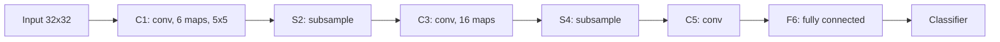

## Purpose

CNNs are the canonical architecture for grid-structured signals. This note tracks the main line from LeNet-5 to ResNet and U-Net, because those three papers explain most of the structural choices that still show up in modern vision backbones.

## What Convolution Encodes

For a single-channel image $x$ and kernel $K$:

$$
y_{i,j} = \sum_{u=0}^{k_h-1} \sum_{v=0}^{k_w-1} K_{u,v}x_{i+u,j+v}
$$

With multiple channels:

$$
y_{c_{out}, i, j}
=
\sum_{c_{in}=1}^{C_{in}}
\sum_{u,v}
K_{c_{out}, c_{in}, u, v}x_{c_{in}, i+u, j+v}
$$

The architectural claims are:

- nearby pixels interact more strongly than distant ones
- the same local pattern may matter anywhere
- parameter sharing is efficient and useful

That is why convolution works so well on images.

> [!abstract] Parameter sharing is the whole trick
> One $5 \times 5$ kernel is 25 weights applied at every spatial position. A fully connected layer mapping even a modest image to a feature map of the same size would need millions of independent weights to represent the same computation. Sharing the kernel encodes the assumption that "edge detector at the top left" and "edge detector at the bottom right" should be the same function.

## LeNet-5

LeCun et al. present LeNet-5 as a full document-recognition system, not just a convolution demo. The famous architecture is roughly:

- input: $32 \times 32$
- `C1`: 6 feature maps with $5 \times 5$ kernels
- `S2`: subsampling / pooling
- `C3`: 16 feature maps
- `S4`: subsampling / pooling
- `C5`: convolution to a fully connected-style stage
- `F6`
- final classifier



This alternating conv-pool-conv-pool-fc shape — spatial resolution shrinking while channel count grows — is the template nearly every later CNN elaborated on.

The paper's point is broader than "use convs." It argues for **gradient-based learning** as a full stack, where feature extraction and classification are trained jointly instead of being separated into hand-designed modules.

## Receptive Fields, Stride, and Pooling

Stride reduces spatial resolution. Pooling or subsampling adds local invariance. Stacking multiple small kernels increases effective receptive field while inserting more nonlinearities than one large kernel would.

This explains why deep stacks of $3 \times 3$ convolutions became standard.

> [!tip] Depth buys receptive field cheaply
> Two stacked $3 \times 3$ convolutions see a $5 \times 5$ region; three see $7 \times 7$. For $C$ channels, three $3 \times 3$ layers cost $27C^2$ weights versus $49C^2$ for one $7 \times 7$ layer, and they insert three nonlinearities instead of one. Deeper-and-smaller wins on both parameters and expressivity, which is the VGG-era lesson baked into most backbones since.

## The ResNet Argument

He et al. make a very specific claim: depth should help, but plain very deep nets show a **degradation problem** where training error gets worse as layers are added.

Their key thought experiment is that a deeper model should contain the shallower solution by construction if the added layers learn identity mappings. Since plain networks still optimize worse, the problem is the parameterization, not expressivity.

The fix is the residual block:

$$
y = x + F(x)
$$

The paper studies architectures up to **152 layers**, reports **3.57%** ImageNet test error for an ensemble, and uses **bottleneck** blocks for ResNet-50/101/152 to keep compute manageable.

That bottleneck structure is:

- `1x1` reduce
- `3x3` process
- `1x1` expand

## U-Net

Ronneberger, Fischer, and Brox target dense segmentation with limited labeled data. Their architecture has:

- a **contracting path** for context
- a symmetric **expanding path** for localization
- skip connections between matching resolutions

The paper also emphasizes training strategy, not only topology. Because biomedical labels are scarce, it relies heavily on augmentation, especially **elastic deformations**.

The famous diagram includes **copy and crop** skip connections because valid convolutions change feature-map size.

The paper reports segmentation of a **512x512** image in **less than a second** on a contemporary GPU.

## NumPy Convolution

```python
import numpy as np

def conv2d_single_channel(x, kernel, stride=1, padding=0):
    x = np.pad(x, ((padding, padding), (padding, padding)))
    kh, kw = kernel.shape
    oh = (x.shape[0] - kh) // stride + 1
    ow = (x.shape[1] - kw) // stride + 1
    out = np.zeros((oh, ow), dtype=x.dtype)

    for i in range(oh):
        for j in range(ow):
            patch = x[i * stride:i * stride + kh, j * stride:j * stride + kw]
            out[i, j] = np.sum(patch * kernel)
    return out
```

This code is simple enough that the parameter-sharing pattern is obvious.

## PyTorch Residual CNN

```python
import torch
import torch.nn as nn

class ResidualBlock(nn.Module):
    def __init__(self, channels: int):
        super().__init__()
        self.net = nn.Sequential(
            nn.Conv2d(channels, channels, kernel_size=3, padding=1, bias=False),
            nn.BatchNorm2d(channels),
            nn.ReLU(inplace=True),
            nn.Conv2d(channels, channels, kernel_size=3, padding=1, bias=False),
            nn.BatchNorm2d(channels),
        )
        self.act = nn.ReLU(inplace=True)

    def forward(self, x: torch.Tensor) -> torch.Tensor:
        return self.act(x + self.net(x))

class SmallCNN(nn.Module):
    def __init__(self, n_classes: int = 10):
        super().__init__()
        self.stem = nn.Sequential(
            nn.Conv2d(3, 64, kernel_size=7, stride=2, padding=3),
            nn.ReLU(inplace=True),
            nn.MaxPool2d(2),
        )
        self.block = ResidualBlock(64)
        self.head = nn.Linear(64, n_classes)

    def forward(self, x: torch.Tensor) -> torch.Tensor:
        x = self.stem(x)
        x = self.block(x)
        x = x.mean(dim=(-2, -1))
        return self.head(x)
```

## What Changed Later

Vision transformers challenged CNN dominance, though most of the practical lessons from CNNs survived:

- locality is useful
- residual paths are critical
- multi-scale processing matters
- skip connections help dense prediction

That is why U-Net-like and ResNet-like patterns keep reappearing even outside classic CNNs.

## Related Notes

- [[ml/deep-learning/diffusion-models|Diffusion Models]]
- [[ml/deep-learning/modeling-architecture-and-data|Modeling, Architecture, and Data]]

## Sources

- [LeCun et al. (1998), Gradient-Based Learning Applied to Document Recognition](https://yann.lecun.com/exdb/publis/pdf/lecun-98.pdf)
- [He et al. (2015), Deep Residual Learning for Image Recognition](https://arxiv.org/abs/1512.03385)
- [Ronneberger, Fischer, and Brox (2015), U-Net](https://arxiv.org/pdf/1505.04597)
