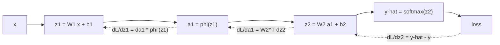

## Purpose

This note is the foundation under the rest of the deep-learning section. The goal is to make the standard neural-network training loop feel mechanical rather than mysterious:

- define a computation
- define a scalar loss
- differentiate it with the chain rule
- update parameters

Rumelhart, Hinton, and Williams made the key move in 1986. Once the network is a composition of differentiable operations, the gradient can be pushed backward one local Jacobian at a time.

## One Affine Layer

For input $x \in \mathbb{R}^{d_{in}}$, weights $W \in \mathbb{R}^{d_{out} \times d_{in}}$, and bias $b \in \mathbb{R}^{d_{out}}$:

$$
z = Wx + b
$$

This is just an affine map. If a network were only a stack of affine maps, the whole composition would still be affine:

$$
W_2(W_1x + b_1) + b_2 = (W_2W_1)x + (W_2b_1 + b_2)
$$

That is why hidden-layer nonlinearities are necessary. They prevent depth from collapsing into one linear classifier.

## A Two-Layer Classifier

For hidden width $h$ and $K$ classes:

$$
\begin{aligned}
z_1 &= W_1x + b_1 \\
a_1 &= \phi(z_1) \\
z_2 &= W_2a_1 + b_2 \\
\hat{y} &= \text{softmax}(z_2)
\end{aligned}
$$

The softmax is

$$
\hat{y}_k = \frac{e^{z_{2,k}}}{\sum_{j=1}^{K} e^{z_{2,j}}}
$$

and for one-hot target $y$ the cross-entropy loss is

$$
\mathcal{L}(\hat{y}, y) = -\sum_{k=1}^{K} y_k \log \hat{y}_k
$$

If the correct class is $c$, this reduces to

$$
\mathcal{L} = -\log \hat{y}_c
$$

## Backpropagation Derivation

The output-layer derivative is the standard identity:

$$
\frac{\partial \mathcal{L}}{\partial z_2} = \hat{y} - y
$$

This falls out of differentiating the softmax and cross-entropy together. The rest is the chain rule.

The forward pass builds the computation left to right; the backward pass walks the same graph in reverse:



The solid edges are the forward pass; the dotted edges are the gradients flowing back through the same nodes.

> [!tip] Backpropagation is local
> Each node only needs two things: the gradient arriving from above and the values it cached during the forward pass. The parameter gradients below are outer products of exactly those two quantities — $\partial \mathcal{L}/\partial W_2 = (\hat{y} - y)a_1^\top$ pairs the upstream gradient with the cached input. This locality is why the forward pass must store activations, and why autodiff frameworks can differentiate any composition of primitives without global analysis.

### Output Layer

Because $z_2 = W_2a_1 + b_2$:

$$
\frac{\partial \mathcal{L}}{\partial W_2}
=
\frac{\partial \mathcal{L}}{\partial z_2}
\frac{\partial z_2}{\partial W_2}
=
(\hat{y} - y)a_1^\top
$$

and

$$
\frac{\partial \mathcal{L}}{\partial b_2} = \hat{y} - y
$$

The hidden activation receives

$$
\frac{\partial \mathcal{L}}{\partial a_1}
=
W_2^\top(\hat{y} - y)
$$

### Hidden Layer

Since $a_1 = \phi(z_1)$:

$$
\frac{\partial \mathcal{L}}{\partial z_1}
=
\frac{\partial \mathcal{L}}{\partial a_1} \odot \phi'(z_1)
$$

For ReLU,

$$
\phi(z) = \max(0, z),
\qquad
\phi'(z) = \mathbf{1}[z > 0]
$$

so only active hidden units pass gradient.

Now

$$
\frac{\partial \mathcal{L}}{\partial W_1}
=
\frac{\partial \mathcal{L}}{\partial z_1}x^\top,
\qquad
\frac{\partial \mathcal{L}}{\partial b_1}
=
\frac{\partial \mathcal{L}}{\partial z_1}
$$

This is the whole backpropagation pattern in miniature. Every later architecture is the same story, only with more structured Jacobians.

## Batch Form

For batch matrix $X \in \mathbb{R}^{B \times d_{in}}$:

$$
\begin{aligned}
Z_1 &= XW_1^\top + b_1 \\
A_1 &= \phi(Z_1) \\
Z_2 &= A_1W_2^\top + b_2 \\
\hat{Y} &= \text{softmax}(Z_2)
\end{aligned}
$$

In practice the loss is averaged over the batch.

## Output Heads and Loss Families

The softmax-cross-entropy pair above is one instance of a general pattern: match the output head to the loss, and the gradient at the logits collapses to prediction minus target ([Deep Learning ch. 6.2](https://www.deeplearningbook.org/contents/mlp.html)). The three standard pairings:

| Task | Head | Loss | $\partial \mathcal{L} / \partial z$ |
|---|---|---|---|
| Regression | linear, $\hat{y} = z$ | MSE $\frac{1}{2}(\hat{y} - y)^2$ | $z - y$ |
| Binary classification | sigmoid, $\hat{y} = \sigma(z)$ | BCE $-y\log\hat{y} - (1-y)\log(1-\hat{y})$ | $\sigma(z) - y$ |
| Multiclass | softmax | cross-entropy $-\sum_k y_k \log \hat{y}_k$ | $\hat{y} - y$ |

Each row is the negative log-likelihood of a distribution family (Gaussian, Bernoulli, multinomial) under its canonical parameterization, which is why the clean form is not a coincidence.

The binary case is the promised second worked derivative. With $\hat{y} = \sigma(z)$ and $\sigma'(z) = \sigma(z)(1 - \sigma(z))$:

$$
\frac{\partial \mathcal{L}}{\partial z}
= \left( -\frac{y}{\hat{y}} + \frac{1-y}{1-\hat{y}} \right) \hat{y}(1 - \hat{y})
= -y(1 - \hat{y}) + (1-y)\hat{y}
= \sigma(z) - y
$$

The $\hat{y}(1-\hat{y})$ factor from the sigmoid exactly cancels the denominators from the log loss. This cancellation is also the numerical-stability argument for computing loss from logits (`CrossEntropyLoss`, `binary_cross_entropy_with_logits`) rather than from probabilities: the fused form never materializes a $\log$ of a saturated sigmoid or softmax. Pairing MSE with a sigmoid head, by contrast, leaves a $\sigma'(z)$ factor in the gradient that vanishes whenever the unit saturates, which is a classic slow-training bug.

## Optimizer Updates

The `step` method below implements plain SGD: $\theta \leftarrow \theta - \alpha g$. Two upgrades cover most practice; full treatment, including conditioning theory and a measured comparison, is in [[math/numerical-optimization|Numerical Optimization for Machine Learning]].

Momentum accumulates a velocity so that consistent gradient directions compound and oscillating ones cancel:

$$
v \leftarrow \mu v - \alpha g, \qquad \theta \leftarrow \theta + v
$$

with $\mu$ typically 0.9 ([Sutskever et al. 2013](https://proceedings.mlr.press/v28/sutskever13.html) schedule it from 0.5 up to 0.99). [Adam](https://arxiv.org/abs/1412.6980) keeps per-parameter moving averages of the gradient and its square, corrects their zero-initialization bias, and scales each coordinate's step:

$$
\begin{aligned}
m &\leftarrow \beta_1 m + (1-\beta_1) g, \qquad & \hat{m} &= m / (1 - \beta_1^t) \\
v &\leftarrow \beta_2 v + (1-\beta_2) g^2, & \hat{v} &= v / (1 - \beta_2^t) \\
\theta &\leftarrow \theta - \alpha\, \hat{m} / (\sqrt{\hat{v}} + \epsilon) &&
\end{aligned}
$$

with paper defaults $\alpha = 10^{-3}$, $\beta_1 = 0.9$, $\beta_2 = 0.999$, $\epsilon = 10^{-8}$. As an implementation sketch on the MLP class below, momentum is three lines:

```python
def step_momentum(self, grads, state, lr=1e-2, mu=0.9):
    for name in ("W1", "b1", "W2", "b2"):
        state[name] = mu * state.get(name, 0.0) - lr * grads[name]
        setattr(self, name, getattr(self, name) + state[name])
```

## Schedules and Gradient Clipping

Two knobs sit outside the optimizer proper. Learning-rate schedules decay $\alpha$ over training — step decay (multiply by 0.1 every $N$ epochs), cosine annealing $\alpha_t = \frac{\alpha_0}{2}(1 + \cos(\pi t/T))$, and a linear warmup over the first few hundred or thousand steps, which matters most with Adam because its second-moment estimate is unreliable early ([DL ch. 8.5](https://www.deeplearningbook.org/contents/optimization.html)). Gradient clipping bounds the update when the loss surface produces a rare enormous gradient, as in recurrent nets ([DL ch. 10.11.1](https://www.deeplearningbook.org/contents/rnn.html)); clip-by-norm rescales the whole gradient vector when it exceeds a threshold $\tau$:

$$
g \leftarrow \begin{cases} g & \lVert g \rVert \le \tau \\ \tau\, g / \lVert g \rVert & \text{otherwise} \end{cases}
$$

which preserves direction, unlike elementwise clip-by-value.

## Gradient Checking

Before trusting a hand-written backward pass, compare it against a centered finite difference:

$$
\frac{\partial \mathcal{L}}{\partial \theta_i} \approx \frac{\mathcal{L}(\theta_i + h) - \mathcal{L}(\theta_i - h)}{2h}
$$

which has $O(h^2)$ error versus $O(h)$ for the one-sided version. The comparison metric is relative error $|g_a - g_n| / \max(|g_a|, |g_n|)$; per the [CS231n conventions](https://cs231n.github.io/neural-networks-3/), below $10^{-7}$ is excellent for smooth networks, up to $10^{-4}$ is acceptable when ReLU kinks are involved, and above $10^{-2}$ means a bug. Use float64 (float32 cancellation error alone can reach $10^{-2}$), $h \approx 10^{-5}$, a handful of examples, and turn off dropout and other stochastic parts while checking.

Checking one entry of each weight matrix of the NumPy MLP below (run in the repo venv, float64, $h = 10^{-5}$):

```python
i, j, h = 1, 2, 1e-5
orig = model.W1[i, j]
model.W1[i, j] = orig + h; lp, _ = model.loss_and_grads(X, y)
model.W1[i, j] = orig - h; lm, _ = model.loss_and_grads(X, y)
model.W1[i, j] = orig
numeric = (lp - lm) / (2 * h)
```

Measured: `W1[1,2]` analytic $+0.35312938$ vs numeric $+0.35312938$, relative error $4.2 \times 10^{-12}$; `W2[1,2]` relative error $1.7 \times 10^{-10}$. Both are far inside the "excellent" band, which is the expected outcome for this loss because softmax-cross-entropy is smooth in the parameters even though ReLU has a kink in the inputs — the check would only brush the kink if a perturbation flipped a unit's sign.

## Why Initialization Matters

Very deep networks fail easily if activations or gradients change scale too aggressively across layers.

He et al. derive an initialization for rectifier networks that keeps the forward variance roughly stable:

$$
\operatorname{Var}[W_{ij}] = \frac{2}{n_{in}}
$$

so one common choice is

$$
W_{ij} \sim \mathcal{N}\left(0, \frac{2}{n_{in}}\right)
$$

That is the standard He initialization. The factor of $2$ appears because ReLU zeroes about half the mass.

The same paper also proposes PReLU:

$$
f(y_i) =
\begin{cases}
y_i & y_i > 0 \\
a_i y_i & y_i \le 0
\end{cases}
$$

with learned negative slope $a_i$. The paper reports **4.94%** top-5 test error on ImageNet 2012, a **26% relative improvement** over GoogLeNet's **6.66%**.

## Batch Normalization

Ioffe and Szegedy normalize each activation dimension over the current mini-batch:

$$
\hat{x}^{(k)} = \frac{x^{(k)} - \mathbb{E}_{\mathcal{B}}[x^{(k)}]}
{\sqrt{\operatorname{Var}_{\mathcal{B}}[x^{(k)}] + \epsilon}}
$$

then restore learnable scale and shift:

$$
y^{(k)} = \gamma^{(k)} \hat{x}^{(k)} + \beta^{(k)}
$$

The point is not to clamp everything permanently to zero mean and unit variance. The point is to stabilize optimization while still letting the model learn whatever affine reparameterization it needs.

The BatchNorm paper reports the same accuracy in **14 times fewer training steps** on a strong ImageNet model, and an ensemble reaching **4.9%** top-5 validation error.

## Dropout

Dropout randomly removes units during training. If $m$ is a Bernoulli mask:

$$
\tilde{h} = m \odot h
$$

The paper's framing is useful. Training samples an exponential family of "thinned" subnetworks, and test-time inference approximates their average with one full network.

Srivastava et al. describe dropout as a way to prevent units from **co-adapting too much**. In several experiments they found dropping **20% of input units** and **50% of hidden units** worked well.

## Choosing Initialization and Normalization

The pieces above interact, and the common configurations are worth a table:

| Choice | Formula / rule | When |
|---|---|---|
| Xavier/Glorot init | $\operatorname{Var}[W] = \tfrac{2}{n_{in} + n_{out}}$ | tanh or sigmoid activations |
| He init | $\operatorname{Var}[W] = \tfrac{2}{n_{in}}$ | ReLU-family activations |
| Batch norm | normalize per-dimension over the batch | large batches; convolutional nets |
| Layer norm | normalize per-example over features | small/variable batches; transformers |
| L2 / weight decay | add $\tfrac{\lambda}{2}\lVert \theta \rVert^2$ (or decoupled decay) | default regularizer |
| Dropout | Bernoulli mask, $p \approx 0.5$ hidden / $0.2$ input | large fully connected layers |

The interactions: normalization layers make initialization scale much less critical, because activations get renormalized each layer regardless of what the weights did — with batch norm, a wrong init costs early training speed rather than trainability. Weight decay and He/Xavier initialization pull in compatible directions (both keep weights in a moderate range), but decay interacts with adaptive optimizers in a way that matters; see the decoupled weight decay discussion in [[math/numerical-optimization|Numerical Optimization]]. Dropout raises activation variance during training, which is why implementations use inverted dropout (rescale by $1/(1-p)$ at train time) so that test-time inference needs no correction.

## NumPy Implementation

This version does the forward pass, gradient calculation, and SGD update explicitly.

```python
import numpy as np

def relu(x):
    return np.maximum(x, 0.0)

def relu_grad(x):
    return (x > 0).astype(x.dtype)

def softmax(logits):
    shifted = logits - logits.max(axis=1, keepdims=True)
    exp = np.exp(shifted)
    return exp / exp.sum(axis=1, keepdims=True)

class MLP:
    def __init__(self, d_in, d_hidden, d_out, seed=0):
        rng = np.random.default_rng(seed)
        self.W1 = rng.normal(0.0, np.sqrt(2 / d_in), size=(d_hidden, d_in))
        self.b1 = np.zeros(d_hidden)
        self.W2 = rng.normal(0.0, np.sqrt(2 / d_hidden), size=(d_out, d_hidden))
        self.b2 = np.zeros(d_out)

    def forward(self, X):
        z1 = X @ self.W1.T + self.b1
        a1 = relu(z1)
        z2 = a1 @ self.W2.T + self.b2
        probs = softmax(z2)
        cache = (X, z1, a1, probs)
        return probs, cache

    def loss_and_grads(self, X, y):
        probs, (X, z1, a1, probs) = self.forward(X)
        B = X.shape[0]

        one_hot = np.zeros_like(probs)
        one_hot[np.arange(B), y] = 1.0
        loss = -np.log(probs[np.arange(B), y] + 1e-12).mean()

        dz2 = (probs - one_hot) / B
        dW2 = dz2.T @ a1
        db2 = dz2.sum(axis=0)

        da1 = dz2 @ self.W2
        dz1 = da1 * relu_grad(z1)
        dW1 = dz1.T @ X
        db1 = dz1.sum(axis=0)

        grads = {"W1": dW1, "b1": db1, "W2": dW2, "b2": db2}
        return loss, grads

    def step(self, grads, lr=1e-2):
        self.W1 -= lr * grads["W1"]
        self.b1 -= lr * grads["b1"]
        self.W2 -= lr * grads["W2"]
        self.b2 -= lr * grads["b2"]
```

## PyTorch Implementation

```python
import torch
import torch.nn as nn

class TorchMLP(nn.Module):
    def __init__(self, d_in: int, d_hidden: int, d_out: int):
        super().__init__()
        self.net = nn.Sequential(
            nn.Linear(d_in, d_hidden),
            nn.ReLU(),
            nn.Linear(d_hidden, d_out),
        )

    def forward(self, x: torch.Tensor) -> torch.Tensor:
        return self.net(x)

model = TorchMLP(128, 256, 10)
logits = model(torch.randn(32, 128))
loss = nn.CrossEntropyLoss()(logits, torch.randint(0, 10, (32,)))
loss.backward()
```

This is shorter because autograd is doing exactly the backpropagation derivation from above.

## Executable Experiments

The first notebook trains the NumPy model on MNIST and exposes the loss curve, predictions, and failure cases discussed above.

[Run the MLP-from-scratch experiment](/ml/deep-learning/mlp-from-scratch-on-mnist.ipynb)

The second isolates softmax regression so the symbolic gradient, finite differences, and PyTorch autograd can be compared on the same real minibatch.

[Check manual gradients against autodiff](/ml/deep-learning/checking-manual-gradients-against-autodiff-on-mnist.ipynb)

## What to Carry Forward

- Backpropagation is just repeated local application of the chain rule.
- Match the output head to the loss; the logit gradient becomes prediction minus target.
- Gradient-check any hand-written backward pass before trusting it.
- Initialization is part of the model, not a clerical detail.
- Normalization layers often change optimization more than small architecture tweaks do.
- Dropout is an ensemble-style regularizer implemented inside one training loop.

## Related Notes

- [[ml/deep-learning/modeling-architecture-and-data|Modeling, Architecture, and Data]]
- [[ml/deep-learning/convolutional-neural-networks|Convolutional Neural Networks]]
- [[ml/deep-learning/decoder-only-transformers|Decoder-Only Transformers]]
- [[ml/deep-learning/recurrent-neural-networks|Recurrent Neural Networks]]
- [[math/numerical-optimization|Numerical Optimization for Machine Learning]]
- [[math/matrix-calculus|Matrix Calculus for Machine Learning]]

## Sources

- [Rumelhart, Hinton, and Williams (1986), Learning Representations by Back-Propagating Errors](https://www.nature.com/articles/323533a0)
- [He et al. (2015), Delving Deep into Rectifiers](https://www.cv-foundation.org/openaccess/content_iccv_2015/papers/He_Delving_Deep_into_ICCV_2015_paper.pdf)
- [Ioffe and Szegedy (2015), Batch Normalization](https://arxiv.org/abs/1502.03167)
- [Srivastava et al. (2014), Dropout](https://www.cs.toronto.edu/~rsalakhu/papers/srivastava14a.pdf)
- [Goodfellow, Bengio, and Courville, Deep Learning, chapters 6, 8, and 10](https://www.deeplearningbook.org/)
- [Kingma and Ba (2015), Adam: A Method for Stochastic Optimization](https://arxiv.org/abs/1412.6980)
- [Sutskever et al. (2013), On the importance of initialization and momentum in deep learning](https://proceedings.mlr.press/v28/sutskever13.html)
- [CS231n, Neural Networks Part 3: Gradient checks](https://cs231n.github.io/neural-networks-3/)
