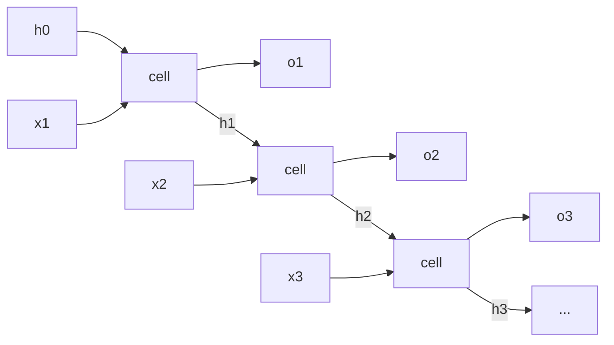

## Purpose

RNNs matter for two reasons. First, they were the canonical sequence model before transformers. Second, they make the core optimization problem of sequence learning painfully visible: both information and gradients must survive repeated application of the same transition.

## The Elman Simple Recurrent Network

Elman's simple recurrent network predicts the next symbol from the current input and a copy of the previous hidden state. At time step $t$:

$$
h_t = \phi(W_{xh}x_t + W_{hh}h_{t-1} + b_h)
$$

and for logits

$$
o_t = W_{hy}h_t + b_y
$$

The model's bias is strong and clean:

- the same parameters are reused at every time step
- the hidden state is the memory
- prediction is a function of the current input plus that memory

Elman's paper is important because it framed temporal structure as something the model could infer from raw sequence regularities rather than from manually defined symbolic units.

## Backpropagation Through Time

Unroll the recurrence over $T$ steps and the RNN becomes a depth-$T$ network with shared parameters:



Every "cell" box is the same function with the same $W_{xh}$, $W_{hh}$, $b_h$. The loop in the rolled form becomes depth in the unrolled form, and gradients must traverse that entire horizontal chain to reach early timesteps.

For total loss

$$
\mathcal{L} = \sum_{t=1}^{T} \mathcal{L}_t
$$

the gradient to an early hidden state contains repeated Jacobian products:

$$
\frac{\partial \mathcal{L}}{\partial h_t}
=
\sum_{k=t}^{T}
\frac{\partial \mathcal{L}_k}{\partial h_k}
\prod_{j=t+1}^{k}
\frac{\partial h_j}{\partial h_{j-1}}
$$

This is the whole vanishing/exploding gradient story. If those Jacobians tend to shrink norms, the product vanishes. If they amplify norms, it explodes.

That is not a quirk of one optimizer. It is structural.

> [!warning] Vanishing gradients are a property of the parameterization
> The product $\prod_j \partial h_j / \partial h_{j-1}$ multiplies the same recurrent Jacobian $T$ times, so its norm behaves like $\lambda^T$ for the dominant singular value $\lambda$. Unless $\lambda$ sits almost exactly at 1, long-range gradient signal either dies or blows up exponentially in sequence length. Clipping handles the exploding side; the vanishing side needed an architectural fix, which is exactly what the LSTM's additive cell-state update provides.

## Why a Fixed-Length State Can Be a Bottleneck

Sequence-to-sequence encoder-decoder models before attention often forced the source sentence through one fixed-length vector. Bahdanau, Cho, and Bengio argue directly that this is a bottleneck. Their encoder-decoder extension lets the decoder **search softly** over relevant source positions rather than compressing the entire source into one vector once and for all.

That paper is the bridge between classic recurrent sequence models and the attention era.

## LSTM

Hochreiter and Schmidhuber's key idea is to create a path for **constant error flow** through the cell state. The paper explicitly says LSTM can bridge lags in excess of **1000** time steps by enforcing this constant error flow through **constant error carousels**.

One standard modern presentation is:

$$
\begin{aligned}
f_t &= \sigma(W_f [h_{t-1}; x_t] + b_f) \\
i_t &= \sigma(W_i [h_{t-1}; x_t] + b_i) \\
\tilde{c}_t &= \tanh(W_c [h_{t-1}; x_t] + b_c) \\
c_t &= f_t \odot c_{t-1} + i_t \odot \tilde{c}_t \\
o_t &= \sigma(W_o [h_{t-1}; x_t] + b_o) \\
h_t &= o_t \odot \tanh(c_t)
\end{aligned}
$$

The important line is

$$
c_t = f_t \odot c_{t-1} + i_t \odot \tilde{c}_t
$$

because the additive state update is much friendlier to long-range credit assignment than repeatedly multiplying through one generic hidden transition.

The original paper also emphasizes locality: LSTM is **local in space and time**, with **$O(1)$ computational complexity per time step and weight**.

## GRU

GRUs compress the gating logic:

$$
\begin{aligned}
z_t &= \sigma(W_z x_t + U_z h_{t-1}) \\
r_t &= \sigma(W_r x_t + U_r h_{t-1}) \\
\tilde{h}_t &= \tanh(W_h x_t + U_h(r_t \odot h_{t-1})) \\
h_t &= (1 - z_t)\odot h_{t-1} + z_t \odot \tilde{h}_t
\end{aligned}
$$

They are not in the source papers listed here, but the comparison is useful because it highlights the main architectural idea: make state updates additive and gate-controlled rather than purely recurrent and multiplicative.

## Attention as the Escape Hatch

Bahdanau attention computes a context vector for decoder step $i$:

$$
c_i = \sum_{j=1}^{T_x} \alpha_{ij} h_j
$$

with alignment weights

$$
\alpha_{ij} = \frac{\exp(e_{ij})}{\sum_{k=1}^{T_x} \exp(e_{ik})}
$$

and score

$$
e_{ij} = a(s_{i-1}, h_j)
$$

where $s_{i-1}$ is the decoder state and $h_j$ is the encoder annotation at source position $j$.

This is the moment sequence modeling changed. Instead of asking a fixed-width hidden state to remember everything, the model learned where to look.

## NumPy Vanilla RNN

```python
import numpy as np

def tanh(x):
    return np.tanh(x)

class VanillaRNN:
    def __init__(self, d_in, d_hidden, d_out, seed=0):
        rng = np.random.default_rng(seed)
        self.Wxh = rng.normal(0, 0.1, size=(d_hidden, d_in))
        self.Whh = rng.normal(0, 0.1, size=(d_hidden, d_hidden))
        self.bh = np.zeros(d_hidden)
        self.Why = rng.normal(0, 0.1, size=(d_out, d_hidden))
        self.by = np.zeros(d_out)

    def step(self, x_t, h_prev):
        h_t = tanh(x_t @ self.Wxh.T + h_prev @ self.Whh.T + self.bh)
        o_t = h_t @ self.Why.T + self.by
        return h_t, o_t

    def forward(self, x):
        B, T, _ = x.shape
        h = np.zeros((B, self.Whh.shape[0]))
        outputs = []
        for t in range(T):
            h, o = self.step(x[:, t], h)
            outputs.append(o)
        return np.stack(outputs, axis=1)
```

## PyTorch LSTM Language Model

```python
import torch
import torch.nn as nn

class LSTMLM(nn.Module):
    def __init__(self, vocab_size: int, d_model: int, n_layers: int = 2):
        super().__init__()
        self.embed = nn.Embedding(vocab_size, d_model)
        self.rnn = nn.LSTM(
            input_size=d_model,
            hidden_size=d_model,
            num_layers=n_layers,
            batch_first=True,
        )
        self.lm_head = nn.Linear(d_model, vocab_size, bias=False)

    def forward(self, token_ids: torch.Tensor) -> torch.Tensor:
        x = self.embed(token_ids)
        h, _ = self.rnn(x)
        return self.lm_head(h)
```

## Executable Experiment

This companion trains a compact character-level GRU on a cropped WikiText-2 corpus. The loss curve, generated sample, and hidden-state behavior turn the recurrence equations into an inspectable training run.

[Run the character-level RNN experiment](/ml/deep-learning/character-level-rnn-on-wikitext-2.ipynb)

## Where RNNs Still Matter

- streaming settings where strict online updates are natural
- smaller-scale sequence problems
- domains where state compression is acceptable and low latency matters

Their core weakness remains the same: the hidden state is a narrow information bottleneck. Attention relaxes that bottleneck by turning memory access into a data-dependent retrieval problem.

## Related Notes

- [[ml/nlp/reading/neural-networks|Feedforward Neural Networks]]
- [[systems/research/sparsity-notes|Faster Causal Self Attention]]
- [[ml/deep-learning/neural-networks-from-scratch|Neural Networks from Scratch]]
- [[ml/deep-learning/encoder-decoder-transformers|Encoder-Decoder Transformers]]
- [[ml/deep-learning/decoder-only-transformers|Decoder-Only Transformers]]

## Sources

- [Elman (1990), Finding Structure in Time](https://papers.baulab.info/papers/Elman-1990.pdf)
- [Hochreiter and Schmidhuber (1997), Long Short-Term Memory](https://deeplearning.cs.cmu.edu/S23/document/readings/LSTM.pdf)
- [Bahdanau, Cho, and Bengio (2014), Neural Machine Translation by Jointly Learning to Align and Translate](https://arxiv.org/abs/1409.0473)
