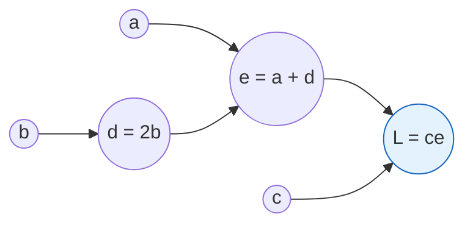

## Purpose

Covers feedforward neural networks as classifiers for NLP. It works through units and activation functions, why nonlinearity is needed at all (the XOR problem), the matrix notation for multi-layer computation, and training with cross-entropy loss and backpropagation. These networks generalize the linear decision boundaries of [[ml/nlp/reading/multinomial-logistic-regression|multinomial logistic regression]] on the same [[ml/nlp/reading/classification|classification]] problems, and they can learn complex patterns without hand-crafted features. Follows [SLP3 ch. 7](https://web.stanford.edu/~jurafsky/slp3/7.pdf).

## Activation Functions

A single computational unit $z = w \cdot x + b$ is a linear function of the input $x$ with weights $w$ and bias $b$. The output $y$ is a non-linear function $f(z)$, where $f$ is the activation function (typically one of $\tanh$, $\text{ReLU}$, or $\sigma$).

$$
y = \sigma(w \cdot x + b) = \frac{1}{1 + e^{-(w \cdot x + b)}}
$$

In practice $\sigma$ is rarely the best choice. SLP3 notes that $\tanh$, a scaled version of $\sigma$ ranging from $-1$ to $1$, is similar and almost always works better.

$$
y = \tanh(w \cdot x + b) = \frac{e^{w \cdot x + b} - e^{-(w \cdot x + b)}}{e^{w \cdot x + b} + e^{-(w \cdot x + b)}}
$$

The simplest activation function is the Rectified Linear Unit (ReLU), which is $0$ for negative inputs and linear for positive inputs.

$$
y = \text{ReLU}(w \cdot x + b) = \max(0, w \cdot x + b)
$$

ReLU is cheap to compute, and it doesn't saturate for large positive inputs the way $\sigma$ and $\tanh$ do. Saturation causes the vanishing gradient problem, where gradients near $0$ stop the network from learning.

## The XOR Problem

A single computational unit cannot solve XOR, because a single unit draws a linear decision boundary and XOR is not linearly separable. A two-layer network can solve it, since the hidden layer re-represents the input in a space where the problem becomes linearly separable.

$$
y = \begin{cases}
1 & \text{if } w \cdot x + b > 0 \\
0 & \text{otherwise}
\end{cases}
$$

To see why XOR is not linearly separable, look at the four inputs. $(x_1, x_2) = (0, 0)$ and $(1, 1)$ are in one class, while $(0, 1)$ and $(1, 0)$ are in the other. No straight line separates the two classes.

## Feedforward Neural Networks

A feedforward NN is a multi-layer network where the output of each layer is the input to the next layer, with no cycles. They are sometimes called multilayer perceptrons (MLPs), although that term technically applies only to networks whose units use a step function as the activation.

The network has three types of nodes.

### Input units

The vector of input units is $x$, with one node for each feature of the input.

### Hidden layers

One or more layers of hidden units, each with a non-linear activation function. In the standard architecture, each node is connected to all nodes in the previous layer, so each hidden unit sums over all input values.

For a given hidden layer, combine the weights $w$ and bias $b$ for each computational unit into a weight matrix $W$ and bias vector $b$. Each element $W_{ji}$ of the weight matrix is the weight from the $i$th input unit $x_i$ to the $j$th hidden unit $h_j$.

The output of a hidden layer with activation function $f$ is:

$$
h = f(W \cdot x + b)
$$

#### Dimensionality

Call the input layer, layer $0$, and let $n_0$ be the number of input units, so the input is a column vector $x \in \mathbb{R}^{n_0}$ with dimension $n_0 \times 1$.

The first hidden layer $h^{(1)}$ has $n_1$ hidden units, so $W \in \mathbb{R}^{n_1 \times n_0}$ and $b \in \mathbb{R}^{n_1}$.

$$
h_j = f\left(\sum_{i=1}^{n_0} W_{ji} x_i + b_j\right)
$$

### Output units

The output layer is the final layer of the network. Its output $y$, with $\dim(y) = n_{\text{output}}$, is an estimate of the probability distribution over classes.

#### Normalization

To get a probability distribution, normalize the output of the network with the softmax function:

$$
y = \text{softmax}(W \cdot h + b)
$$

$$
\text{softmax}(z)_i = \frac{e^{z_i}}{\sum_{j=1}^n e^{z_j}}
$$

### Comparison with MLR

A NN is like MLR with a few differences:

- many layers, since a deep NN is like layer after layer of MLR classifiers
- intermediate layers have non-linear activation functions. Without these, the network would just be a linear classifier, since the composition of linear functions is still linear
- instead of feature selection, previous layers build up a representation of the input that is useful for the final layer

### Details/Notation

- $*^{[l]}$ denotes a quantity associated with the $l$th layer, e.g. $W^{[l]}$ is the weight matrix for the $l$th layer. These indices are 1-indexed.
- $n_l$ is the number of units in layer $l$.
- $g(.)$ is the activation function, which tends to be $\tanh$ or ReLU for hidden layers, and softmax for the output layer.
- $a^{[l]}$ is the output from layer $l$
- $z^{[l]}$ is the input to the activation function in layer $l$, e.g. $z^{[l]} = W^{[l]} \cdot a^{[l-1]} + b^{[l]}$
- $x = a^{[0]}$ is the input vector

#### Example: 2-layer NN

$$
\begin{aligned}
z^{[1]} &= W^{[1]} \cdot a^{[0]} + b^{[1]} \\
a^{[1]} &= g^{[1]}(z^{[1]}) \\
z^{[2]} &= W^{[2]} \cdot a^{[1]} + b^{[2]} \\
a^{[2]} &= g^{[2]}(z^{[2]}) \\
\hat{y} &= a^{[2]}
\end{aligned}
$$

### Feedforward Computation

For $l = 1, \ldots, L$:

$$
z^{[l]} = W^{[l]} \cdot a^{[l-1]} + b^{[l]}, \qquad a^{[l]} = g^{[l]}(z^{[l]})
$$

then return $\hat{y} = a^{[L]}$.

```python
def feedforward(x):
  a = x
  for l in range(1, L):
    z = W[l] @ a + b[l]
    a = g[l](z)
  return a
```

### Replacing the Bias

Often the bias term is folded into the weight matrix by appending a constant $1$ to the input vector.

With $a^{[0]}_0 = 1$, we can write $z^{[l]} = W^{[l]} \cdot a^{[l-1]}$, where the column of $W$ that multiplies the constant plays the role of $b$:

$$
h_j = f\left(\sum_{i=0}^{n_0} W_{ji} x_i\right)
$$

## FF networks for NLP: Classification

Instead of manually designed features, use word embeddings (e.g. word2vec, GloVe). This constitutes "pre-training", i.e. relying on already computed values/embeddings. One simple way to represent a sentence is to sum the embeddings of its words, or to average them.

To classify many examples at once, pack the inputs into a single matrix $X$ where each row $i$ is an input vector $x^{(i)}$. If each input has $d$ features, then $X \in \mathbb{R}^{m \times d}$ where $m$ is the number of examples.

$W \in \mathbb{R}^{d_h \times d}$ is the weight matrix for the hidden layer, $b \in \mathbb{R}^{d_h}$ is the bias vector, and $U$ is the output layer weight matrix. $Y \in \mathbb{R}^{m \times n_{\text{output}}}$ is the output matrix.

$$
\begin{aligned}
H &= f(X W^T + b) \\
Z &= H U^T\\
\hat{Y} &= \text{softmax}(Z)
\end{aligned}
$$

## Training Neural Nets

We want to learn the parameters $W^{[i]}$ and $b^{[i]}$ for each layer $i$ that make $\hat{y}$ as close as possible to the true $y$.

### Loss Function

Same as the one used for MLR, the cross-entropy loss.

For binary classification:

$$
L_{\text{CE}}(\hat{y}, y) = - \log p(y | x) = - \left [ y \log \hat{y} + (1 - y) \log (1 - \hat{y}) \right ]
$$

For multi-class classification with a one-hot true label $y$, the sum collapses to the log probability of the correct class $c$:

$$
L_{\text{CE}}(\hat{y}, y) = - \sum_{i=1}^n y_i \log \hat{y}_i = - \log \hat{y}_c
$$

Written in terms of the logit $z_c$ for the correct class:

$$
L_{\text{CE}}(\hat{y}, y) = -\log \frac{\exp(z_{c})}{\sum_{i=1}^K \exp(z_i)}
$$

### Backpropagation

Gradients pass backward through the network to update the weights, using the chain rule. Each node in a computation graph takes an **upstream** gradient and computes its **local** gradient, multiplying the two to get the **downstream** gradient. A node may have multiple local gradients, one for each incoming edge.

#### A very simple example

Consider the function $L(a, b, c) = c(a + 2b)$. Create a computation graph with nodes $a, b, c$ for the inputs, and $d = 2b, e = a + d, L = ce$ for the intermediate computations.



$$
\begin{aligned}
\frac{\partial L}{\partial c} &= e = a + 2b \\
\frac{\partial L}{\partial a} &= \frac{\partial L}{\partial e} \cdot \frac{\partial e}{\partial a} = c \\
\frac{\partial L}{\partial b} &= \frac{\partial L}{\partial e} \cdot \frac{\partial e}{\partial d} \cdot \frac{\partial d}{\partial b} = 2c
\end{aligned}
$$

### Learning details

NN optimization is a non-convex problem, so it needs a few techniques to work well:

- Initialize weights and biases to small random values instead of all zeros
- Normalize input values to $\mu = 0, \sigma = 1$
- Dropout: randomly (with probability $p$) set some hidden units to 0, then renormalize other inputs to prevent overfitting
- Hyperparameters: learning rate, mini-batch size, number of hidden units, number of layers, choice of activation function, etc.

## Related notes

- [[ml/deep-learning/neural-networks-from-scratch|Neural Networks from Scratch]]
- [[ml/deep-learning/neural-networks-from-scratch|Neural Networks from Scratch and the MNIST experiment]]
- [[ml/deep-learning/recurrent-neural-networks|Recurrent Neural Networks]]
- [[ml/deep-learning/neural-networks-from-scratch|Manual Gradients and Autodiff]]

## Sources

- [Jurafsky & Martin, Speech and Language Processing (3rd ed. draft), Neural Networks chapter](https://web.stanford.edu/~jurafsky/slp3/7.pdf)
