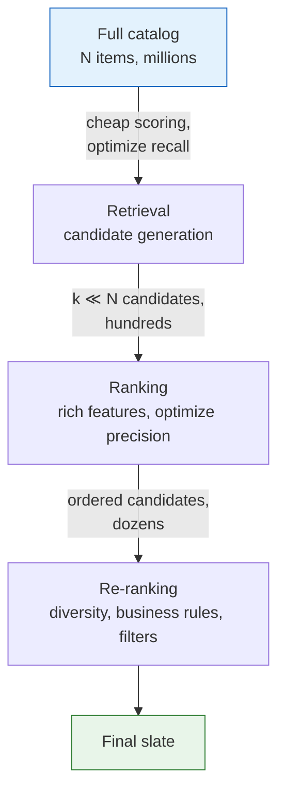

## Purpose

This note describes the backbone of a modern recommender. Once the catalog is large enough, the system stops looking like one model and starts looking like a cascade.

## Why the Pipeline Splits

Suppose the catalog has $N$ items and your best ranker costs $c_r$ to score one item. Full scoring costs

$$
N c_r
$$

per request. If a cheap first stage cuts the catalog to $k \ll N$ candidates, the expensive stage now costs

$$
k c_r
$$

That is the basic economic reason the split exists.

The retrieval stage spends little compute per item and tries to preserve good options. The ranking stage spends much more compute per item and tries to order those options well.

## Retrieval Is a Recall Problem

Retrieval does not need a perfectly calibrated score. It needs to avoid prematurely discarding items the ranker would have liked.

Common candidate sources:

- recent popularity
- item-item or user-item collaborative signals
- content similarity
- follow graph or creator graph heuristics
- two-tower embedding retrieval with ANN
- rule-based pools such as new items or inventory-constrained buckets

Real systems usually union candidates from several sources because each source fails in a different way.

- popularity misses niche intent
- collaborative filtering struggles with cold start
- content similarity misses cross-topic jumps
- ANN retrieval inherits whatever blind spots the embedding space has

## Ranking Is a Precision Problem

Ranking runs after the candidate set is small enough to justify richer features. It often consumes:

- detailed user history
- contextual features
- item freshness
- quality or trust signals
- business constraints
- calibrated historical statistics

The objective may be click probability, conversion, watch time, revenue, or some weighted combination. The score only has to be good enough for the downstream decision rule. Sometimes that means calibrated probabilities. Sometimes it only means the top of the list is right.

## Retrieval and Ranking Want Different Models

The same architecture rarely wins both jobs.

Retrieval likes models with:

- decomposable scoring
- precomputable item representations
- cheap ANN serving

Ranking likes models with:

- rich cross features
- calibration
- constraint handling
- interpretability for debugging and business logic

That is why systems often pair a two-tower retriever with a feature-rich ranker.

## Source Blending

Retrieval almost always returns too many candidates from some sources and too few from others. Candidate blending is the guardrail.

A practical retriever often reserves some budget for:

- head items
- fresh items
- long-tail exploration
- follow-graph items
- advertiser or supplier obligations

If you do not manage source blending explicitly, the candidate set will usually collapse toward the same narrow region of the catalog.

## Calibration and Reranking

Ranking still does not end the story. After the main score is computed, systems often add:

- duplicate suppression
- diversity heuristics
- business rules
- supplier exposure constraints
- hard filters for policy or safety

This is a sign that recommendation is not only prediction. It is also allocation under constraints.

## Failure Modes at the Boundary

> [!warning] The boundary hides failures
> A ranker can only order what retrieval hands it. If recall drops or the candidate mix collapses toward popular items, end-to-end metrics degrade with nothing visibly wrong in either stage's own dashboards.

The boundary between retrieval and ranking is where many silent failures show up.

- Retrieval recall is low, so the ranker never even sees good items.
- The retrieval embedding space collapses around popularity.
- The ranker optimizes a metric that the retriever did not preserve.
- The candidate mix is too homogeneous, so downstream ranking has no room to fix diversity.
- Logged training data reflects old retrieval decisions, so both stages reinforce the same bias.

When a recommender feels inexplicably stale, the problem is often here rather than inside the final ranker.

## What to Measure

Useful stage-specific metrics usually look different:

- retrieval: candidate recall, source coverage, tail coverage, ANN latency
- ranking: calibration, top-k engagement, watch time, conversion, business metrics

If you measure only end-to-end CTR, you lose the ability to tell which stage got worse.

## Related Notes

- [[ml/recommender-systems/two-tower-retrieval|Two-Tower Retrieval]]
- [[ml/recommender-systems/wide-and-deep|Wide and Deep]]
- [[ml/recommender-systems/bias-and-marketplace-effects|Bias, Marketplace Effects, and Counterfactual Evaluation]]
- [[ml/recommender-systems/two-tower-retrieval|Two-Tower Retrieval and the MovieLens 100K experiment]]
- [[ml/nlp/reading/information-retrieval|Indexing and Information Retrieval]]

## Sources

- [Covington, Adams, and Sargin (2016), Deep Neural Networks for YouTube Recommendations](https://research.google.com/pubs/archive/45530.pdf)
- [Cheng et al. (2016), Wide & Deep Learning for Recommender Systems](https://arxiv.org/pdf/1606.07792)
