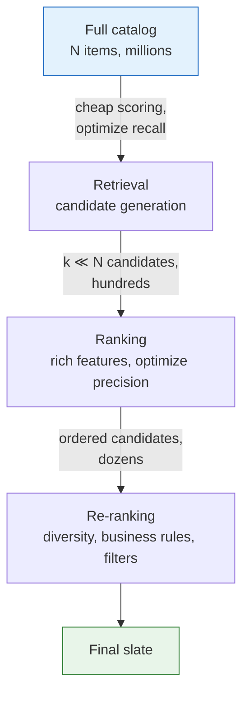

## Purpose

This note describes the backbone of a modern recommender. Once the catalog is large enough, the system stops looking like one model and starts looking like a cascade.

## Why the Pipeline Splits

Suppose the catalog has $N$ items and your best ranker costs $c_r$ to score one item. Full scoring costs

$$
N c_r
$$

per request. If a cheap first stage cuts the catalog to $k \ll N$ candidates, the expensive stage now costs

$$
k c_r
$$

That is the basic economic reason the split exists.

The retrieval stage spends little compute per item and tries to preserve good options. The ranking stage spends much more compute per item and tries to order those options well.

## Retrieval Is a Recall Problem

Retrieval does not need a perfectly calibrated score. It needs to avoid prematurely discarding items the ranker would have liked.

Common candidate sources:

- recent popularity
- item-item or user-item collaborative signals
- content similarity
- follow graph or creator graph heuristics
- two-tower embedding retrieval with ANN
- rule-based pools such as new items or inventory-constrained buckets

Real systems usually union candidates from several sources because each source fails in a different way.

- popularity misses niche intent
- collaborative filtering struggles with cold start
- content similarity misses cross-topic jumps
- ANN retrieval inherits whatever blind spots the embedding space has

## Cold Start and Side-Information Bootstrapping

Every retrieval source in the list above depends on interaction history that a new item or a new user does not have yet. Popularity signals need past exposure. Collaborative signals need past co-occurrence. A brand-new item has neither, and a system that only trusts interaction data will simply never surface it.

Schein, Popescul, Ungar, and Pennock frame the fix as folding side information into the same latent-variable model used for warm items rather than bolting on a separate cold-start path. Their two-way aspect model shares latent classes between a person/movie interaction matrix and item content (such as cast or genre), so a new movie can be placed into the latent space by its content alone, then scored against every user's latent preferences as if it had interaction history. The mechanism generalizes past that specific model: any retrieval or ranking component that learns an embedding space can bootstrap a cold item by encoding its content features into that same space, rather than waiting for behavioral signal to accumulate.

Two consequences follow for pipeline design:

- retrieval should keep a dedicated content-similarity or metadata-based source specifically so new items have a path into the candidate set at all, independent of the collaborative sources
- ranking features for a cold item should degrade gracefully rather than silently defaulting to zero or to the population mean, since a mean-imputed quality score for a brand-new item is indistinguishable from a genuinely mediocre one

Cold start for users is the mirror problem: a new user has no history for collaborative retrieval to key off of, so early sessions typically lean on registration-time signals (stated interests, device, referral source) until enough interaction accumulates to make behavioral retrieval useful.

## Ranking Is a Precision Problem

Ranking runs after the candidate set is small enough to justify richer features. It often consumes:

- detailed user history
- contextual features
- item freshness
- quality or trust signals
- business constraints
- calibrated historical statistics

The objective may be click probability, conversion, watch time, revenue, or some weighted combination. The score only has to be good enough for the downstream decision rule. Sometimes that means calibrated probabilities. Sometimes it only means the top of the list is right.

## Retrieval and Ranking Want Different Models

The same architecture rarely wins both jobs.

Retrieval likes models with:

- decomposable scoring
- precomputable item representations
- cheap ANN serving

Ranking likes models with:

- rich cross features
- calibration
- constraint handling
- interpretability for debugging and business logic

That is why systems often pair a two-tower retriever with a feature-rich ranker.

## Candidate Blending and Source-Budget Allocation

Retrieval almost always returns too many candidates from some sources and too few from others. Candidate blending is the guardrail.

A practical retriever often reserves some budget for:

- head items
- fresh items
- long-tail exploration
- follow-graph items
- advertiser or supplier obligations

The word "budget" is literal, not metaphorical: a common implementation caps how many of the final $k$ candidates each source may contribute, for example at most 40% from popularity, at least 10% reserved for items younger than some age threshold, and a fixed floor for any source tied to a business obligation such as a paid placement or a supplier commitment. Without an explicit cap, whichever source has the cheapest and highest-precision scoring function will crowd out the others, because a naive union-then-truncate-by-score step implicitly favors the source whose scores are best calibrated to look good in that comparison, not necessarily the source the ranker most needs.

This is also where explore/exploit tension resurfaces from [[ml/recommender-systems/bias-and-marketplace-effects|Bias, Marketplace Effects, and Counterfactual Evaluation]]: the long-tail exploration budget is the retrieval-stage mechanism that keeps $\pi_0(a\mid x) > 0$ for actions a purely exploitative retriever would otherwise starve, which is a precondition for later being able to counterfactually evaluate a change that favors those items.

If you do not manage source blending explicitly, the candidate set will usually collapse toward the same narrow region of the catalog.

## Calibration versus Rank-Order Quality

A ranker can be excellent at ordering candidates and still be badly miscalibrated, and the two failures have different symptoms. Rank-order quality (measured by something like NDCG or AUC) only asks whether higher-relevance items are scored above lower-relevance ones. Calibration asks whether the predicted score means what it claims to mean in absolute terms, for example whether a predicted 5% click probability actually converts to clicks 5% of the time.

He et al. define calibration for ad click prediction as the ratio of the average predicted CTR to the average empirical CTR, with 1.0 being perfect. The reason this matters beyond ranking: many downstream systems consume the score as a probability, not just an order. An ad auction multiplies predicted CTR by bid to rank ads and to set the price the winner pays. A budget pacer divides a spend target by predicted CTR to decide how aggressively to bid. A content quality gate might filter out anything below a fixed predicted-engagement threshold. All three break if the score is well-ordered but systematically inflated or deflated, even though a pure ranking metric like NDCG would report no problem at all.

Two consequences for pipeline design:

- retrieval only needs rank-order quality, since it is discarding items, not pricing anything
- ranking needs calibration whenever its output feeds an auction, a budget system, or a hard threshold, and needs it in addition to, not instead of, rank-order quality
- calibration typically needs periodic recalibration (such as a monotonic recalibration curve fit on held-out data) because background rates drift with seasonality, inventory mix, and the model's own retraining cadence, while rank-order quality is comparatively stable to those drifts

## Post-Ranking Reranking for Diversity, Policy, and Supply Constraints

Ranking still does not end the story. After the main score is computed, systems often add:

- duplicate suppression
- diversity heuristics
- business rules
- supplier exposure constraints
- hard filters for policy or safety

Diversity reranking has a standard formalization. Carbonell and Goldstein's Maximal Marginal Relevance selects items one at a time, at each step picking the candidate that maximizes

$$
\mathrm{MMR} = \arg\max_{D_i \in R \setminus S} \Bigl[ \lambda \cdot \mathrm{Sim}_1(D_i, Q) - (1-\lambda) \max_{D_j \in S} \mathrm{Sim}_2(D_i, D_j) \Bigr]
$$

where $R$ is the ranked candidate set, $S$ is what has already been selected for the slate, $\mathrm{Sim}_1$ measures relevance to the query or user profile, and $\mathrm{Sim}_2$ measures similarity between two candidates. At $\lambda = 1$ this reduces to the plain ranked list. At $\lambda = 0$ it greedily maximizes diversity and ignores relevance. Recommenders typically run this at $\lambda$ between roughly 0.5 and 0.8: reranking should not undo most of what the ranker got right, but it should stop the slate from placing five near-duplicates in the top five slots.

Supplier exposure constraints and policy filters compose with MMR-style reranking rather than replacing it: a typical pipeline first removes hard-filtered items (policy violations, out-of-stock inventory), then applies exposure floors or caps as constraints on which items are eligible at each slot, then runs diversity reranking over what remains. Getting the order of operations wrong, for example diversifying before applying hard filters, wastes reranking budget on items that will be removed anyway.

This layering is a sign that recommendation is not only prediction. It is also allocation under constraints.

## Failure Modes at the Boundary

> [!warning] The boundary hides failures
> A ranker can only order what retrieval hands it. If recall drops or the candidate mix collapses toward popular items, end-to-end metrics degrade with nothing visibly wrong in either stage's own dashboards.

The boundary between retrieval and ranking is where many silent failures show up.

- Retrieval recall is low, so the ranker never even sees good items.
- The retrieval embedding space collapses around popularity.
- The ranker optimizes a metric that the retriever did not preserve.
- The candidate mix is too homogeneous, so downstream ranking has no room to fix diversity.
- Logged training data reflects old retrieval decisions, so both stages reinforce the same bias.

When a recommender feels inexplicably stale, the problem is often here rather than inside the final ranker.

### A Concrete Failure Case

Suppose a two-tower retriever is trained purely on click logs and the ranker is trained on the same logs to predict conversion given a click. Six months in, an ops team ships a promotion that boosts one category's exposure for two weeks. Clicks on that category spike, so the next retriever refresh (trained on logs that now include the promo period) pulls the item and user embeddings for that category closer together in the shared embedding space, since the model has no way to know the extra clicks were promo-induced rather than preference-induced.

After the promo ends, the retriever keeps over-retrieving that category, because the embedding shift persists past the event that caused it. The ranker, seeing more of that category in its candidate set, learns from the resulting impressions that the category ranks reasonably well, since it is competing mostly against other candidates the retriever chose to send it. End-to-end CTR looks flat or even slightly up, because the ranker is doing a locally reasonable job on the candidates it receives. Category-level recall against a held-out relevance judgment, or a source-coverage metric tracked at the retrieval stage, would have shown the collapse immediately; end-to-end CTR does not, because it never sees what got excluded.

## What to Measure

Useful stage-specific metrics usually look different, and each one should have an owner and a threshold, not just a dashboard:

| Stage | Metric | What it catches | Blind to |
|---|---|---|---|
| Retrieval | candidate recall against held-out relevant items | items the ranker never gets a chance to see | how well those items get ordered |
| Retrieval | source coverage (share of final slate by candidate source) | one source silently crowding out the others | quality within a source |
| Retrieval | tail coverage (share of slate outside the head-popularity band) | popularity collapse | whether tail items were actually good matches |
| Retrieval | ANN latency and recall@k tradeoff | approximate search degrading below its target operating point | anything about ranking quality |
| Ranking | calibration (predicted vs. empirical rate) | scores that are well-ordered but wrong in an absolute sense | rank-order quality itself |
| Ranking | top-k engagement, watch time, conversion | whether the final ordering serves the actual objective | upstream candidate quality |
| Ranking | business metrics (revenue, supplier exposure balance) | allocation failures invisible to engagement metrics alone | user-side relevance |

If you measure only end-to-end CTR, you lose the ability to tell which stage got worse, exactly as in the failure case above.

## Related Notes

- [[ml/recommender-systems/two-tower-retrieval|Two-Tower Retrieval]]
- [[ml/recommender-systems/wide-and-deep|Wide and Deep]]
- [[ml/recommender-systems/bias-and-marketplace-effects|Bias, Marketplace Effects, and Counterfactual Evaluation]]
- [[ml/recommender-systems/two-tower-retrieval|Two-Tower Retrieval and the MovieLens 100K experiment]]
- [[ml/nlp/reading/information-retrieval|Indexing and Information Retrieval]]

## Sources

- [Covington, Adams, and Sargin (2016), Deep Neural Networks for YouTube Recommendations](https://research.google.com/pubs/archive/45530.pdf)
- [Cheng et al. (2016), Wide & Deep Learning for Recommender Systems](https://arxiv.org/pdf/1606.07792)
- [Schein, Popescul, Ungar, and Pennock (2002), Methods and Metrics for Cold-Start Recommendations](http://dpennock.com/papers/schein-sigir-2002-cold-start.pdf)
- [Carbonell and Goldstein (1998), The Use of MMR, Diversity-Based Reranking for Reordering Documents and Producing Summaries](https://www.cs.cmu.edu/~jgc/publication/MMR_DiversityBased_Reranking_SIGIR_1998.pdf)
- [He et al. (2014), Practical Lessons from Predicting Clicks on Ads at Facebook](https://quinonero.net/Publications/predicting-clicks-facebook.pdf)
