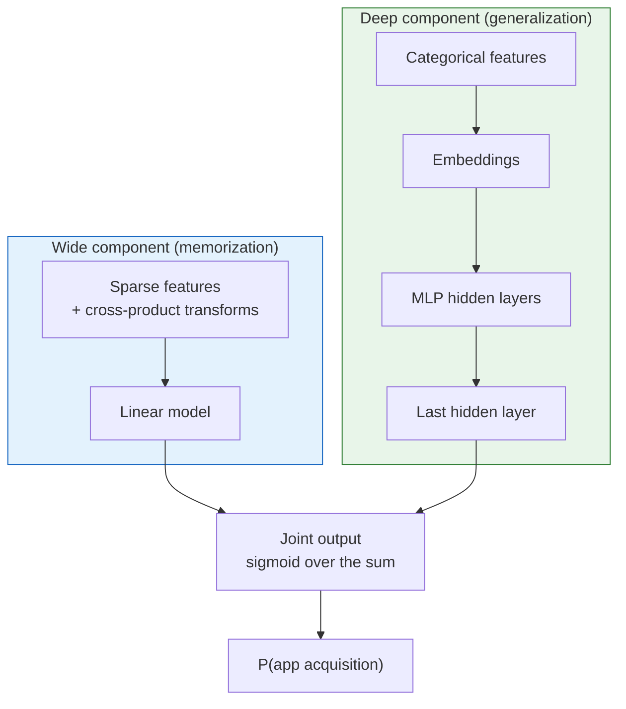

## Purpose

Wide and Deep is less interesting as a branded architecture than as a statement about recommender data. Sparse interaction logs need two different kinds of behavior from the model. They need memorization of rare but valuable feature crosses, and they need generalization to combinations that have not been seen before. This note is about that trade.

## The Tension

A linear model over cross features is good at memorization. If "installed Netflix" and "shown Pandora" is a historically useful combination, the model can put weight on exactly that conjunction.

A deep embedding model is good at generalization. If a user has interacted with many video apps but not this exact music app, embeddings may still place the new app in a compatible region of representation space.

Neither side is enough on its own.

- Wide-only models miss structure unless the feature engineer wrote the right crosses.
- Deep-only models can over-generalize, especially in sparse, high-rank problems full of niche tastes and exception rules.

## Architecture

The paper joins the two pieces into one model:

$$
\hat{y} = \sigma\left(w_{\text{wide}}^\top x_{\text{wide}} + w_{\text{deep}}^\top a^{(L)} + b\right)
$$

where:

- $x_{\text{wide}}$ contains sparse raw and crossed features
- $a^{(L)}$ is the last hidden representation of the deep tower
- both parts are trained jointly

The point is not the exact formula. The point is that the output layer can use both memorized conjunctions and distributed representations.

## Memorization Versus Generalization

The paper names the two effects directly.

- **Memorization** means learning frequent co-occurrences from the observed data.
- **Generalization** means inferring useful behavior on feature combinations that were rare or unseen in training.

That is a good vocabulary for recommender work in general. Whenever a model change helps only frequent head traffic, it usually improved memorization. Whenever a change starts surfacing relevant but less obvious items, it usually improved generalization.

## Why Deep-Only Models Can Fail

This paper makes a point that still gets missed. Dense embeddings produce nonzero similarity almost everywhere. In a sparse recommender problem, that can be wrong. Some user-item pairs should just stay disconnected.

> [!warning] Over-generalization is a real failure mode
> Embedding geometry is smooth by construction, so a deep-only model will recommend something for nearly every query, including ones where the right answer is nothing similar. The wide component exists to hold sharp exception rules that the embedding space would otherwise smooth over.

That is why the wide part matters. It acts as a place to store exception rules that should not be washed away by smooth embedding geometry.

## What the Paper Found

The production setting is Google Play recommendations. The paper reports:

- over **1 billion** active users
- over **1 million** apps
- **+3.9%** relative gain in app acquisitions against the production control
- **+1%** relative gain over the deep-only model

Serving performance also mattered. The authors report scoring **over 10 million apps per second** at peak traffic, with client-side latency reduced from **31 ms** to **14 ms** through multithreading and smaller batches.

Those numbers are a reminder that ranking papers from large systems are never only about model quality. The model has to clear the systems bar too.

## Where Wide and Deep Fits

This architecture is most natural in the ranking stage, not retrieval.

- It can use richer impression-time features.
- It does not need the tower factorization required for ANN retrieval.
- It works well when tabular, sparse, and dense features all matter.

You can think of it as a way of spending extra compute on a much smaller candidate set after retrieval has already done the cheap pruning.

## What Replaced It, and What Did Not

Modern recommenders often swap in more elaborate architectures:

- deeper MLPs
- DCN-style cross layers
- mixture-of-experts blocks
- attention over history

Still, the core problem has not changed. Every architecture is still negotiating the same underlying trade between memorizing sharp exceptions and generalizing beyond the logged data.

## Related Notes

- [[ml/recommender-systems/retrieval-and-ranking|Retrieval and Ranking]]
- [[ml/recommender-systems/two-tower-retrieval|Two-Tower Retrieval]]
- [[ml/recommender-systems/deep-neural-networks-for-youtube-recommendations|Deep Neural Networks for YouTube Recommendations]]

## Sources

- [Cheng et al. (2016), Wide & Deep Learning for Recommender Systems](https://arxiv.org/pdf/1606.07792)
