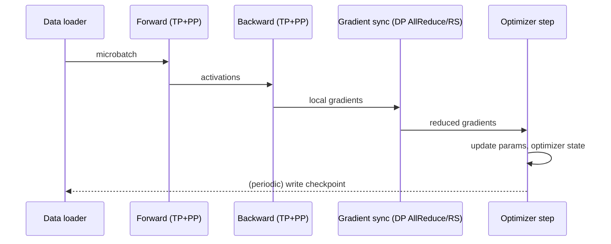
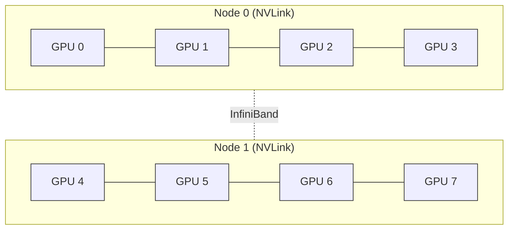

## Purpose

This note is an end-to-end reference for training an LLM across a GPU cluster: what one training step does, how the [[ml/serving-systems/parallelism|parallelism strategies]] compose, how much memory a config actually needs, how the major training systems differ, and how to measure whether the cluster is being used well. It complements [[ml/serving-systems/parallelism|Parallelism]] (the mechanisms) and [[ml/serving-systems/distributed-ml-runtimes|Distributed ML Runtimes]] (the older abstractions these systems grew out of).

## One synchronous training step

Data-parallel replica $r$ holds a full (possibly sharded) copy of the model. A step does, in order: forward pass on a local microbatch, backward pass producing local gradients, a gradient-synchronizing collective across replicas (AllReduce, or ReduceScatter for sharded optimizer state), an optimizer update, and periodic checkpointing of parameters plus optimizer state. If the model doesn't fit one device, tensor and pipeline parallelism subdivide the forward/backward pass itself, and the gradient-sync collective runs only across the data-parallel dimension, not across tensor or pipeline ranks (those exchange activations and layer-boundary gradients instead, per [[ml/serving-systems/parallelism|Parallelism]]).

## Choosing a parallelism strategy

The decision tree, in the order the constraints usually bind: does one GPU hold the parameters, gradients, and optimizer state? If not, shard with ZeRO/FSDP or tensor parallelism before anything else. Does the model still not fit after sharding parameters? Add pipeline parallelism across nodes, since it only moves activations across the slow inter-node link. Is the sequence length driving activation memory past budget even after checkpointing? Add sequence parallelism (detailed in [[ml/serving-systems/parallelism|Parallelism]]). Is the model an MoE? Add expert parallelism, covered in [[ml/serving-systems/mixture-of-experts|Mixture of Experts]]. Once the model fits, scale throughput with data parallelism, the cheapest axis because it needs no change to the model's internal structure.

## Memory budget: a 13B model worked example

For a dense transformer with $\Psi$ parameters trained with mixed-precision Adam, each GPU needs (see [[ml/serving-systems/parallelism|Parallelism, ZeRO and FSDP]] for the derivation): $2\Psi$ bytes FP16 parameters, $2\Psi$ bytes FP16 gradients, and $12\Psi$ bytes of FP32 optimizer state (master weights, momentum, variance), for $16\Psi$ bytes total before any sharding.

For $\Psi = 13 \times 10^9$: $16 \times 13\text{B} \approx 208$ GB, more than two H100-80GB GPUs' worth of memory before a single activation is stored. Sharding this state across $N_d$ data-parallel workers with ZeRO stage 3 (or equivalently FSDP `FULL_SHARD`) brings it to $208\text{GB}/N_d$: at $N_d = 8$, about 26 GB per GPU, leaving room for activations and the temporarily unsharded parameters that FSDP all-gathers back before each layer's forward and backward ([FSDP docs](https://docs.pytorch.org/docs/stable/fsdp.html)). Activation memory on top of this follows the per-layer formula in [[ml/serving-systems/parallelism|Parallelism]]; at long sequence lengths it can exceed the sharded parameter memory and is the usual reason to add tensor or sequence parallelism even when parameters alone would fit.

## System designs compared

These are not just names for parallelism strategies; each is a different point in a design space of what state is replicated, what is communicated, and what the programming model looks like.

**GPipe** ([Huang et al. 2018](https://arxiv.org/abs/1811.06965)) is model-agnostic pipeline parallelism: partition any sequential-layer network across accelerators, split each batch into $m$ microbatches, and pipeline them through the stages. It is a library-level abstraction with no assumption about layer internals, which is also its limit: it does not touch intra-layer parallelism at all, so a single layer still has to fit on one device.

**Megatron-LM** ([Shoeybi et al. 2019](https://arxiv.org/abs/1909.08053)) instead parallelizes inside each transformer layer (tensor parallelism, detailed in [[ml/serving-systems/parallelism|Parallelism]]), implemented as a few inserted communication ops in PyTorch with no compiler changes. The original paper trained an 8.3B-parameter model on 512 GPUs at 76% scaling efficiency against a single-GPU baseline. Follow-up work ([Narayanan et al. 2021](https://arxiv.org/abs/2104.04473)) composed tensor, pipeline, and data parallelism (3D parallelism) and introduced the interleaved pipeline schedule, reaching 502 petaFLOP/s on a 1-trillion-parameter model across 3072 GPUs at 52% of peak per-GPU throughput.

**ZeRO / DeepSpeed** ([Rajbhandari et al. 2019](https://arxiv.org/abs/1910.02054)) takes a different axis: instead of splitting computation, it removes the redundancy in data-parallel *state*. Every data-parallel replica ordinarily holds identical parameters, gradients, and optimizer state; ZeRO shards each in turn (stages 1, 2, 3) across the data-parallel group and reconstructs the needed shard just-in-time via collectives, keeping the per-GPU communication volume the same order as plain data-parallel AllReduce. The paper reports training 100B+ parameter models with super-linear speedup on 400 GPUs at 15 petaflops, an 8x model-size and 10x throughput increase over the prior state of the art, and trained Turing-NLG (17B) as a direct result.

**PyTorch FSDP** ([Zhao et al. 2023](https://arxiv.org/abs/2304.11277)) is ZeRO stage 3 as a native PyTorch module wrapper rather than a separate library, co-designed with PyTorch's tensor and CUDA-caching-allocator internals. Mechanically, an FSDP unit all-gathers its full parameters immediately before use in the forward pass, runs the computation, then frees (reshards) them; the backward pass repeats the all-gather, computes gradients, then reduce-scatters them so each rank ends up owning only its shard of the reduced gradient. `ShardingStrategy` selects how much state stays sharded: `FULL_SHARD` shards parameters, gradients, and optimizer state (ZeRO-3 equivalent); `SHARD_GRAD_OP` shards gradients and optimizer state but keeps parameters unsharded across the forward pass (ZeRO-2 equivalent); `NO_SHARD` replicates everything (plain data parallel); `HYBRID_SHARD` does `FULL_SHARD` within a node and replicates across nodes, trading memory savings for confining the expensive all-gather/reduce-scatter traffic to NVLink ([FSDP docs](https://docs.pytorch.org/docs/stable/fsdp.html)). `backward_prefetch=BACKWARD_PRE` issues the next layer's all-gather before the current layer's backward compute finishes, which is the mechanism that lets communication overlap with compute rather than serialize before it. The paper reports FSDP matching DistributedDataParallel's throughput while supporting substantially larger models, with near-linear TFLOPS scaling.

| System | What it shards | Programming model | Communication pattern |
| --- | --- | --- | --- |
| GPipe | model layers (pipeline stages) | library wraps a sequential model | point-to-point activations between stages |
| Megatron-LM (TP) | weight matrices within a layer | inserted collective ops, no compiler | AllReduce per layer, intra-node |
| ZeRO / DeepSpeed | optimizer state, gradients, params (by stage) | training-loop library | AllGather/ReduceScatter over DP group |
| FSDP | same as ZeRO-3, native module wrapper | `nn.Module` wrapper, PyTorch-integrated | per-unit AllGather (fwd/bwd), ReduceScatter (bwd) |

In practice, large training runs compose these rather than picking one: tensor parallelism inside a node, pipeline parallelism across nodes, and ZeRO/FSDP-style sharding or plain data parallelism across replica groups, exactly the 3D-parallelism pattern in [[ml/serving-systems/parallelism|Parallelism]].

## Communication cost and overlap

Pipeline bubbles, the four collectives (AllReduce, Broadcast, AllGather, ReduceScatter), and their per-strategy cost formulas are derived in [[ml/serving-systems/parallelism|Parallelism]] and extended with schedule diagrams and inter/intra-node sensitivity there; this note focuses on how systems hide that cost rather than re-deriving it. The lever every system above uses is overlap: issue the next collective before the current compute finishes, so the GPU's compute units and its NICs are busy at the same time instead of serially. FSDP's `backward_prefetch` and `forward_prefetch` do this for parameter all-gathers; ZeRO overlaps its ReduceScatter with backward compute of earlier layers; Megatron's tensor-parallel AllReduce is small enough (confined to NVLink, one collective per layer) that it is usually compute-bound rather than the bottleneck once pipeline and data parallelism are configured correctly. The `limit_all_gathers` FSDP option deliberately reintroduces a small serialization point, a rate limiter that caps how many all-gathers can be in flight, trading a bit of overlap for bounded peak memory ([FSDP docs](https://docs.pytorch.org/docs/stable/fsdp.html)).

## Throughput metrics

- **Step time**: wall-clock seconds for one optimizer step across the whole cluster.
- **Tokens per second**: (batch size x sequence length) / step time, the throughput number users usually mean by "training speed."
- **Model FLOPs Utilization (MFU)**: observed tokens/sec times FLOPs-per-token (forward+backward, excluding recomputation), divided by the hardware's theoretical peak FLOPs/sec ([Chowdhery et al. 2022](https://arxiv.org/abs/2204.02311), Appendix B). Because the denominator depends only on model shape and published hardware peak, MFU is comparable across frameworks and clusters in a way raw tokens/sec is not.
- **Scaling efficiency**: throughput at $N$ GPUs divided by ($N$ times single-GPU throughput). Below 100% by construction once communication or bubbles enter; Megatron-LM's 8.3B-parameter run scaled at 76% against its single-GPU baseline, and the composed 1T-parameter run at 52% of theoretical peak per GPU ([Narayanan et al. 2021](https://arxiv.org/abs/2104.04473)).
- **Goodput**: the fraction of wall-clock time spent making useful, checkpoint-preserved training progress, as opposed to time lost to startup, data-loading stalls, or disruption recovery. Distinguishes "the GPUs are busy" from "the GPUs are making progress that survives to a checkpoint."

Worked numeric example: a 13B model, FLOPs-per-token $\approx 6 \times 13 \times 10^9 = 7.8 \times 10^{10}$ (the $6N$ approximation from [[ml/deep-learning/modeling-architecture-and-data|Modeling, Architecture, and Data]]), running at 4,000 tokens/sec on 64 H100s with per-GPU peak FP16 dense throughput 1000 TFLOP/s (from [[ml/serving-systems/performance-modeling|Performance Modeling]]): observed FLOPs/sec $= 7.8 \times 10^{10} \times 4000 \approx 3.12 \times 10^{14}$, cluster peak $= 64 \times 10^{15} = 6.4 \times 10^{16}$, so $\text{MFU} \approx 0.5\%$, a deliberately pathological number showing how sensitive MFU is to actual tokens/sec; production runs at healthy configurations typically land in the 30-55% range reported by the papers above.

## Data loading, checkpointing, and fault tolerance

Data loading has to keep pace with the fastest stage or it becomes the bottleneck; sharded, prefetching data loaders that reshuffle per epoch avoid every replica reading the same disk region at once. Checkpoints need to capture parameters, optimizer state, and the data-loader's position so a restart resumes the exact token stream rather than reprocessing or skipping data; with sharded optimizer state (ZeRO/FSDP), a checkpoint format has to either gather full state before writing (expensive, blocking) or write each shard separately and reshard on load if the restart uses a different GPU count. Stragglers, one slow GPU in a synchronous data-parallel group, stall every other replica at the AllReduce barrier; a job that runs long enough at scale will hit a hardware failure, so restart-from-last-checkpoint plus periodic checkpointing frequency is a direct tradeoff between wasted recompute (checkpoint less often) and checkpoint I/O overhead (checkpoint more often). See [[systems/scheduling/4-cluster-and-datacenter/stragglers-speculation-and-overload|Stragglers, Speculation, and Overload]] for the general scheduling treatment of this problem.

## A small cluster topology

Within a node, GPUs run tensor parallelism over NVLink (600 GB/s, per [[ml/serving-systems/parallelism|Parallelism]]); across nodes, InfiniBand (about 25 GB/s) carries pipeline-stage activations and data-parallel gradient collectives, both of which are far less bandwidth-hungry per byte of useful work than the intra-layer AllReduce tensor parallelism needs.

## Downstream consequences of training choices

The parallelism strategy chosen at training time is not free at deployment. A model trained with heavy tensor parallelism assumes the same NVLink-class topology at inference or pays a latency penalty running the same collectives over slower links. A model trained overtrained-for-inference (fewer parameters, more tokens, per [[ml/deep-learning/modeling-architecture-and-data|Modeling, Architecture, and Data]]) shifts cost from the one-time training bill to nothing extra at serving, since inference parallelism decisions are largely orthogonal to how the model was sharded during training. Checkpoint format choices constrain which serving frameworks can load the model directly versus requiring a conversion step. None of these are training-time correctness issues, but all of them are portability costs paid later.

## Related notes

- [[ml/serving-systems/parallelism|Parallelism]]
- [[ml/serving-systems/distributed-ml-runtimes|Distributed ML Runtimes]]
- [[ml/serving-systems/mixture-of-experts|Mixture of Experts]]
- [[ml/deep-learning/modeling-architecture-and-data|Modeling, Architecture, and Data]]
- [[systems/scheduling/index|Scheduling]]
- [[systems/distributed-systems/index|Distributed Systems]]
