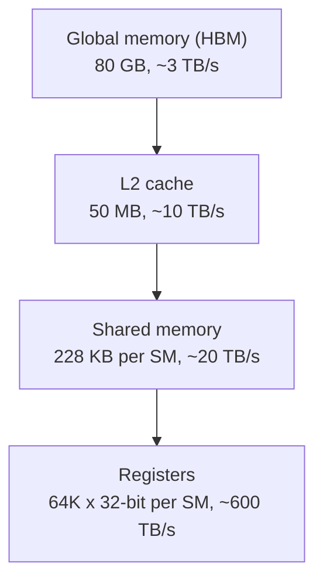

## Purpose

This note covers the GPU hardware model and the programming interfaces used throughout the rest of these serving notes. It is the foundation for [[ml/serving-systems/optimizing-gpu-kernels|Optimizing GPU Kernels]], [[ml/serving-systems/triton|Triton]], and the bottleneck analysis in [[ml/serving-systems/performance-modeling|Performance Modeling]].

These are notes for CSE 599K "LLM Serving Systems" at the University of Washington, Spring 2025, taught by Prof. Baris Kasikci with TA Kan Zhu. Hardware figures are from lecture slides and vendor spec sheets; the market and cost figures are third-party estimates repeated in lecture, and I have not verified them independently.

## Why GPUs matter for serving

Training learns from existing data; inference applies the model to new data. Serving is the systems problem around inference: build a system that performs inference with high throughput and low latency while meeting diverse service level objectives. Demand is enormous (ChatGPT went from roughly 500M monthly visits in December 2022 to roughly 2000M in January 2024, per lecture slides), and the hardware is expensive. An NVIDIA H200 HGX server was quoted around $250,000 with power draw up to about 10kW. Reported 2024 H100 purchase estimates put Meta around 300K units and Google and Microsoft around 150K each. Those numbers are estimates, and I keep them only to make the point that the economics force high utilization. Batching user requests to drive throughput is the recurring theme of every note in this series.

## CPU vs GPU

A GPU is a processor originally built for graphics rendering that now handles scientific computing and machine learning, shipped with a vendor software stack (CUDA for NVIDIA, ROCm for AMD). The design contrast with CPUs:

| Aspect       | CPU                                 | GPU                   |
| ------------ | ----------------------------------- | --------------------- |
| Design focus | Control logic (good with branching) | Computation/loading   |
| Performance  | Single thread performance           | Parallel processing   |
| Cores        | Few powerful cores                  | Many simpler cores    |
| Memory       | Large cache hierarchy               | High bandwidth memory |

Concretely, from lecture:

| Specification    | AMD EPYC 9555 (CPU)    | NVIDIA H200 (GPU) |
| ---------------- | ---------------------- | ----------------- |
| Cores/Threads    | 64 cores / 128 threads | 16,896 CUDA cores |
| Frequency        | 4.4 GHz                | 1.98 GHz          |
| TFLOPs           | ~10-20                 | 989 (dense FP16)  |
| Memory size      | Up to 6 TB             | 141 GB            |
| Memory bandwidth | 576 GB/s               | 4800 GB/s         |
| Memory latency   | ~70 ns                 | ~110 ns           |

CPU DRAM gives low latency random access. GPU HBM gives much higher bandwidth and wants structured, batched access patterns.

## Hardware architecture

GPUs deploy in clusters: NVLink connects GPUs within a node at up to 900 GB/s, while the node's link to the data center network runs around 200 Gb/s, which is 25 GB/s. That two-orders-of-magnitude gap between local memory bandwidth and network bandwidth shapes the parallelism strategies in [[ml/serving-systems/parallelism|Parallelism]].

The on-device memory hierarchy (H100-class figures from lecture):

- Global memory (HBM): 80 GB at ~3 TB/s
- L2 cache: 50 MB at ~10 TB/s
- Shared memory ("smem"): 228 KB per SM at ~20 TB/s
- Registers: 64K x 32-bit per SM at ~600 TB/s



> [!tip] Reading the hierarchy
> Each step down the diagram buys roughly an order of magnitude of bandwidth at a steep cost in capacity. The kernel techniques in [[ml/serving-systems/optimizing-gpu-kernels|Optimizing GPU Kernels]] are all ways of moving data reuse toward the fast, small end of this ladder.

Compute lives in streaming multiprocessors (SMs). Each SM contains CUDA cores for scalar work, tensor cores for small dense matrix multiplies, and the shared memory that serves as a program-managed scratchpad.

## Programming model

The execution hierarchy maps software concepts onto that hardware:

| Concept       | Definition                             | Runs on        | Communication via | Limits                            |
| ------------- | -------------------------------------- | -------------- | ----------------- | --------------------------------- |
| Thread        | Minimal unit that executes instructions | Function units | Local registers   | Up to 255 registers               |
| Warp          | Group of threads                       | SM partition   | Register file     | 32 threads                        |
| Thread block  | Group of warps                         | SM             | Shared memory     | Up to 32 warps (1024 threads)     |
| Kernel        | Function on GPU                        | GPU            | L2/global memory  | Up to $2^{31}-1$ blocks along x   |

The load-bearing facts: 32 threads form a warp, and threads in a warp execute the same instruction at the same pace on different data. Four warps run on an SM at once, and the scheduler swaps warps on and off to hide memory latency. Blocks run independently and can only communicate through L2 or global memory, which is why block-level synchronization is generally unavailable inside a kernel.

## Three ways to program a GPU

### PyTorch

Highest level. You write tensor operations and PyTorch dispatches prebuilt kernels.

```python
import torch

def add_tensors(a, b):
    return a + b

if __name__ == "__main__":
    num_elements = 10**9

    tensor1 = torch.rand(num_elements, device='cpu')
    tensor2 = torch.rand(num_elements, device='cpu')

    tensor1 = tensor1.to('cuda')
    tensor2 = tensor2.to('cuda')

    for i in range(10):
        result = add_tensors(tensor1, tensor2)

    result = result.cpu()
    print("Result of addition:", result)
```

### Triton

A compiler framework from OpenAI with a Python interface. You write programs at the block level and Triton handles thread management within the block. For fused or otherwise custom kernels it beats what you can express in PyTorch ops. See [[ml/serving-systems/triton|Triton]] for a longer treatment.

```python
@triton.jit
def add_kernel(x_ptr, y_ptr, output_ptr, n_elements, BLOCK_SIZE: tl.constexpr):
    pid = tl.program_id(axis=0)
    block_start = pid * BLOCK_SIZE
    offsets = block_start + tl.arange(0, BLOCK_SIZE)
    mask = offsets < n_elements

    x = tl.load(x_ptr + offsets, mask=mask)
    y = tl.load(y_ptr + offsets, mask=mask)
    output = x + y

    tl.store(output_ptr + offsets, output, mask=mask)
```

### CUDA

Bare metal, one-to-one mapping to hardware, highest performance ceiling, heaviest implementation burden.

Memory management:

```cpp
// Memory allocation
cudaMalloc          // device memory allocation
cudaMallocHost      // pinned host memory allocation
cudaFree            // free memory

// Memory operations
cudaMemcpy          // synchronous copy
cudaMemcpyAsync     // asynchronous copy
cudaMemset          // synchronous set
cudaMemsetAsync     // asynchronous set
```

Kernel structure:

```cpp
// Kernel declaration
__global__ void kernel_name(args...)

// Device helper function
__device__ T helper_name(args...)

// Example addition kernel
__global__ void add(int *a, int *b, int *c, size_t num) {
    int block_start = blockIdx.x * blockDim.x;
    int thread_id = threadIdx.x;
    int index = block_start + thread_id;
    if (index < num) {
        c[index] = a[index] + b[index];
    }
}
```

Launch:

```cpp
// Define block and thread dimensions
dim3 block(x, y, z);
dim3 thread(x, y, z);

// Launch kernel
kernel_name<<<block, thread>>>(args);
```

Synchronization and errors:

```cpp
__syncthreads()           // Thread synchronization (device function)
cudaDeviceSynchronize()   // Device synchronization (host function)

// Error checking
cudaGetLastError()        // Get last error
cudaGetErrorString()      // Get error description
```

## Timing and profiling

PyTorch dispatches kernels asynchronously, so the CPU races ahead of the GPU and wall-clock timing around a Python call measures dispatch, not execution. Use CUDA events for accurate GPU timing. For profiling, torch.profiler shows CPU-side activity well but processes slowly, Nsight Systems (nsys) handles system-level traces, and Nsight Compute (ncu) digs inside individual kernels.

CUDA streams let independent kernels overlap when the scheduler allows. Events act as flags between kernels; `cudaStreamWaitEvent` synchronizes one stream on another's event.

## Newer hardware features

Features to know by generation: unified memory addressing and NVLink (P100+), thread block clusters and the Tensor Memory Accelerator (H100+), NVLink SHARP in-network reduction (H100+), and FP4/FP6 precision (B100+). See the [CUDA programming guide](https://docs.nvidia.com/cuda/cuda-c-programming-guide/) for details on each.

## Related notes

- [[ml/serving-systems/optimizing-gpu-kernels|Optimizing GPU Kernels]]
- [[ml/serving-systems/triton|Triton]]
- [[ml/serving-systems/performance-modeling|Performance Modeling]]
- [[ml/serving-systems/how-to-write-a-fast-kernel|How to write a fast kernel]]
- [[hardware/computer-architecture/simd-vectors-gpus-accelerators|From SIMD to SIMT: Vectors, GPUs, and Accelerators]]
