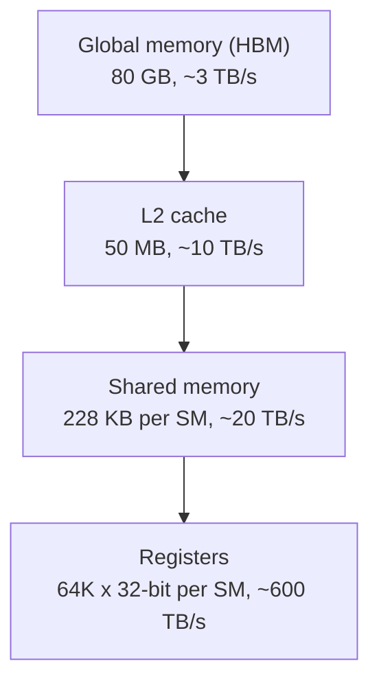

## Purpose

This note covers the GPU hardware model and the programming interfaces used throughout the rest of these serving notes. It is the foundation for [[ml/serving-systems/optimizing-gpu-kernels|Optimizing GPU Kernels]], [[ml/serving-systems/triton|Triton]], and the bottleneck analysis in [[ml/serving-systems/performance-modeling|Performance Modeling]].

These are notes for CSE 599K "LLM Serving Systems" at the University of Washington, Spring 2025, taught by Prof. Baris Kasikci with TA Kan Zhu. Hardware figures are from lecture slides and vendor spec sheets; the market and cost figures are third-party estimates repeated in lecture, and I have not verified them independently.

## Why GPUs matter for serving

Training learns from existing data; inference applies the model to new data. Serving is the systems problem around inference: build a system that performs inference with high throughput and low latency while meeting diverse service level objectives. Demand is enormous (ChatGPT went from roughly 500M monthly visits in December 2022 to roughly 2000M in January 2024, per lecture slides), and the hardware is expensive. An NVIDIA H200 HGX server was quoted around $250,000 with power draw up to about 10kW. Reported 2024 H100 purchase estimates put Meta around 300K units and Google and Microsoft around 150K each. Those numbers are estimates, and I keep them only to make the point that the economics force high utilization. Batching user requests to drive throughput is the recurring theme of every note in this series.

## CPU vs GPU

A GPU is a processor originally built for graphics rendering that now handles scientific computing and machine learning, shipped with a vendor software stack (CUDA for NVIDIA, ROCm for AMD). The design contrast with CPUs:

| Aspect       | CPU                                 | GPU                   |
| ------------ | ----------------------------------- | --------------------- |
| Design focus | Control logic (good with branching) | Computation/loading   |
| Performance  | Single thread performance           | Parallel processing   |
| Cores        | Few powerful cores                  | Many simpler cores    |
| Memory       | Large cache hierarchy               | High bandwidth memory |

Concretely, from lecture:

| Specification    | AMD EPYC 9555 (CPU)    | NVIDIA H200 (GPU) |
| ---------------- | ---------------------- | ----------------- |
| Cores/Threads    | 64 cores / 128 threads | 16,896 CUDA cores |
| Frequency        | 4.4 GHz                | 1.98 GHz          |
| TFLOPs           | ~10-20                 | 989 (dense FP16)  |
| Memory size      | Up to 6 TB             | 141 GB            |
| Memory bandwidth | 576 GB/s               | 4800 GB/s         |
| Memory latency   | ~70 ns                 | ~110 ns           |

CPU DRAM gives low latency random access. GPU HBM gives much higher bandwidth and wants structured, batched access patterns.

## Hardware architecture

GPUs deploy in clusters: NVLink connects GPUs within a node at up to 900 GB/s, while the node's link to the data center network runs around 200 Gb/s, which is 25 GB/s. That two-orders-of-magnitude gap between local memory bandwidth and network bandwidth shapes the parallelism strategies in [[ml/serving-systems/parallelism|Parallelism]].

The on-device memory hierarchy (H100-class figures from lecture):

- Global memory (HBM): 80 GB at ~3 TB/s
- L2 cache: 50 MB at ~10 TB/s
- Shared memory ("smem"): 228 KB per SM at ~20 TB/s
- Registers: 64K x 32-bit per SM at ~600 TB/s



> [!tip] Reading the hierarchy
> Each step down the diagram buys roughly an order of magnitude of bandwidth at a steep cost in capacity. The kernel techniques in [[ml/serving-systems/optimizing-gpu-kernels|Optimizing GPU Kernels]] are all ways of moving data reuse toward the fast, small end of this ladder.

Compute lives in streaming multiprocessors (SMs). Each SM contains CUDA cores for scalar work, tensor cores for small dense matrix multiplies, and the shared memory that serves as a program-managed scratchpad.

## Programming model

The execution hierarchy maps software concepts onto that hardware:

| Concept       | Definition                             | Runs on        | Communication via | Limits                            |
| ------------- | -------------------------------------- | -------------- | ----------------- | --------------------------------- |
| Thread        | Minimal unit that executes instructions | Function units | Local registers   | Up to 255 registers               |
| Warp          | Group of threads                       | SM partition   | Register file     | 32 threads                        |
| Thread block  | Group of warps                         | SM             | Shared memory     | Up to 32 warps (1024 threads)     |
| Kernel        | Function on GPU                        | GPU            | L2/global memory  | Up to $2^{31}-1$ blocks along x   |

The load-bearing facts: 32 threads form a warp, and threads in a warp execute the same instruction at the same pace on different data. Four warps run on an SM at once, and the scheduler swaps warps on and off to hide memory latency. Blocks run independently and can only communicate through L2 or global memory, which is why block-level synchronization is generally unavailable inside a kernel.

## Three ways to program a GPU

### PyTorch

Highest level. You write tensor operations and PyTorch dispatches prebuilt kernels.

```python
import torch

def add_tensors(a, b):
    return a + b

if __name__ == "__main__":
    num_elements = 10**9

    tensor1 = torch.rand(num_elements, device='cpu')
    tensor2 = torch.rand(num_elements, device='cpu')

    tensor1 = tensor1.to('cuda')
    tensor2 = tensor2.to('cuda')

    for i in range(10):
        result = add_tensors(tensor1, tensor2)

    result = result.cpu()
    print("Result of addition:", result)
```

### Triton

A compiler framework from OpenAI with a Python interface. You write programs at the block level and Triton handles thread management within the block. For fused or otherwise custom kernels it beats what you can express in PyTorch ops. See [[ml/serving-systems/triton|Triton]] for a longer treatment.

```python
@triton.jit
def add_kernel(x_ptr, y_ptr, output_ptr, n_elements, BLOCK_SIZE: tl.constexpr):
    pid = tl.program_id(axis=0)
    block_start = pid * BLOCK_SIZE
    offsets = block_start + tl.arange(0, BLOCK_SIZE)
    mask = offsets < n_elements

    x = tl.load(x_ptr + offsets, mask=mask)
    y = tl.load(y_ptr + offsets, mask=mask)
    output = x + y

    tl.store(output_ptr + offsets, output, mask=mask)
```

### CUDA

Bare metal, one-to-one mapping to hardware, highest performance ceiling, heaviest implementation burden.

Memory management:

```cpp
// Memory allocation
cudaMalloc          // device memory allocation
cudaMallocHost      // pinned host memory allocation
cudaFree            // free memory

// Memory operations
cudaMemcpy          // synchronous copy
cudaMemcpyAsync     // asynchronous copy
cudaMemset          // synchronous set
cudaMemsetAsync     // asynchronous set
```

Kernel structure:

```cpp
// Kernel declaration
__global__ void kernel_name(args...)

// Device helper function
__device__ T helper_name(args...)

// Example addition kernel
__global__ void add(int *a, int *b, int *c, size_t num) {
    int block_start = blockIdx.x * blockDim.x;
    int thread_id = threadIdx.x;
    int index = block_start + thread_id;
    if (index < num) {
        c[index] = a[index] + b[index];
    }
}
```

Launch:

```cpp
// Define block and thread dimensions
dim3 block(x, y, z);
dim3 thread(x, y, z);

// Launch kernel
kernel_name<<<block, thread>>>(args);
```

Synchronization and errors:

```cpp
__syncthreads()           // Thread synchronization (device function)
cudaDeviceSynchronize()   // Device synchronization (host function)

// Error checking
cudaGetLastError()        // Get last error
cudaGetErrorString()      // Get error description
```

## Timing and profiling

PyTorch dispatches kernels asynchronously, so the CPU races ahead of the GPU and wall-clock timing around a Python call measures dispatch, not execution. Use CUDA events for accurate GPU timing. For profiling, torch.profiler shows CPU-side activity well but processes slowly, Nsight Systems (nsys) handles system-level traces, and Nsight Compute (ncu) digs inside individual kernels.

CUDA streams let independent kernels overlap when the scheduler allows. Events act as flags between kernels; `cudaStreamWaitEvent` synchronizes one stream on another's event.

## Newer hardware features

Features to know by generation: unified memory addressing and NVLink (P100+), thread block clusters and the Tensor Memory Accelerator (H100+), NVLink SHARP in-network reduction (H100+), and FP4/FP6 precision (B100+). See the [CUDA programming guide](https://docs.nvidia.com/cuda/cuda-c-programming-guide/) for details on each.

## From host to HBM: the full datapath

A kernel launch crosses several physical links before any compute happens. Host code allocates pinned or pageable memory, copies it across PCIe (or NVLink-C2C on Grace-Hopper/Grace-Blackwell superchips) into device HBM, and only then does the GPU's own internal hierarchy take over:


PCIe Gen5 x16 tops out around 64 GB/s per direction, roughly two orders of magnitude below the ~3-8 TB/s of on-package HBM bandwidth quoted above. That gap is why host-device transfers are staged and overlapped with compute (via `cudaMemcpyAsync` and streams, see [[ml/serving-systems/memory-management|Memory Management]] for KV-cache-specific staging) rather than issued synchronously inside the hot path. A deeper architectural treatment of this whole hierarchy, built up from RTL primitives rather than asserted as a table, lives in [[hardware/gpu-architecture|GPU Architecture from First Principles]].

## Warp scheduling and why occupancy isn't the goal

Each SM partition's warp scheduler picks one ready warp per cycle to issue an instruction from. "Ready" means the warp isn't stalled on a memory request, a data dependency, or a `__syncthreads()` barrier. With enough resident warps, the scheduler always has somewhere to issue while other warps wait on HBM, which is the mechanism behind latency hiding: a memory-bound warp's few-hundred-cycle stall becomes invisible if 20 other warps are ready to fill the gap.

Occupancy is the fraction of the SM's maximum resident warps actually scheduled. It is necessary but not sufficient for good performance for two reasons. First, occupancy measures whether the scheduler has warps to choose from, not whether those warps are doing useful work; a kernel can hit 100% occupancy while every warp is stalled on the same contended memory bank. Second, occupancy is a static launch-configuration property, while achieved bandwidth and achieved FLOPs depend on the actual instruction mix, memory access pattern, and register pressure at runtime. A kernel tuned for lower occupancy but larger per-thread tiles (more registers, more reuse from shared memory) routinely outperforms a high-occupancy kernel with poor data reuse, which is the resource tradeoff worked out quantitatively in [[hardware/gpu-architecture|GPU Architecture from First Principles]].

## CUDA cores, Tensor Cores, copy engines, and SFUs

An SM is not one undifferentiated pool of ALUs; it packs several distinct execution unit types, and mapping work to the wrong one wastes throughput:

- **CUDA cores**: scalar FP32/FP64/INT32 ALUs, one operation per thread per cycle. This is the default target for anything that isn't a dense matrix multiply.
- **Tensor Cores**: fixed-function units that compute small matrix-multiply-accumulate tiles (e.g., a warp-group operating on 16x8x16-shaped fragments) per instruction rather than per thread. All GEMM- and attention-heavy LLM serving work routes through these; see [[ml/serving-systems/optimizing-gpu-kernels|Optimizing GPU Kernels]] for the GEMM case study.
- **Load/store units and copy engines**: dedicated hardware for moving data (global/shared memory transactions, and for `cudaMemcpyAsync`, independent DMA copy engines that run concurrently with compute, which is what makes compute/copy overlap across streams possible).
- **Special function units (SFUs)**: low-precision, low-latency approximations of transcendentals (`exp`, `rsqrt`, `sin`), used by softmax, layer norm, and activation functions. They trade some numerical accuracy for throughput far above running the same function on CUDA cores.

Confusing these categories misleads intuition about a kernel's bottleneck: a kernel spending time in Tensor Cores is compute bound on matrix throughput, while one spending time in SFUs is bound on a completely different, much smaller unit, and one bound on load/store units is bandwidth bound regardless of how idle the CUDA cores and Tensor Cores are.

## Numeric format throughput tradeoffs

Different data types are not just storage choices, they route through different (or differently-configured) Tensor Core paths with different peak throughput. Representative H100 dense Tensor Core peaks (Hopper architecture page, NVIDIA H100 datasheet):

| Format | Relative peak dense TFLOPs (H100, indicative) | Typical use |
| --- | --- | --- |
| FP32 | ~67 (non-tensor) | Reference/accumulation, rarely the hot path |
| TF32 | ~500 (tensor) | Drop-in training/inference speedup with FP32-like range |
| FP16 / BF16 | ~1000 (tensor) | Standard training and inference compute dtype |
| FP8 | ~2000 (tensor) | Hopper-generation inference and increasingly training |
| INT8 | ~2000 (tensor, TOPS) | Quantized inference |

The pattern: halving the bit width roughly doubles peak Tensor Core throughput, because more low-precision MACs fit in the same silicon and power budget. This is why quantization (BF16 to FP8 to INT8) is a first-order serving lever, not just a memory-footprint trick, though the [[ml/serving-systems/performance-modeling|roofline model]] caveat still applies: a kernel already memory bound at FP16 does not speed up proportionally from switching to FP8, since the bottleneck was never compute throughput to begin with.

## Hopper vs. Blackwell: what changes for the programmer

Both target the same CUDA programming model; the [Blackwell Tuning Guide](https://docs.nvidia.com/cuda/archive/12.8.1/blackwell-tuning-guide/index.html) states explicitly that "applications that follow the best practices for [Ampere and Hopper] should typically see speedups on the Blackwell GPUs without any code changes." The differences that matter when you do want to tune further:

| Aspect | Hopper (compute capability 9.0) | Blackwell (compute capability 10.0 / 12.0) |
| --- | --- | --- |
| Max resident warps/SM | 64 | 64 (cc 10.0), 48 (cc 12.0) |
| Register file | 64K x 32-bit per SM | 64K x 32-bit per SM |
| Max registers/thread | 255 | 255 |
| Shared memory/SM | Up to 228 KB | Up to 228 KB (cc 10.0), 128 KB (cc 12.0) |
| Thread block clusters | Introduced; portable size up to 8 | Supported; B200 allows nonportable size 16 via opt-in |
| L2 cache | 50 MB (H100) | Up to 126 MB (GB200) |
| HBM | HBM3, ~3.35 TB/s (H100 SXM) | HBM3/HBM3e, up to 180 GB capacity (B200) |
| NVLink | 4th generation | 5th generation, higher per-GPU bandwidth |

Source: [Blackwell Tuning Guide](https://docs.nvidia.com/cuda/archive/12.8.1/blackwell-tuning-guide/index.html) and [Hopper Architecture](https://www.nvidia.com/en-us/data-center/technologies/hopper-architecture/) pages.

On PTX/cubin compatibility: a cubin compiled for one compute capability runs unmodified only on that same major/minor-or-higher revision, but PTX is forward-compatible and JIT-compiles to any newer architecture, per the [Blackwell Compatibility Guide](https://docs.nvidia.com/cuda/inline-ptx-assembly/blackwell-compatibility-guide/index.html). Concretely: an application built with CUDA Toolkit 12.8 that embeds PTX (not just Hopper-native cubin) runs on Blackwell without a rebuild; one that embeds only `sm_90` cubin needs recompiling with a `compute_100`/`sm_100` target to get a native Blackwell binary, or it falls back to JIT-compiling embedded PTX at load time (verifiable by forcing `CUDA_FORCE_PTX_JIT=1`). Architecture-conditional PTX using `sm_90a`/`compute_90a` (Hopper-specific features like warp-group matrix instructions) is explicitly not forward-compatible to Blackwell, so kernels using those features need a Blackwell-native rebuild, not just a newer driver.

Programmer-visible feature continuity: the Tensor Memory Accelerator (TMA) and async transaction barriers introduced on Hopper (see [[ml/serving-systems/optimizing-gpu-kernels|Optimizing GPU Kernels]]) remain available and are the documented tuning surface on Blackwell too; thread block clusters and distributed shared memory work the same way on both, with Blackwell's B200 adding the larger nonportable cluster size as its main structural change.

## Launch-cost hierarchy

Every level of the execution hierarchy has an associated overhead, and matching kernel/launch granularity to the actual amount of work avoids paying fixed costs repeatedly:

| Level | Approximate overhead character | What it costs |
| --- | --- | --- |
| Thread | Effectively free | Register allocation only; threads are the parallelism unit, not a schedulable cost |
| Warp | Sub-cycle to a few cycles | Issue slot in the scheduler; divergence multiplies this |
| Block | Tens of cycles | Shared memory allocation, barrier setup, scheduling onto an SM |
| Kernel launch | ~microseconds (CPU-side dispatch + device-side setup) | Fixed launch latency, independent of grid size; this is why decode-phase kernels (small batches, memory bound) are launch-overhead-sensitive while prefill-phase kernels (large batches, compute bound) can amortize it |
| Stream | Effectively free once created | Enables overlap; cost is in synchronization (`cudaStreamWaitEvent`), not the stream itself |
| Device (process) | Milliseconds | Context creation, one-time cost per process |

This hierarchy is exactly why kernel fusion matters more for decode (many small, launch-overhead-bound kernels per token) than for prefill (few large, compute-bound kernels per request); see [[ml/serving-systems/optimizing-gpu-kernels|Optimizing GPU Kernels]] for fused-kernel patterns and [[ml/serving-systems/batching|Batching]] for how batch size shifts a kernel across this boundary.

## Peak FLOPs vs. bandwidth vs. arithmetic intensity

Advertised peak FLOPs are a ceiling, not a forecast. Three independent reasons a kernel undershoots peak:

1. **Arithmetic intensity below the ridge point**: the [[ml/serving-systems/performance-modeling|roofline model]] shows H100 FP16 critical intensity is about 333 FLOPs/byte; anything below that is memory bound and cannot reach compute peak regardless of how well-tuned the kernel is.
2. **Occupancy or launch configuration**: too few warps to hide memory latency, or a grid too small to fill all SMs, leaves compute units idle even for compute-bound work.
3. **Non-ideal instruction mix**: register spills, bank conflicts, uncoalesced accesses, and warp divergence all reduce achieved throughput below the ideal-case peak the vendor spec sheet assumes.

| Workload | Typical arithmetic intensity | Roofline region on H100 |
| --- | --- | --- |
| Elementwise ops (add, activation) | ~0.1-1 FLOPs/byte | Deeply memory bound |
| Decode-phase attention (batch small) | Low, KV-cache-bandwidth-bound | Memory bound |
| Prefill-phase attention / large-batch GEMM | Scales with batch/sequence dimension | Compute bound past a batch threshold |
| Well-tiled GEMM ($M, N, K$ large) | $O(M)$ or better, per [[ml/serving-systems/performance-modeling|Performance Modeling]] | Compute bound |

The practical upshot: quoting a GPU's peak TFLOPs number for a serving workload is meaningless without also stating which regime (memory or compute bound) that workload falls into, which is why [[ml/serving-systems/performance-modeling|Performance Modeling for LLM Serving Systems]] treats the roofline model as the load-bearing analysis rather than the spec sheet.

## Related notes

- [[ml/serving-systems/optimizing-gpu-kernels|Optimizing GPU Kernels]]
- [[ml/serving-systems/triton|Triton]]
- [[ml/serving-systems/performance-modeling|Performance Modeling]]
- [[ml/serving-systems/how-to-write-a-fast-kernel|How to write a fast kernel]]
- [[hardware/gpu-architecture|GPU Architecture from First Principles]]
- [[ml/serving-systems/gpu-interconnects|GPU Interconnects and Collective Communication]]
- [[hardware/computer-architecture/simd-vectors-gpus-accelerators|From SIMD to SIMT: Vectors, GPUs, and Accelerators]]
