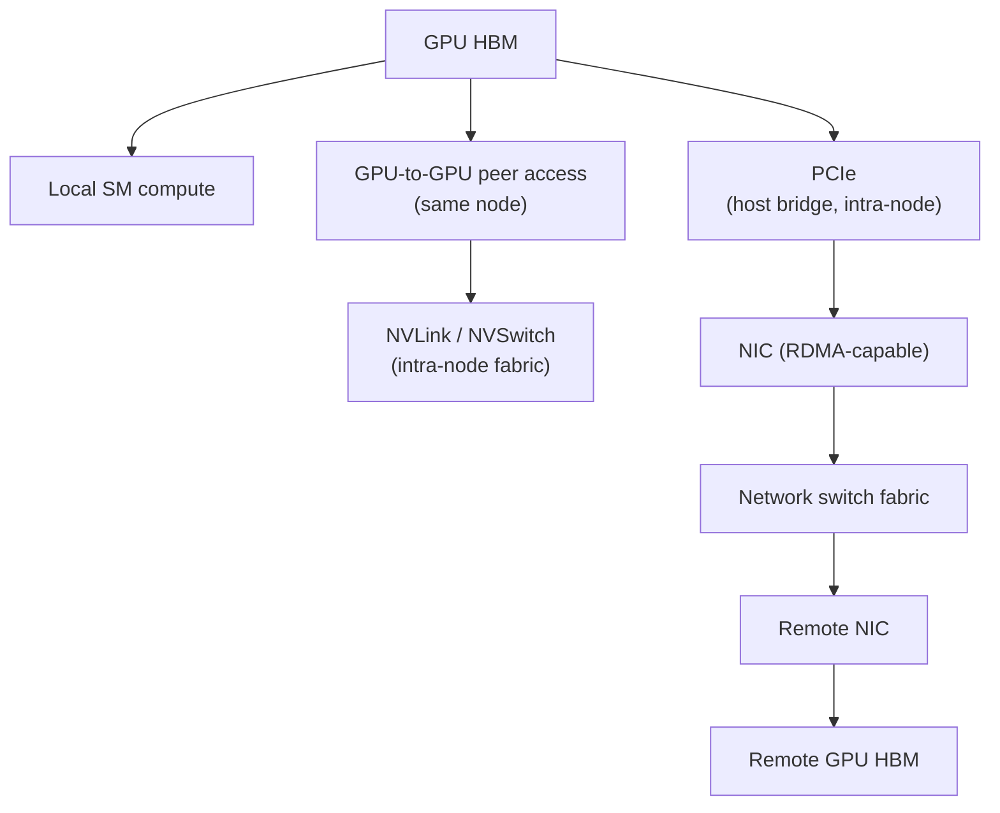

## Purpose

[[ml/serving-systems/parallelism|Parallelism in LLM Serving Systems]] introduces the four collective primitives (AllReduce, Broadcast, AllGather, ReduceScatter) and the headline bandwidth numbers that make tensor parallelism an intra-node decision and pipeline parallelism an inter-node one. This note goes one level deeper: the physical hierarchy those numbers come from, how a library like NCCL turns a logical collective into traffic on specific physical links, a full derivation of ring-AllReduce's bandwidth formula, and why different parallelism strategies stress the network in structurally different ways.

## The communication hierarchy

Every hop between two GPUs' data has a different bandwidth, latency, and failure domain:

Representative figures, gathered from the Hopper/Blackwell architecture pages and [[ml/serving-systems/parallelism|Parallelism]]'s lecture-sourced numbers (treat generation-to-generation deltas as directional, since exact figures depend on SKU and system configuration):

| Layer | Typical bandwidth | Typical latency character | Failure domain |
| --- | --- | --- | --- |
| HBM (local) | ~3-8 TB/s | Tens of ns | Single GPU |
| NVLink (4th gen, Hopper) | Up to 900 GB/s aggregate per GPU | Sub-microsecond | NVLink domain (node or NVL72 rack) |
| NVLink (5th gen, Blackwell) | Higher aggregate per GPU than Hopper (per the [Blackwell Tuning Guide](https://docs.nvidia.com/cuda/archive/12.8.1/blackwell-tuning-guide/index.html)) | Sub-microsecond | NVLink domain |
| PCIe Gen5 x16 | ~64 GB/s per direction | ~microseconds | Host/device pair |
| InfiniBand/RoCE NIC (RDMA) | ~25-50 GB/s per link (200-400 Gb/s class) | Low microseconds | Node-to-node link |
| Cross-node switch fabric | Aggregate scales with switch radix; bisection bandwidth is the binding constraint at scale | Microseconds plus hop count | Switch or link |

The two-orders-of-magnitude drop from NVLink to cross-node fabric, already used in [[ml/serving-systems/parallelism|Parallelism]] to justify keeping tensor parallelism inside a node, is the same gap the roofline-style reasoning in [[ml/serving-systems/performance-modeling|Performance Modeling]] applies one level up: bandwidth is hierarchical, and the collective communication pattern has to respect whichever level of the hierarchy it is forced to cross.

## CUDA peer access, GPUDirect RDMA, and pinned memory

Three mechanisms let data move without unnecessary staging copies:

- **CUDA peer access** (`cudaDeviceEnablePeerAccess`/`cudaDeviceCanAccessPeer`): lets one GPU directly read/write another GPU's memory over NVLink or PCIe without staging through host memory. The [Blackwell Tuning Guide](https://docs.nvidia.com/cuda/archive/12.8.1/blackwell-tuning-guide/index.html) notes NVLink-connected transfers route over NVLink transparently once peer access is enabled; the API call is still required to permit direct transfers at all.
- **GPUDirect RDMA**: lets a network adapter read/write GPU memory directly, skipping a bounce through host memory for cross-node transfers. This is what makes cross-node collective bandwidth approach the NIC's rated bandwidth rather than being capped by an extra PCIe hop through host DRAM.
- **Pinned (page-locked) host memory** (`cudaMallocHost`): required for `cudaMemcpyAsync` to actually overlap with compute and for the DMA engines behind PCIe/NVLink-C2C transfers to operate without OS-level page faults; pageable memory forces a synchronous staging copy through a pinned bounce buffer.

## How NCCL maps collectives to physical links

[NCCL](https://docs.nvidia.com/deeplearning/nccl/user-guide/docs/overview.html) implements each collective as a single CUDA kernel that does both communication and local reduction, rather than separate memcpy-plus-kernel steps, which is what lets it approach peak bandwidth instead of paying kernel-launch and synchronization overhead per step. Two aspects matter for reasoning about a training or serving job's network behavior:

1. **Topology detection**: NCCL probes the machine (NVLink connectivity, PCIe switch topology, NIC placement, InfiniBand/RoCE fabric) at initialization and builds an internal topology graph before choosing an algorithm. This is why NCCL performance is sensitive to process/GPU/NIC affinity: a rank pinned to the wrong CPU socket relative to its GPU and NIC can silently downgrade its effective bandwidth.
2. **Channels**: NCCL splits a collective's data across multiple parallel "channels," each potentially routed over a different physical link or ring, to use the aggregate bandwidth of multiple NVLinks or NICs simultaneously rather than serializing everything over one path. Tuning parameters like `NCCL_MIN_NCHANNELS`/`NCCL_MAX_NCHANNELS` and algorithm selection (`NCCL_ALGO`, ring vs. tree) directly affect how the topology graph's bandwidth is exploited.

NCCL supports AllReduce, Broadcast, Reduce, AllGather, ReduceScatter, AllToAll, Gather, and Scatter as named collectives, plus point-to-point send/recv, all layered on the same topology-aware channel infrastructure (NCCL overview docs).

## Ring, tree, and hierarchical AllReduce

[[ml/serving-systems/parallelism|Parallelism]] states that AllReduce decomposes into ReduceScatter followed by AllGather and that this decomposition is bandwidth-optimal; here is why, and what the alternatives trade off:

- **Ring AllReduce**: arrange $N$ devices in a logical ring; each device sends to its right neighbor and receives from its left, running $N-1$ ReduceScatter steps followed by $N-1$ AllGather steps. Every device sends and receives exactly $\frac{N-1}{N}$ of the total data twice (once per phase), which is the source of the bandwidth-optimality: no device ever needs to hold more than its fair share of traffic at once. This is the algorithm popularized for deep learning by the [Baidu ring-allreduce writeup](https://arxiv.org/abs/1802.05799), adapting an HPC technique to neural network gradient synchronization.
- **Tree AllReduce**: reduce up a tree to a root, then broadcast back down. Latency scales as $O(\log N)$ hops instead of ring's $O(N)$ steps, which wins for small messages or large device counts where per-step latency dominates over bandwidth; ring wins when message size is large enough that bandwidth, not per-step latency, dominates. NCCL selects between them based on message size and topology.
- **Hierarchical (topology-aware) AllReduce**: for multi-node systems, run ring or tree AllReduce within each node (over fast NVLink) first, then one cross-node AllReduce across a single representative per node (over the slow network), then broadcast the result back down within each node. This confines the expensive cross-node traffic to one exchange per node instead of one per GPU, directly exploiting the bandwidth hierarchy from the table above. NCCL's topology detection and channel selection implement a version of this automatically rather than requiring the application to hand-roll it.

## Worked bandwidth model: ring AllReduce

For $N$ devices each holding $S$ bytes of data to reduce, ring AllReduce's ReduceScatter phase does $N-1$ steps, each transferring $\frac{S}{N}$ bytes; the AllGather phase does another $N-1$ steps of the same size. Total data sent (and received) per device:

$$\text{Bytes per device} = 2(N-1)\frac{S}{N}$$

With per-link bandwidth $B$, and treating a device's send and receive links as independent (true for a ring, where each device talks to two distinct neighbors), the time is

$$T_{ring} = \frac{2(N-1)}{N} \cdot \frac{S}{B}$$

As $N \to \infty$, this approaches $\frac{2S}{B}$, independent of device count: ring AllReduce's bandwidth cost per device does not grow with cluster size, which is exactly the bandwidth-optimality claim. Worked example: $N = 8$ GPUs within an NVLink domain, $S = 500$ MB of gradients per device, $B = 400$ GB/s effective per-link bandwidth (a fraction of NVLink's raw aggregate, since ring uses one send and one receive link concurrently rather than all links at once):

$$T_{ring} = \frac{2 \times 7}{8} \times \frac{500 \times 10^6 \text{ bytes}}{400 \times 10^9 \text{ bytes/s}} \approx 1.75 \times 1.25\text{ ms} \approx 2.19\text{ ms}$$

Compare against a naive (non-ring) AllReduce where every device sends its full $S$ bytes to every other device: $O(N)$ times more traffic per device, which is why ring (or the algorithmically equivalent ReduceScatter+AllGather) is the default for large messages rather than a naive gather-and-broadcast.

## Hopper and Blackwell system case studies

- **Hopper (H100 SXM / DGX H100)**: 4th-generation NVLink connects 8 GPUs per node at up to 900 GB/s aggregate bidirectional bandwidth per GPU (Hopper architecture page); NVSwitch provides all-to-all connectivity within that 8-GPU domain so any pair of GPUs sees full NVLink bandwidth rather than being limited by a ring or mesh topology's diameter.
- **Blackwell (GB200 NVL72)**: 5th-generation NVLink extends the single-hop, full-bandwidth domain from 8 GPUs to 72 GPUs across an entire rack, per NVIDIA's [Blackwell architecture](https://www.nvidia.com/en-gb/data-center/technologies/blackwell-architecture/) materials; this changes the parallelism-to-topology mapping below, since a 72-GPU NVLink domain lets tensor parallelism scale to a rack rather than being capped at a single 8-GPU node's PCIe/NVLink boundary.
- **Consequence for collective placement**: as the NVLink domain grows (8 to 72 GPUs), more of what used to be cross-node, RDMA-fabric traffic becomes intra-domain NVLink traffic, and the hierarchical-AllReduce split described above moves outward: the "fast tier" now covers a whole rack rather than one node, and only inter-rack traffic pays the RDMA-fabric cost.

## Mapping parallelism strategies onto topology

Building on [[ml/serving-systems/parallelism|Parallelism]]'s strategy definitions:

| Strategy | Communication pattern | Topology fit |
| --- | --- | --- |
| Tensor parallelism | Frequent AllReduce per layer, large messages, latency-sensitive (blocks the critical path) | Confine to the fastest single-hop domain (NVLink/NVSwitch within a node or NVL72 rack) |
| Pipeline parallelism | Point-to-point activation handoff between adjacent stages, once per microbatch boundary | Tolerates the slower cross-node network, since traffic is small and only between neighboring stages |
| Data parallelism | Periodic AllReduce (or ReduceScatter+AllGather) of gradients, less frequent, more tolerant of latency | Runs across the full cluster, often hierarchical (in-node ring, then cross-node) |
| Expert (MoE) parallelism | All-to-All dispatch and combine per forwarded token, data-dependent routing | Stresses whichever fabric connects the expert-hosting GPUs, discussed below |

## Why MoE All-to-All and tensor-parallel AllReduce stress the network differently

Tensor-parallel AllReduce moves a fixed-size, statically known volume of activations every layer, over a fixed, statically known set of peer GPUs (the other members of the same tensor-parallel group), so its network demand is predictable and schedulable; the mapping above confines it to the fastest fabric precisely because it is both frequent and latency-sensitive.

MoE All-to-All (see [[ml/serving-systems/mixture-of-experts|Mixture of Experts]] for the routing mechanism) is data-dependent: which GPU sends how much to which other GPU depends on the token-to-expert routing decision made at runtime, so the traffic matrix is not fixed in advance and can be imbalanced if routing skews toward a subset of experts. All-to-All also touches every GPU hosting an expert rather than a fixed small group, so it is far more likely to cross the intra-node/inter-node boundary than a tensor-parallel AllReduce confined to one node's GPUs. The practical consequences: MoE deployments care more about load-balancing routing (to keep the All-to-All traffic matrix close to uniform) and about placing frequently-co-activated experts within the same fast-fabric domain, whereas tensor-parallel AllReduce optimization is mostly about keeping the tensor-parallel group small enough to fit inside the fastest available NVLink domain in the first place.

## Communication-computation overlap, congestion, and stragglers

Overlap: NCCL collectives run as CUDA kernels on a stream, so issuing a collective on a separate stream from the compute stream lets the two overlap if there is independent work to overlap with, e.g., pipeline parallelism overlapping one microbatch's communication with the next microbatch's compute, or ZeRO/FSDP overlapping parameter AllGather with the forward pass of the previous layer (see [[ml/serving-systems/parallelism|Parallelism]]'s ZeRO/FSDP section). Overlap only helps if the two streams' resource usage does not itself contend (e.g., an SM-heavy collective competing with compute for the same SMs).

Congestion: shared network links (a top-of-rack switch, a shared NIC) can serialize traffic from multiple concurrent jobs or multiple concurrent collectives, degrading achieved bandwidth below any single collective's isolated benchmark number; this is why production clusters isolate collective-heavy traffic onto dedicated fabrics or use adaptive routing where the fabric supports it.

Stragglers: a collective's completion time is bounded by its slowest participant, since every device must reach the same point in a ring or tree before the collective completes. One slow GPU (thermal throttling, a noisy neighbor process, a flaky NIC) stalls every other participant, which is why observability at the level of "which rank is late" matters more than aggregate cluster utilization for diagnosing serving or training slowdowns.

NCCL hangs: because collectives are collective, a bug that causes one rank to skip a collective call (a code path divergence, an unhandled exception on one rank, a deadlock elsewhere) manifests as every other rank hanging in the collective indefinitely, not as an error on the skipping rank. Debugging typically starts with per-rank stack traces or NCCL's own debug logging (`NCCL_DEBUG=INFO`) to identify which rank never reached the collective, since the hang symptom alone does not indicate which rank is at fault.

## Benchmark protocol: nccl-tests

[nccl-tests](https://github.com/NVIDIA/nccl-tests) is NVIDIA's standard tool for measuring NCCL collective performance and correctness; it is a protocol worth documenting here even without multi-GPU hardware to run it on. `all_reduce_perf` and its siblings (`all_gather_perf`, `reduce_scatter_perf`, `alltoall_perf`, `broadcast_perf`) share a common harness:

1. **Scan message sizes**: sweep from small (`-b`, minimum bytes) to large (`-e`, maximum bytes), typically doubling each step (`-f 2`), since small messages are latency-bound and large messages are bandwidth-bound, and a single size cannot characterize both regimes.
2. **Warm up before timing**: `-w`/`--warmup_iters` runs iterations that are not included in the reported timing, so the first-call NCCL initialization and topology setup cost does not pollute steady-state numbers.
3. **Report both algorithm bandwidth and bus bandwidth**: nccl-tests' "busbw" column normalizes algorithm bandwidth by the theoretical communication volume of the specific collective (e.g., the $\frac{2(N-1)}{N}$ factor derived above for ring AllReduce), so different collectives and device counts become comparable on the same scale rather than each needing its own reference point.
4. **Run at the intended scale**: single-node (`-g` GPUs per process) isolates NVLink/NVSwitch behavior; multi-node via MPI (`mpirun -np <ranks> -N <gpus per node>`) is required to measure the cross-node fabric's actual achieved bandwidth, which single-node runs cannot reveal.
5. **Check correctness alongside performance**: the `-c` flag validates collective results against a reference computation, catching silent data corruption (a real risk at scale from bit flips, faulty transceivers, or topology misdetection) that a pure timing run would miss.

This protocol, not a single quoted GB/s number, is what a serving or training team should reproduce on their own hardware before trusting any vendor-quoted or third-party interconnect bandwidth figure; no nccl-tests run was performed for this note, since no multi-GPU hardware was available in this environment.

## Related notes

- [[ml/serving-systems/parallelism|Parallelism in LLM Serving Systems]]
- [[ml/serving-systems/mixture-of-experts|Mixture of Experts]]
- [[ml/serving-systems/performance-modeling|Performance Modeling for LLM Serving Systems]]
- [[hardware/gpu-architecture|GPU Architecture from First Principles]]
- [[ml/serving-systems/gpu-basics|GPU Basics]]
