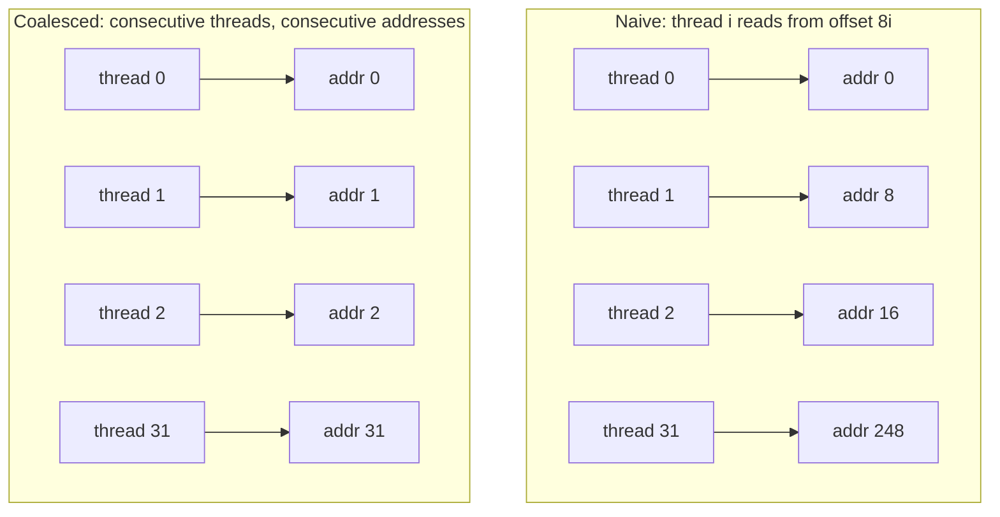

## Purpose

This note walks the first steps of hand-writing a CUDA kernel, using matrix transpose as the running example. It applies the architecture concepts from [[ml/serving-systems/gpu-basics|GPU Architecture and Programming]]. The full optimization sequence for this same kernel (shared memory tiling, bank conflict padding, measured timings) lives in [[ml/serving-systems/optimizing-gpu-kernels|Optimizing GPU Kernels]]; this note stops at the naive version and the coalescing idea.

## Baseline: transpose in PyTorch

`a.t()` only changes the tensor's stride metadata, so `.contiguous()` is what actually moves the data. Timing needs CUDA events because kernel launches are asynchronous.

```python
import torch

num_rows = num_cols = 8192
a = torch.randn(num_rows, num_cols)

res = a.t().contiguous()

start = torch.cuda.Event(enable_timing=True)
end = torch.cuda.Event(enable_timing=True)

start.record()

for i in range(100):
    res = a.t().contiguous()

end.record()
torch.cuda.synchronize()

elapsed_time = start.elapsed_time(end)
time_per_iter = elapsed_time / 100

print(f"Elapsed time: {elapsed_time} ms")
print(f"Time per iteration: {time_per_iter} ms")
```

## A first CUDA attempt

The natural partitioning is one block per row. A row of 8192 floats will not fit in the per-thread resources of a 1024-thread block if each thread handles one element, so each thread takes a contiguous slice of columns:

```cpp
#include <torch/extension.h>
#include <stdio.h>

__global__ void transpose(float* input, float* output, int num_rows, int num_cols) {
    int row = blockIdx.x;
    int col_start = threadIdx.x * (num_cols / blockDim.x);
    int col_end = col_start + (num_cols / blockDim.x);

    for (int col = col_start; col < col_end; ++col) {
        if (col < num_cols) {
            output[col * num_rows + row] = input[row * num_cols + col];
        }
    }
}
```

This version is slow. Adjacent threads read addresses that are `num_cols / blockDim.x` elements apart, and write addresses that are entire columns apart, so neither the loads nor the stores coalesce.

## Coalesced memory access

Inside one warp, if the 32 threads access contiguous addresses, the hardware batches the accesses into one or a few memory transactions. That batching is what makes global memory bandwidth usable.

In the naive kernel above, each thread owns a slice of $8192 / 1024 = 8$ columns, so on any given loop iteration the warp's 32 loads land 8 elements apart and every load becomes its own transaction. Assigning consecutive elements to consecutive threads lets the hardware fold the same 32 loads into a few transactions:



> [!tip] Spotting uncoalesced access
> Check what one warp does in a single instruction, not what one thread does over its whole loop. Each thread here reads contiguous columns over time, and the access pattern is still terrible, because at any instant the warp's addresses are strided. If adjacent threads' addresses differ by more than one element, the loads split into separate transactions.

Getting both the reads and the writes of a transpose to coalesce requires staging tiles in shared memory, which is where [[ml/serving-systems/optimizing-gpu-kernels|Optimizing GPU Kernels]] picks up.

## Related notes

- [[ml/serving-systems/optimizing-gpu-kernels|Optimizing GPU Kernels]]
- [[ml/serving-systems/gpu-basics|GPU Architecture and Programming]]
