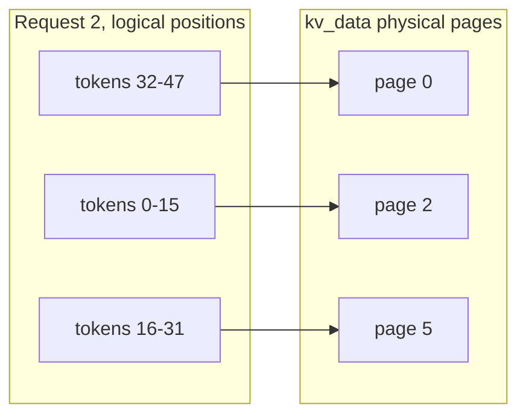

## Purpose

This note covers how serving systems size, allocate, share, and evict the KV cache, plus the FlashAttention algorithm that keeps attention itself from blowing up memory. KV-cache allocation directly constrains [[ml/serving-systems/batching|batching]], and [[ml/serving-systems/inf-llm|InfLLM]] explores an external-memory approach for extremely long contexts.

These are notes for CSE 599K "LLM Serving Systems" at the University of Washington, Spring 2025, taught by Prof. Baris Kasikci with TA Kan Zhu. The prefix-sharing speedup range quoted below comes from lecture slides without a full benchmark setup, so I mark it as unverified.

## KV cache sizing

Per token, the KV cache stores one key vector and one value vector per layer per KV head:

$$\text{KV bytes per token} = \underbrace{2}_{K \text{ and } V} \times \text{num\_kv\_heads} \times \text{head\_dim} \times \text{num\_layers} \times \text{dtype bytes}$$

Worked example from lecture, Llama3-8B on an 80 GB H100 in FP16. Weights take $2 \times 8 = 16$ GB, and serving-time activations are negligible next to that. Take requests with 1024 input tokens and 1024 output tokens. A request's decode allocation grows from 0 to 1024 tokens, so on average it holds $1024 + \frac{1024}{2} = 1536$ token slots. With 8 KV heads, head dim 128, 32 layers, FP16:

$$1536 \times 2 \times 2 \times 8 \times 128 \times 32 \text{ bytes} = 192 \text{ MB per request (average)}$$

Maximum average batch size is then $(80 - 16) / 0.1875 \approx 341$ requests. Compare this against the batch size of 333 needed to reach the compute-bound regime on the H100 (see [[ml/serving-systems/performance-modeling|Performance Modeling]]): the KV cache budget barely covers the batch the compute wants. Per token the cache costs $2 \times 2 \times 8 \times 128 \times 32 = 128$ KB, so the 64 GB budget holds about 512K tokens.

## A unified memory budget

The H100 example above collapses to two terms (weights, KV cache) because serving-time activations are small, but the general accounting has four terms:

$$\text{GPU memory} = \text{Weights} + \text{Activations} + \text{KV cache} + \text{Framework overhead}$$

Weights are fixed once a model and dtype are chosen: $2P$ bytes in FP16/BF16 for $P$ parameters, half that in INT8, a quarter in INT4. Activations during serving are transient (one forward pass's worth of intermediate tensors) and small relative to weights and KV cache, unlike training where activations dominate (see [[ml/serving-systems/parallelism|Parallelism]] for the training-side accounting, where checkpointing and tensor+sequence parallelism exist specifically because training activations are not negligible). Framework overhead covers the CUDA context, cuDNN/cuBLAS workspace, and NCCL communication buffers; it is roughly constant per process, on the order of 1-2 GB, and easy to forget when sizing a deployment against a GPU's advertised capacity.

For the Llama3-8B/H100 example, the budget is 80 GB total, 16 GB weights, about 1-2 GB framework overhead, and the remainder, roughly 62-63 GB, available for KV cache. Every extra GB spent on framework overhead or on wider activation buffers (larger max sequence length staged for prefill, for example) comes directly out of the batch size the KV cache can support. This is the same tradeoff [[ml/serving-systems/parallelism|tensor and pipeline parallelism]] make explicit for training: fixed costs replicate per device, so the marginal budget for the thing that should scale (KV cache here, activations there) shrinks as fixed costs grow.

## MHA, MQA, and GQA: KV-cache comparison

The KV-cache formula above has a $\text{num\_kv\_heads}$ term that is independent of the number of query heads. Multi-head attention (MHA) sets $\text{num\_kv\_heads} = \text{num\_query\_heads}$, so every query head reads its own K/V projection. Multi-query attention (MQA) sets $\text{num\_kv\_heads} = 1$: every query head shares one K/V head, shrinking the cache by the head count but costing model quality. [Grouped-query attention (GQA)](https://arxiv.org/abs/2305.13245) interpolates: query heads are split into $G$ groups, each group sharing one K/V head, so $\text{num\_kv\_heads} = G$. MHA is $G = \text{num\_query\_heads}$, MQA is $G = 1$.

GQA is not a from-scratch architecture choice; the paper's practical recipe is to uptrain an existing MHA checkpoint into GQA using about 5% of the original pretraining compute, mean-pooling each group's original K/V heads to initialize the shared head, which is why GQA shows up retrofitted onto model families (Llama 2 70B, Llama 3, Mistral) rather than only in models designed around it from the start.

Holding head_dim = 128, 32 layers, FP16, and 32 query heads fixed, the per-token KV-cache cost scales linearly with $\text{num\_kv\_heads}$:

| Attention | num_kv_heads | Bytes/token | Relative to MHA |
| --------- | ------------ | ----------- | ---------------- |
| MHA       | 32           | 512 KB      | 1x                |
| GQA-8     | 8            | 128 KB      | 0.25x             |
| GQA-4     | 4            | 64 KB       | 0.125x            |
| MQA       | 1            | 16 KB       | 0.03x             |

Llama3-8B's actual configuration (32 query heads, 8 KV heads) is GQA-8: a 4x reduction in KV-cache bytes and KV-cache bandwidth relative to full MHA at the same query-head count, which is most of why the 192 MB/request figure above is affordable at all. Multiplying out the 4x factor against the earlier batch-size arithmetic, an MHA version of the same model would only fit $(80-16)/0.75 \approx 85$ average-size requests instead of 341.

## The allocation problem

Output lengths vary and are unknown at admission. A request that stops at 1024 output tokens needs 192 MB on average; one that runs to 4096 needs 384 MB. The allocator has to reserve space without knowing which case it is holding.

### Method 1: allocate for the maximum

Reserve the model's maximum sequence length per request. Utilization craters from internal fragmentation, and the max batch size drops to $(80-16)/0.375 \approx 170$ even though most requests never touch the reserved space.

### Method 2: grow like std::vector

Start small and double the allocation when it fills. Average utilization within a request sits around 75% (the classic doubling-array bound), external fragmentation appears between requests, and growth requires copies. Workable, and better than max-length reservation, but the fragmentation still costs real batch slots.

### Method 3: PagedAttention

[PagedAttention](https://arxiv.org/abs/2309.06180) (the vLLM paper) applies virtual memory's trick: chunk KV storage into small fixed pages and map logical token positions to physical pages through an indirection table. A page holding 16 tokens' KV for one layer costs $16 \times 2 \times 2 \times 8 \times 128 = 64$ KB, big enough that reading a page uses memory bandwidth efficiently, small enough that internal fragmentation is capped at one partial page per request. Pages need not be contiguous, so external fragmentation disappears.

The page table is a flat multi-level structure:

```text
kv_indptr:  [0, 2, 3, 6, 10]                   # NumReq + 1 elements
kv_indices: [1, 4, 8, 2, 5, 0, 6, 10, 15, 17]  # NumPage elements
kv_data:    [actual KV cache data...]          # MaxPage elements
```

Request $i$ owns pages `kv_indices[kv_indptr[i]:kv_indptr[i+1]]`, and `kv_data[page_id]` holds the actual KV entries. The attention kernel walks this table during decode.

> [!example] Walking the table
> Request 2 owns `kv_indices[kv_indptr[2]:kv_indptr[3]] = kv_indices[3:6]`, which names physical pages 2, 5, and 0. With 16-token pages, its tokens 0-15 sit in `kv_data[2]`, tokens 16-31 in `kv_data[5]`, and tokens 32-47 in `kv_data[0]`. Logical order and physical placement are fully decoupled:



## Prefix sharing

Requests frequently share a prefix: the same system prompt across users, or the accumulated history in a multi-round conversation.

```text
1. "You are a helpful assistant. User: Hello, Assistant: Hi!"
2. "You are a helpful assistant. User: Hello, Assistant: Hi!, User: Solve this problem..."
3. "You are a helpful assistant. User: What can you do?"
```

Storing the shared prefix once turns $n$ copies of a length-$p$ prefix into one: prefill compute, KV cache space, and decode-time memory reads for the prefix all drop from $n \times p$ to $p$. Prefix matching can run asynchronously in the background. The cost is that cached prefix chunks occupy memory even when no live request reuses them, so the cache needs an eviction policy. Gains scale with prefix length, batch size, and how short the unique suffixes are; the lecture quotes 2-32x speedups across configurations, without the underlying benchmark setup, so treat the range as indicative.

## Eviction: recompute or offload?

When GPU memory cannot hold the whole prefix tree, evicted entries can later be rebuilt two ways: recompute them from the tokens, or reload them from CPU memory over PCIe.

Recomputing $p$ tokens through a model with $P_{model}$ parameters costs

$$T_{recompute} = \frac{2pP_{model}}{Compute}$$

Loading the same KV entries over PCIe costs

$$T_{load} = \frac{2 \times \text{dtype} \times \frac{D_{model}}{GQA} \times L \times p}{PCIe_{BW}}$$

where $\frac{D_{model}}{GQA}$ is the KV width after grouped-query sharing and $L$ is the layer count. The ratio is

$$\frac{T_{recompute}}{T_{load}} = \frac{PCIe_{BW} \times P_{model}}{\text{dtype} \times \frac{D_{model}}{GQA} \times L \times Compute}$$

Plugging in an 8B model on an A100 (30 GB/s PCIe, 300 TFLOPs, FP16, KV width 1024, 32 layers):

$$\frac{30 \times 10^9 \times 8 \times 10^9}{2 \times 1024 \times 32 \times 300 \times 10^{12}} \approx 12$$

Loading from CPU memory beats recomputation by roughly 12x for this configuration, which is why serving systems offload rather than drop evicted KV entries.

## FlashAttention

Standard attention materializes the $\text{seqlen} \times \text{seqlen}$ score matrix in global memory, so memory grows quadratically with sequence length and the kernel spends its time moving that matrix around. [FlashAttention](https://arxiv.org/abs/2205.14135) computes exact attention without ever materializing it.

The obstacle is softmax, which normalizes over a full row. The numerically stable form subtracts the row max before exponentiating:

$$sm(x_i) = \frac{e^{x_i - c}}{\sum_{j=1}^d e^{x_j - c}}, \quad c = \max_i x_i$$

Subtracting $c$ prevents overflow and leaves the result unchanged, since the factor $e^{-c}$ cancels between numerator and denominator. FlashAttention exploits the fact that the row max and the normalizing sum can be maintained incrementally. The algorithm tiles Q, K, V into blocks that fit in shared memory, computes attention block pair by block pair, keeps running max and sum statistics in registers, and rescales previously accumulated output whenever a new block raises the running max. Global memory only ever sees the inputs and the final output.

Causal masking drops in cleanly: masked positions get $-\infty$ before the softmax, contribute $e^{-\infty} = 0$ to the running sum, and blocks that are entirely masked are skipped. Grouped-query attention also fits naturally, since multiple query heads sharing one KV head means the kernel processes several query blocks against the same KV block, cutting KV cache size and KV reads by the group factor.

## FlashAttention-2

The original FlashAttention kernel reached only 25-40% of an A100's theoretical FLOPs/s, and the shortfall was not algorithmic, it was work partitioning: too many non-matmul FLOPs, uneven thread-block occupancy, and shared-memory traffic between warps that a matmul kernel would not pay. [FlashAttention-2](https://arxiv.org/abs/2307.08691) fixes all three without changing the memory complexity story above:

- Fewer non-matmul FLOPs, by rescaling output accumulation only once per block instead of at every step, and by deferring the final division by the softmax denominator to the very end.
- Parallelize across thread blocks over the sequence dimension in addition to batch and head, so a single long sequence still saturates the GPU even at small batch size, which matters for the long-decode workloads this note is otherwise concerned with.
- Split the work differently within a thread block: FlashAttention-1 split K/V across warps, forcing each warp to communicate partial results through shared memory; FlashAttention-2 splits Q across warps instead and keeps K/V visible to all of them, so each warp finishes its output slice with no inter-warp communication.

The result is roughly a 2x speedup over FlashAttention-1, reaching 50-73% of theoretical peak on A100, and end-to-end GPT-style training throughput of up to 225 TFLOPs/s (72% model FLOPs utilization). None of this changes the KV-cache sizing or PagedAttention story above; FlashAttention-2 is an attention-kernel improvement that composes with paged, GQA-shaped KV caches rather than replacing them.

## Long-context optimization

Long-context serving stresses every mechanism above simultaneously: KV cache from the sizing formula grows linearly with sequence length, so a 128K-context request costs 128x the per-token bytes of a 1K-context one, and that cost lands even before considering batch size. A few strategies, layered on top of GQA and PagedAttention rather than replacing them:

- **Shrink the per-token cost.** GQA/MQA (above) cut the linear coefficient directly. Quantizing the KV cache itself (INT8 or FP8 keys/values, distinct from weight quantization in [[ml/serving-systems/quantization|Quantization]]) buys another 2-4x at the cost of some attention-score precision.
- **Share more of the linear cost.** Prefix sharing (above) turns the shared portion of the linear cost into a one-time cost when many requests share a long common prefix, such as a large retrieved-document context reused across queries. [SGLang](https://arxiv.org/abs/2312.07104) generalizes this into RadixAttention, a radix tree over token sequences that automatically finds and reuses shared KV prefixes across arbitrary requests, not just ones an application explicitly marks as sharing a system prompt.
- **Move some of the cache off the compute-bandwidth path.** [[ml/serving-systems/inf-llm|InfLLM]] treats distant context as external memory, retrieving only the KV blocks relevant to the current query instead of keeping the full history resident and attention-bandwidth-bound.
- **Bound the budget explicitly.** Since KV cache scales linearly with sequence length but GPU memory does not, systems either cap the maximum context length admitted, evict/offload old entries (the recompute-vs-load tradeoff above), or accept a throughput cliff past some context length where the batch size the KV budget can support drops below what keeps the GPU compute-bound.

These compose: a production long-context server typically runs GQA weights, paged KV allocation, prefix/radix sharing across requests, and an eviction or offload policy for whatever does not fit, all at once, rather than picking one.

## Related notes

- [[ml/serving-systems/batching|Batching]]
- [[ml/serving-systems/performance-modeling|Performance Modeling]]
- [[ml/serving-systems/inf-llm|InfLLM]]
- [[ml/serving-systems/transformers|Transformer Architecture]]
- [[systems/research/sparsity-notes|Faster Causal Self Attention]]
- [[ml/serving-systems/peft-and-preference-optimization|PEFT and Preference Optimization]]
