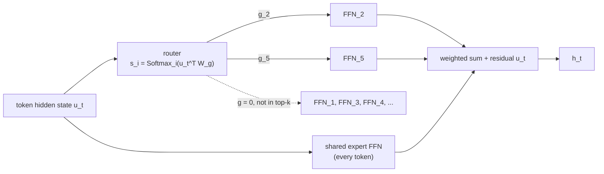
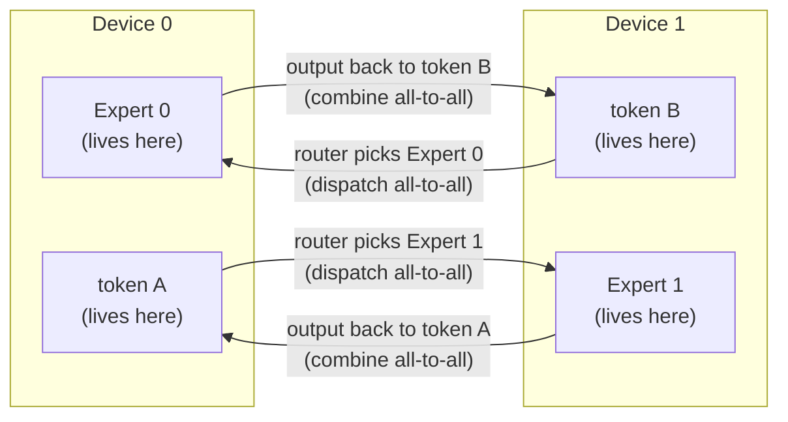

## Purpose

This note explains the MoE architecture, why it scales well, and what it costs at the systems level. Expert routing spreads parameters and computation across devices, so MoE serving builds on [[ml/serving-systems/parallelism|parallel execution]] and the cost model in [[ml/serving-systems/performance-modeling|Performance Modeling]].

These are notes for CSE 599K "LLM Serving Systems" at the University of Washington, Spring 2025, taught by Prof. Baris Kasikci with TA Kan Zhu. Speedup numbers are quoted from the cited papers or from lecture slides; I have not reproduced any of them.

## Core idea

A MoE layer replaces one large feedforward network with many smaller expert FFNs plus a router that picks a few experts per token. Since each token only activates $k$ of $N$ experts, you can grow $N$ (total parameters) without growing per-token FLOPs. Parameters scale; compute stays flat. That decoupling is the whole appeal.

The pattern shows up in Mixtral, Grok, the DeepSeek series, Qwen-MoE, and the open OLMoE, and GPT-4 is widely rumored to use it (unconfirmed).

## Why the architecture wins

Three lines of evidence from the papers:

- Same FLOPs, more parameters, better quality. [Switch Transformers](https://arxiv.org/abs/2101.03961) showed pre-training speedups up to 7x over dense baselines at fixed compute by scaling expert count.
- Cheaper training for target accuracy. [DeepSpeed-MoE](https://arxiv.org/abs/2201.05596) reports around 5x lower training cost to match a dense model's quality.
- Competitive at deployment scale. [Mixtral 8x7B](https://arxiv.org/abs/2401.04088) matches or beats Llama 2 70B across benchmarks while activating about 13B parameters per token, roughly 5x fewer. [DeepSeek-V3](https://arxiv.org/abs/2412.19437) pushes the pattern to 671B total parameters with 37B active.

## Routing

The standard mechanism is top-k token choice routing. For token $t$ at layer $l$:

$$h_t^l = \sum_{i=1}^{N} g_{i,t} \cdot \text{FFN}_i^{(l)}(u_t) + u_t$$

where $u_t$ is the token's hidden state, $g_{i,t}$ is the gating weight for expert $i$ (zero for unselected experts), and the routing scores come from a learned projection, $s_{i,t} = \text{Softmax}_i(u_t^T W_g)$. The alternative is expert choice routing, where each expert selects the tokens it will process, which guarantees balanced expert load at the price of tokens receiving varying amounts of compute.

A top-2 layer with one shared expert, for a token routed to experts 2 and 5:



Configurations in deployed models:

| Model       | Routed experts | Active routed | Shared experts |
| ----------- | -------------- | ------------- | -------------- |
| Mixtral     | 8              | 2             | 0              |
| DBRX        | 16             | 4             | 0              |
| DeepSeek v1 | 64             | 6             | 2              |
| DeepSeek v3 | 256            | 8             | 1              |
| Qwen 1.5    | 60             | 4             | 4              |

Shared experts run for every token; routed experts are conditionally activated. Most models put MoE in the MLP layers only. MoE attention exists (JetMoE) but is rare.

## Training difficulties

Top-k selection is a discrete decision, so only the selected experts receive gradients and the routing decision itself is not differentiable. Workarounds include REINFORCE-style estimators, stochastic perturbations of the router logits, and, most commonly in practice, auxiliary balancing losses layered on top of the standard gradient path.

Balancing matters for a second reason beyond gradients: systems efficiency. If routing concentrates on a few experts, the devices hosting them bottleneck the whole step. The lecture notes that unbalanced training runs degenerate to a handful of hot experts.

> [!warning] Router collapse is self-reinforcing
> An expert that receives more tokens gets more gradient updates, improves faster, and wins more routing decisions. A small early imbalance can amplify until a few experts absorb nearly all traffic and the rest stay untrained. The balancing losses below exist to break this feedback loop before it locks in.

The [Switch Transformer](https://arxiv.org/abs/2101.03961) auxiliary loss is the canonical fix:

$$\mathcal{L}_{\text{aux}} = \alpha \cdot N \cdot \sum_{i=1}^{N} f_i \cdot P_i$$

where over a batch $B$ of $T$ tokens, $f_i = \frac{1}{T}\sum_{x \in B} \mathbf{1}\{\text{argmax } p(x) = i\}$ is the fraction of tokens dispatched to expert $i$ and $P_i = \frac{1}{T}\sum_{x \in B} p_i(x)$ is the router probability mass it receives. The gradient with respect to $P_i$ is proportional to $f_i$, so experts that receive more tokens get their routing probability pushed down harder.

The DeepSeek line iterated on this. [DeepSeek v1 and v2](https://arxiv.org/abs/2401.06066) add per-device balancing (aggregate the same objective by device) and, in [v2](https://arxiv.org/abs/2405.04434), a communication balancing loss of the form $\mathcal{L}_{\text{CommBal}} = \alpha_3 \sum_{i=1}^{D} f_i^{in} P_i^{out}$ that balances inbound and outbound traffic per device. [DeepSeek v3](https://arxiv.org/abs/2412.19437) drops auxiliary losses entirely and instead maintains a per-expert bias $b_i$, updated online: a token routes to expert $i$ when $s_{i,t} + b_i$ makes the top-k, but the gating weight uses the unbiased $s_{i,t}$. V3 also switches the score function to a sigmoid.

## The DeepSeek lineage

The architecture evolution is a useful compressed history of MoE design:

- v1 (16B total, 2.8B active): 64 fine-grained routed experts plus 2 shared, 6 active, standard top-k with expert and device balancing losses.
- v2 (236B total, 21B active): 160 routed plus 2 shared, adds top-M device routing (each token touches at most M devices) and the communication balancing loss.
- v3 (671B total, 37B active): 256 routed plus 1 shared, 8 active, sigmoid scoring, aux-loss-free bias balancing, top-M device routing retained.

The fine-grained pattern (many small experts plus always-on shared experts) comes from the observation that smaller experts specialize better and the shared expert absorbs common knowledge that would otherwise be duplicated across every routed expert.

## Upcycling

Training a MoE from scratch is expensive, so several models initialize from a dense checkpoint: copy the dense FFN weights into every expert, attach a fresh router, and continue training. Qwen1.5-MoE did this from the Qwen-1.8B dense model (60 routed experts with 4 shared, 4 active) and reached quality competitive with much larger dense models at a fraction of the training cost, per the [Qwen MoE report](https://qwenlm.github.io/blog/qwen-moe/).

## Systems: expert parallelism and all-to-all

Expert parallelism partitions experts across devices. Every MoE layer then needs two all-to-all collectives per pass: a dispatch that routes each token's activations to the devices holding its selected experts, and a combine that gathers the expert outputs back to the token's original position.

```text
GPU0: [A0, A1, A2, A3]  ->  GPU0: [A0, B0, C0, D0]
GPU1: [B0, B1, B2, B3]  ->  GPU1: [A1, B1, C1, D1]
GPU2: [C0, C1, C2, C3]  ->  GPU2: [A2, B2, C2, D2]
GPU3: [D0, D1, D2, D3]  ->  GPU3: [A3, B3, C3, D3]
```

All-to-all is synchronous, blocking, and moves a lot of data, so it dominates MoE communication cost. The lecture quotes it at an average of 34.1% of step time, with median 2x and worst-case around 4x slowdown when it contends with other communication. Lina (USENIX ATC 2023) attacks exactly this contention: partition AllReduce tensors into micro-operations, schedule all-to-all at higher priority so it never shares bandwidth, and pipeline expert computation against communication. It reports up to 2.4x speedup in MoE layer execution.

## Serving MoE models

The parameter count that was free at training FLOPs is very much not free at deployment. Mixtral 8x7B needs roughly 3.5 GB for attention layers and about 90 GB for experts in FP16, which exceeds a single GPU.

Options, roughly in order of sophistication:

1. Weight offloading (FlexGen, Mixtral-Offloading, DeepSpeed Zero-Offload lineages): keep cold experts in CPU memory and copy them to the GPU on demand. The problem is that copying an expert's weights takes over 50 ms while executing it takes around 2 ms, so the PCIe copy dominates.
2. CPU compute ([Fiddler](https://arxiv.org/abs/2402.07033)): instead of moving weights to the compute, move the activations to the weights. Activations are tiny (under 0.1 ms to copy), so experts resident in CPU memory get computed on the CPU. Fiddler profiles expert popularity, places hot experts on GPU, and per token solves a placement problem, minimizing the max of CPU-side and GPU-side latency. It reports 8.2-10.1x over Mixtral-Offloading and 19.4-22.5x over DeepSpeed-MII.
3. Popularity-aware placement: expert popularity at inference time differs from uniform (balancing losses shape training-time load, and real traffic is skewed), so collecting expert selection paths after load balancing converges and allocating resources to predicted-hot experts approaches the performance of oracle placement.

At the large scale end, [DeepSeek-V3's deployment](https://arxiv.org/abs/2412.19437) separates prefill from decode. Prefill runs 32-way expert parallelism (8 experts per GPU) with redundant copies of hot experts and routing constrained to limit InfiniBand traffic. Decode spreads to 320 GPUs across 40 nodes: attention runs TP4 with sequence parallelism and DP80, experts run EP320 so each GPU holds a single expert, 64 GPUs carry redundant and shared experts, and attention micro-batches overlap with expert micro-batches to hide communication.

## Batching expert computation

Within one device, running each expert's tokens as a separate GEMM wastes the batching benefit. The GroupGemm pattern restores it: route, then permute tokens so each expert's tokens are contiguous, run all experts in one grouped GEMM kernel, un-permute, and mix outputs with the gating weights. The permutation indices come from a prefix sum over the expert-selection mask (binary mask, cumsum over the flattened transpose, reshape), which parallelizes cleanly on GPU.

## Lineage: from sparsely-gated MoE to dropless routing

The systems ideas in this note did not start with DeepSeek. [Shazeer et al. (2017)](https://arxiv.org/abs/1701.06538) introduced the sparsely-gated MoE layer itself: up to thousands of expert FFNs between stacked LSTM layers, with a trainable gate selecting a sparse combination per example, reporting over 1000x model capacity increase with only minor efficiency losses. The system problem it already had to solve is the one this note keeps returning to: routing decisions are data-dependent, so the amount of work sent to each device varies at runtime.

[GShard](https://arxiv.org/abs/2006.16668) (Lepikhin et al. 2020) turned that into a distributed systems problem: a set of lightweight sharding annotations plus an XLA compiler extension that automatically inserts the cross-device communication for a Sparsely-Gated MoE Transformer, scaling multilingual machine translation past 600 billion parameters across 2048 TPU v3 cores in 4 days. GShard is also where capacity factor and hard token dropping enter the design (below), because a compiler-generated program needs statically-shaped tensors, and expert token counts are only known at runtime.

Switch Transformers ([already cited](https://arxiv.org/abs/2101.03961) above) simplified the routing to top-1 and popularized the auxiliary balancing loss described earlier in this note. [MegaBlocks](https://arxiv.org/abs/2211.15841) (Gale et al. 2022) attacks the capacity-factor/token-dropping tradeoff from the kernel side instead of the algorithm side: it reformulates MoE computation as block-sparse matrix operations with custom GPU kernels, so that variable per-expert token counts map onto hardware without padding to a fixed capacity or dropping the overflow. The paper reports end-to-end training speedups up to 40% over Tutel and 2.4x over dense Megatron-LM training at matched quality. This is the "dropless routing" alternative referenced below.

## Capacity factor and token dropping

A compiler or a fixed-shape kernel needs to allocate a fixed-size buffer per expert before it knows how many tokens will route there. Given $T$ tokens, $N$ experts, and top-$k$ routing, the expected tokens per expert is $\frac{kT}{N}$; the **capacity factor** $c$ scales that into an actual buffer size, $\text{capacity} = c \cdot \frac{kT}{N}$. GShard-style systems set $c > 1$ (commonly 1.25-2) to absorb the imbalance that a router produces even with a balancing loss pushing toward uniformity. Tokens that route to an expert already at capacity are **dropped**: their contribution from that expert is zero (only the residual/shared-expert path, if any, carries them forward), which both wastes the token's gradient signal for that expert and worsens quality on the dropped tokens specifically. Raising $c$ reduces drop rate but increases wasted compute and memory, since every expert allocates its full capacity buffer whether or not tokens fill it. **Dropless routing** (MegaBlocks) sidesteps the tradeoff entirely by using block-sparse kernels that size per-expert work exactly to the tokens actually routed, at the cost of losing the fixed-shape assumption that made the compiler-driven GShard approach simple to generate code for.

## Token-to-expert routing and all-to-all path

Expert parallelism spreads $N$ experts across $P$ devices. A token's activation is computed wherever the token lives, then must physically move to the device holding its selected expert, and the output must move back. That round trip is the two all-to-all collectives already introduced above (dispatch, combine); the diagram below makes the routing decision that drives them explicit for two tokens on two devices, top-1 routing:



Every token whose chosen expert is off-device pays this cross-device hop twice per MoE layer, which is why all-to-all volume (not FLOPs) is usually what caps MoE training throughput at scale, matching the 34.1% step-time figure cited above.

## Expert, tensor, and data parallelism for MoE: cost comparison

The three axes shard different things and pay different communication bills for an MoE layer with $N$ experts, model dimension $d$, and $T$ tokens per device per step:

| Strategy | What it shards | Communication per MoE layer | Scales with |
| --- | --- | --- | --- |
| Expert parallelism | experts across devices | 2 all-to-alls of routed-token activations, size $\approx kTd$ bytes total | number of devices $P$ (more hops, same total payload) |
| Tensor parallelism | each expert's weight matrices | AllReduce per expert-local GEMM, same $8bsh$-style cost as dense TP (see [[ml/serving-systems/parallelism|Parallelism]]) | tensor-parallel width $t$, independent of $N$ |
| Data parallelism | full model (incl. all experts) replicated | AllReduce of gradients for every parameter, incl. every expert's weights, every step | total parameter count, which is $N\times$ larger with more experts |

Expert parallelism is the only one of the three whose communication volume scales with *token count* rather than *parameter count*, which is exactly the property that makes MoE's parameter/compute decoupling pay off systems-wise: growing $N$ (more experts) grows data-parallel and tensor-parallel communication (more weights to sync or shard) but leaves expert-parallel communication roughly flat (same tokens, just spread over more, smaller experts). In practice, as the DeepSeek-V3 deployment example above shows, production systems compose all three: TP within a node for attention and each expert's own GEMMs, EP to place experts, and DP to replicate everything else.

## Why training-time balance does not guarantee serving-time balance

The balancing losses in this note optimize the *training* distribution over a batch, which mixes many prompts and topics; they say nothing about the distribution any single production request or topic-cluster of traffic will produce. This is inference, not a specific published measurement: a router trained to balance load in aggregate can still send an overwhelming share of a topically narrow request stream (all customer-support tickets about billing, say) to whichever few experts specialized on that content during training, because those experts genuinely are the best fit for that traffic even though the aggregate training batch stayed balanced. Serving-time popularity being skewed and non-uniform is exactly the premise Fiddler's placement problem and the "popularity-aware placement" approach both start from, described above; DeepSeek-V3's own deployment addresses it directly by replicating hot experts redundantly at inference rather than relying on the training-time balance to hold.

## Comparing deployed MoE designs

| Design | Routing | Balancing mechanism | Capacity handling | Notable systems trick |
| --- | --- | --- | --- | --- |
| Switch Transformer | top-1 | auxiliary load-balancing loss | fixed capacity factor, drops overflow | simplifies top-k to top-1 for speed |
| MegaBlocks | top-k, framework-agnostic | inherited from base model | dropless (block-sparse kernels) | reformulates MoE as block-sparse GEMM |
| Mixtral | top-2, no shared experts | implicit (no aux loss reported) | standard capacity-factor framework | fewer, larger experts (8 total) |
| DeepSeek v3 | top-8 of 256, sigmoid scoring | aux-loss-free per-expert bias | fine-grained experts, top-M device routing | hot-expert replication at serving, prefill/decode disaggregated EP width |

## Related notes

- [[ml/serving-systems/parallelism|Parallelism]]
- [[ml/serving-systems/performance-modeling|Performance Modeling]]
- [[ml/serving-systems/batching|Batching]]
- [[ml/serving-systems/distributed-training|Distributed Training of Large Language Models]]
