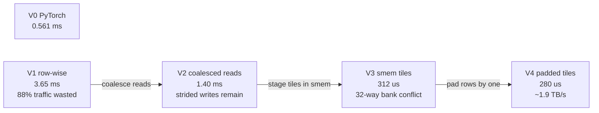

## Purpose

This note works through the standard GPU kernel optimizations using three case studies: matrix transpose, parallel reduction, and GEMM. Start with [[ml/serving-systems/gpu-basics|GPU Architecture and Programming]] for the hardware model, then use [[ml/serving-systems/performance-modeling|Performance Modeling]] or the compact [[ml/serving-systems/roofline-reference|Roofline reference]] to identify which resource limits a given kernel.

These are notes for CSE 599K "LLM Serving Systems" at the University of Washington, Spring 2025, taught by Prof. Baris Kasikci with TA Kan Zhu. The transpose timings below come from the course demo (an 8192x8192 FP32 transpose); the slides do not record the exact GPU or driver, so treat absolute numbers as indicative and the relative improvements as the real lesson.

## The memory hierarchy sets the rules

Kernel optimization is mostly about which memory you touch and in what pattern. The hierarchy (H100-class numbers, per lecture):

- Global memory: 80 GB at ~3 TB/s
- L2 cache: 50 MB at ~10 TB/s
- Shared memory / L1: 228 KB per SM at ~20 TB/s
- Registers: 64K x 32-bit per SM at ~600 TB/s

Each level buys roughly an order of magnitude in bandwidth. The four techniques that follow are all ways of moving work up this hierarchy or making a level deliver its rated bandwidth:

1. Coalesced global loading
2. Shared memory as a staging buffer
3. Bank conflict avoidance
4. Branch divergence minimization

> [!tip] Know your bound before optimizing
> Place the kernel on the roofline first (the arithmetic intensity check in [[ml/serving-systems/performance-modeling|Performance Modeling]]). The first three techniques are bandwidth work and only pay off for memory-bound kernels. A transpose does no arithmetic at all, so it sits at the far memory-bound end and bandwidth is the entire game, which is why it makes a clean case study.

## Case study 1: matrix transpose

The transpose is a pure data-movement kernel, so it isolates the memory techniques. Reads are row-major, writes are column-major, and one of the two will fight the hardware unless you restructure the access pattern. Total traffic for 8192x8192 FP32 is $8192^2 \times 4 \times 2 \approx 537$ MB per pass, which converts each timing below into an achieved bandwidth.

### V0: PyTorch baseline

`x.t()` only flips strides; `.contiguous()` performs the actual movement. Measured: 0.561 ms, about 956 GB/s, roughly a third of what the memory system can do.

### V1: row-wise partitioning

One block per row, each thread handling a slice of columns (the naive kernel written out in [[ml/serving-systems/how-to-write-a-fast-kernel|How to write a fast kernel]]). Measured: 3.65 ms, worse than PyTorch. The profiler blames uncoalesced global accesses: 117,440,512 excess sectors, 88% of total traffic wasted.

### V2: coalesced reads

Inside one warp, accesses to contiguous addresses coalesce into one or a few memory transactions. Reassigning threads so consecutive threads read consecutive addresses brings the time to 1.40 ms. The writes to the output are still strided by a full column, so 58,720,256 excess sectors remain (78% of total).

### V3: tiles through shared memory

You cannot make both sides of a transpose coalesce against global memory directly, so stage tiles in shared memory: read a tile row-wise (coalesced), transpose it inside shared memory, write it out row-wise in the transposed layout (also coalesced). Discontinuous access hurts far less in shared memory than in global memory. Measured: 312 us. The profiler now reports a 33-way bank conflict across 524,288 shared loads.

Shared memory can be allocated statically or dynamically:

```cpp
// static, up to 48 KB
__shared__ float f_array[10];

// dynamic, up to 228 KB (needs cudaFuncSetAttribute above 48 KB)
extern __shared__ int shared_mem[];
my_kernel<<<grid, block, shared_mem_size_in_bytes>>>(...);
```

### V4: padding away bank conflicts

Shared memory is divided into 32 banks, with consecutive 4-byte words striped across banks round-robin. When multiple threads in a warp hit different addresses in the same bank, the accesses serialize. A transposed tile column maps every element to the same bank when the tile width is a multiple of 32, which is exactly the 32-way conflict V3 shows. Padding each tile row by one element shifts consecutive rows to different bank offsets and breaks the pattern. Measured: 280 us, about 1.9 TB/s, a 13x improvement over V1.

The whole progression, with the profiler finding that motivated each step:



## Branch divergence

Threads in a warp execute the same instruction stream. When a warp hits a branch where some threads take the `if` side and others the `else` side, the hardware runs both paths and masks out the inactive threads, so divergent code pays for every path any thread takes. Structure algorithms so that whole warps take the same branch whenever possible.

## Case study 2: parallel reduction

Reduce an array with an associative operation (sum, max, min):

```text
for element in array:
    temp = op(temp, element)
```

The parallel version is a tree: 8 elements to 4 partials to 2 to 1, in $\log n$ steps. The classic sequence of implementations fixes one problem at a time:

1. Interleaved addressing: thread $i$ works when $i \bmod 2^N = 0$, with stride $2^{N-1}$. Every other thread in a warp idles, severe branch divergence.
2. Better access patterns: reindex so active threads are contiguous, which improves coalescing but keeps some divergence.
3. Sequential addressing: start with a large stride and halve it (stride 8, 4, 2, 1). Active threads stay contiguous and bank conflicts disappear.
4. Load two elements per thread: each thread does a first add during the load, halving the block count for the same data.
5. Load even more elements per thread: raises memory utilization per thread, but fewer blocks means fewer SMs have work, so occupancy eventually drops. There is a sweet spot rather than a monotone win.

## Case study 3: GEMM

For $C = AB$ with $A$ of size $M \times K$ and $B$ of size $K \times N$, each output element consumes a row and a column, $2K$ elements. Computed naively that is $2MNK$ element loads while the unique data is only $MK + NK$. The gap is the caching opportunity.

Tiling loads blocks of $A$ ($T_M \times K$ strips) and $B$ ($K \times T_N$ strips) through shared memory and reuses them across a $T_M \times T_N$ output tile. Total loads become

$$L = \frac{T_M + T_N}{T_M \cdot T_N} \cdot MNK$$

so doubling tile dimensions roughly halves memory traffic, until shared memory and register capacity cap the tile size.

Modern GEMMs layer this tiling: a thread block owns a large output tile, each warp owns a medium tile, and tensor cores execute the innermost small GEMMs (shapes like 16x8x16). A tensor core is a hardware unit that a full warp drives collectively, supporting several data types at different rates; the lecture quotes up to 256x throughput over FP32 CUDA cores for the fastest types. Whether a given matmul can actually saturate them is a roofline question, covered in [[ml/serving-systems/performance-modeling|Performance Modeling]].

## Libraries to reach for first

Hand-writing kernels is the last resort. The standard library stack:

- cuBLAS: NVIDIA's closed-source GEMM library, the default answer for dense matmul.
- CUTLASS: open-source template GEMM library when you need a custom epilogue or data type.
- FlashInfer: attention kernels for serving (fused softmax, discontinuous GEMV).
- CUB: warp-, block-, and device-level primitives (reductions, scans, sorts).
- RAFT: vector search, clustering, top-k.

## Calling a custom kernel from Python

Pybind11 plus the torch extension machinery wraps a CUDA kernel for PyTorch:

```cpp
#include <pybind11/pybind11.h>
#include <torch/torch.h>
#include <torch/extension.h>
#include <cuda_runtime.h>

__global__ void add_kernel(int *a, int *b, int *c, size_t num) {
    int block_start = blockIdx.x * blockDim.x;
    int thread_id = threadIdx.x;
    int index = block_start + thread_id;
    if (index < num) {
        c[index] = a[index] + b[index];
    }
}

torch::Tensor add(torch::Tensor a, torch::Tensor b) {
    auto num = a.size(0);
    auto c = torch::empty_like(a);

    int threads_per_block = 256;
    int blocks_per_grid = (num + threads_per_block - 1) / threads_per_block;

    add_kernel<<<blocks_per_grid, threads_per_block>>>(
        a.data_ptr<int>(), b.data_ptr<int>(), c.data_ptr<int>(), num);
    cudaDeviceSynchronize();
    return c;
}

PYBIND11_MODULE(my_addition, m) {
    m.def("add", &add, "Add two tensors");
}
```

## Case study 4: Tensor Core GEMM

The tiled GEMM in case study 3 hands its innermost tiles to Tensor Cores; this case study looks inside that handoff. A Tensor Core instruction computes a small, fixed-shape matrix-multiply-accumulate (e.g., an `m16n8k16` fragment per warp on Ampere/Hopper-generation instructions) rather than one scalar FMA per thread, so the tiling hierarchy from case study 3 gains an extra level between "warp tile" and "single element":

- **Thread-block tile**: the output region one block computes, sized to fit its share of shared memory (see the resource tradeoff in [[hardware/gpu-architecture|GPU Architecture from First Principles]]).
- **Warp tile**: a sub-region of the block tile that one warp accumulates, iterating over Tensor Core instructions.
- **Instruction tile**: the fixed shape a single Tensor Core instruction consumes (operands from registers, loaded via shared memory).

**Layouts**: Tensor Core instructions require operands in specific fragment layouts (row-major vs. column-major, and a specific thread-to-element mapping within the warp), which is why GEMM kernels stage data through shared memory with an explicit layout transform rather than reading global memory directly into Tensor Core registers.

**Accumulation precision**: even at FP16/BF16/FP8 input precision, Tensor Core accumulation typically happens in FP32, which controls numerical error independent of the storage dtype. This is why "FP8 GEMM" does not mean FP8 arithmetic throughout: inputs and outputs may be FP8, but the accumulator inside the Tensor Core instruction is wider.

**Epilogue fusion**: the accumulated tile sits in registers after the last Tensor Core instruction; fusing bias-add, activation, or a scale/dequantize step into the epilogue (before writing back to global memory) avoids a second kernel launch and a second round trip through the memory hierarchy for the same tile, the CUTLASS design that motivates "libraries to reach for first" below.

**CUDA cores vs. Tensor Cores in one kernel**: a real fused GEMM kernel typically still uses CUDA cores for index arithmetic, predication, and the epilogue's elementwise math, while the matrix-multiply itself routes through Tensor Cores; profiling such a kernel means separating Tensor Core utilization from CUDA core (SM) utilization, since a kernel can be Tensor-Core-bound while CUDA cores sit mostly idle, or vice versa if the epilogue is heavy relative to the matmul.

## FlashAttention as a memory-hierarchy problem

[[ml/serving-systems/memory-management|Memory Management in LLM Serving Systems]] covers the FlashAttention algorithm itself (online softmax, tiling Q/K/V into shared memory, never materializing the full score matrix). The kernel-optimization framing on top of that algorithm: FlashAttention is IO-aware in exactly the sense case study 1's transpose is bandwidth-aware, it is a tiling strategy chosen to minimize traffic between HBM and the fast on-chip tiers ([[hardware/gpu-architecture|registers, shared memory, L2]]) rather than to minimize FLOPs. The [FlashAttention paper](https://arxiv.org/abs/2205.14135) reports its HBM access count as $O(N^2 d^2 M^{-1})$ against standard attention's $O(Nd + N^2)$, where $M$ is SRAM size, which is the same "move less data" lever as the shared-memory-staged transpose (case study 1) and the tiled GEMM (case study 3), applied to an operator whose naive implementation is memory bound by a materialized intermediate rather than by weight or activation traffic.

## Hopper-specific patterns: TMA, async barriers, warp-group MMA

Hopper (compute capability 9.0) added hardware support for exactly the producer/consumer pipeline that hand-written double buffering used to implement in software:

- **Tensor Memory Accelerator (TMA)**: a dedicated async copy engine that moves a full tile between global and shared memory in one instruction, issued by a single thread, freeing the rest of the warp from address-generation and copy-loop overhead. This replaces the per-thread `cp.async` copy loop used on Ampere-generation kernels.
- **Async transaction barriers**: a barrier type that tracks the byte count of an in-flight TMA transfer and signals completion when that many bytes have arrived, so consumer warps can wait on data readiness without polling or a full `__syncthreads()`.
- **Warp-group matrix multiply-accumulate (`wgmma`)**: a Hopper instruction where a group of four warps cooperatively executes one larger matrix-multiply instruction, amortizing instruction issue and register traffic over a bigger tile than a single warp's `mma` instruction can address.
- **Producer/consumer (warp-specialized) pipelines**: rather than every warp doing load-then-compute, Hopper kernels commonly dedicate some warps purely to issuing TMA loads (producers) while other warps consume tiles via `wgmma` (consumers), overlapping the next tile's load with the current tile's compute by construction instead of relying on instruction-level scheduling to overlap them.

These primitives are the hardware-level implementation of the same async-copy/double-buffering/warp-specialization patterns kernel authors used to hand-roll; the reusable pattern is: **issue the next tile's load before consuming the current tile, and let a barrier (not a full block-wide sync) gate the consumer on data readiness.** The tradeoff is register and shared-memory pressure: warp specialization and deeper pipelines both consume more of the same finite per-SM budget worked out quantitatively in [[hardware/gpu-architecture|GPU Architecture from First Principles]], so pipeline depth is itself an occupancy/tile-size tradeoff, not a free win.

## Blackwell-specific notes

The [Blackwell Tuning Guide](https://docs.nvidia.com/cuda/archive/12.8.1/blackwell-tuning-guide/index.html) states that Hopper-era best practices carry over without code changes, and documents these Blackwell-specific tuning surfaces on top of that baseline:

- **Thread block clusters**: supported on Blackwell as on Hopper, with B200 additionally allowing a nonportable cluster size of 16 (versus the portable maximum of 8) by opting in via `cudaFuncAttributeNonPortableClusterSizeAllowed`. Larger clusters give a kernel more distributed shared memory to work with across SMs at the cost of reduced maximum active blocks GPU-wide.
- **Occupancy computation for cluster-based kernels**: the guide recommends computing occupancy with `cudaOccupancyMaxActiveClusters` rather than the older per-block occupancy calculators, since cluster-based launches change how blocks pack onto SMs.
- **L2 capacity growth**: up to 126 MB on GB200 versus 50 MB on H100, which shifts the effective "free" reuse distance for tiles that spill out of shared memory but stay resident in L2, relevant to kernels tuned around L2 persistence (`cudaFuncSetAttribute` with `cudaAccessPropertyPersisting`).
- **Shared memory carveout is unchanged in mechanism**: `cudaFuncAttributePreferredSharedMemoryCarveout` still controls the L1/shared split at runtime, same as Hopper and Ampere, so kernels tuned for a specific carveout percentage on Hopper need the same tuning pass, not a different API, on Blackwell.

## Separate vs. fused kernels

Fusion trades kernel-launch and intermediate-memory-traffic overhead against flexibility and compile-time specialization. The recurring pattern in LLM serving:

| Pattern | Separate kernels | Fused kernel |
| --- | --- | --- |
| Norm + activation | Write normalized tensor to HBM, read it back for activation | Compute norm and activation on the same tile in registers/shared memory, one HBM round trip |
| Projection + activation | GEMM writes output, activation kernel reads it back | GEMM epilogue applies activation before writeback (the epilogue fusion above) |
| Attention (QKV proj, scores, softmax, output proj) | Multiple kernels, full score matrix touches HBM | FlashAttention-style single kernel, no materialized score matrix |
| Quantization + GEMM | Quantize kernel writes low-precision tensor, GEMM reads it | Fused quantize-and-matmul, or GEMM epilogue that quantizes on the way out |

The benefit scales with how memory bound the individual ops are: two memory-bound elementwise kernels back to back pay for reading and writing the same data twice, so fusing them roughly halves their combined HBM traffic. Fusing a memory-bound op onto a compute-bound GEMM's epilogue is closer to free, since the GEMM was already Tensor-Core-bound and the epilogue op fills otherwise-idle CUDA-core cycles. Fusing two already-compute-bound kernels buys little, since neither was HBM-traffic-limited to begin with, per the [[ml/serving-systems/performance-modeling|roofline]] framing.

Launch overhead ties this to serving phase directly: decode issues many small kernels per token (one attention step, one or two small GEMMs per layer, at batch sizes far below the compute-bound threshold worked out in [[ml/serving-systems/performance-modeling|Performance Modeling]]), so the fixed microsecond-scale launch cost from [[ml/serving-systems/gpu-basics|GPU Basics]]'s launch-cost hierarchy is a larger fraction of each kernel's runtime, making fusion (and CUDA graphs to amortize launch overhead further) disproportionately valuable for decode. Prefill's large, compute-bound kernels amortize the same fixed launch cost over far more work per launch, so fusion there is primarily about the HBM-traffic argument above rather than launch overhead.

## Triton vs. CUDA vs. CUTLASS on the same target

All three can express the tiled-GEMM pattern from case study 3; they differ in what they automate and what they expose:

- **CUDA**: full control over shared memory layout, TMA/barrier usage, warp specialization, and register allocation. Highest ceiling, heaviest implementation and maintenance burden, and the only option for exploiting a brand-new hardware feature the day it ships.
- **CUTLASS**: a C++ template library built on CUDA that provides parameterized tile shapes, layouts, and epilogues (including the Hopper `wgmma`/TMA patterns above pre-wired) so a custom epilogue or dtype can be built by composing templates instead of writing the pipeline from scratch. This is the intended answer to "I need a custom fusion but don't want to hand-write the mainloop."
- **Triton**: a Python-embedded compiler where the programmer writes block-level logic (see [[ml/serving-systems/gpu-basics|GPU Basics]]'s Triton example) and the compiler handles shared memory allocation, some scheduling, and lowering to the target architecture's instructions, including Tensor Core usage where applicable. Faster to iterate, and often close to CUDA/CUTLASS performance for GEMM- and attention-shaped kernels, at the cost of less control over the exact pipeline structure (warp specialization strategy, barrier placement) than hand-written CUDA or CUTLASS expose.

The practical decision rule: reach for cuBLAS/CUTLASS/FlashInfer first (per the library list above), drop to Triton when the fusion is custom but the access pattern is standard (tiled GEMM-like or attention-like), and drop to raw CUDA only when a specific hardware feature or pipeline structure isn't reachable through the higher-level tool.

## Benchmark protocol

None of the timings in this note's case studies were re-measured for this revision; the numbers above are quoted from the original course demo, and the FlashAttention HBM-access complexity is quoted from the paper. When actually benchmarking a kernel, use a protocol like the following rather than a single wall-clock measurement:

1. **Warmup**: run the kernel several times before timing to let clocks reach steady state and caches/JIT (Triton's autotuner, CUDA's lazy module load) settle.
2. **Synchronize around the region timed**: use CUDA events (`cudaEventRecord`/`cudaEventElapsedTime`) around just the kernel launches being measured, not wall-clock time around asynchronous dispatch (see the timing pitfall in [[ml/serving-systems/gpu-basics|GPU Basics]]).
3. **Repeat and report variance**: run enough iterations to report a distribution (median and spread), not a single sample; GPU clocks, thermal state, and scheduler noise all introduce run-to-run variance.
4. **Record occupancy and achieved bandwidth/FLOPs**, not just wall-clock time: Nsight Compute (`ncu`) reports achieved occupancy, achieved memory throughput as a percentage of peak, and achieved compute throughput as a percentage of peak, which is what determines whether a kernel is actually near its roofline ceiling or merely fast relative to a weak baseline.
5. **Use profiler counters to attribute time**, not just guess: excess memory sectors (case study 1's coalescing metric), shared memory bank conflicts, warp divergence stalls, and Tensor Core utilization are all directly measurable in Nsight Compute rather than inferred from timing alone.
6. **Measure end-to-end impact, not just kernel time**: a kernel-level speedup that does not move the serving system's throughput or latency (because the kernel wasn't on the critical path, or because a fusion just moved a launch-overhead cost elsewhere) is not a serving win; validate against the request-level metrics from [[ml/serving-systems/performance-modeling|Performance Modeling]].

## Related notes

- [[ml/serving-systems/gpu-basics|GPU Architecture and Programming]]
- [[ml/serving-systems/how-to-write-a-fast-kernel|How to write a fast kernel]]
- [[ml/serving-systems/triton|Triton]]
- [[ml/serving-systems/performance-modeling|Performance Modeling]]
- [[ml/serving-systems/memory-management|Memory Management in LLM Serving Systems]]
- [[hardware/gpu-architecture|GPU Architecture from First Principles]]
- [[systems/operating-systems/benchmarks/reductions|Parallel Reductions Benchmarks]]
