## Purpose

This note lays out the three main parallelism strategies (data, pipeline, tensor), the memory accounting that motivates them, and how they compose. Parallel execution becomes necessary when the model or KV cache exceeds one device; compare the [[ml/serving-systems/memory-management|memory constraints]] and the routing-specific case in [[ml/serving-systems/mixture-of-experts|Mixture of Experts]].

These are notes for CSE 599K "LLM Serving Systems" at the University of Washington, Spring 2025, taught by Prof. Baris Kasikci with TA Kan Zhu.

## Why one GPU stops being enough

Single-GPU performance keeps improving through number formats (FP32 to FP16 to INT8), specialized instructions (DP4A, HMMA, IMMA), process nodes (28nm down to 5nm), and sparsity support, and it is still fundamentally limited. Model sizes grew faster: ELMo at 94M, GPT-2 at 1.5B, GPT-3 at 175B, MT-NLG at 530B. A single GPU cannot hold the weights of models at that scale, let alone the activations and optimizer state during training.

The interconnect hierarchy determines what distribution costs. Within a node, NVLink 3.0 moves 600 GB/s while PCIe 4.0 moves 32 GB/s. Between nodes, InfiniBand HDR moves about 25 GB/s. Bandwidth drops by more than an order of magnitude at the node boundary, and every parallelism decision below is downstream of that fact.

## Collective communication primitives

Four operations cover almost everything:

- AllReduce: every device ends with the elementwise reduction of all devices' data.
- Broadcast: one device's data goes to all others.
- AllGather: every device ends with the concatenation of all devices' data.
- ReduceScatter: reduction followed by scattering shards.

AllReduce decomposes into ReduceScatter followed by AllGather, and that decomposition is bandwidth-optimal, which is why it shows up repeatedly in the analysis below.

## What state has to live somewhere

Training holds model parameters, gradients, activations from the forward pass, and optimizer state (momentum, variance). Serving holds parameters, activations, and the KV cache. Each parallelism strategy shards a different subset.

## Data parallelism

Each GPU holds a full model copy and processes a slice of the batch; gradients are aggregated after the backward pass. The centralized implementation ships gradients to a parameter server that broadcasts updated weights, and the server becomes both a bandwidth bottleneck and a single point of failure. The decentralized implementation aggregates peer-to-peer with AllReduce (ring, tree, or ReduceScatter + AllGather).

Data parallelism scales batch size and nothing else. Every GPU still stores the full parameters, gradients, and optimizer state, so it cannot help once the model itself outgrows a device.

## Pipeline parallelism

Split the model by layers into stages, one stage per GPU. Forward activations flow left to right, backward gradients right to left, and only activations cross stage boundaries, point to point.

A naive schedule leaves most stages idle most of the time. [GPipe](https://arxiv.org/abs/1811.06965) splits the batch into $m$ microbatches so stages overlap, at the cost of holding more in-flight activations. The bubble fraction is $\frac{p-1}{m}$ for $p$ stages, so more microbatches shrink the idle time. The 1F1B schedule alternates one forward and one backward per stage during steady state (warm-up, alternate, drain), keeping the pipe full with less activation memory. Zero Bubble Pipeline ([Qi et al.](https://arxiv.org/abs/2401.10241)) goes further by splitting the backward pass into activation-gradient work (needed immediately by the previous stage) and weight-gradient work (deferrable), and scheduling the deferrable half into what would have been bubble time.

Pipeline parallelism shards the model cheaply in communication terms, but it is batch-size sensitive: small batches mean few microbatches mean big bubbles.

## Tensor parallelism

Split within layers instead of across them, following [Megatron-LM](https://arxiv.org/abs/1909.08053). For an MLP block $Z = \text{Dropout}(\text{GeLU}(XA)B)$, split $A$ by columns so each GPU computes $Y_i = \text{GeLU}(XA_i)$ with no communication, then split $B$ by rows so each GPU computes $Z_i = Y_i B_i$, and one AllReduce forms $Z = \sum Z_i$. Attention splits by heads: each GPU processes a subset of heads and an AllReduce combines the output projection. Each layer ends up with an AllReduce in the forward pass and a mirrored one in the backward pass.

The tradeoff against pipeline parallelism is communication volume. Pipeline stages exchange activations once per boundary, about $bsh$ bytes. Tensor parallelism moves roughly $8bsh$ per layer through AllReduces (lecture estimate), so it wants NVLink-class links and is usually confined within a node. In exchange there are no bubbles and no batch size requirement, so utilization stays high even at small batches.

## Activation memory and how to shrink it

Per layer, activations for a transformer take approximately

$$\text{Memory per layer} = sbh\left(34 + 5\frac{as}{h}\right)$$

bytes, where $s$ is sequence length, $b$ batch size, $h$ hidden size, and $a$ the number of attention heads (derivation in [Korthikanti et al.](https://arxiv.org/abs/2205.05198)). Two levers reduce it:

Checkpointing stores only layer inputs and recomputes intermediate activations during the backward pass, trading roughly a third of throughput for a large memory saving, which often buys back a bigger batch.

Tensor parallelism with $t$ ways shards the big matrix multiply activations but leaves the pointwise parts unsharded:

$$sbh\left(10 + \frac{24}{t} + 5\frac{as}{ht}\right)$$

The residual $10sbh$ is LayerNorm ($4sbh$), dropout ($2sbh$), and stored layer inputs ($4sbh$). Those are pointwise along the sequence, so sequence parallelism splits them along the sequence dimension across the same $t$ GPUs, with an AllGather to reassemble before the MLP. That removes the unsharded term entirely:

| Configuration     | Activations per layer                     |
| ----------------- | ----------------------------------------- |
| No parallelism    | $sbh(34 + 5\frac{as}{h})$                 |
| Tensor only       | $sbh(10 + \frac{24}{t} + 5\frac{as}{ht})$ |
| Tensor + sequence | $sbh(\frac{34}{t} + 5\frac{as}{ht})$      |

With tensor plus sequence parallelism, activation memory finally scales linearly in device count.

## ZeRO and FSDP

Data parallelism's redundancy is the target of [ZeRO](https://arxiv.org/abs/1910.02054). For $\Psi$ parameters trained with Adam in mixed precision, each GPU holds $2\Psi$ bytes of FP16 params, $2\Psi$ of FP16 gradients, and $K\Psi$ of optimizer state ($K = 12$: FP32 master params, momentum, and variance at $4\Psi$ each). ZeRO shards this state across the $N_d$ data-parallel workers in three stages: stage 1 shards optimizer state, stage 2 adds gradients, stage 3 adds the parameters themselves, bringing per-GPU memory to $\frac{(2 + 2 + K)\Psi}{N_d}$. PyTorch's Fully Sharded Data Parallel (FSDP) implements this idea.

## Composing: 3D parallelism

Deployment proceeds in two phases. First make the model fit: tensor parallelism within a node (where NVLink can afford the AllReduce traffic), pipeline parallelism across nodes (where only point-to-point activations cross the slow links). Then scale compute by adding data parallelism across groups, with gradient accumulation to amortize communication.

A cluster of 8-GPU nodes typically runs 8-way tensor parallel inside each node, pipeline parallel across nodes, and data parallel across node groups. The batch must be large enough to keep the pipeline bubble small, tensor parallelism should not be split so wide that per-GPU GEMMs get thin, and the right configuration ultimately depends on the model shape and the bandwidth topology.

## Comparing the sharding strategies

Every strategy above shards a different subset of {parameters, gradients, optimizer state, activations}, which is the fastest way to compare them:

| Strategy | Params | Gradients | Optimizer state | Activations | Extra communication vs. plain data parallel |
| --- | --- | --- | --- | --- | --- |
| Data parallel | replicated | replicated | replicated | replicated (per-sample) | none (baseline AllReduce) |
| Tensor parallel | sharded | sharded | sharded | partially sharded (see below) | AllReduce per layer, forward and backward |
| Pipeline parallel | sharded (by layer) | sharded (by layer) | sharded (by layer) | replicated per stage, more in flight | point-to-point activations at stage boundaries |
| Sequence parallel | sharded (with TP) | sharded (with TP) | sharded (with TP) | fully sharded (with TP) | AllGather/ReduceScatter for the pointwise ops |
| Expert parallel (MoE) | sharded (by expert) | sharded (by expert) | sharded (by expert) | replicated (routed tokens only) | two all-to-alls per MoE layer (see [[ml/serving-systems/mixture-of-experts|Mixture of Experts]]) |
| ZeRO-1 / FSDP `SHARD_GRAD_OP`-adjacent | replicated | replicated | sharded | replicated | ReduceScatter (grad) + AllGather (optimizer step readback) |
| ZeRO-2 | replicated | sharded | sharded | replicated | ReduceScatter only, no extra AllGather |
| ZeRO-3 / FSDP `FULL_SHARD` | sharded | sharded | sharded | replicated | AllGather (params, fwd+bwd) + ReduceScatter (grad) |

Data parallel and expert parallel are the two strategies whose communication volume tracks something other than parameter count (batch size, and token count respectively); everything else pays a cost proportional to how many parameters or activations it has to move.

## Pipeline schedules: GPipe, 1F1B, and interleaved

The bubble fraction $\frac{p-1}{m}$ from the section above is the same number for every schedule; what differs is how much activation memory the schedule needs to hold to achieve it. GPipe's schedule runs all $m$ forward microbatches before starting any backward, so it must keep $m$ microbatches of activations alive simultaneously:

```mermaid
gantt
    dateFormat X
    axisFormat %s
    section Stage 0 (GPipe)
    F1 :done, 0, 1
    F2 :done, 1, 2
    F3 :done, 2, 3
    F4 :done, 3, 4
    B1 :crit, 4, 5
    B2 :crit, 5, 6
    B3 :crit, 6, 7
    B4 :crit, 7, 8
```

1F1B (one-forward-one-backward) interleaves as soon as possible: once stage $p-1$'s first backward is ready, every earlier stage alternates one forward with one backward, so at steady state each stage holds only as many in-flight activations as there are stages downstream of it, not all $m$:

```mermaid
gantt
    dateFormat X
    axisFormat %s
    section Stage 0 (1F1B)
    F1 :done, 0, 1
    F2 :done, 1, 2
    F3 :done, 2, 3
    B1 :crit, 3, 4
    F4 :done, 4, 5
    B2 :crit, 5, 6
    B3 :crit, 6, 7
    B4 :crit, 7, 8
```

Both schedules have the same bubble fraction and the same total step time; 1F1B just bounds peak activation memory to $O(p)$ microbatches instead of $O(m)$, which is why it, not GPipe's naive schedule, is the default in practice.

The interleaved schedule from [Narayanan et al. (2021)](https://arxiv.org/abs/2104.04473) attacks the bubble itself rather than the memory: instead of one contiguous block of layers per device, split the model into more, smaller chunks and assign multiple non-adjacent chunks to each device. A device now gets a fresh microbatch to work on sooner after finishing one chunk, shrinking the effective bubble fraction to $\frac{p-1}{m}\cdot\frac{1}{v}$ for $v$ chunks per device, at the cost of $v\times$ more point-to-point communication (each chunk boundary is a device boundary now) and, per the paper, at "memory footprint comparable to existing approaches." The paper reports throughput improvements over 10% from this schedule change alone, holding the rest of the training configuration fixed.

## Collectives: which links they stress

Building on the four primitives above: AllReduce and AllGather in tensor parallelism run once or twice per transformer layer and move activation-sized tensors ($bsh$-scale), which is why tensor parallelism is confined to NVLink-class intra-node links in practice; at InfiniBand's roughly 25 GB/s, the same traffic pattern would dominate step time. Pipeline parallelism's point-to-point activation sends are the one pattern designed to cross the slow inter-node link, since only one activation tensor per microbatch per boundary needs to move, not an all-to-all or all-reduce over the whole group. Data-parallel and ZeRO/FSDP gradient synchronization (ReduceScatter, AllGather) is bandwidth-bound but latency-tolerant: it happens once per step rather than once per layer, so it can absorb inter-node latency that would be unacceptable at per-layer frequency, which is why data-parallel and sharding groups are usually the axis placed across nodes while tensor parallelism stays inside one.

## Memory worked example: a 70B model

Take $\Psi = 70 \times 10^9$ parameters, mixed-precision Adam ($2\Psi$ params + $2\Psi$ grads + $12\Psi$ optimizer state = $16\Psi$ bytes, from the ZeRO section above): $16 \times 70\text{B} \approx 1.12$ TB of state before activations, roughly 14 H100-80GB GPUs' worth of memory just to hold parameters, gradients, and optimizer state with zero redundancy. Unsharded (plain data parallel replicates all of it), this doesn't fit any single GPU. With ZeRO-3/FSDP `FULL_SHARD` across $N_d = 64$ data-parallel workers: $1.12\text{TB}/64 \approx 17.5$ GB per GPU, leaving roughly 60 GB of the 80 GB budget for activations and the temporarily-unsharded working set that FSDP all-gathers per layer. Activation memory per layer at sequence length $s=4096$, hidden size $h=8192$, batch $b=1$ (per-GPU, before tensor parallelism) from the formula above is $sbh(34 + 5as/h)$ bytes; adding 8-way tensor parallelism divides the bulk of that by $t=8$, per the tensor-plus-sequence row of the earlier table, which is usually the deciding factor in whether a 70B-class model needs tensor parallelism at all or can run on sharding alone.

## Training parallelism vs. inference parallelism

The parallelism strategies above are derived from training's memory profile: large batches, full activation storage or recomputation, and a symmetric forward-backward cost. Inference has none of these properties, which is why [[ml/serving-systems/batching|batching]] and [[ml/serving-systems/performance-modeling|performance modeling]] treat prefill and decode as almost separate workloads. Prefill is compute-bound and batch-parallel like training's forward pass, so it benefits from the same tensor-parallel placement used in training. Decode is memory-bandwidth-bound (one token at a time, per [[ml/serving-systems/performance-modeling|Performance Modeling]]'s roofline analysis) and latency-sensitive rather than throughput-sensitive, so the placement question flips: minimizing the number of sequential communication hops per token matters more than maximizing per-GPU FLOPs, since decode never reaches the compute-bound regime tensor parallelism is designed for. This is why disaggregated serving (in [[ml/serving-systems/batching|Batching]]) puts prefill and decode on separately configured clusters rather than reusing one training-shaped parallelism layout for both, and why DeepSeek-V3's decode deployment (in [[ml/serving-systems/mixture-of-experts|Mixture of Experts]]) uses a wider, differently-shaped parallelism configuration than its prefill deployment even though both serve the same trained weights.

## Checkpointing, restart, and topology placement for long jobs

A checkpoint under any sharded strategy has to record which shard of parameters, gradients, and optimizer state each rank holds, not just the values; restarting with a different data-parallel or tensor-parallel width means either resharding on load or restoring to the exact same process-group layout the checkpoint was written under. FSDP and ZeRO both support the latter as the fast path and the former as a slower fallback that gathers full state before rewriting shards to a new layout. Topology placement matters most for tensor parallelism, since it is the axis most sensitive to link bandwidth: a scheduler that places a tensor-parallel group across a node boundary silently converts a 600 GB/s NVLink-bound collective into a 25 GB/s InfiniBand-bound one, often the single biggest accidental slowdown in a multi-node job. See [[ml/serving-systems/distributed-training|Distributed Training of Large Language Models]] for the full checkpoint-format and straggler discussion, and [[systems/scheduling/4-cluster-and-datacenter/stragglers-speculation-and-overload|Stragglers, Speculation, and Overload]] for the general scheduling treatment.

## Related notes

- [[ml/serving-systems/memory-management|Memory Management]]
- [[ml/serving-systems/mixture-of-experts|Mixture of Experts]]
- [[ml/serving-systems/performance-modeling|Performance Modeling]]
- [[ml/serving-systems/batching|Batching]]
- [[ml/serving-systems/distributed-training|Distributed Training of Large Language Models]]
- [[ml/serving-systems/distributed-ml-runtimes|Distributed ML Runtimes]]
