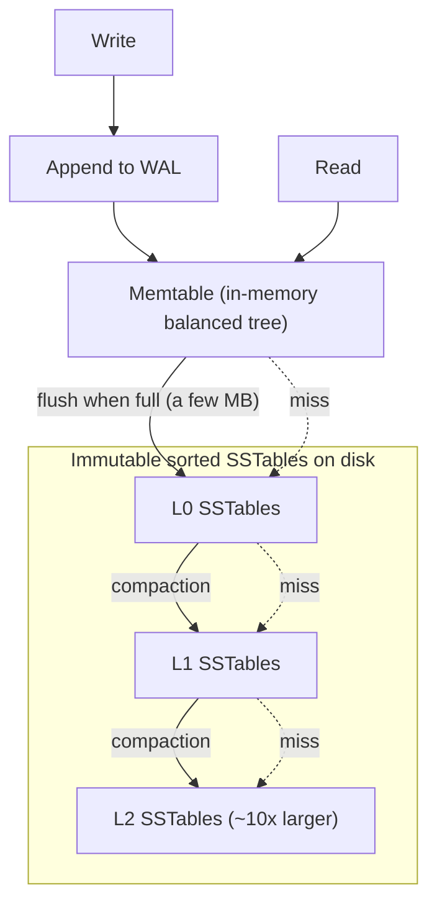

## Purpose

Reading notes on chapter 3 of [Designing Data-Intensive Applications](https://dataintensive.net/) by Martin Kleppmann. The chapter builds storage engines up from an append-only log, then contrasts the index structures behind OLTP systems with the column-oriented layouts behind analytics.

## The simplest possible database

```bash
#!/bin/bash

#instant database
db_set () {
 echo "$1,$2" >> database
}
db_get () {
 grep "^$1," database | sed -e "s/^$1,//" | tail -n 1
}
```

Because the storage is a log, writes are $O(1)$ appends and reads are $O(n)$ scans. That trade already makes log-structured storage a good fit for append-only workloads such as event sourcing. To make reads faster we add an index, an additional structure derived from the primary data. Every index trades write performance for read performance, since writes now have to update the index as well as the primary data.

## Hash indexes

A hash index maps keys to byte offsets in the data file. Lookups by exact key are fast; range queries are not, since adjacent keys land in unrelated buckets. Store the log-structured key-value data in a binary format and use the in-memory hash table to find each key's offset. Deletes work by writing a tombstone record, and periodic compaction rewrites segments without the dead keys.

Crash recovery has a few options:

- Reread the log from beginning to end, rebuilding the hash table in memory. Slow, but needs no extra storage.
- Snapshot the hash table to disk periodically. Faster recovery at the cost of extra storage.
- Add checksums so partially written records can be detected and discarded.

For concurrency, keep a single write thread and multiple read threads. Writes serialize, reads parallelize.

## SSTables and LSM-trees

A Sorted String Table (SSTable) stores key-value pairs sorted by key. Segments are organized by time: reads search from the most recent segment backwards, and a background process merges older segments. Because segments are sorted, merging works like mergesort, keeping only the most recent value for each key, and range queries are fast. A sparse in-memory index of byte offsets is enough, since sorted order lets you scan from the nearest indexed key.

A Log-Structured Merge Tree (LSM-tree) is the combination of an in-memory balanced tree with on-disk SSTables. The simplified algorithm used by LevelDB, and similarly by Cassandra and HBase (both inspired by [[systems/distributed-systems/bigtable|Bigtable]]):

- When a write comes in, add it to an in-memory balanced tree (the memtable).
- When the memtable exceeds some threshold, typically a few megabytes, write it out to disk as an SSTable file. Writes continue to a fresh memtable meanwhile.
- On a read, check the memtable first, then the most recent on-disk segment, then progressively older segments.
- Periodically merge and compact segment files in the background.



Lucene, the index engine behind Elasticsearch and Solr, uses a similar scheme for its term dictionary. Words are the keys and the values are [[ml/nlp/reading/information-retrieval|posting lists]], the ids of documents containing each word. The term dictionary lives in SSTable-like files that are merged periodically.

### Bloom filters

A Bloom filter is a bit array plus $k$ hash functions approximating set membership: inserting a key sets $k$ bits, and a lookup reports "possibly present" only if all $k$ bits are set — false positives happen, false negatives never do. The false-positive rate is tunable by space: at $m$ bits for $n$ keys the optimal $k = (m/n)\ln 2$ gives rate $\approx 0.6185^{m/n}$, so the common 10 bits/key yields about 1%. LSM reads consult one filter per SSTable and skip any segment that cannot contain the key. This matters most for **missing** keys, which otherwise pay the worst case of checking every level; [Bigtable](https://research.google/pubs/pub27898/) reports Bloom filters drastically reducing disk seeks for exactly that lookup pattern.

### Compaction policies

Compaction strategy determines where the LSM pays its costs:

- **Size-tiered** (Cassandra's default, HBase): collect segments of similar size, merge several into one bigger segment when enough accumulate. Each key is rewritten only $O(\log(\text{data}))$ times as it moves up size classes, so write amplification is low — but a key may exist in every tier at once, so reads check more segments and space amplification is high (transient 2x during a big merge, and overlapping stale versions in between).
- **Leveled** (LevelDB, RocksDB default): levels $L_1, L_2, \ldots$ each hold non-overlapping SSTables covering the whole key range, with $L_{i+1}$ about 10x larger than $L_i$. A key lives in at most one SSTable per level, so reads touch few files and space overhead stays near 10%; but pushing one SSTable from $L_i$ into $L_{i+1}$ rewrites ~10 overlapping SSTables there, so write amplification is roughly 10x per level crossed.

The rule of thumb: size-tiered for write-heavy workloads, leveled for read-heavy or space-constrained ones. This is the read/write/space amplification triangle made concrete, below.

## B-trees vs. LSM-trees

B-trees trade write speed for read speed. A B-tree is an n-ary tree with sorted keys in every node, updated in place a page at a time. A high branching factor (hundreds of keys per 4-16 KB page) keeps the tree shallow — four levels of 4 KB pages with branching factor 500 address $500^4 \cdot 4\,\text{KB} = 256$ TB — which minimizes disk seeks.

### Page splits and merges

The tree grows and shrinks a page at a time. Inserting into a full leaf **splits** it: allocate a new page, move the upper half of the keys there, and insert a separator key pointing at the new page into the parent. If that overflows the parent, the split cascades upward; splitting the root is the only way the tree gets taller, which is what keeps it balanced without rebalancing passes. Deletion runs in reverse: a page that falls below half full **merges** with a sibling (or steals keys from it), removing a separator from the parent. Many production engines skip merges and only reuse emptied pages, accepting some fragmentation.

Splits are also where B-trees get dangerous: a split touches two leaf pages and a parent, and a crash between those writes leaves an orphaned page or a dangling pointer. This is one reason every serious B-tree engine has a write-ahead log.

> [!warning] A split is a multi-page write
> There is no atomic way to update two leaves and a parent at once on disk. A crash mid-split corrupts the tree structure itself, not just one record, which is why the WAL rule below is non-negotiable for B-tree engines.

LSM-trees trade read speed for write speed. Writes are sequential appends; reads may touch several segments. Compaction can hurt LSM-tree read performance, especially at high percentiles of read latency, since compaction competes with foreground requests for disk bandwidth. With high enough write throughput you also have to monitor disk space, because compaction can fall behind incoming writes and leave unmerged segments accumulating.

## Write-ahead logging and crash recovery

Both engine families rely on the same durability rule: before any in-place change to a data structure hits disk, a record describing the change is appended to a log and flushed. The [PostgreSQL WAL docs](https://www.postgresql.org/docs/current/wal-intro.html) state the contract: "changes to data files ... must be written only after those changes have been logged." Two things follow. Durability gets cheap: a commit needs only a sequential log flush, not a flush of every dirty page, turning scattered random writes into one sequential stream. And crashes become recoverable: after a crash, **replay** the log forward from the last checkpoint, redoing changes that never reached the data files; because torn half-written pages are restored from logged full-page images (or repaired via redo), a partially completed page split stops being fatal.

A **checkpoint** bounds recovery time by flushing dirty pages and recording "the log before this point is fully applied," letting old log segments be recycled. The knobs trade write burst against recovery time: frequent checkpoints mean fast recovery but more repeated page writes.

The two engine families use the log differently. A B-tree engine WALs every page modification, including the structural ones from splits. An LSM engine only needs the WAL to cover the memtable, the one component living in volatile memory; SSTables are immutable once written, so recovery is "replay the WAL into a fresh memtable," and a memtable flush lets its log segment be dropped. This is the sense in which the LSM design is log-structured twice over.

## Amplification: the three-way trade

> [!abstract] The amplification triangle
> No storage engine minimizes read, write, and space amplification at once. B-trees favor reads, LSM-trees favor writes, and within the LSM family the compaction policy (size-tiered vs. leveled) tunes the position along the triangle.

Every storage engine can be scored on three ratios — **read amplification** (disk work per logical read), **write amplification** (bytes written to disk per logical byte written), and **space amplification** (bytes on disk per live byte) — and no design minimizes all three. The [LSM-tree paper](https://www.cs.umb.edu/~poneil/lsmtree.pdf) is essentially an argument about this trade: batching writes through memory and merging sequentially buys write efficiency at some read cost.

Following one write through each engine makes the amplification sources visible.

**B-tree write path** for `put(k, v)`: descend to the leaf (reads); append the change to the WAL and flush; modify the page in the buffer pool; if full, split (two or three more pages dirtied plus WAL records); eventually write dirtied pages back. Write amplification: the WAL copy, plus a whole page written for one changed row (a 100-byte row in a 4 KB page is 40x right there), again per split page. Read amplification: one page per level, mitigated by caching upper levels. Space amplification: modest, from half-empty pages and fragmentation.

**LSM write path** for the same put: append to WAL, insert into the memtable — the foreground work ends here, which is why write latency is low. Later the memtable flushes as an SSTable ($L_0$), and compaction rewrites the key once per level it descends. Write amplification: WAL + flush + one rewrite per level; with leveled compaction and ~10x fanout, 20-30x total is typical in practice, but all of it sequential and in the background. Read amplification: memtable, then $L_0$ segments, then one SSTable per level — each a Bloom-filter check and possibly a seek; a miss without filters pays the maximum. Space amplification: stale versions and tombstones pending compaction.

The practical summary: B-trees pay foreground random writes for cheap point reads and predictable latency; LSMs pay background rewrite bandwidth and multi-segment reads for sequential-write throughput and better compression (sorted runs compress well). Which side of the trade to take depends on the read/write mix, and the compaction-policy choice above tunes position within the LSM side.

## Secondary indexes

A secondary index is an index on something other than the primary key, so values are not necessarily unique. It can be built from a hash index (still bad for range queries) or a B-tree or LSM-tree (good for range queries, slower writes). As in full-text search, the value for each key can be a list of matching records, which is exactly an inverted index.

### What lives inside the index

You choose between storing a reference to the row or storing the row itself in the index. A heap file holds the actual rows, and indexes point into it. Updates can happen in place when the new value fits in the old slot; otherwise the row moves and either the index or a forwarding pointer at the old location gets updated, which adds a level of indirection to reads.

A clustered index stores row data directly in the index, which suits read-heavy workloads at the cost of space and slower updates. InnoDB, the MySQL storage engine, clusters the table on the primary key, and secondary indexes point at the primary key rather than a heap location. SQL Server allows one clustered index per table.

B-trees handle one-dimensional keys well but do poorly on multi-dimensional queries. R-trees handle multi-dimensional indexing at the cost of complexity. Fuzzy indexes handle approximate matches in full-text search: Lucene keeps an in-memory finite state automaton over the characters of each key, similar to a trie, which supports matching within a given edit distance.

## Keeping everything in memory

As RAM gets cheaper, keeping the whole dataset in memory becomes viable. In-memory databases offer low latency and high throughput, and their real advantage is avoiding the overhead of encoding data structures for disk rather than avoiding disk reads, since a disk-based engine with a large cache rarely touches disk on reads anyway. Crash recovery is the hard part. A write-ahead log makes recovery possible but slows writes. Redis offers weak durability by writing to disk asynchronously. Some in-memory databases can exceed available RAM by evicting cold values to disk, cache-style.

## Transaction processing or analytics?

OLTP (online transaction processing) serves real-time stateful workloads where low latency and high availability matter. An enterprise typically runs several OLTP systems side by side, with ACID transactions, concurrency control, and the index structures above.

OLAP (online analytics processing) serves batch analysis: a read-only copy of the data, loaded and queried in bulk for business intelligence, reporting, and data mining. Availability matters less, and a single query is allowed to hog resources. Data warehouses are the OLAP counterpart to the OLTP indexes above, and they use different schemas and storage layouts.

### Star and snowflake schemas

A star schema has a single fact table containing the events you want to query and multiple dimension tables holding the attributes you want to filter and group by. The fact table carries foreign keys into the dimension tables. A snowflake schema further normalizes the dimension tables into sub-tables, which saves space and complicates queries.

Warehouses get huge, petabytes in some cases, because facts are events kept long term. Fact tables are also wide, often hundreds of columns.

## Column-oriented storage

```sql
SELECT
 dim_date.weekday, dim_product.category,
 SUM(fact_sales.quantity) AS quantity_sold
FROM fact_sales
 JOIN dim_date ON fact_sales.date_key = dim_date.date_key
 JOIN dim_product ON fact_sales.product_sk = dim_product.product_sk
WHERE
 dim_date.year = 2013 AND
 dim_product.category IN ('Fresh fruit', 'Candy')
GROUP BY
 dim_date.weekday, dim_product.category;
```

Transactional databases store data row-oriented, so answering the query above loads entire rows even though it touches a handful of columns. Column-oriented storage lays out each column contiguously, so a query reads only the columns it uses, which saves enormous I/O on wide tables. Values within a column are similar to each other, so columns also compress well, with bitmap encoding plus run-length encoding as the standard tricks. Compressed columns additionally suit vectorized processing, where SIMD instructions operate on many values at once ([C++ SIMD example from UW CSE 333](https://courses.cs.washington.edu/courses/cse333/23au/lectures/27/code/cpp_simd_example.tar.gz)).

### Sort order in column storage

Rows can be kept ordered by a chosen sort key, with secondary sort keys breaking ties. Sorting enables fast range queries on the sort key, improves compression (long runs of duplicates run-length encode well), and gives sequential reads better locality. A store can even maintain the same data redundantly in several different sort orders and pick the best one per query, which C-Store did and Vertica productized.

### Writing to column-oriented storage

All these read optimizations make in-place writes slow. The fix is the LSM-tree approach again: buffer writes in memory, then periodically merge them into the compressed column files.

### Aggregation: data cubes and materialized views

A materialized view is a precomputed, stored query result, usually a join or aggregation. It speeds up the queries it covers and costs write overhead to maintain, which is acceptable in a read-heavy warehouse. A data cube takes this further by precomputing aggregates along every combination of several dimensions, essentially a multi-dimensional array of totals. Cubes are expensive to maintain and inflexible for queries they do not cover. Often the better path is to store raw data, find the slow queries by measuring, and only then precompute aggregates for those queries.

## Sources

- [Designing Data-Intensive Applications](https://dataintensive.net/), Martin Kleppmann, chapter 3
- [O'Neil, Cheng, Gawlick, O'Neil (1996), The Log-Structured Merge-Tree](https://www.cs.umb.edu/~poneil/lsmtree.pdf)
- [PostgreSQL docs, Write-Ahead Logging](https://www.postgresql.org/docs/current/wal-intro.html)
- [Chang et al. (2006), Bigtable: A Distributed Storage System for Structured Data](https://research.google/pubs/pub27898/)

## Related notes

- [[systems/databases/foundations/ch2-data-models-and-query-languages|data models]]
- [[systems/databases/distributed-data/ch5-replication|replication]]
- [[systems/distributed-systems/bigtable|Bigtable, A Distributed Storage System for Structured Data]]
- [[ml/nlp/reading/information-retrieval|Indexing and Information Retrieval]]
