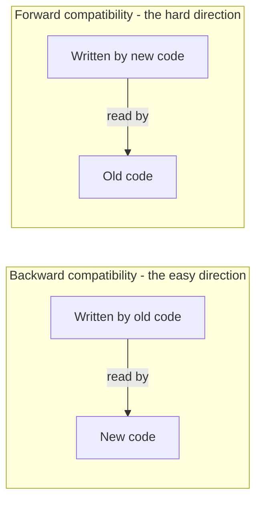

## Purpose

Reading notes on chapter 4 of [Designing Data-Intensive Applications](https://dataintensive.net/) by Martin Kleppmann. The chapter is about what happens to encoded data when the code around it changes, and how serialization formats and dataflow patterns keep old and new versions compatible.

## Vocabulary

**Evolvability** is the ability to evolve as requirements change.

**Schema-on-read** means the schema is not enforced when data is written, only interpreted when it is read, so it can change over time. **Schema-on-write** means the schema is enforced at write time, usually by a database.

**Backward compatibility** means new code can read data written by old code. **Forward compatibility** means old code can read data written by new code, usually by ignoring fields it does not recognize. Backward compatibility is the easier of the two, since new code knows about the old format. Forward compatibility requires old code to tolerate additions it has never seen.

## Formats for encoding data

Programs work with at least two representations of data: in-memory data structures (objects, arrays, hash maps) and encoded bytes stored on disk or sent over the network. **Serialization** (also called encoding or marshaling) translates the in-memory form into bytes that can be stored or transmitted and reconstructed later, possibly on a different machine. **Deserialization** (decoding, unmarshaling) is the reverse.

Language built-in formats like Java serialization and Python's pickle are usually slow, space-inefficient, and tied to one language, so they are a bad idea for long-term storage or cross-service communication.

**JSON** and **XML** are language-independent and human readable. Both handle UTF-8 strings well and binary strings poorly; the base64 workaround inflates data by 33%. **CSV** is popular and less powerful. It is not self-describing, so application code carries the burden of interpreting types.

**Binary encodings** are more compact than the textual formats and faster to encode and decode. They fit internal communication well; for data crossing organizational boundaries, a textual format is usually the safer choice because every party can read it without shared tooling.

### Protocol Buffers, Thrift, and Avro

**Protocol Buffers** (protobuf) pairs a schema language with a binary encoding. The encoding is not self-describing; decoding requires the schema. Code generators produce classes that encode and decode records. Each field gets a numeric field tag in the schema, and the encoding refers to fields by tag rather than name, so fields can be reordered without breaking compatibility. Lists are expressed as repeated fields rather than a dedicated array type.

**Thrift** is similar: an interface definition language, a binary encoding, and code generation for many languages. It ships several protocols, including a binary protocol and a denser compact protocol. Field names never appear in the encoded bytes; field tags do. Unlike protobuf, it has real list types, which can nest.

**Avro** grew out of Hadoop as an alternative to protobuf and Thrift. It has two schema languages, an IDL for humans and a JSON form for machines. The encoding contains no tags or field identifiers at all, just lengths and values back to back, which makes it the most compact of the three, and it uses variable-length integers for lengths. Decoding requires knowing the exact schema the data was written with, which leads to its writer/reader schema design.

What makes all three work well:

- **Compact structure.** Data is a sequence of fields identified by schema information rather than repeated names.
- **Schema evolution.** New fields can be added if they get a fresh tag number and are optional or have a default value. Old code ignores unknown fields; new code fills defaults for missing ones. Fields can be removed or renamed only if their tag numbers are never reused.

> [!warning] Tag numbers are forever
> In protobuf and Thrift, a removed field's tag number can **never be reused**. Old data encoded with that tag still exists, and a new field wearing the same tag would be silently misinterpreted as the old one.

### Avro's writer and reader schemas

Avro decodes data by comparing two schemas: the writer schema the data was encoded with and the reader schema the consuming code expects. The two just have to be compatible:

- A field in the writer schema that the reader schema lacks is ignored.
- A field the reader schema expects that the writer schema lacks is filled from the reader schema's default value.
- Either side can be the newer version. Compatibility holds as long as fields are only added or removed with default values.
- A field that should default to null must be declared as a union type including null.
- Renaming a field uses aliases, which keeps backward compatibility only, since old writers know nothing about the new name.

How the reader learns the writer schema depends on context. A Hadoop file with millions of records encoded identically stores the writer schema once at the top of the file. A database whose rows were written over years stores a schema version number per row plus a table of versions. Services can negotiate schemas at connection setup. A registry of schema versions is a good idea in all these cases.

### Dynamically generated schemas

Say you want to dump a relational database to disk in a binary format. The database schema has changed over time, so with protobuf or Thrift someone would have to hand-assign field tags for every historical version. Avro was designed for exactly this case: generate an Avro schema from the current database schema and regenerate it whenever the database schema changes. No tags means nothing to hand-maintain. This also makes Avro the natural choice in dynamic languages where a code generation step is unwelcome, while protobuf and Thrift lean into static code generation.

## Modes of dataflow

In every mode, one process encodes and another decodes. The modes differ in who the two parties are and how far apart in time they run.

### Through databases

The writer encodes; every later reader decodes. Multiple processes running different code versions will access the same database at the same time, so both backward and forward compatibility are needed. One subtle trap is preservation of unknown fields: old code that reads a record, updates one field, and writes it back can silently drop fields added by newer code unless the application handles this. Data outlives code, so any value written at any time in the past may still need to be read.

> [!warning] The read-modify-write trap
> Forward compatibility at decode time is not enough. Old code that decodes a record, changes one field, and re-encodes it will **drop every field it did not recognize** unless unknown fields are explicitly carried through.

### Dumping to files and archival storage

Here the encoder is the process dumping the data and the decoder reads the file later. Dumps are typically encoded with the latest schema in one pass, which makes them a good opportunity to use an analytics-friendly column-oriented format. Avro fits this flow well.

### Through services: REST and RPC

The client encodes requests; the server decodes them, and vice versa for responses. Servers are commonly updated before clients, and with public APIs the provider has no control over client versions at all, so both compatibility directions matter here too.

In a service-oriented architecture, different teams own different services, each exposing an API that encapsulates its internals. Web services show up in three contexts: internal services within an organization, public APIs, and partner APIs exposed to specific external organizations.

**REST** is a design philosophy that builds on HTTP: simple data formats, URLs to identify resources, and HTTP's own mechanisms for caching, authentication, and content negotiation. The chapter mentions SOAP mostly to steer around it.

**RPC** frames a network request as a call to a function on a remote server, aiming for location transparency. The abstraction leaks. Network requests can fail, time out, or execute twice, which local calls cannot, so systems built on RPC still have to handle those failure modes. Idempotent operations make transparent retries safe. REST wins some credibility here by never pretending the network is absent. RPC frameworks also tend to couple client and server to specific languages, which hurts public APIs where you do not control the client.

**gRPC** is a modern RPC framework using protobuf as its interface definition language over HTTP/2. It suits internal services better than public APIs. Newer RPC frameworks generally represent asynchronous responses with futures or promises, support streaming for long-lived exchanges, and sometimes include service discovery so clients can find servers without hardcoded addresses.

REST's practical advantage is its ecosystem: servers, load balancers, proxies, caches, monitoring, and debugging tools all speak HTTP, and browsers do too.

For evolvability, the usual simplifying assumption is that all servers update before all clients, so requests need only backward compatibility and responses only forward compatibility. Public RPC-style APIs still end up maintaining compatibility indefinitely, and with no single standard for API versioning, versioning tends to be ad hoc.

### Through asynchronous message-passing

Message passing sits between RPC and databases. A producer sends a message to a named queue or topic on a message broker (Kafka, RabbitMQ, and similar), the broker stores it, and one or more consumers receive it. The sender does not wait for a response.

This buys several things:

- **Durability.** The broker holds messages until they are consumed, so a broker or consumer restart loses nothing.
- **Decoupling.** Producers and consumers do not need to be online at the same time, and neither needs to know the other's address.
- **Fan-out.** A message can be delivered to multiple consumers.
- **Buffering.** Queues absorb bursts when consumers fall behind.

Communication is one-way by default, though request/response can be layered on top with reply queues. Brokers do not usually enforce a data format, so the encoding choices above still apply; the broker only needs to read routing metadata.

### Distributed actor frameworks

The actor model treats actors as the unit of concurrent computation. In response to a message, an actor can update local state, create more actors, and send more messages. Actors are effectively state machines that communicate only by message passing. A distributed actor framework uses the same message-passing machinery between machines as within one, so local and remote communication share code and semantics, a smaller mismatch than RPC's.

Rolling upgrades still require compatible message encodings across framework versions:

- **Akka** uses Java serialization by default and can be configured to use protobuf, which enables rolling upgrades.
- **Orleans** uses a custom encoding by default; upgrades historically required setting up a new cluster and migrating traffic.
- **Erlang/OTP** makes record schema changes hard to roll out, though an experimental mapping to protobuf-style types exists.

## Sources

- [Designing Data-Intensive Applications](https://dataintensive.net/), Martin Kleppmann, chapter 4

## Related notes

- [[systems/databases/distributed-data/ch5-replication|replication]]
- [[systems/distributed-systems/RPC|RPC]]
- [[reference/slides/system-design-interviews|System Design Interviews]]
