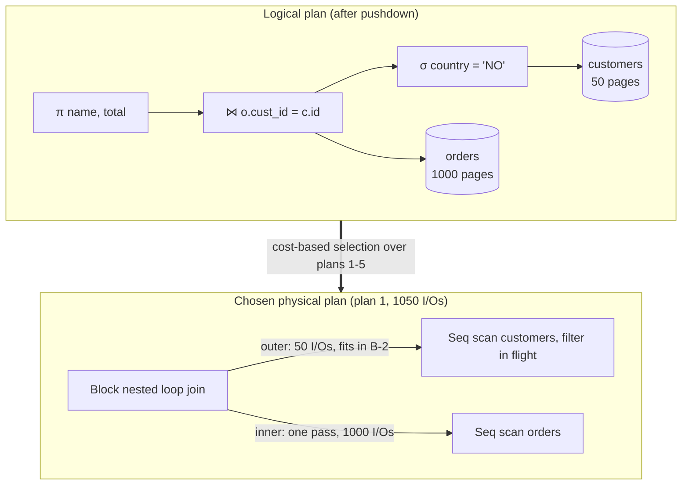

## Purpose

The query-processing side of the database branch: how a declarative query becomes an executable plan, what the physical operators cost, and why the optimizer's weakest link is not the cost model or the search algorithm but the row-count estimates feeding both. Costs below are in page I/Os, the [CS186](https://cs186berkeley.net/notes/note10/) convention, with $[R]$ pages and $|R|$ tuples for relation $R$ and $B$ buffer pages. Storage-side context (heap files, indexes, clustering) is in [[systems/databases/foundations/ch3-storage-and-retrieval|Storage and Retrieval]].

## Logical plans, physical plans

A SQL query first becomes a **logical plan**: a relational-algebra tree of selections, projections, and joins. Algebraic rewrites at this level are safe and nearly always good — push selections below joins so filters shrink inputs early, push projections down to narrow tuples, flatten subqueries. The hard choice deferred to the **physical plan** is which algorithm implements each operator (which join method, index scan versus sequential scan) and in what join order. Logical rewrites are rule-driven; physical selection is cost-driven, which is where estimates enter and things go wrong.

Execution engines then run the plan. The classic **Volcano/iterator model** gives every operator `open/next/close` and pulls one tuple at a time down the tree — simple and composable, but the per-tuple virtual calls and cache misses dominate runtime on modern CPUs. [Neumann (2011)](https://www.vldb.org/pvldb/vol4/p539-neumann.pdf) inverts it: compile the plan into tight loops organized around data pipelines, keeping tuples in registers until a pipeline breaker (hash table build, sort) forces materialization, emitting LLVM IR — with compile times of milliseconds and performance "sometimes rivaling hand-written C++ code." Vectorized execution (batches of thousands of tuples per `next`) is the other standard fix; DuckDB and ClickHouse use it, HyPer and its descendants compile.

## Join algorithms and their costs

Joining $R \bowtie S$ with $R$ as outer:

| Algorithm | I/O cost | When it wins |
| --- | --- | --- |
| Naive nested loop | $[R] + \lvert R \rvert \cdot [S]$ | never; the strawman |
| Block nested loop | $[R] + \lceil [R]/(B-2) \rceil \cdot [S]$ | one input near memory-sized |
| Index nested loop | $[R] + \lvert R \rvert \cdot (\text{lookup cost})$ | selective join + index on inner |
| Sort-merge | $\text{sort}(R) + \text{sort}(S) + [R] + [S]$ | output must be sorted, or inputs already are |
| Grace hash | $\approx 3([R] + [S])$ (two-pass) | large inputs, equality join; the default |

Block nested loop reads the outer once and the inner once per memory-sized chunk of the outer, so the smaller relation should be the outer. Sort-merge pays external-sort cost ($2[R](1 + \lceil \log_{B-1}\lceil [R]/B \rceil \rceil)$ per input) then a single merge pass. Grace hash partitions both inputs by hash (write + read each page once) and joins matching partitions in memory: read, write, read again — the $3([R]+[S])$. Hash joins only handle equality predicates; sort-merge and nested loops handle inequalities.

## The System R optimizer

[Selinger et al. (1979)](https://dl.acm.org/doi/10.1145/582095.582099) set the template still used everywhere: estimate the cost of alternative plans and pick the cheapest, searching join orders with bottom-up dynamic programming. Pass 1 finds the best access path per table (sequential scan or each index, costed by selectivity). Pass $k$ finds the best plan for each $k$-table subset by extending each $(k-1)$-subset with one more table, considering only **left-deep** trees (inner side is always a base table, so plans pipeline and the search space stays polynomial-ish). Subplans are kept not only if globally cheapest but also if they produce an **interesting order** — sortedness on a join key, grouping, or ordering column — since a slightly costlier sorted subplan can win later by making a sort-merge join or `ORDER BY` free. Cross products are deferred. Cost is a weighted sum of I/O and CPU driven by estimated cardinalities, which is the load-bearing assumption examined next.

## Cardinality estimation is where plans die

The optimizer needs the size of every intermediate result. Standard machinery: per-column statistics (row counts, distinct values, histograms), selectivity $1/\text{distinct}(c)$ for equality, interpolation over histograms for ranges, $1/\max(\text{distinct}(c_1), \text{distinct}(c_2))$ for joins — and **independence**: the selectivity of `AND`ed predicates is the product of individual selectivities.

Real data is correlated, and multiplication of wrong factors compounds. [Leis et al. (2015)](https://www.vldb.org/pvldb/vol9/p204-leis.pdf) ran PostgreSQL and several commercial optimizers on the Join Order Benchmark (real IMDb data, 113 queries) and found errors growing roughly exponentially with join count: median q-error near 10 by three joins, underestimates of $10^2$-$10^4$ routine at five or more, in every system tested. Underestimates are the dangerous direction — they seduce the planner into nested-loop joins that expect ten rows and receive a million. Their second finding reframes optimizer engineering: with true cardinalities supplied, even a crude cost model picked good plans, so **cardinality quality dominates cost-model quality**. The practical mitigations are unglamorous: multi-column statistics (`CREATE STATISTICS` in PostgreSQL), avoiding predicates the estimator cannot see through (functions on columns), and in newer systems, sampling or learned estimators.

> [!tip] Estimates dominate the cost model
> With true cardinalities supplied, even a crude cost model picked good plans in every system Leis et al. tested. Effort spent on better statistics buys more than effort spent tuning cost constants.

## Worked example

Schema: `orders` (1,000 pages, 100,000 tuples), `customers` (50 pages, 5,000 tuples), $B = 102$ buffer pages, query:

```sql
SELECT c.name, o.total
FROM   orders o JOIN customers c ON o.cust_id = c.id
WHERE  c.country = 'NO';
```

Logical rewrite pushes `country = 'NO'` below the join. Say statistics estimate 50 matching customers (1% selectivity). Candidate physical plans (costs from the formulas above, arithmetic checked in the repo venv):

1. **Block nested loop, filtered customers outer.** Read customers (50), filter in flight; 50 matching customers fit easily in $B - 2 = 100$ pages, so one pass over orders: $50 + 1 \cdot 1000 = 1050$ I/Os.
2. **Block nested loop, orders outer**: $1000 + \lceil 1000/100 \rceil \cdot 50 = 1500$ I/Os — same algorithm, wrong outer, 43% more expensive.
3. **Grace hash join**: $3(1000 + 50) = 3150$ I/Os, needless here since one input fits in memory (the build side collapses to plan 1's shape in practice).
4. **Sort-merge**: sorting orders alone costs 4000 I/Os; total $\approx 5150$. Only attractive if output order on `cust_id` were needed later.
5. **Index nested loop** with an index on `orders.cust_id`: 50 customers $\times$ (index descent + fetch of their orders). With ~20 orders per customer **unclustered**, that is up to $50 \cdot 20 = 1000$ scattered tuple fetches plus descents — comparable to plan 1 at best; with a **clustered** index, matching orders sit on ~10 contiguous pages per customer and this plan wins decisively. Same query, same index, roughly an order of magnitude swing from physical layout alone.



The planner picks plan 1 at these estimates. Now suppose `country` is correlated with a second pushed-down predicate (say `region = 'Scandinavia'`): independence multiplies two 1% selectivities into 0.01% and predicts 0.5 customers, and the planner may flip to a naive per-customer index-probe strategy that would be catastrophic against the actual 50 — the Leis failure mode in miniature.

## Feedback into storage design

Planner behavior is the reason index and layout choices matter beyond point lookups. A clustered index turns range and foreign-key access into sequential I/O and changes the join-method decision, as plan 5 shows. A covering index removes heap fetches entirely and makes index-only plans viable. Conversely, past a selectivity of a few percent, an unclustered index scan loses to a sequential scan — one random fetch per tuple against one sequential pass — so adding indexes does not help queries that touch broad slices. The planner is the consumer of every storage decision in [[systems/databases/foundations/ch3-storage-and-retrieval|Storage and Retrieval]]; when it misbehaves, `EXPLAIN ANALYZE`'s estimated-versus-actual row counts show whether the statistics or the physical design is at fault.

## Related notes

- [[systems/databases/foundations/ch3-storage-and-retrieval|Storage and Retrieval]]
- [[systems/databases/foundations/ch2-data-models-and-query-languages|Data Models and Query Languages]]
- [[systems/databases/transactions-serializability-isolation|Transactions, Serializability, and Isolation Levels]]

## Sources

- [CS186 Berkeley notes: Iterators and Joins, Query Optimization](https://cs186berkeley.net/notes/note10/)
- [Selinger et al. (1979), Access Path Selection in a Relational Database Management System](https://dl.acm.org/doi/10.1145/582095.582099)
- [Neumann (2011), Efficiently Compiling Efficient Query Plans for Modern Hardware](https://www.vldb.org/pvldb/vol4/p539-neumann.pdf)
- [Leis et al. (2015), How Good Are Query Optimizers, Really?](https://www.vldb.org/pvldb/vol9/p204-leis.pdf)
