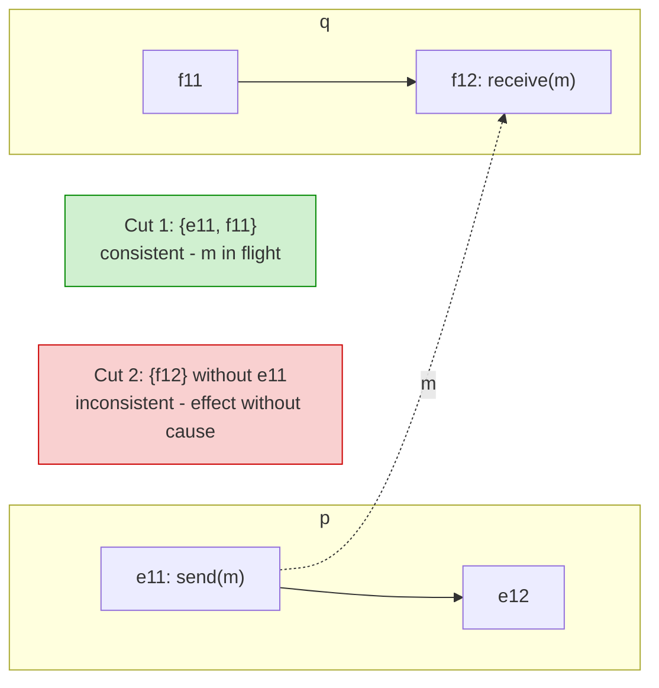

## Purpose

Notes on [Babaoglu and Marzullo's chapter](https://courses.cs.washington.edu/courses/csep552/18wi/papers/chapt4.pdf) on consistent global states. The chapter builds the formal model for asking "does the system currently satisfy predicate $\Phi$" when no observer can see every node at once. So far this note covers the system model and the definition of a distributed computation.

## Core idea

Many problems in distributed computing reduce to maintaining a consistent global state and running predicates against that state to trigger actions. The true state of a distributed system is the union of all node states. Since nodes don't share memory, any global state must be inferred purely from the messages nodes exchange.

A global state is *inconsistent* if no ideal external observer could have constructed it by watching the real execution. The chapter formalizes this through **Global Predicate Evaluation (GPE)**: determining whether the system satisfies some predicate $\Phi$.

> [!note] What "consistent" means here
> A global state is consistent exactly when it could have been observed by an ideal external observer of the real execution. Operationally: if the state includes the *receive* of a message, it must also include the *send*. A cut that captures an effect without its cause describes an execution that never happened.

## Asynchronous distributed systems

Define a distributed system as a set $P$ of *sequential* processes $p_1, p_2, \ldots, p_n$ and a network of unidirectional *channels* between pairs of processes. The network is reliable but may deliver messages out of order. It is *strongly connected*, though not necessarily *fully connected*, so communication between two processes may pass through intermediaries.

The model deliberately makes the weakest workable assumptions, so results proved in it hold for arbitrary real systems.

## Distributed computations

A distributed computation is the execution of a distributed program over a collection of processes, each of which sequentially processes a stream of *events*. Communication is a pair of events: a message $m$ is enqueued on a channel by $send(m)$ and dequeued by $receive(m)$. The one ordering fact the model gives us for free is that $send(m)$ at process $p$ happens before $receive(m)$ at process $q$. Everything else about global ordering has to be built from that relation, which is what [[systems/distributed-systems/clocks|logical clocks]] do.

The send/receive relation is also what separates consistent cuts from inconsistent ones. Cut 1 below captures $send(m)$ but not $receive(m)$ — fine, the message is simply in flight. Cut 2 captures $receive(m)$ without its $send(m)$, a state no real observer could have seen:

## Related notes

- [[systems/distributed-systems/clocks|distributed clocks]]
- [[systems/distributed-systems/ordering-events-in-distributed-systems|event ordering]]
