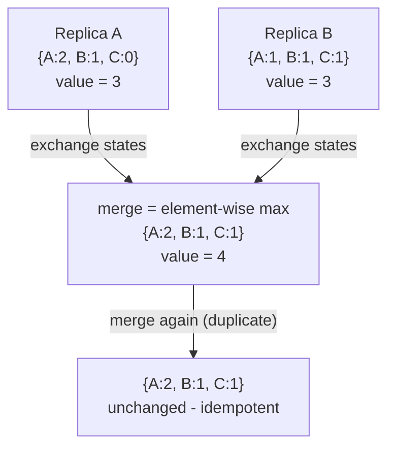
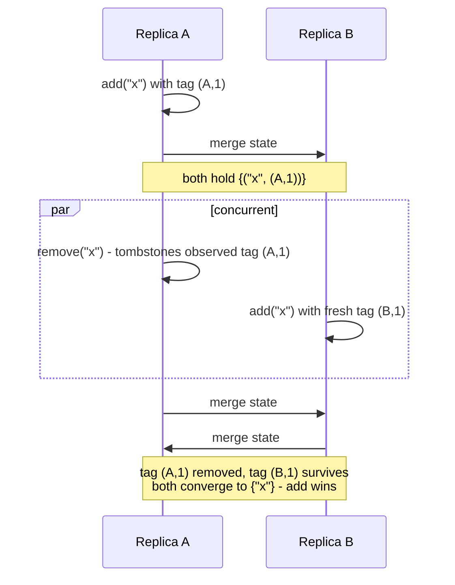

## Purpose

The multi-writer replication problem, solved by algebra instead of coordination. [[systems/distributed-systems/dynamo-db|Dynamo]] and [[systems/distributed-systems/disconnected-operation|disconnected operation]] both hit the same wall: accept writes at multiple replicas without talking, and concurrent updates conflict — Dynamo punts the merge to the application (the shopping cart), Coda punts to the user. CRDTs are data types whose merge is built in and provably convergent, so conflict resolution stops being an application afterthought. This note gives the conditions that make that work, the standard constructions, and the costs.

## Strong eventual consistency

Plain eventual consistency promises only that replicas *eventually* agree, saying nothing about how — systems that reconcile by rollback or "last writer wins by wall clock" satisfy it while losing data. [Shapiro et al. (2011)](https://hal.inria.fr/inria-00609399/document) define the stronger target CRDTs actually meet, **strong eventual consistency (SEC)**: eventual delivery (every update reaches every replica), plus **strong convergence** — any two replicas that have delivered the *same set* of updates are in the *same state*, immediately and deterministically, regardless of delivery order. No consensus round, no rollback, no conflict cases surfaced to the caller. The [Isabelle/HOL verification work](https://martin.kleppmann.com/papers/crdtops.pdf) machine-checked this property for the main constructions below, which matters because hand proofs in this area have a history of missing interleavings.

> [!tip] The whole trick in one line
> Same *set* of updates $\Rightarrow$ same state, no matter the delivery order. Merge being a semilattice join (commutative, associative, idempotent) is what makes reordering, duplication, and repetition all harmless — convergence comes from algebra, not coordination.

## The two recipes

**State-based (CvRDT).** Replicas exchange whole states and merge. Convergence is guaranteed if the states form a **join-semilattice**: a partial order $\le$ in which any two states have a least upper bound $\sqcup$, updates only move state upward ($s \le s'$, inflation), and merge *is* the join. Join is by definition commutative, associative, and idempotent — so merges tolerate reordering, duplication, and repetition for free, and gossip over any eventually-connected topology converges. The proof obligation collapses to "is my merge a join and are my updates inflations."

**Operation-based (CmRDT).** Replicas broadcast operations; each applies them locally. The requirements shift to the network and the operations: delivery must respect causal order, and operations that are *concurrent* must **commute** — applying them in either order yields the same state. Op-based CRDTs ship less data but lean on causal broadcast (in practice, vector-clock machinery as in [[systems/distributed-systems/ordering-events-in-distributed-systems|ordering events]]); duplicated delivery must be handled explicitly. Shapiro et al. prove the two recipes equivalent — each emulates the other — and **delta-CRDTs** split the difference by shipping only recently-changed fragments of state that merge like states do.

## The standard constructions

**G-Counter.** A map from replica ID to a local count; increment bumps your own entry, value is the sum, merge is element-wise max. Element-wise max over vectors of naturals is a textbook join; increments are inflations. **PN-Counter**: two G-Counters, increments minus decrements.



**G-Set / 2P-Set.** A grow-only set (merge = union) is the simplest CRDT. Adding removal naively gives the 2P-Set — an add set plus a tombstone set, remove wins over add — with the sharp edge that a removed element can *never* be re-added, because the tombstone is permanent.

**LWW-Register.** A (value, timestamp) pair; merge keeps the higher timestamp. Cheap and popular (Cassandra cells work this way), and honest about its trade: concurrent writes are resolved by silently discarding one, ties need a deterministic tiebreaker or replicas diverge, and skewed clocks can make an older write win. LWW is the CRDT that admits it loses data.

**OR-Set (add-wins set).** The construction that fixes 2P-Set. Every add attaches a globally unique tag; remove deletes only the *(element, tag)* pairs the removing replica has *observed*. A concurrent re-add carries a fresh tag the remove never saw, so the element survives: adds win against concurrent removes, and elements are freely re-addable.



Verified end to end in the repo venv with a ~25-line implementation:

```python
class ORSet:
    def __init__(self, rid):
        self.rid, self.n = rid, 0
        self.adds, self.removed = set(), set()
    def add(self, e):
        self.n += 1
        self.adds.add((e, (self.rid, self.n)))       # unique tag per add
    def remove(self, e):                             # removes OBSERVED tags only
        self.removed |= {(x, t) for (x, t) in self.adds if x == e}
    def merge(self, other):
        self.adds |= other.adds
        self.removed |= other.removed
    def value(self):
        return {e for (e, t) in self.adds if (e, t) not in self.removed}

A, B = ORSet("A"), ORSet("B")
A.add("x"); B.merge(A)
A.remove("x"); B.add("x")     # concurrent remove at A, re-add at B
A.merge(B); B.merge(A)
print(A.value(), B.value())   # {'x'} {'x'} - add wins, replicas agree
```

The same script checks merge-order independence and duplicate delivery for a G-Counter: merging $\{A{:}2, B{:}1\}$ with $\{C{:}1\}$ in either order, with one merge repeated, yields identical state — idempotence absorbing the duplicate. This is the semilattice algebra doing observable work.

## The ordering-sensitive case: replicated lists

Sets and counters have no positions; collaborative text does, and it is where CRDT design gets genuinely hard. The core move (Treedoc, Logoot, RGA, and descendants): give every character a **stable identifier** drawn from a dense order, so "insert between id₁ and id₂" allocates a fresh identifier strictly between them, and concurrent inserts at the same place are ordered by identifier comparison rather than by index arithmetic. Deletes leave tombstones so that concurrent operations referencing the deleted position still resolve.

Correct-looking designs fail subtly here. [Kleppmann et al.](https://martin.kleppmann.com/papers/interleaving-anomalies.pdf) showed that Logoot and LSEQ suffer an **interleaving anomaly**: two users concurrently typing "abc" and "xyz" at the same position can converge to "axbycz" — each user's insertion order is preserved, but the runs are shuffled together, which no user intended. RGA-family designs avoid this for insertions-after but have their own weaker anomaly. This is the concrete argument for the machine-checked-proof line of work, and for using a hardened library — Yjs or Automerge — rather than hand-rolling a list CRDT: both implement tombstone compaction, efficient identifier encoding, and the anomaly fixes that took the research community a decade to converge on.

## What CRDTs cost, and cannot do

- **Metadata growth.** Unique tags, per-replica counter entries, and tombstones accumulate; a long-lived OR-Set or text document can carry metadata dwarfing the payload. Compacting tombstones safely requires knowing every replica has seen the removal — which is a coordination problem again, just moved to garbage collection.
- **No global invariants.** SEC guarantees replicas agree, not that the agreed state satisfies cross-object constraints. "Balance never negative," "username unique," "at most one winner" all require forbidding one of two concurrent operations, which is precisely the coordination CRDTs decline to do. Systems needing such invariants need consensus on that path — [[systems/distributed-systems/paxos-intro|Paxos]]-class machinery — and CRDTs everywhere else.
- **Resolution is policy, chosen in advance.** Add-wins, remove-wins, LWW: each is a fixed answer to "what should concurrent conflicting intent mean," baked into the type. The Dynamo shopping cart's deleted-item-reappears anomaly is the add-wins policy under another name; picking the CRDT *is* picking the anomaly you can live with.

> [!warning] Convergence is not correctness
> SEC guarantees replicas *agree*, not that the agreed state satisfies any cross-object invariant. "Balance never negative" or "username unique" require forbidding one of two concurrent operations — exactly the coordination CRDTs decline to do. Keep consensus on those paths and use CRDTs everywhere else.

In production terms: Riak ships counters/sets/maps as datatypes, Redis Enterprise's active-active geo-replication runs on CRDTs, and Automerge/Yjs carry the collaborative-editing ecosystem. On the [[systems/distributed-systems/consistency|consistency]] spectrum, CRDT systems sit at causal-plus-convergent: below linearizability, above ad-hoc eventual consistency, with availability and partition tolerance as the entire point.

## Related notes

- [[systems/distributed-systems/consistency|Consistency]]
- [[systems/distributed-systems/dynamo-db|Dynamo]]
- [[systems/distributed-systems/disconnected-operation|Disconnected Operation]]
- [[systems/distributed-systems/ordering-events-in-distributed-systems|Ordering Events in Distributed Systems]]
- [[systems/distributed-systems/clocks|Clocks]]

## Sources

- [Shapiro, Preguica, Baquero, Zawirski (2011), A Comprehensive Study of Convergent and Commutative Replicated Data Types, INRIA RR-7506](https://hal.inria.fr/inria-00609399/document)
- [Gomes, Kleppmann, Mulligan, Beresford (2017), Verifying Strong Eventual Consistency in Distributed Systems, OOPSLA](https://martin.kleppmann.com/papers/crdtops.pdf)
- [Kleppmann, Gomes, Mulligan, Beresford (2019), Interleaving Anomalies in Collaborative Text Editors, PaPoC](https://martin.kleppmann.com/papers/interleaving-anomalies.pdf)
- [crdt.tech, papers and taxonomy](https://crdt.tech/papers.html)
