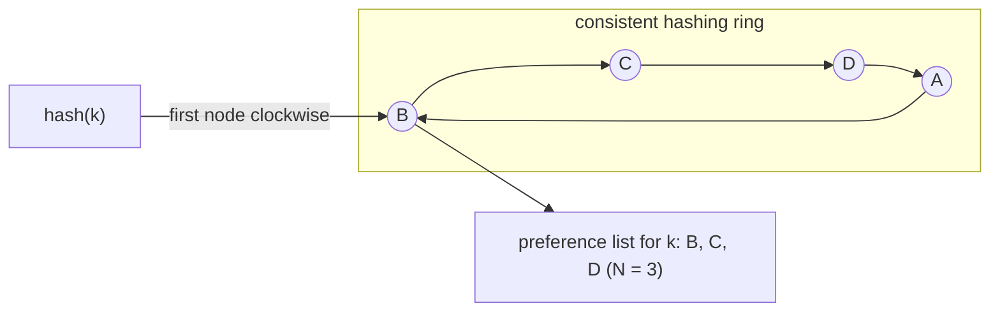
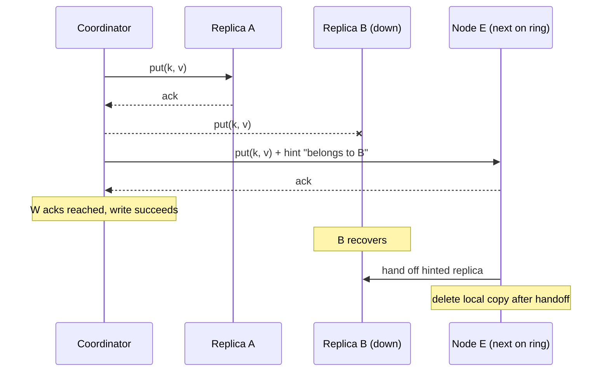

## Purpose

Notes on the [Dynamo paper](https://www.allthingsdistributed.com/files/amazon-dynamo-sosp2007.pdf). This is a stub. Only the main idea is recorded so far.

## Main idea

Dynamo is a highly available key-value store that sacrifices consistency under certain failure conditions. Writes are always accepted, so the system can produce divergent versions of an object, and it makes extensive use of object versioning with vector clocks plus application-assisted conflict resolution to reconcile them. Reconciliation happens at read time, and when the version history alone cannot decide, the application merges the divergent versions itself, the shopping cart being the paper's running example.

> [!quote] Dynamo paper, SOSP 2007
> "Customers should be able to view and add items to their shopping cart even if disks are failing, network routes are flapping, or data centers are being destroyed by tornados."

> [!tip] The core trade
> Dynamo is an "always writeable" store: writes are never rejected because of failures or concurrent updates. The cost moves to reads, where divergent versions surface and must be reconciled, by vector clock comparison when possible and by the application when not.

The paper's techniques worth writing up properly: consistent hashing for partitioning and replication, vector clocks for versioning, sloppy quorums with hinted handoff for availability during failures, and gossip-based membership.

### Partitioning: consistent hashing

Each node owns positions on a hash ring. A key hashes to a ring position, the first node clockwise from that position coordinates the key, and the next $N-1$ distinct nodes complete the key's *preference list* of replicas.

### Sloppy quorum and hinted handoff

Reads and writes go to the first $N$ *healthy* nodes in the preference list rather than strictly the first $N$, so a write can still gather $W$ acknowledgements while a replica is down. The substitute node stores the write with a hint naming the intended owner and hands it back when the owner recovers.

> [!warning] Sloppy quorums weaken read guarantees
> With a sloppy quorum, $R + W > N$ no longer guarantees that a read overlaps the latest write, since the quorums are drawn from whichever nodes are healthy at the time. Eventual consistency also leaks into the application: the shopping cart merge is a union of divergent versions, so a deleted item can resurface.

> [!warning] Vector clock sizing
> A clock gains a (node, counter) pair for every node that coordinates a write to the object. Dynamo caps the size by timestamping pairs and truncating the oldest past a threshold, which discards causality information and can force application-level reconciliation that the clocks would otherwise have resolved.

## Related notes

- [[systems/distributed-systems/consistency|consistency]]
- [[systems/distributed-systems/sharding|sharding]]
- [[systems/distributed-systems/disconnected-operation|disconnected operation]]
- [[systems/distributed-systems/clocks|clocks]]
