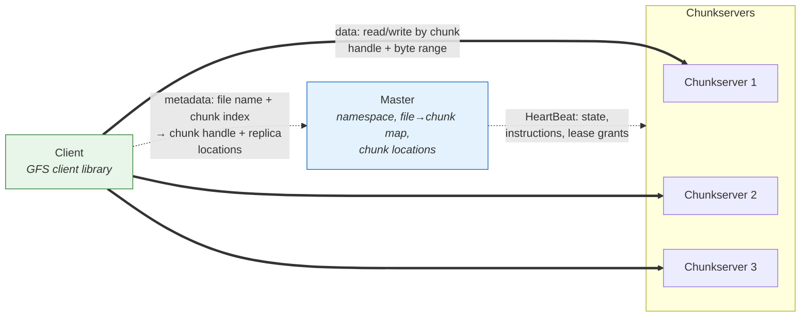
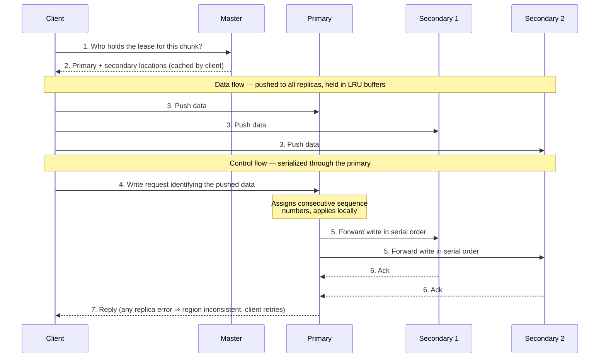

## Purpose

Notes on the [GFS paper](https://static.googleusercontent.com/media/research.google.com/en//archive/gfs-sosp2003.pdf). GFS is worth studying for how far a single-master design goes when the workload is known, and for its honest tradeoff of consistency for simplicity in the write path. It is also the storage layer under [[systems/distributed-systems/bigtable|Bigtable]].

## Problem

GFS departs from traditional file systems because Google's workload departs from traditional workloads:

- It runs on commodity hardware, so component failure is the common case and the system must tolerate it constantly
- Huge multi-GB files are the norm
- Reads and appends dominate, while updates and random writes are rare, so the system optimizes for large streaming reads and concurrent appends

## Assumptions

- Commodity hardware, so the system constantly monitors for, detects, and tolerates failures
- A modest number of large files, from a few million files around 100 MB up to multi-GB files, and the system is optimized for these
- Two read patterns: large streaming reads spanning more than 1 MB, and smaller random reads that are often batched
- Well-defined semantics for concurrent appends matter, since a common use of GFS is as a producer-consumer queue
- High sustained bandwidth takes precedence over latency

> [!quote] Workload assumptions, from the [paper's introduction](https://static.googleusercontent.com/media/research.google.com/en//archive/gfs-sosp2003.pdf)
> "First, component failures are the norm rather than the exception. [...] Second, files are huge by traditional standards. Multi-GB files are common."

## Interface

The interface looks familiar but GFS is not POSIX compliant. Files are organized hierarchically in directories and identified by path names, with *create*, *delete*, *open*, *close*, *read*, and *write*. GFS adds *snapshot*, which copies a file or directory tree cheaply, and *record append*, which lets multiple clients append to the same file concurrently while guaranteeing atomicity of each individual record.

## Architecture

A GFS cluster is one *master* plus multiple *chunkservers*, accessed by multiple *clients*. Each component is a user-level server process on a commodity Linux machine, and running a client and a chunkserver on the same machine is common, at some reliability cost.

Files are made of fixed-size *chunks*, each identified by an immutable, globally unique 64-bit *chunk handle* assigned by the master at creation. Chunkservers store chunks as Linux files on local disk and serve reads and writes addressed by chunk handle and byte range. Each chunk is replicated on multiple chunkservers, three by default.

The master maintains all filesystem metadata: the namespace, access control information, file-to-chunk mappings, and chunk-to-server mappings. The master and chunkservers exchange *HeartBeat* messages, which let the master monitor and instruct chunkservers and let chunkservers report status.

The GFS client library is linked into each application. All metadata operations go through the master, but data flows directly between clients and chunkservers, with nothing like the Linux vnode layer in the way. Neither clients nor chunkservers cache file data. Clients cache metadata. Chunkservers do get caching of hot data for free through the Linux buffer cache, but that is transparent to GFS.

The dashed edges below carry metadata only; the thick edges carry file data and never touch the master:

## Single master

A single master vastly simplifies the design, since replication and chunk placement decisions can use global knowledge of the filesystem. For this to scale, the master's involvement in reads and writes has to be minimized.

The common-case read:

1. The client translates a file name and byte offset into a chunk index locally
2. The client requests the chunk handle and replica locations from the master
3. The client caches the result, keyed by file name and chunk index
4. The client picks a replica, often the closest, and reads directly from it while the cache entry stays valid

Steps 1 and 2 batch across many chunks at almost no extra cost.

## Chunk size

Chunks are 64 MB and lazily allocated, which avoids internal fragmentation. Large chunks let clients cache the metadata for a lot of data, reduce the master traffic needed to acquire that metadata, and keep the master's metadata small enough to hold in memory.

The disadvantage is hotspots. A small file occupies few chunks, so hundreds of machines reading the same small file concurrently overload the chunkservers that hold it.

> [!warning] Hotspots
> Google hit this with an executable stored in GFS being launched across hundreds of machines at once, hammering the handful of chunkservers holding its single chunk. The fix was a higher replication factor on such files plus staggered start times. **Extension idea (mine)**: peer-to-peer sharing between clients could relieve hotspots.

## Metadata

The master stores three kinds of metadata, all in memory:

- File and chunk namespaces
- File-to-chunk mappings
- The location of each chunk's replicas

The first two are also persisted in an *operation log* on the master's local disk. Replica locations are not persisted. On startup, and whenever a chunkserver joins, the master asks the chunkserver what chunks it holds.

### In-memory data structures

Keeping metadata in memory makes master operations fast, and it lets the master scan its entire state cheaply, which is what enables garbage collection, re-replication after failures, and migration for load balancing.

The obvious objection is that memory bounds the filesystem's size. In practice each 64 MB chunk needs under 64 bytes of metadata, and namespace metadata compresses well with prefix compression. A few extra GB of memory on the master buys a huge amount of additional capacity, so memory only becomes the limit for enormous systems on an under-specced master.

### Chunk locations

Polling chunkservers for their chunks instead of persisting locations is a deliberate simplification. Maintaining a globally consistent persistent view would have been an uphill battle, since chunkservers partially fail, and the chunkserver ultimately knows best which chunks it actually has.

### Operation log

The operation log is the only persistent metadata, and it also defines the serialization order of concurrent operations. The log is replicated remotely, and changes are batched and flushed before responding to clients. The master replays the log on startup, and keeps replay fast by checkpointing its state as a compact B-tree structure that can be memory-mapped directly. Checkpoints are built in a background thread so mutations continue during checkpointing, then written to disk locally and remotely.

## Consistency model

### Guarantees

File namespace mutations are atomic, since they execute at the single master under locking. File data mutations have looser guarantees, described in terms of regions:

> [!info] Region states
> - **Defined**: the region is consistent and reflects a mutation in its entirety — every client sees the same data, and it is exactly what one writer wrote
> - **Consistent but undefined**: all clients see the same data, but it is a mingled interleaving of concurrent mutations rather than any single one
> - **Inconsistent**: a mutation failed, and different clients may see different data

Successful serial mutations leave regions defined. Successful concurrent mutations leave regions consistent but possibly undefined. After a sequence of successful mutations, the file is guaranteed defined and contains the data of the last mutation. GFS achieves this by applying mutations to a chunk in the same order across replicas, and by using chunk version numbers to detect replicas that missed mutations while their server was down.

A stale chunk is never returned to clients and is garbage collected as soon as possible. Clients cache chunk locations, so there is a window where a client can read from a stale replica. For append-heavy workloads this usually presents as reading a premature end of chunk rather than wrong data.

Component failures can corrupt or destroy data. Chunkservers checksum their data, and on detecting corruption restore from a valid replica. Data becomes unavailable only if all replicas are lost before the master reacts, and even then corrupted data is never silently returned.

### Implications for applications

Prefer appends over random writes. Record append has at-least-once semantics and may insert arbitrary padding between records, so applications should structure their records with self-validating framing and use unique identifiers to dedupe non-idempotent entries.

## System interactions

### Leases and mutation order

A mutation is any change to a chunk's contents, performed at every replica. The order comes from a lease mechanism:

1. The master grants a *lease* (around 60 seconds) to one replica, making it the *primary*
2. The primary picks a serial order for all mutations to the chunk
3. All replicas apply mutations in the primary's order

Leases extend via requests piggybacked on HeartBeat messages. The master can revoke a lease, and if it loses contact with the primary it just waits for the lease to expire before granting a new one.

### The write path

1. The client asks the master which chunkserver holds the lease and where the other replicas are. If no lease exists, the master grants one to a replica of its choice
2. The master replies with the identity of the primary and the secondary replicas, and the client caches this
3. The client pushes the data to all replicas, which hold it in an LRU buffer until used or expired
4. Once every replica acknowledges the data, the client sends a write request to the primary identifying that data. The primary assigns consecutive sequence numbers to all mutations it receives, possibly from multiple clients, and applies them locally
5. The primary forwards the write request to the secondaries, which apply mutations in the primary's order
6. The secondaries acknowledge completion to the primary
7. The primary replies to the client. Any replica errors are reported to the client, leaving the region inconsistent; the client retries the failed mutation, eventually falling back to redoing the entire write

## Related notes

- [[systems/distributed-systems/bigtable|Bigtable]]
- [[systems/distributed-systems/primary-backup|primary-backup replication]]
- [[systems/operating-systems/lecture-notes/file-systems|File Systems]]
- [[systems/operating-systems/v4-persistent-storage/11-file-systems-overview|File Systems, Introduction and Overview]]
