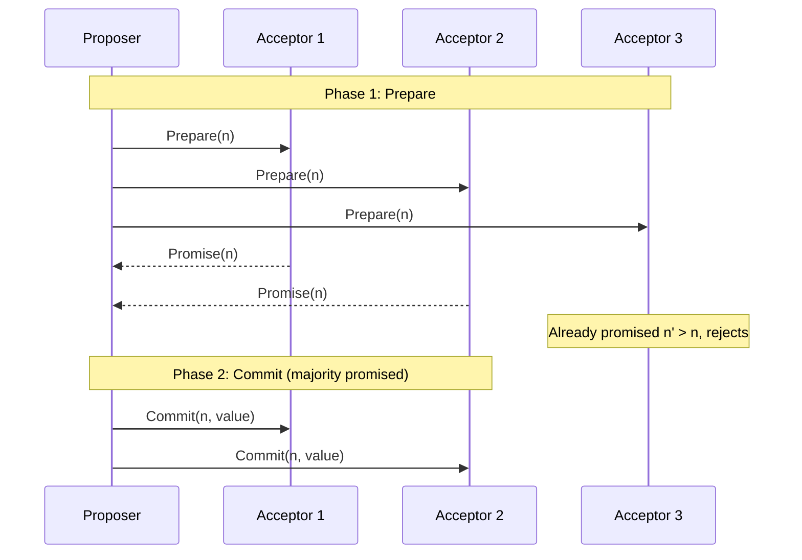

## Purpose

Notes on the [Managing Critical State chapter](https://sre.google/sre-book/managing-critical-state/) of the Google SRE book. The chapter argues that whenever you need agreement on state across nodes, you should reach for a proven consensus protocol instead of ad hoc coordination, and it surveys the system patterns you build on top of one. These notes stop before the chapter's detailed Multi-Paxos message flow.

## CAP theorem

The CAP theorem states that a distributed system can only guarantee two of the following three properties:

- **Consistency**: all nodes see the same data at the same time
- **Availability**: every request receives a response, without guarantee that it contains the most recent write
- **Partition tolerance**: the system continues to operate despite network partitions

Since real networks partition, the practical choice during a partition is between continuing to serve requests (availability) and refusing to serve until the partition heals (consistency).

## ACID's alternative: BASE

ACID (Atomicity, Consistency, Isolation, Durability) gives clean semantics for transactions on a single node, and it does not translate or scale well to distributed systems.

Some datastores instead offer BASE semantics (Basically Available, Soft state, Eventually consistent), which tolerate network partitions better. Most BASE systems use multi-leader replication, where each leader accepts writes and propagates them to the other leaders. Availability and partition tolerance improve, and the application code inherits the complexity of dealing with eventual consistency.

## Why ad hoc coordination fails

### The split brain problem

Split brain is when multiple nodes believe they are the leader. A naive defense is a heartbeat mechanism: the leader sends heartbeats to followers, and if two nodes both act as leader, each eventually notices the other's heartbeats and issues a **STONITH** (Shoot The Other Node In The Head) command to kill it.

> [!warning] STONITH standoff
> Networks are asynchronous and unreliable, so heartbeats can be delayed until both nodes issue STONITH at each other and both go down. Worse, detecting split brain reliably is hard in the first place, because a network partition and a node failure look identical from the outside, and nodes can be partitioned from each other in arbitrary ways.

### Faulty group membership algorithms

Maintaining cluster membership with gossip protocols runs into the same trap. A partition inside a cluster leads to multiple leaders elected in the same cluster, which often ends in data loss or corruption.

## How distributed consensus works

The problem that matters in practice is **asynchronous distributed consensus**, where nodes can fail and messages can be delayed, lost, or duplicated arbitrarily. The FLP impossibility result (Fischer, Lynch, and Paterson) shows no deterministic algorithm can guarantee progress in an asynchronous system if even one node can crash. Real systems get around this by ensuring enough healthy replicas and network connectivity that progress happens most of the time, and by using exponential backoff to prevent cascading retries.

Fault models for consensus algorithms:

- **crash-fail**: nodes that fail never re-enter the system
- **crash-recovery**: nodes that fail can re-enter the system. More realistic, and more complex.
- **Byzantine fault tolerance**: nodes can fail arbitrarily, including sending incorrect messages

## Paxos overview

Paxos ensures that a quorum (majority) of nodes agrees on a value. It does not guarantee all nodes know the agreed value, since that would require unbounded communication in an asynchronous network. Majority agreement is the guarantee.

Paxos runs as a sequence of proposals, each of which a quorum may accept or reject. Each proposal carries a `sequenceNumber` that must be unique across all proposals and monotonically increasing, giving proposals a strict order.

In the first phase, a proposer sends a `sequenceNumber` to the acceptors. Each acceptor that has not seen a higher `sequenceNumber` responds with a `promise` to reject any proposal numbered lower. Otherwise it rejects the proposal. Once the proposer holds promises from a majority, it commits by sending a `commit` message carrying a value.

Quorum overlap is what makes this safe. Any two majorities share at least one node, so a committed proposal has a unique committed value. Acceptors must persist a log of the proposals they have seen and accepted, so that they honor their promises even after a crash.

## System architecture patterns for distributed consensus

Consensus algorithms are low-level building blocks and should sit behind higher-level abstractions. That separates concerns, makes testing and debugging easier, and lets you swap the protocol without touching the rest of the system.

It is common to consume consensus as a service, such as Zookeeper, rather than embedding it. Google does this with Chubby. Designing applications as clients of a consensus service pushes the separation even further.

### Reliable replicated state machines

A **replicated state machine** (RSM) maintains multiple copies of the same process by executing the same commands, in the same order, on every copy. Any deterministic program can become a highly available service by turning it into an RSM.

A consensus algorithm in a lower layer determines the order of operations. Nodes in the consensus group can miss decisions they weren't in the quorum for, so peers synchronize state using a sliding-window protocol.

### Reliable replicated datastores and configuration stores

Non-distributed storage systems often order operations by timestamp, and this fails in distributed systems because of clock drift. Google's Spanner attacks the timestamp uncertainty head on with TrueTime, modeling the uncertainty interval explicitly and minimizing it with periodic clock resynchronization, and that approach is complicated and expensive. See [[systems/distributed-systems/clocks|clocks]] for why the uncertainty is unavoidable.

Consensus protocols sidestep timestamps entirely when replicating data. The cost is speed. Storage operations are small and frequent, and consensus needs multiple round trips per decision, so naive designs are slow.

### Highly available processing using leader election

Leader election is equivalent to distributed consensus. It fits systems where one node should process requests at a time, and commonly the elected leader delegates actual work to a pool of workers, as in GFS and Bigtable. The leader election service sits off the critical path, so its latency barely affects system throughput.

### Distributed coordination and locking services

A **barrier** blocks a group of nodes until all of them reach a certain point, splitting a distributed computation into ordered stages. MapReduce uses one to make sure every mapper finishes before reducers start. A single coordinator node can implement a barrier, and that is a single point of failure, so implementations like Zookeeper's build the barrier on an RSM instead.

**Distributed locking** provides mutual exclusion over shared resources among nodes. In practice locks need renewable leases with timeouts to prevent deadlock when a holder dies. Locks are another low-level primitive, and it is often better to use a higher-level abstraction that provides distributed transactions.

### Reliable distributed queuing and messaging

Queues commonly use a lease mechanism so exactly one node processes a message at a time while still allowing failover when that node dies.

Queuing also generalizes into **atomic broadcast** and **publish-subscribe** systems, where messages must be reliably delivered to multiple nodes, useful for notifications and for things like cache invalidation in [[systems/distributed-systems/distributed-cache-coherence|distributed cache coherence]]. Queuing as workload distribution spreads work across a pool of workers.

## Distributed consensus performance

The conventional wisdom says consensus protocols are too slow to use freely. The SRE book pushes back on this, arguing that well-deployed consensus performs well.

Performance depends on:

- **Workload**
  - **Throughput**: proposals per second at peak load
  - Request mix: read-heavy, write-heavy, mixed
  - **Consistency semantics**: can reads be stale?
  - **Request size**: how much data moves per operation
- **Deployment**
  - **Network topology**: cluster size, LAN versus WAN
  - **Quorum type**: quorum size and geographic placement
  - **Optimizations**: sharding, pipelining, batching

> [!warning] Leader locality
> One common pitfall with single-leader replication is that a client's perceived latency is proportional to the round-trip time between the client and the leader, wherever the leader happens to be.

## Related notes

- [[systems/distributed-systems/paxos-intro|Paxos]]
- [[systems/distributed-systems/consistency|consistency]]
- [[systems/distributed-systems/two-phase-commit|Two Phase Commit]]
