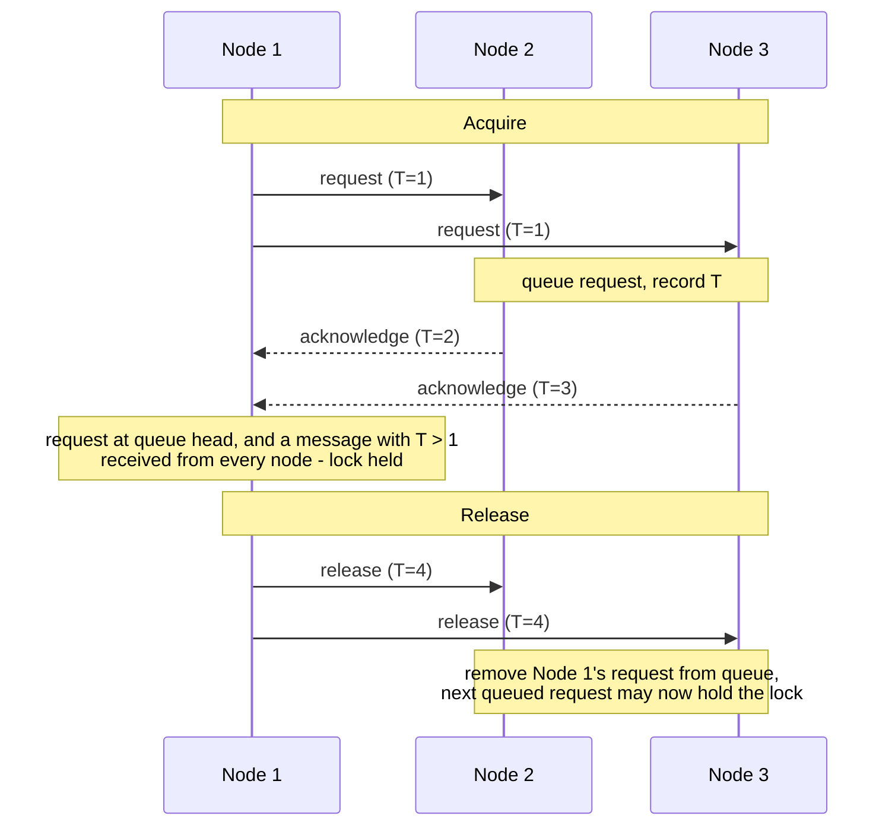

## Purpose

This note records [Lamport's distributed mutual exclusion algorithm](https://lamport.azurewebsites.net/pubs/time-clocks.pdf), which provides locking across a distributed system with no central lock server.

## Core idea

We want the same old mutual exclusion via locking, but across nodes that share no memory. The trick is to keep a consistent ordering of locking events on every node in the system, using [[systems/distributed-systems/clocks|logical clock]] timestamps. Every node maintains the same queue of outstanding requests, ordered by timestamp, so every node independently agrees on who holds the lock.

> [!tip] There is no lock server
> No node grants the lock. Every node runs the same deterministic rule over the same totally ordered request queue, so each one *computes* who holds the lock locally — and they all get the same answer. This is the replicated state machine idea in miniature.

## The algorithm

Each message carries a timestamp $T_m$ and a sequence number. Timestamps are logical clock values with ties broken by node ID, so message ordering is total. The algorithm assumes messages between any two nodes arrive in the order sent.

There are three message types:

- `request`, broadcast to all nodes
- `release`, broadcast to all nodes
- `acknowledge`, sent in reply to a request

Each node maintains:

- a queue of requests ordered by $T_m$
- the timestamp of the last message received from each node in the system

Message handling:

- On receiving `request`: record its $T_m$, add the request to the queue, and reply with an `acknowledge`
- On receiving `release`: record its $T_m$ and remove the sender's request from the queue
- On receiving `acknowledge`: record its $T_m$

To acquire the lock, broadcast a `request`. You hold the lock once both of these are true:

- your `request` is at the head of your queue
- you have received some message timestamped later than your request from every other node, so no earlier request can still be in flight

To release the lock, broadcast `release`, and every node removes your request from its queue.

## Limits

> [!warning] Zero fault tolerance
> Acquiring the lock requires hearing a later-timestamped message from *every* other node, so a single crashed node halts all acquisitions system-wide. The algorithm's value is the idea, not the deployment.

The algorithm tolerates no failures: one crashed node stops every acquisition, since progress requires hearing from every other node. It also costs a broadcast round trip per acquisition. Its value is the idea, using logical timestamps to make every node compute the same total order of lock events, which is the same foundation that replicated state machines build on.

## Related notes

- [[systems/distributed-systems/clocks|clocks]]
- [[systems/distributed-systems/ordering-events-in-distributed-systems|ordering distributed events]]
- [[systems/operating-systems/v2-concurrency/5-synchronizing-access-to-shared-objects|Synchronizing Access to Shared Objects]]
