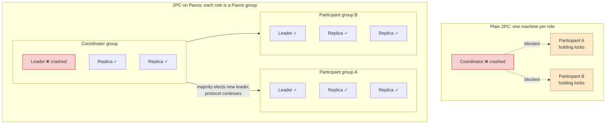
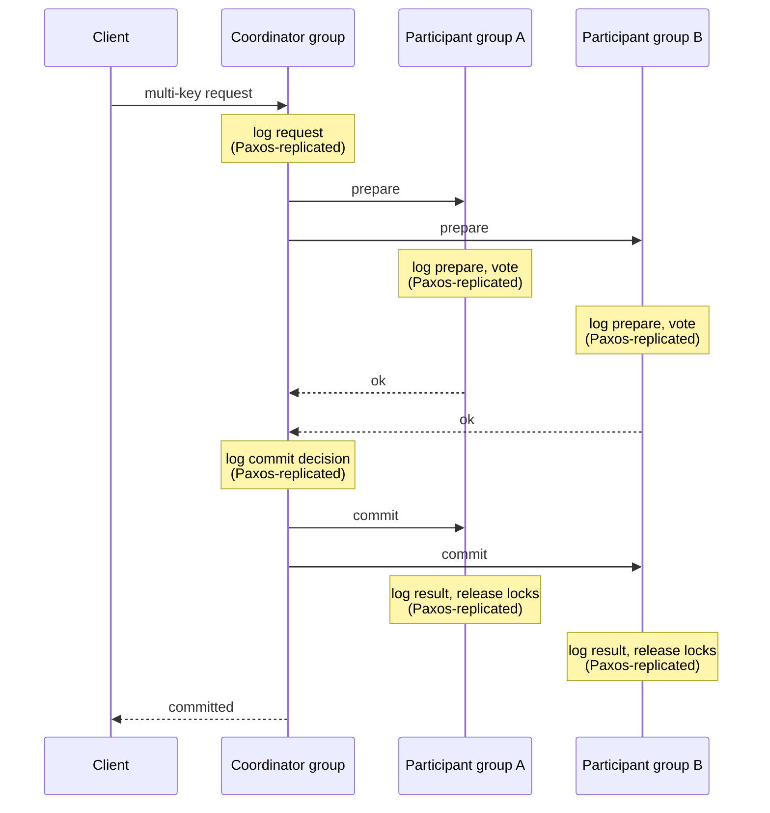

## Purpose

Plain [[systems/distributed-systems/two-phase-commit|two-phase commit (2PC)]] blocks whenever a node it depends on is unavailable, since every participant has to answer before the transaction can move forward. This note explains how running 2PC on top of [[systems/distributed-systems/paxos-intro|Paxos]] removes that blocking, and sketches what multi-key transactions look like in a sharded key-value store built this way.

## Core idea

2PC blocks because each role in the protocol lives on a single machine. If the coordinator dies after participants prepare, the participants sit on their locks until it comes back. The fix is to make the coordinator and each participant a Paxos group managing its own shard. A group keeps making progress as long as a majority of its replicas are up, so no single machine failure can stall the transaction. The protocol then waits on group decisions rather than on individual nodes. Blocking also hurts plain 2PC in quieter ways, for example read-only transactions stuck behind locks, which snapshot reads can relieve.

In the plain version the coordinator's crash strands both participants on their locks. In the Paxos version the same crash costs the coordinator group one replica out of three, a surviving majority elects a new leader, and the transaction proceeds.

## 2PC on Paxos

1. Client requests a multi-key operation at the coordinator group
2. Coordinator logs the request
3. Coordinator sends prepare to the participant groups
4. Each participant group decides commit or abort and logs the result
5. Coordinator sends the commit or abort decision
6. Participant groups record the result

Each "log" step here is a Paxos-replicated log entry, so the decision survives the failure of any minority of a group.

## Multi-key transactions in a KV store

Assume a reader-writer locking scheme and application code that runs on the client. The client makes RPCs to the storage layer to start and end transactions and to read and write values. The KV store acquires and releases locks and does the reads and writes. Keeping the KV store this simple makes application logic easy to change. The server can abandon a transaction and release its locks if the client fails.

Execution then works like this:

- During execution, the client reads and writes objects by contacting the leader of the appropriate Paxos group, which acquires any locks needed
- When the client decides to commit, it notifies the coordinator
  - The coordinator sends `prepare` to every shard involved
  - Each group replicates the prepare entry in its log, then votes `ok` or `abort`
- If every contacted shard votes `ok`, the coordinator sends `commit`
  - Each shard replicates the `commit` entry in its log
  - Each leader releases its locks

## Caution: deadlocks

Deadlocks are easy to trigger when operations span shards. A general solution is to kill transactions that would otherwise wait.

> [!warning] Deadlocks
> Two examples with a checking and savings account at a bank:
>
> - Two clients execute the same transaction concurrently. Both get read locks on the accounts, so neither can acquire write locks, and both stall.
> - Two clients transfer in opposite directions, one from savings to checking and one from checking to savings. Each holds a read lock the other needs, so both stall.

Moving shards between groups can hit the same problem in sharded systems.

## Bigtable and Spanner

Bigtable shipped without distributed transactions, and users complained. Incremental updates make transactions especially valuable. Spanner, Google's multi-datacenter database, runs 2PC over Paxos groups exactly as sketched above, and F1, Google's advertising backend, was rebuilt on top of it.

> [!quote] Spanner paper, section 1
> "The lack of cross-row transactions in Bigtable led to frequent complaints; Percolator was in part built to address this failing." The authors add that some engineers argued transactions should be avoided for their performance cost, but conclude it is better to let application programmers deal with performance problems as bottlenecks arise than to always code around the lack of transactions.
>
> — [Spanner: Google's Globally-Distributed Database (OSDI 2012)](https://static.googleusercontent.com/media/research.google.com/en//archive/spanner-osdi2012.pdf)

## Sources

- [Spanner: Google's Globally-Distributed Database](https://static.googleusercontent.com/media/research.google.com/en//archive/spanner-osdi2012.pdf)

## Related notes

- [[systems/distributed-systems/two-phase-commit|two-phase commit]]
- [[systems/distributed-systems/paxos-intro|Paxos]]
- [[systems/distributed-systems/sharding|sharding]]
