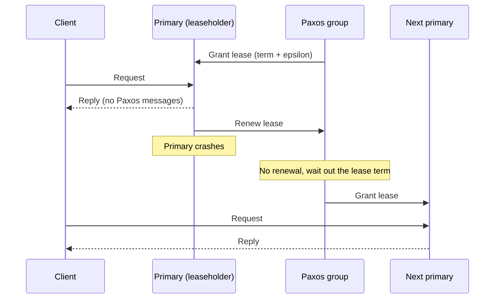

## Purpose

Paxos buys fault tolerance with messages. This note counts what each common replication architecture pays per request. It then shows the standard trick for keeping Paxos out of the hot path, which is to use it as a lease server and let a leaseholder serve requests cheaply.

## Overhead of simple architectures

A single server needs 2 messages per request, the request and the reply. It tolerates no failures.

[[systems/distributed-systems/primary-backup|Primary-backup]] with one backup and a view server needs 4 messages: client to primary, primary forwards to backup, backup acknowledges, primary replies to the client. It handles any one failure.

A Paxos group of size $k$ can make progress as long as a majority of nodes are up. With a stable leader, committing one request costs about $3(k-1) + 2$ messages: the client request and reply account for the 2, and the leader exchanges three rounds with each of the $k-1$ other replicas (accept out, acknowledgment back, commit out).

> [!tip] Pay for what you need
> Each step up buys failure tolerance and costs messages. Pick based on how many simultaneous failures you actually need to survive.

## Paxos as a lease server

A lease is a time-limited right to do something, for example to act as primary. Leases rely on loosely synchronized clocks. A typical lease term is a few seconds, padded by some epsilon to absorb clock drift. The point is to avoid paying the Paxos message cost on every operation. If a leaseholder fails, the system waits for the lease to expire rather than running a failure detector.

The workflow:

1. The Paxos group grants the lease to a primary
2. The primary serves requests until the lease expires, forwarding writes to its backup
3. If the primary fails to renew the lease, the group grants a lease to the next primary

[Chubby](https://static.googleusercontent.com/media/research.google.com/en//archive/chubby-osdi06.pdf), the lock service behind Bigtable at Google, is built this way, and ZooKeeper fills the same role in many open source systems. As long as clock drift stays within the epsilon padding, at most one node holds the lease at a time, which rules out split brain. Since the leaseholder is the unique primary, it can serve reads locally and manage cache invalidation without consulting the group. With write ahead logging you can drop the explicit backup entirely and recover by replaying the log on a fresh primary.

> [!warning] The epsilon carries the safety argument
> Split brain is ruled out only while clock drift stays within the epsilon padding. A leaseholder whose clock runs slow can believe it still holds the lease after the group has granted it to a successor, so the drift bound is a correctness assumption, not a tuning knob.

## Related notes

- [[systems/distributed-systems/paxos-intro|Paxos introduction]]
- [[systems/distributed-systems/paxos-made-simple|Paxos Made Simple]]
- [[systems/distributed-systems/primary-backup|primary backup]]
