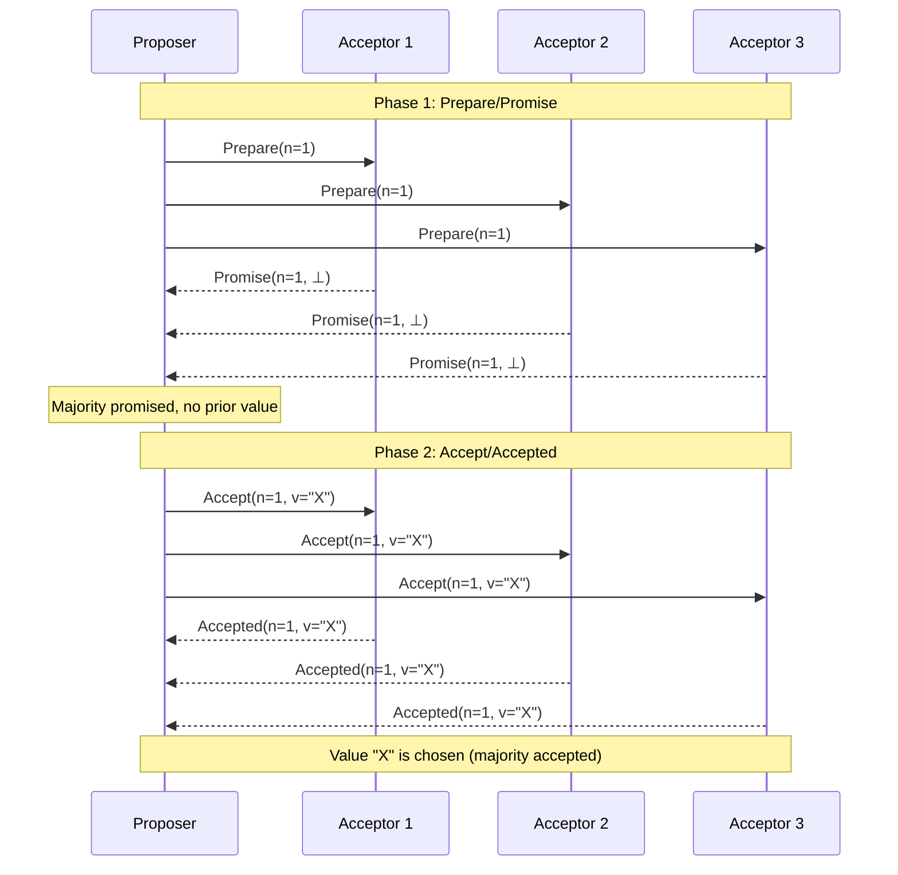

## Purpose

This note is a first pass at Paxos. It states the impossibility result that shapes the design, then walks the two phases of the core protocol in the setting where Paxos actually gets used, state machine replication. [[systems/distributed-systems/paxos-made-simple|Paxos Made Simple]] has the full derivation.

## FLP impossibility result

The [FLP result](https://groups.csail.mit.edu/tds/papers/Lynch/jacm85.pdf) shows that in an asynchronous system where even one process may fail, no deterministic protocol can guarantee consensus terminates. You cannot have guaranteed safety and guaranteed progress at once, so a protocol has to pick which one it will never give up.

Paxos always picks safety. It still makes progress in practice as long as a majority of nodes are up and failures stop long enough for a round to complete, which is the best FLP allows.

> [!abstract] FLP in one sentence
> You cannot guarantee both safety and liveness in an asynchronous system with even one faulty process, so every consensus protocol must choose which property it will sacrifice under adversarial conditions.

## State machine replication

Order client operations into an append-only log and have every replica apply the log in order. Consensus is easy if only one request is in flight at a time, so the standard structure is to elect a leader, send all client requests to it, and let the leader define the ordering. If the leader fails or gets slow, elect a new one, as many times as needed. Each log slot then needs all nodes to agree on one value, and that per-slot agreement is exactly what Paxos provides. It also makes leader election safe, since competing would-be leaders cannot commit conflicting values.

> [!info] State machine replication
> One Paxos instance per log slot. The value chosen for slot i is the ith command everyone executes.

## Paxos, the algorithm



```plaintext
Proposer:
  Prepare(n) -> Promise(n, n', v')
  Accept(n, v) -> Accepted(n, v)

Acceptor:
  Promise(n, n', v') -> Prepare(n)
  Accepted(n, v) -> Accept(n, v)
```

### Phase 1: Prepare

- The proposer selects a proposal number $n$ and sends `Prepare(n)` to all (or a majority) of the acceptors.
- An acceptor that has seen nothing higher than $n$ responds with `Promise(n, n', v')`, where $n'$ is the highest proposal number it has accepted and $v'$ is the value of that proposal. The promise means the acceptor will never accept a proposal numbered less than $n$.
- The proposer waits for a majority of promises before proceeding.

### Phase 2: Accept

- Once the proposer has a majority of promises, it sends `Accept(n, v)` to the acceptors, where $v$ is the value of the highest-numbered proposal reported in the promises, or the proposer's own value if no promise reported one. Adopting the highest reported value is what keeps an already-chosen value from being overwritten.
- Each acceptor that has not promised a higher number accepts and responds with `Accepted(n, v)`.
- Once a majority of acceptors accept, the value is chosen.

## Related notes

- [[systems/distributed-systems/paxos-made-simple|Paxos Made Simple]]
- [[systems/distributed-systems/paxos-architecture|Paxos architecture]]
- [[systems/distributed-systems/ordering-events-in-distributed-systems|event ordering]]
