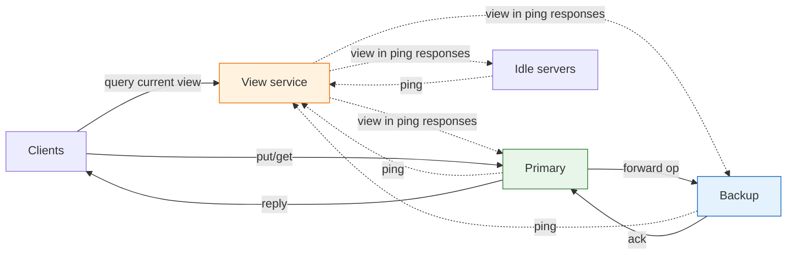
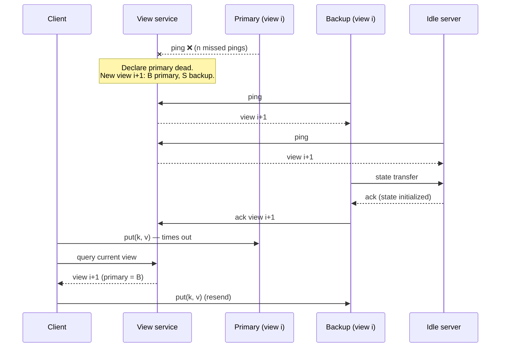

## Purpose

A single node keeps itself consistent by applying operations in one well-defined (serializable) order. The hard part is staying available and consistent at the same time: the system has to look like a single machine even while servers inside it fail. This note covers state machine replication, the primary-backup scheme, and the view service that decides who the primary is.

## Single node KV store

Consider an instance of redis with multiple clients reading and writing to it. Abstractly this is a state machine, where each client operation transitions the system from one state to the next.

### State machine replication

Replicate the state machine across multiple servers. If every server applies the same operations in the same order, every server ends in the same state. This holds as long as the effect of each operation is deterministic.

#### Example: virtual machine replication

Take a single VM running a single application. Create $n$ copies of the VM and feed each copy exactly the same inputs (packets, interrupts, instructions). All $n$ VMs then behave identically. VMware built a production fault tolerance system on this idea; the [VM-FT paper](https://pdos.csail.mit.edu/6.824/papers/vm-ft.pdf) describes it.

Any randomness in the system has to be made deterministic, for example by fixing seeds. This replication mechanism also assumes a single core, since multi-core interleavings are a source of nondeterminism.

### Two servers (primary-backup)

At any given time, clients speak to only one server, the primary. Data is replicated on the primary and backup servers, and if the primary fails, the backup becomes the new primary. The point is to keep the system available and reliable through failures.

#### Basic operations

- Clients send operations (`put`, `get`) to the primary.
- The primary decides the order of operations.
- The primary forwards operations to the backup.
- The backup applies operations in the same order as the primary (hot standby), or just saves a log of the operations (cold standby).
- After the backup applies the operation, the primary replies to the client.

#### Key assumptions

- Every replica executes deterministically as a function of its inputs.
- If randomness is used, it must be deterministic (same seed everywhere).
- Servers are single core.

#### Key challenges

- There can only be one primary at a time.
    - Primary, backup, and clients all need to agree on who the primary is.
    - State at the primary must be consistent with all previous operations.
- The system must keep operating despite failures of the primary or backup.
    - It must handle dropped messages, duplicated messages, and arbitrary delays.

## The view service

The view service is a server that provides a consistent view of the system. Clients ask it for the primary's address to find out where to send operations. Even if the view service misjudges a failure, the system stays consistent, because the view service is the single authority on who the primary is.

> [!tip] One authority on who is primary
> The key insight is that the view service is the single authority on who the primary is. Failure detection can be wrong (a slow or partitioned server is not dead), but wrong detection only costs availability, never consistency: servers and clients act on views, not on their own guesses about liveness.

That authority makes it a single point of failure. The hard part is guaranteeing only one primary at a time without making every operation check in with the view service.

Dashed edges carry pings and view updates; solid edges carry client operations. Operations never pass through the view service.

### Detecting server failures

- Each server periodically sends an RPC ping to the view service.
- The view service declares a server dead once it has missed $n$ pings in a row, and alive once a single ping arrives.

When the view service detects a failure, it creates a new view, which is the system state it sends back in ping responses.

### Primary failures

- The view service detects the failure after $n$ missed pings.
- It declares a new view with the backup as the new primary, and an idle server as the new backup if one is available.
    - In-flight client requests eventually time out, and the client checks back in with the view service.
- The view service sends the new view in all subsequent ping responses.
- The new primary hears the new view and sends its state to the new backup.
- The backup initializes its state and acknowledges the new primary.
- The new primary acknowledges the current view to the view service.
- The client hears about the new view and starts sending operations to the new primary, resending any operations that were lost.

If the primary dies with no idle servers available, the backup becomes the primary and there is no backup.

### Managing servers

Keep a pool of idle servers that can be promoted. If the primary dies, the new view has the old backup as primary and an idle server as backup. If the backup dies, the new view has an idle server as the new backup.

## Split brain

A primary that appears offline may really just be partitioned from the view service, which will elect a new primary anyway. Now two servers each believe they are the primary. This is split brain. Correctness survives it as long as believing is all they do: the protocol must ensure that at most one server can ever act as primary. The rules below arrange that, since the old primary cannot complete operations without the backup accepting its forwarded requests.

> [!danger] Split brain
> A partitioned primary keeps serving clients that can still reach it, while the view service promotes the backup. Two servers now believe they are the primary. The rules below make believing harmless: the old primary must forward every operation to its backup before replying (rule 2), and the backup rejects forwarded requests once its view has moved on (rule 3). So the old primary can no longer complete any operation, and at most one server ever *acts* as primary.

## Rules

1. The primary in view $i + 1$ must have been the backup or the primary in view $i$ (except in the first view).
2. The primary must wait for the backup to accept and execute each operation before replying to the client (if a backup exists).
3. The backup must accept forwarded requests only if its view is current.
4. A non-primary must reject client requests.
5. Every operation must happen entirely before or entirely after any state transfer.

## Sources

- [The Design of a Practical System for Fault-Tolerant Virtual Machines](https://pdos.csail.mit.edu/6.824/papers/vm-ft.pdf)

## Related notes

- [[systems/distributed-systems/consistency|consistency]]
- [[systems/distributed-systems/google-file-system|Google File System]]
- [[systems/distributed-systems/paxos-architecture|Paxos architecture]]
