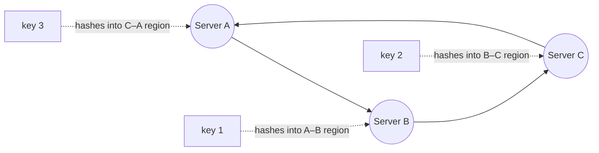

## Purpose

Sharding is deciding which server owns which keys. This note covers the two assignment schemes I've seen most, consistent hashing and indirection tables, and the load problems each one runs into.

## Consistent hashing

The classic approach hashes keys and servers into the same modular space, and each shard owns the region between itself and its neighbor. This is consistent hashing, and [Dynamo](https://www.allthingsdistributed.com/files/amazon-dynamo-sosp2007.pdf) is the well-known production example.

Arrows around the circle are the ring order. A key belongs to the first server clockwise from where it hashes, so each server owns the region between its predecessor and itself.

It works, but it has drawbacks:

- **Load imbalance**: random placement of servers on the ring gives some shards much larger regions than others, so load skews even when keys are uniform. Dynamo counters this with virtual nodes, placing each server at many points on the ring.
- **Hotspots**: a few very popular keys can overload whichever shard owns them, and the hash placement gives you no way to split just those keys off.
- **Data migration**: adding a shard means moving the keys in the region it takes over, which is expensive.

> [!warning] Hot shards are invisible to the hash
> Consistent hashing balances *regions*, not *load*. A handful of very popular keys can overload whichever shard owns them, and because placement is fixed by the hash function, there is no way to split off just those keys without changing the scheme.

## Indirection tables

A cooler approach in my opinion. Put a table of `hash(key) -> server address` on every client, with many more table entries than servers. Load balancing then becomes table assignment: give fewer entries to servers whose entries hold more or hotter keys. Broadcast table changes to every client server. Moving one table entry migrates a small slice of keys, so rebalancing is cheap and targeted.

> [!tip] Resharding cost is the real difference
> With consistent hashing, rebalancing means taking over a contiguous ring region and moving every key in it. With an indirection table, reassigning a single entry moves only that small slice of keys, so the system can respond to hot spots with cheap, targeted migrations.

## Related notes

- [[systems/distributed-systems/scaling-web-services|scaling web services]]
- [[systems/distributed-systems/load-balancing|load balancing]]
- [[systems/distributed-systems/dynamo-db|Dynamo]]
