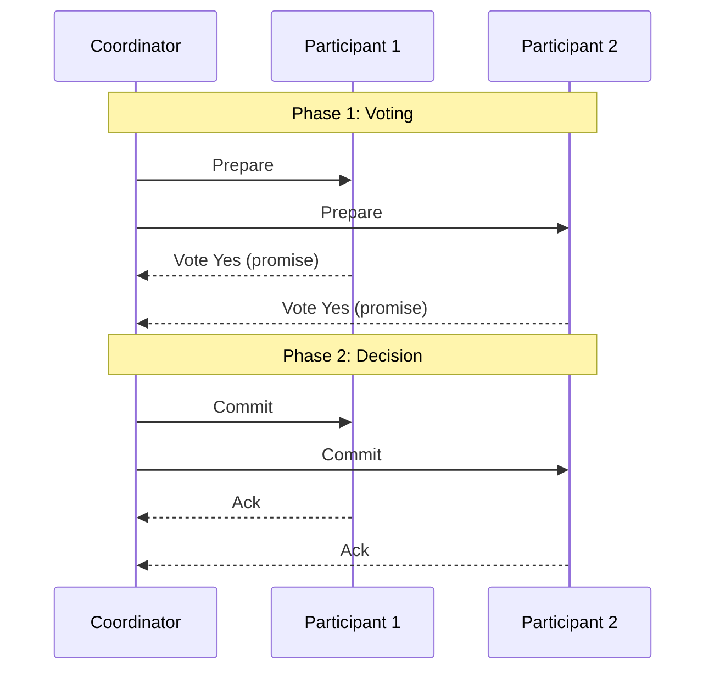
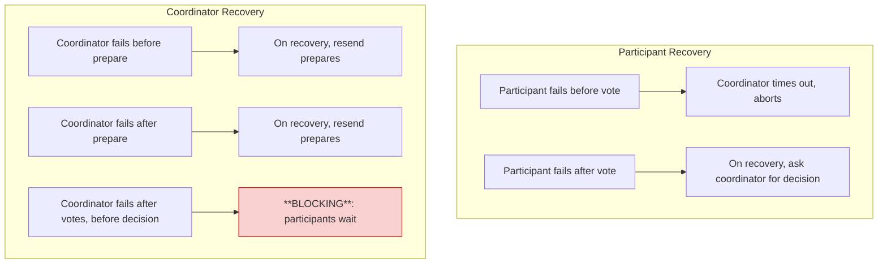

## Purpose

Updates that span multiple keys, or multiple storage systems, need all-or-nothing semantics so failures leave the data in a sane state. Two-phase commit (2PC) is the protocol that makes a distributed transaction, a group of operations across nodes, commit or abort as a unit. This note covers the machinery 2PC builds on (locking and logging), the protocol itself, its failure handling, and why it blocks.

> [!warning] 2PC blocks
> 2PC is a **blocking** protocol. If the coordinator fails after participants vote yes, all yes-voting participants must hold their locks and wait for recovery. For non-blocking alternatives, see [[systems/distributed-systems/non-blocking-two-phase-commit|2PC over Paxos]].

## ACID

2PC exists to give distributed transactions the ACID properties:

| Term | Description |
|---|---|
| Atomic | Operations appear to either happen as a group or not at all |
| Consistent | The system satisfies linearizability (or some other chosen consistency model) |
| Isolated | Transactions don't see the intermediate results of other transactions, only the effects of ones that already committed |
| Durable | Operations that complete stay completed |

## Two phase locking (2PL): consistency and isolation

In 2PL, a transaction acquires locks on all structures it touches and releases them only on commit or abort:

```plaintext
- start transaction -
Phase 1: acquire locks
- commit or abort -
Phase 2: release locks
```

Holding every lock until the end is what makes multi-key transactions look isolated, since no other transaction can observe a half-done state.

## Redo logging: atomicity and durability

Log all changes to disk, followed by a log commit record. If a crash happens before the commit record hits the log, abandon the transaction. If the commit record made it, redo the logged changes. Either way the transaction lands entirely or not at all.

## Deadlock

Deadlock is when two or more transactions wait for locks held by each other in a cycle. Detection plus killing one transaction breaks the cycle. Prevention is generally the better idea, and a consistent global ordering on lock acquisition achieves it, since a cycle needs someone to acquire locks against the order.

## Distributed transactions

The two generals problem (see [[systems/distributed-systems/RPC|RPC]]) rules out agreeing to perform an action at the same physical time. Instead the nodes agree on a virtual time, an ordering position, at which the operation happens.

### Atomic commit protocol (ACP)

The properties we want:

- Every node arrives at the same decision
- Once a node decides, it never changes its decision
- The transaction is committed only if all nodes vote yes
- If all processes vote yes, the transaction is normally committed
- If all failures are eventually repaired, the transaction is eventually either committed or aborted

## 2PC in detail

### Roles

- Participants: nodes that must update data relevant to the transaction
- Coordinator: the node responsible for executing the protocol (it might also be a participant)

### Messages

- Prepare: can you commit the transaction?
- Commit: commit the transaction
- Abort: abort the transaction

### The protocol



> [!tip] A yes vote is a promise
> When a participant votes yes, it promises to commit if told to. This means acquiring locks and writing to the redo log *before* voting, so the transaction can survive crashes.

- The coordinator sends prepare to every participant
- Each participant votes, and a yes vote is a promise
  - It acquires locks to prevent or delay conflicting operations
  - It votes abort on deadlock or if any of its operations cannot be completed
- The coordinator collects the votes, decides, tells everyone, and the locks get released

2PC is a blocking protocol. It makes no progress while a participant or the coordinator is unavailable at the wrong moment, so it is fault tolerant without being highly available. That limit is fundamental to the protocol, and [[systems/distributed-systems/non-blocking-two-phase-commit|2PC over Paxos]] is the standard way around it.

### Handling failures

Every role logs its state transitions before sending messages, which is what makes the recovery cases below work.



#### Participant fails before sending its vote

The coordinator keeps a timer and retries the prepare. Past some threshold it logs a no vote on the participant's behalf and aborts. If the participant later comes back, it asks the coordinator for the decision and learns of the abort.

#### Participant fails after sending its vote

If the participant recovers before the decision is sent, the protocol continues normally. Otherwise it finds the pending transaction in its log on recovery and requests the decision from the coordinator, which resends it, and the protocol continues.

#### Coordinator fails before sending prepares

The coordinator logged the client request, so on recovery it picks the transaction back up and sends the prepares.

#### Coordinator fails after sending prepares

The prepare is in the coordinator's log, so on recovery it resends the prepares. Participants that already voted just repeat their votes.

> [!danger] The blocking case
> The coordinator fails after participants vote yes and before any decision arrives. Every yes-voting participant has promised to commit, so it **must hold its locks and wait** for the coordinator to recover. This is the fundamental limitation of 2PC.

The painful case is the coordinator failing after participants vote yes and before any decision arrives. Every yes-voting participant has promised to commit, so it must hold its locks and wait for the coordinator to recover. That wait is the blocking behavior named above.

## Related notes

- [[systems/distributed-systems/non-blocking-two-phase-commit|non-blocking two-phase commit]]
- [[systems/distributed-systems/consistent-global-state|consistent global state]]
