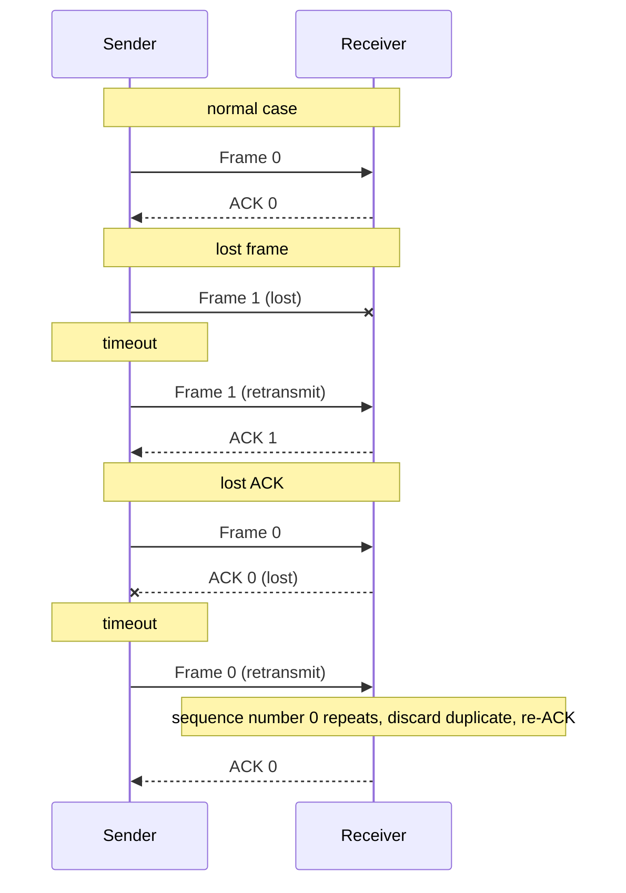
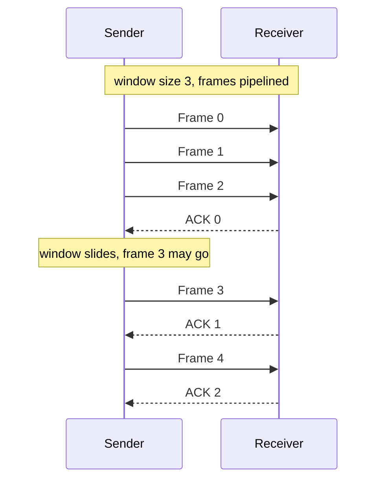

## Purpose

Frames get lost or corrupted, and [[systems/networks/2-direct-links/errors|error detection]] only tells you something went wrong. Retransmission is how the link recovers. This note covers ARQ, the family of protocols that acknowledge good frames and resend the rest.

## Automatic Repeat reQuest (ARQ)

ARQ is used when errors are common or must be corrected, wireless links being the usual example. The receiver acknowledges each correctly received frame, and the sender retransmits any frame that isn't acknowledged before a timeout.

- **Stop-and-wait ARQ**: send one frame, wait for its ACK, send the next.
- **Sliding window ARQ**: send up to $n$ frames before requiring an ACK. With window size $n$, the sender moves $n$ frames per RTT.
- **Go-back-N ARQ**: a sliding window where a lost frame forces the sender to retransmit that frame and everything after it.

Stop-and-wait, with the two failure cases every ARQ scheme has to handle:



> [!warning] Duplicates are the sneaky case
> A lost ACK and a lost frame look identical to the sender, so it retransmits either way. Without sequence numbers the receiver would accept the retransmission as new data. The sequence number is what lets it discard the duplicate and just re-ACK.

### Timeouts

The timeout can't be too long, or the link sits idle after a loss. It can't be too short, or the sender retransmits frames that were fine. Timeouts are easy to set on a LAN, where latency is predictable, and hard over the Internet, where it varies widely.

### Sequence numbers

Frames and ACKs both carry sequence numbers so the sender knows exactly which frames got through. Stop-and-wait only needs a single bit, 0 or 1, since one frame is in flight at a time. Sliding window and go-back-N number frames modulo $2^k$.

### Limitations of stop-and-wait

Only one frame is outstanding at a time, so the link carries at most one frame per RTT no matter how fat it is. That's fine on a LAN and wasteful on any link with a high [[systems/networks/1-physical/coding-and-modulation|bandwidth-delay product]], where keeping the pipe full requires many frames in flight.

Sliding window fixes this by pipelining. New frames go out as ACKs come back, so the window stays full:



## Pseudocode sketches

These are illustrative sketches, real implementations track timers and sequence numbers per frame.

```python
# Stop and Wait ARQ
def sender():
    while True:
        frame = create_frame()
        send_frame(frame)

        ack_received = wait_for_ack()

        if ack_received:
            break

def receiver():
    while True:
        frame = receive_frame()
        process_frame(frame)

        send_ack()
```

```python
# Sliding Window ARQ
def sender():
    window_size = 3
    frames = [create_frame() for _ in range(window_size)]
    send_frames(frames)

    acknowledged_frames = wait_for_acknowledgment()

    # Move window forward
    frames = frames[len(acknowledged_frames):] + [create_frame()]
    send_frames(frames)

def receiver():
    while True:
        frames = receive_frames()
        process_frames(frames)

        send_acknowledgment()
```

```python
# Go-Back-N ARQ
def sender():
    window_size = 3
    frames = [create_frame() for _ in range(window_size)]
    send_frames(frames)

    while True:
        acknowledged_frames = wait_for_acknowledgment()

        if not acknowledged_frames:
            resend_frames(frames)

def receiver():
    expected_frame = 0

    while True:
        frames = receive_frames()

        for frame in frames:
            if frame.sequence_number == expected_frame:
                process_frame(frame)
                expected_frame += 1

        send_acknowledgment()
```

## Related notes

- [[systems/networks/2-direct-links/errors|error detection]]
- [[systems/networks/2-direct-links/framing|framing]]
