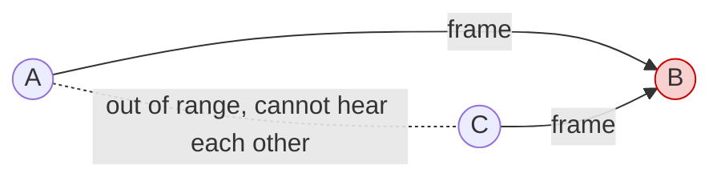
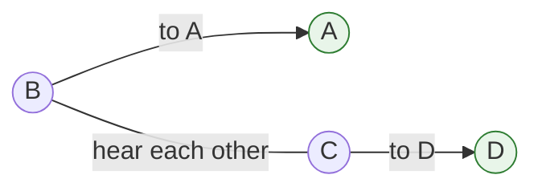
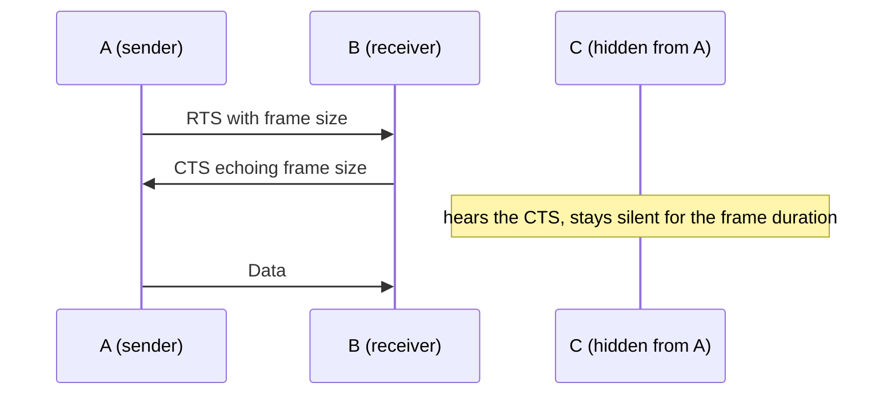

## Purpose

Wired [[systems/networks/2-direct-links/multiple-access|multiple access]] leans on carrier sense, and carrier sense breaks down over the air. This note covers why, the two classic failure modes, and the protocols WiFi and cellular use instead.

## Why wireless is different

The wireless medium is an unbounded region of space rather than a wire with two ends, so what the sender hears tells it little about what the receiver hears. Collisions matter at the receiver, and the sender can't observe them there. On top of that, a node cannot hear the network while it is transmitting, so collision detection in the Ethernet style is off the table.

## Hidden terminal problem

Two nodes sit out of range of each other, both in range of a third node between them. Each sender hears a quiet channel, so both transmit, and their frames collide at the node in the middle. Carrier sense gave the wrong answer.

A and C each hear silence, both send, and the frames collide at B.

## Exposed terminal problem

Two nearby nodes send to different receivers that are out of each other's range. Each sender hears the other and backs off, even though both transmissions would have succeeded. Carrier sense gave the wrong answer in the other direction, wasting capacity instead of causing collisions.

Both transmissions would succeed at their receivers, but B and C hear each other and needlessly back off.

## Multiple Access with Collision Avoidance (MACA)

MACA drops carrier sense for a short handshake. Collisions remain possible, on the handshake itself, but become much less likely.

1. **Request to Send (RTS)**: the sender asks the receiver for the channel.
2. **Clear to Send (CTS)**: the receiver grants it, echoing the frame size.
3. **Data**: the sender transmits while nodes that heard the CTS stay silent for the frame's duration.

The handshake fixes both problems above. A hidden terminal hears the receiver's CTS even though it can't hear the sender, so it stays quiet. An exposed terminal hears the RTS but no CTS, so it knows its own transmission won't interfere.

## 802.11 (WiFi)

Clients connect to the network through an **access point (AP)**.

### Physical layer

- 20/40 MHz channels on unlicensed ISM bands. 802.11b/g/n run on 2.4 GHz, 802.11a/n on 5 GHz.
- OFDM modulation, except legacy 802.11b. Amplitude and phase choices adapt to the SNR, giving rates from 6 to 54 Mbps plus error correction.
- 802.11n adds multiple antennas.

### Link layer

- Multiple access is CSMA/CA. The RTS/CTS handshake is optional.
- Frames are ACKed and retransmitted with [[systems/networks/2-direct-links/retransmission|ARQ]].
- Frames carry three addresses because traffic relays through the AP.
- A 32-bit CRC detects errors.
- The standard also covers encryption and power saving.

## Centralized MAC: cellular

Cellular runs on licensed spectrum, which is scarce and heavily regulated, so the design centralizes control. The base station coordinates the mobiles' transmissions, and that tight control buys QoS guarantees and robustness that distributed access can't promise.

GSM's MAC uses FDMA/TDMA with random access plus backoff for channel requests. One channel carries coordination traffic, the rest carry data, and a dedicated channel supports QoS.

## Related notes

- [[systems/networks/2-direct-links/multiple-access|multiple access]]
- [[systems/networks/1-physical/media|media]]
