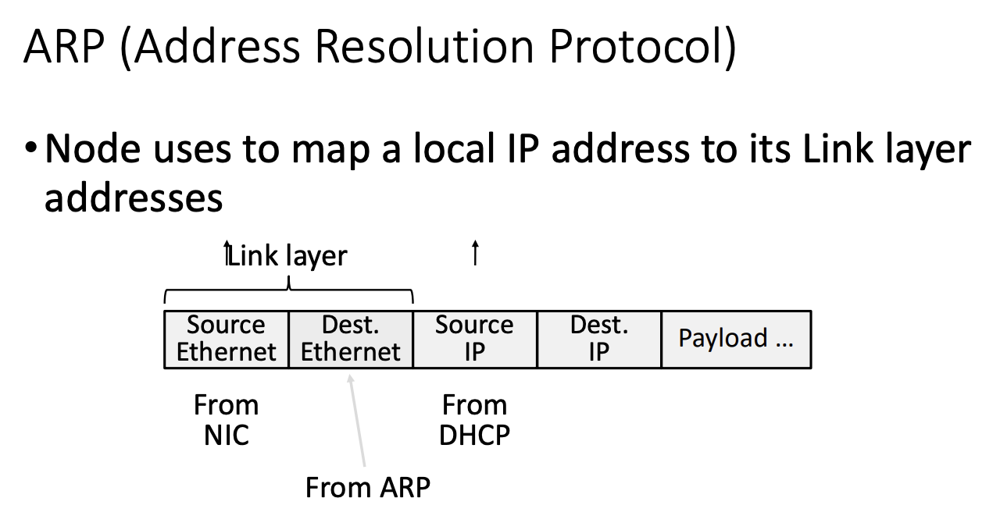
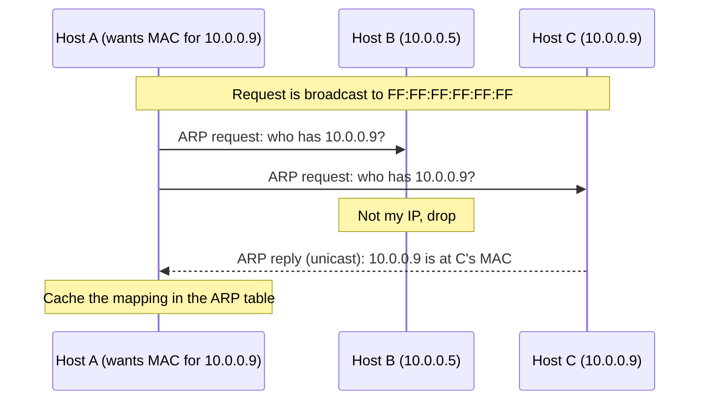

## Purpose

Explain how a host turns an IP address into a MAC address so it can deliver a packet over the local link. Covers the ARP table and the request and reply exchange that fills it.

## Core idea

ARP ([RFC 826](https://datatracker.ietf.org/doc/html/rfc826)) maps IP addresses to MAC addresses. IP forwarding decides which machine on the local network should get the packet, and ARP supplies the link layer address the frame needs to actually reach it (see [[systems/networks/3-network/internetworking|internetworking]] for the forwarding side). ARP sits directly on top of the link layer and uses no servers or routers, which it can't anyway, since a host needs ARP working before it can talk to anything by IP.

ARP is one example of a discovery protocol, meaning a protocol for finding devices on a network. Zeroconf and Apple's Bonjour are others. Discovery protocols usually rely on broadcast, because broadcast is the only way to reach a device whose address you don't know yet.

This slide shows where the fields of an outgoing frame come from. The NIC provides the source MAC, ARP provides the destination MAC, and [[systems/networks/3-network/DHCP|DHCP]] provided the host's own IP in the first place.



## ARP table

Each host caches the mappings it has learned in an ARP table held in memory. You can inspect yours:

```bash
arp -a
```

## ARP request

When a device wants to send a packet to another device on the same network, it first checks its ARP table for the destination IP. On a miss, it broadcasts an ARP request to the MAC address `FF:FF:FF:FF:FF:FF`, asking who owns the destination IP.

## ARP reply

The request reaches every node on the link, but only some act on it. The node that owns the requested IP sends back an ARP reply carrying its MAC address. Nodes that already have an entry for the sender can use the request to refresh that entry. Everyone else drops the request.

The full exchange, with the request broadcast to the link and the reply unicast back:



## Related notes

- [[systems/networks/3-network/internetworking|internetworking]]
- [[systems/networks/3-network/DHCP|DHCP]]
