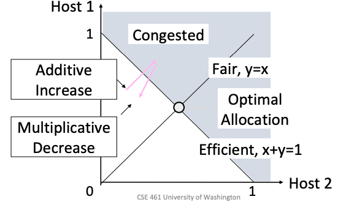
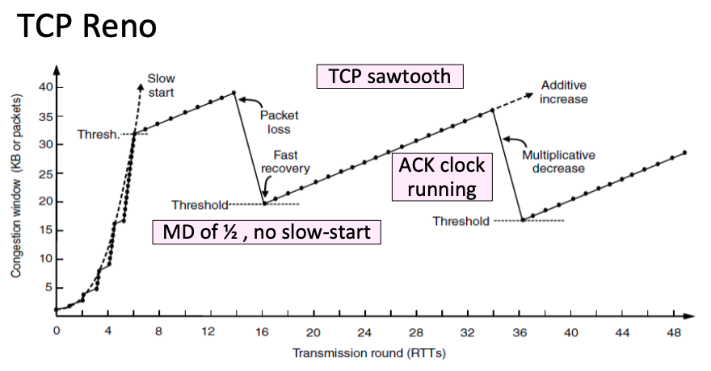

## Purpose

Cover the connection-oriented machinery of TCP, from setup and teardown through retransmission timers, then work through congestion control, which is where most of the interesting design lives. The protocol itself is specified in [RFC 9293](https://datatracker.ietf.org/doc/html/rfc9293).

## Connection establishment

Both sides must be ready to transfer data and must agree on parameters like the maximum segment size before any data flows.

### Three-way handshake

Each side probes the other with a fresh Initial Sequence Number (ISN). A side announces its ISN in a SYNchronize segment, and the peer echoes it back in an ACKnowledge segment.

1. Client sends SYN(x)
2. Server replies with SYN(y)ACK(x+1)
3. Client replies with ACK(y+1)

Lost SYNs are retransmitted. The fresh ISNs make the handshake robust against stale segments from earlier connections, at the cost of one extra round trip before data can flow.

### Connection release

TCP closes in two halves. Each side finishes sending its data and sends a FIN segment, and each FIN closes one direction of the connection.

1. The active closer sends FIN(x), the passive side ACKs
2. The passive side sends FIN(y), the active side ACKs

Lost FINs are retransmitted, just like SYNs.

### TIME_WAIT state

After the final exchange, the active closer waits twice the maximum segment lifetime before fully closing. The final ACK may have been lost, in which case the peer will retransmit its FIN and someone has to be around to answer it. Waiting also keeps old segments from this connection from being misread as part of a new connection on the same port pair.

## Retransmission timeout

Picking the timeout is a real problem because RTT varies widely with queueing and routing. Set it too small and you retransmit segments that were merely delayed. Set it too large and you sit idle after a real loss.

TCP uses an adaptive timeout that tracks a smoothed RTT estimate and its variance with exponentially weighted moving averages:

$$SRTT_{N+1} = (1 - \alpha) \cdot SRTT_N + \alpha \cdot RTT_{N+1}$$

$$Svar_{N+1} = (1 - \beta) \cdot Svar_N + \beta \cdot |RTT_{N+1} - SRTT_{N+1}|$$

The timeout is the smoothed RTT plus a multiple of the variance as a safety margin. This works well in practice, though a sudden shift in path RTT can still throw the estimate off until the averages catch up. The standardized version of this computation is [RFC 6298](https://datatracker.ietf.org/doc/html/rfc6298).

## Congestion

Congestion is a traffic jam in the network. Switches and routers keep internal buffers per output port, and those queues absorb short bursts fine. When the input rate stays above the output rate for long enough, the queue fills and packets drop. Congestion depends on traffic patterns, so it can happen even when the network as a whole has spare capacity.

Ideally throughput would climb toward link capacity as offered load grows. In practice throughput drops sharply past a certain load. This is congestion collapse. Dropped packets time out, senders retransmit, the retransmissions add load, and more packets drop. The feedback loop can push a network into a state where almost no useful data gets through. TCP's job is to run each sender as close to the congestion point as possible without tipping over it.

### Bandwidth allocation and fairness

Deciding who gets how much bandwidth resembles CPU scheduling. Giving every TCP connection an equal share is not obviously fair, since one user or one application can open many connections. In practice TCP allocates per flow.

The bottleneck for a flow is the link that limits its bandwidth. Equal per-flow fairness shares each bottleneck link equally among the flows crossing it. The cleaner formalization is max-min fairness, the allocation that maximizes the minimum bandwidth any flow gets. You can find it by imagining water poured into the network. Rates rise together until some link saturates, the flows bottlenecked there are frozen at their share, and the remaining flows keep rising. When flows start or stop, the allocation has to be recomputed.

Allocating bandwidth fairly and efficiently at once is hard. Senders come and go, load shifts constantly, and no single entity sees the whole network. The working solution is to have every sender continuously probe the network and adapt its rate to feedback. The design space:

- Open loop (reserve bandwidth before use) versus closed loop (measure and adjust as you go)
- Host support versus network support for setting and enforcing allocations
- Window-based versus rate-based control

TCP is closed-loop, host-driven, and window-based, with packet drops as the feedback signal. Nothing physically stops a sender from running a greedier algorithm, so the scheme relies on hosts cooperating. Different TCP implementations also use different congestion signals:

| Signal | Protocol | Tradeoff |
| ------ | -------- | -------- |
| Packet loss | TCP NewReno, Cubic (Linux default) | Simple, but the signal arrives late |
| Packet delay | TCP BBR (used by YouTube) | Earlier warning, but congestion must be inferred |
| Explicit notification from routers | TCPs with ECN | Fast and unambiguous, but routers must support it |

### AIMD

Additive Increase, Multiplicative Decrease is the control law hosts use to converge on a good allocation. While the network is not congested, add a small constant to the rate. When congestion is detected, multiply the rate down.

Picture two hosts sharing a link of capacity 1, with $x$ the bandwidth of H1 and $y$ the bandwidth of H2. Fair allocations satisfy $x = y$ and efficient ones satisfy $x + y = 1$. On this plot, additive increase moves the operating point diagonally, parallel to the fair line, and multiplicative decrease moves it back along the line toward the origin. Each cycle ends closer to the intersection of the fair and efficient lines, so the allocation converges there.

The repeated increase-then-halve cycle produces the sawtooth pattern in TCP's sending rate over time.

## Slow start and TCP Tahoe

The sender maintains a congestion window, cwnd, and sends at roughly cwnd/RTT, using packet loss as the congestion signal. A new connection wants to reach the right window fast without blasting the network on the way up.

Slow start does this with exponential growth. Send one packet, then two after the first ACK, then four, doubling each RTT (cwnd increases by 1 per ACK). Growth continues until loss or until cwnd crosses the threshold ssthresh, at which point the sender switches to additive increase, adding about one packet per RTT (cwnd increases by 1/cwnd per ACK).

Tahoe puts these together:

- Start in slow start with cwnd = 1 (or another small value)
- On crossing ssthresh, switch to additive increase
- On packet loss, set ssthresh = cwnd / 2, reset cwnd = 1, and slow start again

Resetting to cwnd = 1 is necessary in Tahoe because a timeout means the ACK clock is gone, and slow start is how TCP rebuilds it. It is conservative and costs a lot of throughput per loss.

### Inferring loss before timeout: fast retransmit

TCP ACKs are cumulative, carrying the highest in-order sequence number received. When a segment goes missing, later segments trigger duplicate ACKs stuck at the gap. Three duplicate ACKs let the sender conclude the segment was lost and retransmit it immediately, without waiting for a timeout. The sender also halves cwnd. This is fast retransmit.

### Fast recovery and Reno

Duplicate ACKs carry a second piece of information. Each one means some packet did arrive, just out of order, so the network is still delivering. Fast recovery uses this to keep the ACK clock running after a fast retransmit. Instead of collapsing to cwnd = 1, the sender continues at the halved window, sending one new segment per duplicate ACK. The result is the classic sawtooth without the slow start dips:

Fast recovery only works when duplicate ACKs keep arriving. If several packets in a row are lost, the ACK stream dries up, the sender times out, and it falls back to slow start at cwnd = 1.

### Reno, NewReno, and SACK

- Reno repairs one loss per RTT. Multiple losses in a window usually force a timeout.
- NewReno repairs multiple losses in a window without timing out.
- Selective ACKs (SACK) let the receiver report received ranges, so the sender can see all the holes and retransmit several lost segments at once.

## Router-assisted schemes

### Explicit Congestion Notification (ECN)

Routers mark packets when congestion builds, before the queue overflows, and the receiver echoes the mark back to the sender. The sender reacts as it would to loss, but no packet was dropped, so nothing needs retransmitting and no timeout is risked. The cost is that both routers and hosts must implement it. ECN is common in data centers, where the operator controls both.

### Random Early Detection (RED)

Without ECN support in hosts, routers can still signal early by dropping packets at random before the queue is full, with drop probability rising as the queue fills. Senders see the drops and back off before hard congestion sets in.

## Related notes

- [[systems/networks/4-transport/flow-control|flow control]]
- [[systems/networks/4-transport/ACK-clocking|ACK clocking]]
- [[systems/networks/4-transport/transport-overview|transport layer overview]]
- [[systems/networks/2-direct-links/retransmission|retransmission]]
