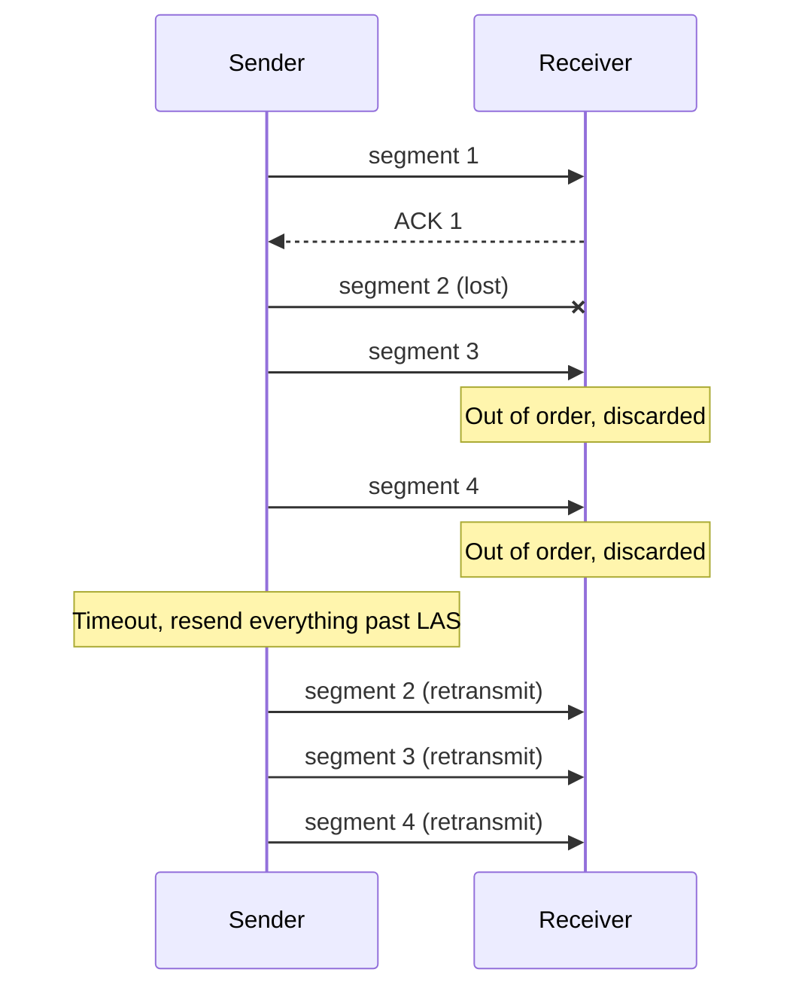
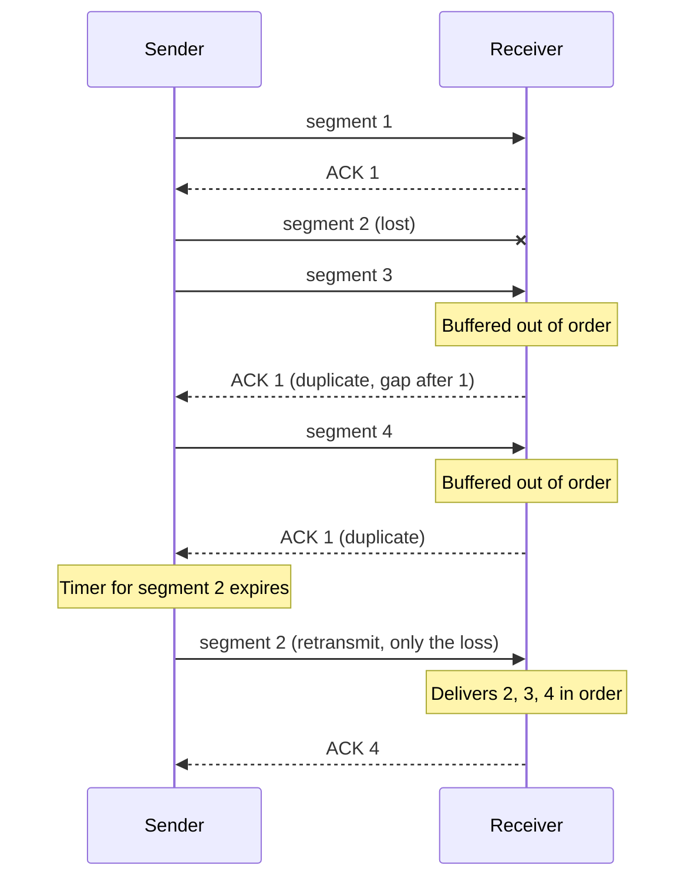

## Purpose

Work out how sliding window ARQ keeps a link busy without overrunning the receiver. Covers the sender and receiver state, the Go-Back-N and Selective Repeat recovery schemes, how many sequence numbers each needs, and how to pick the window size from the bandwidth-delay product.

## Core idea

Stop-and-wait ARQ allows one outstanding packet at a time, so the sender idles for a full round trip after every packet. Sliding window ARQ fixes this by allowing up to $w$ unacknowledged packets in flight. The sender keeps transmitting until the window fills, which means it can move $w$ packets per RTT instead of one.

## Sizing the window

The window has to cover the data the path can hold over one round trip. That amount is the bandwidth-delay product taken over the RTT, $R \times RTT$.

Worked example. Assume $10$ kb packets, rate $R = 1$ Mbps, and one-way delay $d = 50$ ms, so $RTT = 2d = 100$ ms. The data in flight needed to keep the link busy is

$$R \times RTT = 10^6 \times 0.1 = 100{,}000 \text{ bits}$$

Dividing by the packet size gives the window:

$$w = \frac{100{,}000}{10{,}000} = 10 \text{ packets}$$

With $w \geq 10$ the sender never stalls waiting for ACKs. A smaller window caps throughput at $w \times 10{,}000$ bits per RTT.

## Sliding window sender

The sender buffers up to $w$ segments until they are ACKed. It tracks two variables. LFS is the sequence number of the last frame sent, and LAR is the sequence number of the last ACK received. The sender may transmit whenever

$$LFS - LAR \leq w$$

so at most $w$ frames are unacknowledged at any time.

## Sliding window receiver

The receiver side determines what happens on loss. Two standard schemes trade buffer space against retransmission cost.

### Go-Back-N ARQ

The receiver keeps a single packet buffer and tracks LAS, the sequence number of the last ACK sent. When a segment arrives with sequence number $LAS + 1$, the receiver accepts it, updates LAS, and sends an ACK. Anything out of order gets discarded, even though it arrived intact.

The sender uses one timer. On timeout it retransmits everything from $LAS + 1$ onward. One lost packet therefore costs a full window of retransmissions, which is the price paid for the tiny receiver.

### Selective Repeat ARQ

The receiver buffers up to $w$ segments, accepting anything in the range $[LAS + 1, LAS + w]$. When $LAS + 1$ arrives, it updates LAS past any buffered in-order segments and ACKs. An out-of-order segment gets buffered, and the receiver re-ACKs the last in-order segment so the sender learns where the gap is. Duplicates trigger the same re-ACK.

The sender keeps a timer per segment and retransmits only the segment that timed out. One loss costs one retransmission, which is the payoff for the extra receiver buffering and bookkeeping.

## Sequence numbers

Sequence numbers must be large enough that a retransmitted old packet can never be confused with a new one.

- Stop-and-wait needs only two values, 0 and 1.
- Go-Back-N needs $w + 1$ values, $w$ for the packets in the window plus one so the ACK of the previous window is unambiguous.
- Selective Repeat needs $2w$ values, $w$ for the current window and $w$ more so delayed ACKs for the previous window cannot be misread.

## Related notes

- [[systems/networks/4-transport/TCP|TCP]]
- [[systems/networks/4-transport/ACK-clocking|ACK clocking]]
- [[systems/networks/2-direct-links/retransmission|retransmission]]
