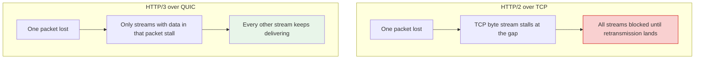

## Purpose

The modern half of the web-transport story, picking up where [[systems/networks/5-application/HTTP|HTTP]] and [[systems/networks/4-transport/TCP|TCP]] leave off. The organizing thread is a single recurring problem — head-of-line (HOL) blocking — which HTTP/2 solved at the application layer only to expose it one layer down, and which QUIC finally solved by redesigning the transport. Layering picture:

```text
HTTP/1.1        HTTP/2          HTTP/3
   |               |               |
  TLS             TLS            QUIC   (streams, loss recovery,
   |               |               |     TLS 1.3 built in)
  TCP             TCP             UDP
```

## What HTTP/1.1 costs

HTTP/1.1 processes one request at a time per connection: a response must complete before the next request is served (pipelining exists in the RFC but was never reliably deployed — broken intermediaries and HOL issues led browsers to disable it). Browsers compensate by opening ~6 parallel TCP connections per origin, which multiplies handshake and slow-start costs and still serializes within each connection. Every new connection pays the setup tax: 1 RTT for the TCP handshake plus 2 RTT for TLS 1.2 (1 RTT with TLS 1.3) before the first byte of the request leaves. On a 100 ms path, that is 200-300 ms of protocol overhead per connection before any content moves. Page loads dominated by many small objects are dominated by these fixed costs, the argument developed in the page-load-time section of [[systems/networks/5-application/HTTP|HTTP]].

## HTTP/2: multiplexing above TCP

[HTTP/2 (RFC 7540)](https://www.rfc-editor.org/rfc/rfc7540) replaced the textual protocol with binary framing and made one TCP connection carry many concurrent **streams**, each an independent request/response. Frames from different streams interleave on the connection (§5.1); HPACK compresses headers statefully across requests; stream priorities and server push rounded out the design (push has since been effectively retired — Chrome removed it — because hit rates never justified the complexity). One connection per origin replaces six, so one handshake, one slow-start ramp, one congestion-control state.

The application-layer HOL problem is gone: a slow response no longer blocks the connection, since other streams keep flowing between its frames. But the fix stops at the TCP boundary. **TCP delivers a single ordered byte stream**, so a single lost segment stalls delivery of *everything* behind it — frames from all streams, including streams whose own packets all arrived — until the retransmission lands. Multiplexing concentrated all the eggs into one basket precisely so that one lost packet could drop them all: under loss, HTTP/2 can perform *worse* than HTTP/1.1's six independent connections, which localize each loss to one-sixth of the traffic. Two further TCP-inherited limits: the handshake tax remains (TCP then TLS, sequentially), and a connection is identified by its 4-tuple, so changing networks — WiFi to cellular — kills every connection.



## QUIC: rebuilding the transport on UDP

[QUIC (RFC 9000)](https://www.rfc-editor.org/rfc/rfc9000) is a connection-oriented, encrypted, multiplexed transport that runs over UDP. UDP is not the point — it is the deployment vehicle: middleboxes drop or mangle unknown IP protocols, so a new transport must masquerade as an existing one, and user-space implementation lets endpoints ship protocol changes at application-update speed rather than OS-kernel speed ([Langley et al.](https://dl.acm.org/doi/10.1145/3098822.3098842) cite both ossification and iteration velocity as the design drivers; Google shipped multiple QUIC versions per year this way). The design answers each TCP limitation directly:

- **Streams are transport objects** (§2). A QUIC connection carries many streams, each with its own flow control and its own ordering. Loss recovery is per-packet, and data delivery is per-stream: a lost packet stalls only the streams that had data in that packet (§2.2). Transport-level HOL blocking is gone by construction.
- **One combined handshake** (§7). The transport and TLS 1.3 handshakes are fused: a new connection completes in 1 RTT, and resumption can send application data in the first flight (0-RTT). The 0-RTT caveat is replay: early data can be recorded and replayed by an attacker, so it must carry only idempotent requests (§9.2 of RFC 9001's threat model; HTTP clients restrict 0-RTT to safe methods).
- **Connection IDs, not 4-tuples** (§5.1). A connection is named by IDs chosen by each endpoint, so it survives NAT rebinding and network migration (§9): a phone walking from WiFi to LTE keeps its QUIC connections, where every TCP connection would reset.
- **Loss recovery without ambiguity.** Packet numbers increase monotonically and are never reused — a retransmission carries the old data in a *new* packet number (§17.2, RFC 9002) — eliminating TCP's retransmission ambiguity in RTT measurement. ACK frames carry large ranges and receiver delay measurements, giving the sender a sharper picture than TCP's cumulative ACK + SACK.
- **Encryption covers the transport headers.** Almost everything except the connection ID is encrypted, including ACKs — partly for privacy, partly deliberate anti-ossification: what middleboxes cannot parse, they cannot grow dependencies on.

## HTTP/3: HTTP on QUIC

[HTTP/3 (RFC 9114)](https://www.rfc-editor.org/rfc/rfc9114) is a re-mapping, not a re-semantics: methods, status codes, and header fields are unchanged, and the specification is largely about which QUIC stream carries what. Each request/response pair gets its own bidirectional QUIC stream (§4.1) — request concurrency is delegated to the transport, and HTTP/3 needs no stream layer of its own, unlike HTTP/2. Header compression changes for exactly the HOL reason: HPACK requires every endpoint to process header blocks in the same total order to keep dynamic tables synchronized, which QUIC's independent streams cannot guarantee. **QPACK** (RFC 9204) splits the difference — dynamic-table updates travel on a dedicated unidirectional stream, and header blocks reference table state only once acknowledged, trading a little compression efficiency for zero cross-stream ordering dependency (§4.2). Prioritization was dropped from the core spec (HTTP/2's dependency-tree scheme was complex and barely used) and delegated to the Extensible Priorities extension (RFC 9218). Discovery is via `Alt-Svc` headers or DNS HTTPS records, since a client cannot otherwise know an origin speaks UDP.

Failure behavior is the practical contrast. HTTP/2 under 1% packet loss: each loss freezes all streams for at least an RTT while TCP retransmits in order. HTTP/3 under the same loss: each lost packet delays only its own streams' data; a browser loading 50 resources sees 49 progress normally. Under network change: HTTP/2 connections all reset and re-handshake; HTTP/3 connections migrate and continue.

## Measured impact

From Google's deployment paper ([Langley et al. 2017](https://dl.acm.org/doi/10.1145/3098822.3098842)), the largest published QUIC dataset: QUIC carried over 30% of Google's egress traffic (an estimated 7% of the whole Internet) at publication. Mean search latency improved 8% for desktop and 3.6% for mobile users; YouTube rebuffer rates dropped 18% for desktop and 15.3% for mobile. The gains concentrate where the protocol arguments predict: slower, lossier network paths (the worst-latency deciles improved the most, and users in high-RTT countries saw multiples of the average gain), with the 0-RTT handshake contributing the dominant share of the latency win. The paper is also frank that on fast, clean networks the differences shrink toward zero — QUIC is a tail-latency and bad-network protocol more than a fast-path one, the same statistical shape as the arguments in [[systems/performance/tail-latency-percentiles|Tail Latency and Percentiles]].

## Related notes

- [[systems/networks/5-application/HTTP|HTTP]]
- [[systems/networks/4-transport/TCP|TCP]]
- [[systems/networks/4-transport/UDP|UDP]]
- [[systems/networks/5-application/CDNs|CDNs]]
- [[systems/performance/tail-latency-percentiles|Tail Latency, Percentiles, and Queueing Distributions]]

## Sources

- [RFC 9000, QUIC: A UDP-Based Multiplexed and Secure Transport](https://www.rfc-editor.org/rfc/rfc9000)
- [RFC 9114, HTTP/3](https://www.rfc-editor.org/rfc/rfc9114)
- [RFC 7540, HTTP/2](https://www.rfc-editor.org/rfc/rfc7540)
- [RFC 9204, QPACK](https://www.rfc-editor.org/rfc/rfc9204), [RFC 9002, QUIC Loss Detection](https://www.rfc-editor.org/rfc/rfc9002)
- [Langley et al. (2017), The QUIC Transport Protocol: Design and Internet-Scale Deployment, SIGCOMM](https://dl.acm.org/doi/10.1145/3098822.3098842)
