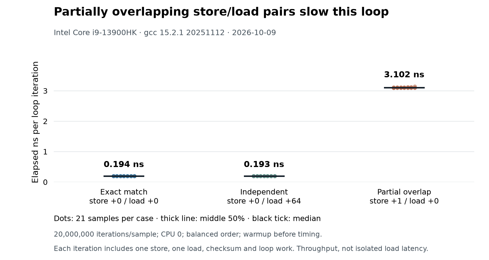

## Purpose

Measure how three store-then-load address relationships affect the reciprocal throughput of a small x86-64 loop. The cases are an exact address match, a one-byte-shifted partial overlap, and an independent load from another hot cache line.

When a load requests bytes supplied by an older store that has not reached cache, the load/store machinery may forward those bytes from the store buffer. Forwarding depends on the address and size relationship. A partial overlap can prevent forwarding and hold up younger work, as described in the [Intel optimization manual](https://cdrdv2-public.intel.com/821612/248966-Optimization-Reference-Manual-V1-050.pdf) and Agner Fog's [microarchitecture manual](https://www.agner.org/optimize/microarchitecture.pdf). The load/store queue and store buffer fit into the wider [[hardware/computer-architecture/out-of-order-execution|out-of-order execution pipeline]].

## Setup

The reproducible run recorded here used this environment:

| Field | Value |
| --- | --- |
| Measured | 2026-10-09 20:05:19 UTC |
| CPU | 13th Gen Intel Core i9-13900HK |
| OS | Linux 6.17.9-arch1-1, x86-64 |
| Compiler | GCC 15.2.1 20251112 |
| Flags | `-O3 -std=gnu11 -Wall -Wextra -Wpedantic` |
| Affinity | Logical CPU 0 |
| Timer | `CLOCK_MONOTONIC_RAW` |

The harness is Linux x86-64 only. It exits on the ARM64 development machine rather than treating emulated x86 execution as hardware evidence.

## Workload

Each iteration issues one 8-byte `movq` store followed by one 8-byte `movq` load. The byte ranges are inside one 64-byte-aligned, 128-byte buffer.

| Pattern | Store range | Load range | Relationship |
| --- | --- | --- | --- |
| `exact` | `[0, 8)` | `[0, 8)` | Exact match; forwarding candidate |
| `partial_overlap` | `[1, 9)` | `[0, 8)` | Seven bytes overlap; exact forwarding is unavailable |
| `independent` | `[0, 8)` | `[64, 72)` | Separate hot cache line; same-shape control |

GNU inline assembly fixes the intended accesses and includes a `memory` clobber. The loop adds every loaded value to a checksum that is consumed after the run, which prevents the compiler from deleting the loads. Inspection of the compiled loops confirmed store/load offsets of `+0/+0`, `+1/+0`, and `+0/+64`.

There is no loop-carried dependency from a load to the next iteration's store or address. Several store/load pairs can overlap in flight. The benchmark therefore measures the reciprocal throughput of the complete loop, including its checksum and branch, rather than the latency of one forwarded load.

## Method

The [C harness](store_fwd_bench.c) and [runner](run_store_fwd_bench.sh) perform the following procedure:

1. Compile the source with the flags in the setup table.
2. Use `taskset` to restrict the process to one logical CPU and verify that the affinity mask contains exactly one CPU.
3. Warm each pattern for 1,000,000 iterations.
4. Measure 21 samples of 20,000,000 iterations for each pattern.
5. Interleave patterns in randomized three-trial Latin-square blocks. Across the run, every pattern occupies the first, second, and third position seven times.
6. Time the complete loop with `CLOCK_MONOTONIC_RAW`. Do not subtract a loop-only baseline.

The table reports the median and order-statistic quartiles. The [recorded output](store_fwd_bench-results.txt) contains every sample, trial order, checksum, environment field, and the SHA-256 digest of the source that produced it.

## Results

Times are elapsed nanoseconds per complete loop iteration; the raw output preserves more digits.

| Pattern | P25 (ns) | Median (ns) | P75 (ns) |
| --- | ---: | ---: | ---: |
| Exact match | 0.1933 | 0.1935 | 0.1938 |
| Independent | 0.1932 | 0.1933 | 0.1935 |
| Partial overlap | 3.0986 | 3.1017 | 3.1141 |



The plotting source is [available beside the benchmark](plot_store_fwd_bench.py). It reads the checked-in result file and requires Matplotlib 3.10 or newer.

### Historical results without provenance

An earlier version of this note recorded the following numbers:

| Pattern | Historical ns/op | Historical ratio |
| --- | ---: | ---: |
| Exact match | 0.52 ns | 1.0x |
| Independent | 0.70 ns | 1.3x |
| Partial overlap | 3.64 ns | 7.0x |

No CPU model, compiler version, flags, source revision, raw samples, or run date survived with those numbers. They remain here as historical data with missing provenance. They cannot establish a cross-machine comparison, a cycle count, or a claim about forwarding latency.

## Interpretation

On this CPU and toolchain, partial overlap reduced the loop's throughput by about 16 times relative to the exact pattern. The median rose by about 2.91 ns per iteration. This is consistent with partial-overlap backpressure after the load cannot use the ordinary exact-match forwarding path.

The exact and independent medians differ by 0.000218 ns, or about 0.11%, while their sample ranges overlap. This harness does not resolve a throughput difference between them. The independent case is a control that loads another hot cache line; it is not a measurement of isolated L1 load latency. These results do not support the earlier claim that forwarding is universally faster than an L1 hit.

The benchmark leaves CPU frequency, thermal state, SMT-sibling activity, and background kernel activity uncontrolled. CPU affinity prevents migration but does not isolate the physical core. The ratios describe this recorded run and should be remeasured on other microarchitectures.

Partial overlap requires overlapping byte ranges. Merely packing a struct or loading an unaligned field does not create this dependency. The following defined C operations request the same ranges as the partial-overlap case, although a compiler may transform them and the generated machine code must be inspected:

```c
#include <stdint.h>
#include <string.h>

uint8_t bytes[16] = {0};
uint64_t stored = 42;
uint64_t loaded;

memcpy(bytes + 1, &stored, sizeof(stored));
memcpy(&loaded, bytes, sizeof(loaded));
```

Compact binary parsers and byte-buffer code can create this pattern when they write one field and immediately read a wider or shifted region.

## Reproduction

From the benchmark directory on Linux x86-64:

```bash
./run_store_fwd_bench.sh
```

The defaults reproduce the recorded workload. The optional positional arguments set iterations per sample and sample count. Sample count must be an odd multiple of three from 9 through 99 so the Latin-square blocks stay balanced.

```bash
./run_store_fwd_bench.sh 20000000 21
CPU=4 CC=gcc ./run_store_fwd_bench.sh 20000000 21
python3 plot_store_fwd_bench.py
```

`CPU` must name one logical CPU in the process's allowed affinity set. The runner records the source digest, compiler identity, build flags, kernel, CPU model, affinity, trial order, raw timings, and summary in standard output.

## Sources

- [Intel 64 and IA-32 Architectures Optimization Reference Manual](https://cdrdv2-public.intel.com/821612/248966-Optimization-Reference-Manual-V1-050.pdf)
- [The microarchitecture of Intel, AMD and VIA CPUs (Agner Fog)](https://www.agner.org/optimize/microarchitecture.pdf)

## Related notes

- [[hardware/computer-architecture/out-of-order-execution|out-of-order execution]]
- [[systems/operating-systems/benchmarks/branch|branch prediction]]
- [[systems/operating-systems/benchmarks/false_sharing|false sharing]]
- [[systems/operating-systems/benchmarks/mlp|memory-level parallelism]]
